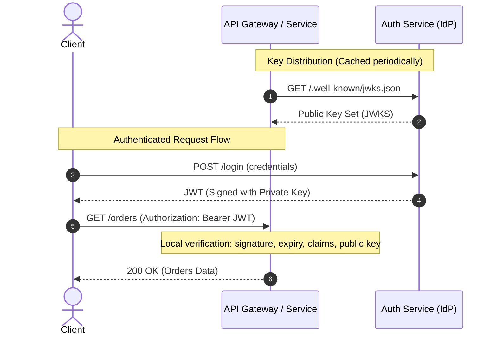
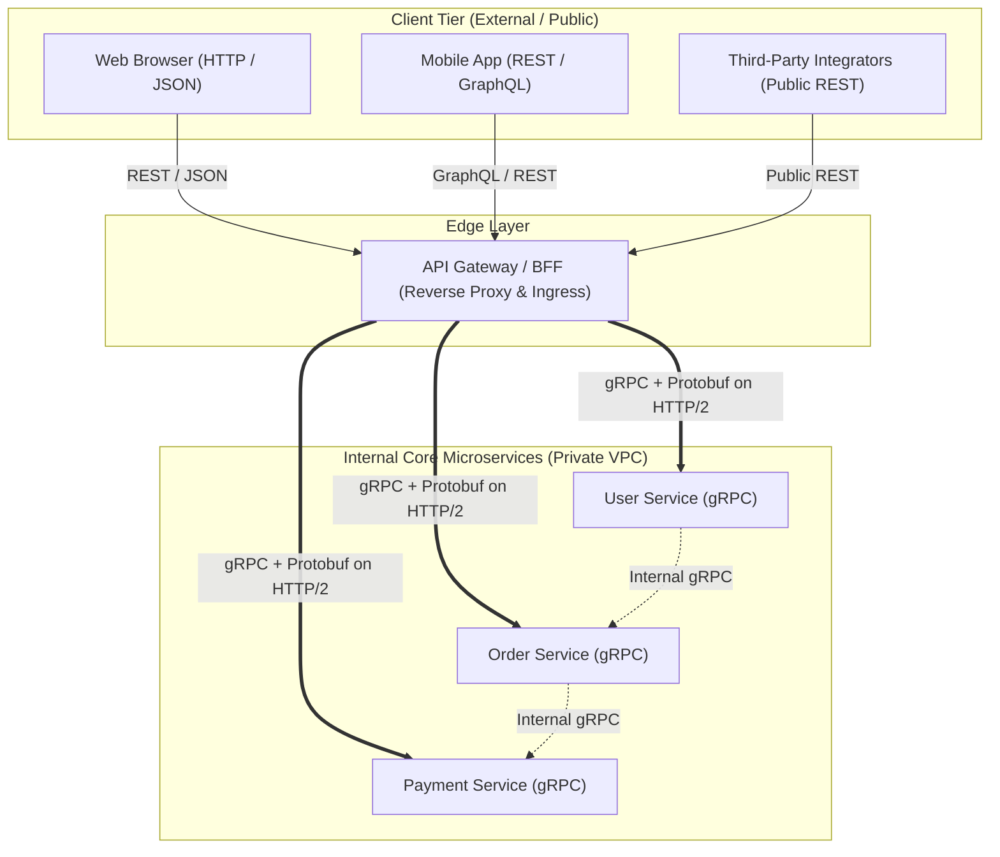

# API Technologies: REST, GraphQL, gRPC, Protobuf, Sessions & JWT

In modern distributed architectures, choosing the right communication paradigm, serialization format, and identity mechanism directly dictates latency, scalability, payload efficiency, and developer velocity. This guide consolidates core architectural paradigms—REST, GraphQL, and gRPC/Protobuf—alongside session- and token-based state management.

---

## 1. API Fundamentals & Core Contracts

An **API (Application Programming Interface)** establishes a strict contractual boundary between distinct software systems. It standardizes request formats, response payloads, transport protocols, data schemas, and error semantics.

### Abstract Contract Example

```text
Client Request:
GET /users/123
```

```json
{
  "id": 123,
  "name": "Swapnil"
}
```

The underlying wire representation and interface model determine how systems exchange this data efficiently.

---

## 2. REST (Representational State Transfer)

REST is an architectural style centered on **resources** identified by uniform URIs, manipulated via standard HTTP methods with declarative metadata.

```text
Core Mental Model: "Everything is a Resource."
Examples: /users, /orders, /products
```

### 2.1 REST Architectural Constraints

1. **Client-Server Separation:** User interface concerns are decoupled from data storage concerns, enabling independent deployment and evolution.
2. **Statelessness:** Each request from client to server must contain all necessary context (authentication, parameters, state). The server stores no conversational session state between requests.
3. **Cacheability:** Responses must implicitly or explicitly define themselves as cacheable or non-cacheable to prevent stale reads and eliminate redundant network hops.
4. **Uniform Interface:** Standardized resource URIs, standard HTTP verbs, self-descriptive messages, and hypermedia controls (HATEOAS).
5. **Layered System:** Clients cannot tell whether they are connected directly to the end server or to an intermediary (proxy, gateway, CDN, load balancer).
6. **Code-on-Demand (Optional):** Servers can temporarily extend client functionality by transferring executable code (e.g., JavaScript).

### 2.2 Uniform Interface: URI Design Conventions

* **Good (Resource-Oriented / Nouns):**
  * `GET /users` (List users)
  * `POST /users` (Create user)
  * `PATCH /users/123` (Partially update user 123)
  * `DELETE /users/123` (Delete user 123)
* **Bad (RPC-Style in REST / Verbs in URIs):**
  * `/getUsers`
  * `/createUser`
  * `/removeUser`

### 2.3 HTTP Verbs, Safety & Idempotency (RFC 9110)

According to [RFC 9110 (HTTP Semantics)](https://www.rfc-editor.org/rfc/rfc9110.html):
* **Safe Methods:** Do not alter server state (read-only semantics). Safe methods are inherently idempotent.
* **Idempotent Methods:** Making $N \ge 1$ identical requests produces the identical server state as a single request.

| Verb | Semantics | Safe (RFC 9110) | Idempotent (RFC 9110) | Typical Use Case |
| :--- | :--- | :--- | :--- | :--- |
| **GET** | Read resource | Yes | Yes | Retrieve profile, list entities |
| **HEAD** | Retrieve headers only | Yes | Yes | Check cache validity, resource existence |
| **POST** | Create resource / process data | No | No | Submit order, login, append record |
| **PUT** | Replace complete resource | No | Yes | Full document update / upsert |
| **PATCH** | Partial resource update | No | No (by spec, though often implemented idempotently) | Update single field (e.g., email) |
| **DELETE** | Remove resource | No | Yes | Delete entity by ID |

#### PUT vs PATCH Example

Given an existing resource:
```json
{
  "name": "John",
  "age": 25
}
```

* **PUT Request Body:** `{"name": "Bob"}`
  * **Result:** `{"name": "Bob"}` (Missing fields like `age` are overwritten or nulled).
* **PATCH Request Body:** `{"name": "Bob"}`
  * **Result:** `{"name": "Bob", "age": 25}` (Only `name` is modified; `age` is preserved).

### 2.4 HTTP Status Codes & Conditional Validation (ETag / 304)

* **2xx (Success):**
  * `200 OK`: Request succeeded.
  * `201 Created`: Resource successfully created (includes `Location` header).
  * `204 No Content`: Action succeeded, no response body returned (common in `DELETE`).
* **3xx (Redirection & Cache Validation):**
  * `301 Moved Permanently`: Target resource assigned new permanent URI (browsers/crawlers update links).
  * `302 Found`: Temporary redirect.
  * `304 Not Modified`: Conditional validation response. The client sends `If-None-Match: "etag_hash"` or `If-Modified-Since`. If the server resource has not changed, it returns `304 Not Modified` with zero body payload, instructing the client to use local cached representation.
* **4xx (Client Errors):**
  * `400 Bad Request`: Malformed syntax or validation failure.
  * `401 Unauthorized`: Authentication missing or invalid.
  * `403 Forbidden`: Authenticated, but lacking permission/role.
  * `404 Not Found`: Resource does not exist.
  * `429 Too Many Requests`: Rate limit exceeded.
* **5xx (Server Errors):**
  * `500 Internal Server Error`: Unhandled server exception.
  * `503 Service Unavailable`: Server overloaded or undergoing maintenance.

### 2.5 REST Inefficiencies: Over-fetching, Under-fetching & Round Trips

* **Over-fetching:** The server returns fixed, full data structures. If a mobile view only needs `name`, fetching `GET /users/1` still downloads `email`, `phone`, `addresses`, `audit_metadata`, consuming unnecessary bandwidth.
* **Under-fetching & Multiple Round Trips:** Loading a dashboard requiring User, Orders, and Payments requires sequential or fan-out REST calls:
  ```http
  GET /users/1
  GET /orders?userId=1
  GET /payments?userId=1
  ```
  This introduces significant client latency over mobile/high-RTT networks.

---

## 3. State Management: Sessions vs. JWTs

A classic architectural question: *If REST requires statelessness, why do production systems use session cookies and tokens?*

### 3.1 Architectural Truth: Practicality Over Theoretical Purity

In pure REST theory, every request transfers all authentication context without server-side memory. In practice, systems balance stateless scaling against strict access control:
* **Session-Based Authentication:** Stateful. The server generates a random opaque `SessionID` (e.g., `XYZ`), maps `XYZ -> User123` in Redis/database, and sets an `HttpOnly` cookie.
* **Token-Based Authentication (JWT):** Statelessly self-contained. The client receives a cryptographically signed token containing claims and passes it via `Authorization: Bearer <token>`.

```text
Tradeoff Summary:
- Sessions: Instant revocation & centralized control | Requires centralized session storage (Redis bottleneck/scaling overhead).
- JWTs: Stateless verification & horizontal scalability | Difficult revocation before expiration without secondary state.
```

### 3.2 Theft Vulnerability & The Revocation Tradeoff

> **Common Question:** *If an attacker steals a Session ID vs. a JWT, isn't the security risk identical?*
>
> **Answer:** Yes. A stolen bearer token or session cookie grants full authenticated impersonation until invalidation.

The critical divergence is **revocation mechanics**:
* **Session Invalidation:** Deleting `XYZ -> User123` from Redis terminates access immediately for all subsequent requests. Enables instant force-logout, single-device concurrency limits, and immediate lockout upon password reset.
* **JWT Invalidation:** Because validation occurs statelessly via cryptographic verification, an active JWT remains valid until its `exp` timestamp unless the system introduces revocation mechanisms (e.g., distributed blacklists/Redis lookups or short token lifetimes paired with rotating refresh tokens).

### 3.3 JWT Internal Structure & Integrity vs Secrecy

A JWT is composed of three Base64URL-encoded parts separated by periods (`header.payload.signature`):
1. **Header:** Metadata detailing algorithm and type (e.g., `{"alg": "HS256", "typ": "JWT"}`).
2. **Payload:** Claims and metadata (e.g., `{"userId": 123, "role": "ADMIN", "exp": 1712345678}`).
3. **Signature:** Cryptographic signature verifying integrity.

> **Misconceptions Corrected:**
> * *Misconception 1:* "JWT contains a hash of the entire HTTP request." $\rightarrow$ **Correction:** The signature hashes only `base64Url(Header) + "." + base64Url(Payload)`.
> * *Misconception 2:* "JWT payload is encrypted and hidden." $\rightarrow$ **Correction:** Standard JWT payloads are Base64URL-encoded, not encrypted. Any client or intermediary can inspect payload claims. The signature guarantees **integrity and authenticity**, not confidentiality.

### 3.4 Verification Schemes: Symmetric (HS256) vs Asymmetric (RS256 / JWKS)

* **Symmetric (HS256):** Both auth issuer and downstream verification services share a single secret key. If a downstream service is compromised, attackers can forge arbitrary valid tokens.
* **Asymmetric (RS256 / EdDSA):**
  * Auth Service signs with a **Private Key**.
  * Downstream services verify using the corresponding **Public Key**.
  * **Key Distribution:** Public keys are fetched from Auth Service at startup or cached via a **JWKS (`/.well-known/jwks.json`)** endpoint.

#### The Passport Analogy
A government authority signs a passport with official seals. Airport security across the globe inspects and validates the passport's security features locally without placing a synchronous phone call to the issuing government for every traveler.


> [!NOTE]
> *Security Deep Dive Reference:* Advanced cryptographic token architectures, refresh token rotation (RTR), OAuth2/OIDC authorization code flows, mTLS, and replay mitigation are detailed separately in dedicated security modules.

---

## 4. GraphQL: Client-Driven Declarative Data Fetching

Developed by Meta, **GraphQL** shifts control over response shape from the backend server to the client.

```text
Core Mental Model: "Clients request precise data trees via a single endpoint (/graphql)."
```

### 4.1 Queries, Mutations & Schema

* **Schema Definition Language (SDL):**
  ```graphql
  type User {
    id: ID!
    name: String!
    city: String
    orders: [Order!]!
  }

  type Query {
    getUser(id: ID!): User
  }

  type Mutation {
    createUser(name: String!, city: String): User!
  }
  ```
* **Declarative Query:**
  ```graphql
  query {
    getUser(id: "123") {
      name
    }
  }
  ```
  Returns exactly:
  ```json
  {
    "data": {
      "getUser": {
        "name": "Swapnil"
      }
    }
  }
  ```
  Eliminates over-fetching and allows bundling multiple entity queries into a single round trip.

### 4.2 Resolvers & The N+1 Query Problem

A **Resolver** is a backend function responsible for fetching the data for a single field in the schema.

> **Misconception:** "One field always requires one separate database query."
> **Correction:** Top-level parent resolvers often fetch entire domain entities; child field resolvers simply extract attributes from the already-loaded object in memory unless separate relational fetching is defined.

#### The N+1 Problem Scenario
When querying a list of 100 users and their nested orders:
1. `users` resolver executes 1 SQL query: `SELECT * FROM users;` (Returns 100 users).
2. For each of the 100 users, child resolver `orders` executes: `SELECT * FROM orders WHERE user_id = ?;`
3. **Total Database Calls:** $1 + 100 = 101$ queries.

#### Solutions for N+1 Queries
* **Batch Loading (`DataLoader`):** Defers individual lookups within an execution tick, groups IDs, and issues a single batch query:
  ```sql
  SELECT * FROM orders WHERE user_id IN (1, 2, 3, ..., 100);
  ```
* **SQL Joins & Eager Loading:** Joining data at the parent resolver level (`LEFT JOIN orders`) or leveraging ORM constructs (e.g., JPA `@EntityGraph`, `JOIN FETCH`).

### 4.3 Subscriptions & Caching Tradeoffs

* **Real-Time Subscriptions:** GraphQL Subscriptions establish persistent bi-directional connections (typically WebSockets) pushing real-time updates when specified server-side events occur.
* **HTTP Caching Tradeoff:** Because GraphQL queries typically route as `POST /graphql` with dynamic arbitrary payload bodies, standard edge network HTTP caches (CDNs, proxies) cannot cache responses by URL/method alone. Caching requires complex client-side normalized caches (Apollo/Relay) or specialized persisted query hashing at the gateway.

---

## 5. gRPC & Protocol Buffers (Protobuf)

**gRPC** is an open-source, high-performance Remote Procedure Call (RPC) framework that makes calling a remote microservice method look syntactically identical to invoking a local in-memory method.

```java
// Local appearance of a remote network invocation
UserResponse response = userServiceStub.getUser(UserRequest.newBuilder().setId(123).build());
```

### 5.1 Protobuf: The Binary Serialization Contract

**Protocol Buffers (Protobuf)** is a language-agnostic, binary serialization mechanism and interface definition format.

```text
Relationship:
JSON : REST  ::  Protobuf : gRPC
```

#### Protocol Buffer Contract Example
```proto
syntax = "proto3";

package ecommerce;

message User {
  int32 id = 1;
  string name = 2;
  string email = 3;
  reserved 4, 10 to 15;
  reserved "legacy_token", "temp_hash";
}
```

### 5.2 Binary Wire Encoding & The Tag Formula

Unlike JSON, Protobuf **never transmits field names over the wire**. It encodes data as binary Key-Value pairs where the "Key" is a compact variable-length integer (varint) combining the **Field Number (Tag)** and the **Wire Type**:

$$\text{Key Tag Formula: } \text{Key} = (\text{field\_number} \ll 3) \mid \text{wire\_type}$$

* **JSON Wire Payload (33 bytes):**
  `{"id":123,"name":"Swapnil"}` $\rightarrow$ Transmits `id`, `name`, quotes, braces, colons on every single request.
* **Protobuf Wire Payload (~11 bytes):**
  `08 7B 12 07 53 77 61 70 6E 69 6C`
  * `08` $\rightarrow$ (Tag 1, WireType 0: Varint) + Value `123` (`7B`)
  * `12` $\rightarrow$ (Tag 2, WireType 2: Length-delimited) + Length `7` (`07`) + ASCII `"Swapnil"`
* **Scale Benefit:** Saving 22 bytes across $10^9$ requests saves **22 GB of bandwidth** alongside massive CPU savings by avoiding JSON string parsing and reflection.

### 5.3 Build Contract, Code Generation & IDE Integration

```text
               ┌───────────────┐
               │  user.proto   │ (Shared Contract)
               └───────┬───────┘
                       │ protoc (Compiler)
            ┌──────────┴──────────┐
            ▼                     ▼
     ┌─────────────┐       ┌─────────────┐
     │  User.java  │       │   User.go   │
     │ (Java DTOs  │       │  (Go Structs│
     │  & Stubs)   │       │  & Clients) │
     └─────────────┘       └─────────────┘
```

> **Misconceptions Corrected:**
> * *Misconception 1:* "Services exchange `.proto` schemas dynamically over the network at runtime." $\rightarrow$ **Correction:** Schema compilation happens at **build time**. Both services compile against the shared contract from a central contract repo or package artifact.
> * *Misconception 2:* "Protobuf eliminates DTOs." $\rightarrow$ **Correction:** `protoc` automatically generates concrete, type-safe DTO classes (e.g., `User.newBuilder().setName("Swapnil").build()`). Developers write clean code against generated classes with full IDE autocompletion; wire tag encoding is handled internally.

### 5.4 Schema Evolution, Backward Compatibility & `reserved` Tags

Protobuf supports seamless rolling schema updates across distributed systems:
* **Forward Compatibility (Old service receives new payload):** Ignores unrecognized new field tags without throwing deserialization errors.
* **Backward Compatibility (New service receives old payload):** Assigns default values (e.g., `0`, `""`, `false`) for missing fields.
* **Golden Rule of Protobuf:** **Never reuse or renumber a field tag.** If field `name = 1` is deprecated, tag `1` must never be assigned to another field.
* **The `reserved` Keyword:** Explicitly locks deprecated tags and field names in the `.proto` file, causing compilation to fail if a developer attempts to reuse them.

### 5.5 The Four gRPC Communication Modes

gRPC leverages **HTTP/2** framing, multiplexing, and binary streaming to support four communication patterns:
1. **Unary RPC:** Classic single-request, single-response ($1 \rightarrow 1$).
2. **Server Streaming RPC:** Client sends one request; server responds with a stream of messages ($1 \rightarrow N$) (e.g., real-time stock ticker updates).
3. **Client Streaming RPC:** Client streams a sequence of messages; server processes and returns a single summary response ($N \rightarrow 1$) (e.g., large file uploads, telemetry ingest).
4. **Bidirectional Streaming RPC:** Both sides send asynchronous streams over a single multiplexed TCP connection ($N \leftrightarrow M$) (e.g., chat applications, multiplayer sync).

### 5.6 Tradeoffs & Why Protobuf Isn't Used Everywhere

| Dimension | REST / JSON | gRPC / Protobuf |
| :--- | :--- | :--- |
| **Human Readability** | High (plain text, easily debugged via `curl`/browser) | None on wire (raw binary, requires decoding tools) |
| **Browser Compatibility** | Native (supported across all web browsers) | Limited (requires gRPC-Web proxy/translation) |
| **Client-Server Coupling** | Loose (schema updates rarely break clients) | Tight (both sides depend on compiled proto contracts) |
| **Public Developer Ecosystem**| Industry standard for public third-party APIs | Best suited for private internal microservices |
| **Tooling & Build Overhead**| Minimal (no code generation steps required) | High (`protoc` build plugins, contract repo sync) |

---

## 6. Real-World Architecture: The Hybrid Edge-to-Core Pattern

Modern large-scale microservice architectures combine these technologies into a high-performance hybrid topology:
* **Edge / Ingress:** Clients (Web, Mobile, Third-Party) connect via **REST/JSON** or **GraphQL** over HTTPS to an **API Gateway** for accessibility, caching, and browser compatibility.
* **Internal Core:** Backend microservices communicate internally over **gRPC/Protobuf** on HTTP/2 for ultra-low latency, binary efficiency, and strict type safety.



---

## 7. Comparative Technology Matrix

| Dimension | REST | GraphQL | gRPC / Protobuf |
| :--- | :--- | :--- | :--- |
| **Primary Protocol** | HTTP/1.1 or HTTP/2 | HTTP/1.1 or HTTP/2 | HTTP/2 (Multiplexed) |
| **Data Format** | JSON, XML, Text | JSON | Binary Protocol Buffers |
| **Interface Style** | Resource-Oriented (URIs) | Schema-Oriented (Graph/Types) | Contract-Oriented (RPC Stubs) |
| **Data Fetching** | Fixed server endpoints (Risk of Over/Under-fetch)| Precise client queries (Zero over-fetch) | Strict RPC method parameters |
| **Network Efficiency** | Moderate (verbose text field names) | Moderate payload; High query flexibility | Maximum (binary tagging, compressed headers) |
| **Streaming** | Server-Sent Events (SSE), WebSockets | Subscriptions (WebSockets) | Native 4-way HTTP/2 Streaming |
| **Best Used For** | Public APIs, CRUD services, web clients | Dashboards, aggregated mobile apps | Internal microservices, high-throughput RPC |

---

## 8. Authoritative References

* **HTTP Semantics & Caching:** [RFC 9110: HTTP Semantics](https://www.rfc-editor.org/rfc/rfc9110.html) & [MDN Web Docs: HTTP](https://developer.mozilla.org/en-US/docs/Web/HTTP)
* **GraphQL Official Specification:** [GraphQL Spec (October 2021 / Latest)](https://spec.graphql.org/)
* **Protocol Buffers Documentation:** [Protobuf Encoding & Language Guide](https://protobuf.dev/programming-guides/encoding/)
* **gRPC Architecture & Concepts:** [gRPC Documentation & Core Concepts](https://grpc.io/docs/what-is-grpc/core-concepts/)
* **Distributed System Design:** [The System Design Primer (Dongwon Kim / Donne Martin)](https://github.com/donnemartin/system-design-primer)

---

## Quick recall

1. **Why does Protobuf omit field names from the serialized binary payload?**
   It replaces field names with compact numeric tags combined with wire types (`(field_number << 3) | wire_type`), drastically minimizing payload size and CPU parsing overhead.
2. **What makes an HTTP method idempotent under RFC 9110?**
   Executing the request once or multiple identical times consecutively leaves the server in the identical end state (e.g., `GET`, `PUT`, `DELETE`).
3. **What is the primary difference between HS256 and RS256 JWT validation?**
   HS256 uses a single shared secret for signing and verification. RS256 uses a private key for signing (Auth service) and a public key for verification across downstream services or gateways.
4. **How does `DataLoader` resolve the GraphQL N+1 problem?**
   It collects individual IDs requested across a single event-loop tick and coalesces them into a single batch database query (`WHERE id IN (...)`).
5. **Why should field tags in `.proto` files never be reused, and how is reuse prevented?**
   Reusing tags causes existing active clients or older services to misinterpret new field types as old fields, corrupting data. The `reserved` keyword enforces tag retirement at compile time.
