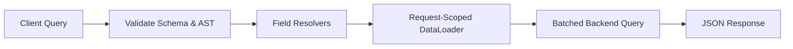

# Graph Databases & GraphQL — Related in Name Only

**The misconception first:** GraphQL and graph databases are NOT related. GraphQL is an **API technology**; graph databases are a **database category**. The shared word "graph" is a coincidence of naming.

## Graph databases

### Fraud detection — the canonical use case

Fraud is often about **relationships**, not individual records. Each account looks fine in isolation; the pattern only appears when you connect them:

```text
Alice   → Device D1
Bob     → Device D1     ← shared device: suspicious
Charlie → Device D1
```

**Circular money movement:**

```text
A → B → C → D → A
```

Graph databases can detect cycles like this efficiently.

**Fraud use cases:** shared devices, shared addresses, money-laundering chains, circular transactions, networks of related accounts.

**Interview answer:** graph databases are useful in fraud detection because fraud often involves hidden relationships among accounts, devices, IPs, customers, and transactions — graph traversal makes these patterns easy to discover.

## GraphQL

### What it is

A query language for APIs that lets clients request **exactly the data they need**.

REST — multiple endpoints:

```text
GET /users/123
GET /users/123/orders
```

GraphQL — single request:

```graphql
{
  user(id: 123) {
    name
    orders {
      amount
    }
  }
}
```

### How the backend works (vs REST routing)

In REST, the URL routes to a controller. GraphQL over HTTP commonly exposes **one endpoint** — `POST /graphql` — and routes by query shape. Note that GraphQL itself is **transport-agnostic** (it specifies query parsing, schema validation, and execution semantics independently of HTTP, WebSockets for subscriptions, or gRPC), but `POST /graphql` is the ubiquitous HTTP convention.

```text
REST:     URL  → Controller
GraphQL:  Query → Validate Schema → Resolvers
```



Before executing any resolver, the GraphQL engine parses the query document into an Abstract Syntax Tree (AST) and **validates it against the schema** (ensuring requested fields exist, types match, arguments are valid, and fragments are legal). If validation fails, execution aborts immediately without touching resolvers or backend databases.

**Schema** declares what's queryable:

```graphql
type Query {
  user(id: ID!): User
}
```

**Resolver** is the function that fetches it:

```javascript
user: (_, args) => {
  return userRepository.findById(args.id);
}
```

A frontend query for `user(id:123){ name }` invokes the `user` resolver.

### Aggregating multiple services

A GraphQL server can call the User Service, Order Service, and Payment Service, combine the results, and return one response — it's an aggregation layer.

### GraphQL and N+1

Classic problem. For:

```graphql
{
  users {
    name
    orders { amount }
  }
}
```

a naive implementation does *get users, then for each user get orders* — N+1 again. **Common solution: DataLoader**, which batches the per-user requests into one `WHERE user_id IN (...)` query. (General N+1 mechanics: `spring/jpa_lazy_eager/LazyEagerN1.md`.)

**Request-scoped lifecycle:** A DataLoader instance must be created fresh per incoming request context. DataLoader coalesces multiple load calls scheduled within a single execution tick and memoizes results in memory for the duration of that request. Request scoping ensures:
1. **No cross-request stale reads:** Fresh data is fetched on subsequent requests.
2. **No data leakage:** User-specific authorization and private cached entities are discarded as soon as the request lifecycle completes.

### Security and operational boundaries

Because GraphQL clients construct arbitrary query shapes, production backends enforce safeguards at the API gateway, engine, and resolver boundaries:

1. **Depth limits:** Restrict the maximum AST nesting level to prevent recursive DoS queries (e.g., `user { friends { friends { friends ... } } }`).
2. **Query complexity / cost analysis:** Assign numeric weights to fields (with multipliers for lists) and reject queries exceeding a max complexity budget before execution begins.
3. **Input validation:** Validate scalar formats, regex constraints, and input object bounds prior to resolving.
4. **Query-aware rate limiting:** Rate-limit based on calculated query complexity/cost rather than simple HTTP hit count.
5. **Authorization at resolver and data-service boundaries:** Authentication happens at the transport/HTTP layer (e.g., JWT extraction into context), while granular field-level and entity-level authorization is enforced inside field resolvers and underlying domain services to avoid broken object-level authorization (BOLA/IDOR).

### The mental model

The GraphQL server is simply a backend component. Instead of writing many REST endpoints (`GET /user`, `GET /orders`), you write resolvers. GraphQL parses the request, validates it against the schema, figures out which fields were requested, invokes the appropriate resolvers, batches data fetching via request-scoped DataLoaders, and returns exactly the requested JSON structure.

## Gotchas / Trick questions

1. **"GraphQL must use a graph database."** No — GraphQL is an API query language; it can sit on top of SQL, NoSQL, other services, anything. Graph databases (Neo4j, Neptune) are a storage category.
2. **"GraphQL eliminates the N+1 problem."** The opposite — naive resolvers *reintroduce* it (one query per nested field per parent). DataLoader-style batching is the standard fix.
3. **"How does GraphQL route without URLs?"** Single `POST /graphql` endpoint (by convention over HTTP); the query body is parsed and validated against the schema, then dispatched to field resolvers — query shape replaces URL routing.

## Quick recall

**Q. GraphQL vs graph database?**
A. GraphQL is an API query language; a graph database is a database category. Unrelated despite the name.

**Q. Why are graph databases good for fraud detection?**
A. Fraud lives in hidden relationships (shared devices/addresses, circular transfers) — graph traversal finds these patterns efficiently.

**Q. How does a GraphQL backend know what to execute?**
A. One `POST /graphql` endpoint; the query is validated against the schema and each requested field is resolved by its resolver function.

**Q. Does a GraphQL engine execute resolvers if the query contains invalid fields or types?**
A. No. The query AST is validated against the schema before execution; invalid queries fail immediately without invoking resolvers.

**Q. Is GraphQL coupled to HTTP and `POST /graphql`?**
A. No. GraphQL is transport-agnostic (specifies AST parsing, schema validation, and execution); `POST /graphql` is merely the standard HTTP convention. Subscriptions often run over WebSockets.

**Q. How does N+1 appear in GraphQL, and what's the fix?**
A. Naive nested resolvers fire one query per parent entity; DataLoader batches them into `WHERE id IN (...)` queries.

**Q. Why must DataLoader instances be request-scoped?**
A. Scoping DataLoader to a single request lifecycle batches and caches keys only within that execution tick, preventing stale data across requests and preventing cross-user data leakage.

**Q. How do you protect a GraphQL API from malicious or resource-intensive queries?**
A. Query depth limiting, query complexity/cost analysis, input validation, cost-based rate limiting, and field/service-level authorization.

**Q. What can a GraphQL server sit in front of?**
A. Anything — databases, REST services, multiple microservices — aggregating results into one response shaped exactly like the query.

## Sources

- [GraphQL Specification](https://spec.graphql.org/) — Official GraphQL specification defining syntax, type systems, AST validation, and execution semantics.
- [GraphQL.org Learn](https://graphql.org/learn/) — Authoritative introduction to queries, schemas, resolvers, and pagination.
- [GraphQL DataLoader (GitHub)](https://github.com/graphql/dataloader) — Reference batching and caching utility detailing event-loop ticks and per-request memoization.
- [OWASP GraphQL Cheat Sheet](https://cheatsheetseries.owasp.org/cheatsheets/GraphQL_Cheat_Sheet.html) — Security controls for query depth, complexity analysis, rate limiting, and authorization boundaries.
- [System Design Primer](https://github.com/donnemartin/system-design-primer) — API paradigm comparisons and aggregation gateway patterns.
