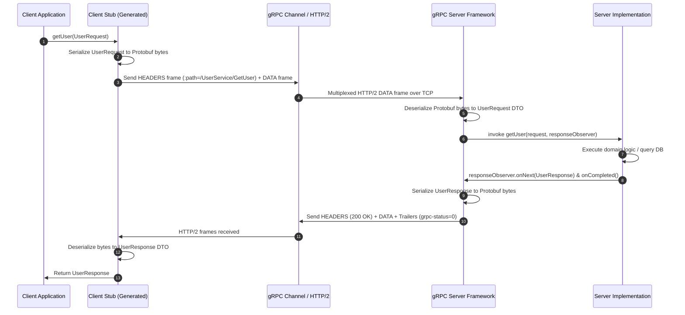

# Protocol Buffers (Protobuf) and gRPC Deep Dive

In high-throughput microservice architectures, communication protocols and serialization formats dictate network bandwidth consumption, serialization CPU cost, operational complexity, and developer velocity. Understanding the mechanical differences between REST/JSON and gRPC/Protobuf is essential for senior backend engineers evaluating system boundaries, designing performant internal RPCs, and planning backwards-compatible schema evolutions.

---

## 1. Choice Pressure & System Mental Model

A common candidate misconception is conflating data representation with transport protocols or reducing the trade-off to "REST is JSON; gRPC is binary":

- **Protobuf (Protocol Buffers)** answers: *How should data be structured and serialized?* It is an interface definition language (IDL) and compact binary serialization format (comparable to JSON, XML, or Apache Avro).
- **gRPC** answers: *How should services communicate over the network?* It is a high-performance, open-source universal RPC framework that uses HTTP/2 for transport and Protocol Buffers as its default contract and serialization mechanism.

| Stack Dimension | REST Stack | gRPC Stack |
| :--- | :--- | :--- |
| **Transport** | HTTP/1.1 or HTTP/2 | HTTP/2 (Multiplexed streams) |
| **Payload Format** | Text-based JSON / XML | Compact binary Protobuf |
| **Contract / Schema** | Optional (OpenAPI / JSON Schema), often implicit | Mandatory, strictly typed `.proto` contracts |
| **API Paradigm** | **Resource-Oriented** (URLs, HTTP verbs: `GET /users/123`) | **Procedure-Oriented** (Method invocations: `getUser()`) |
| **Code Generation** | Optional / external tooling | First-class build-time compilation (`protoc`) |
| **Target Audience** | External public consumers, Web Browsers, third parties | Internal machine-to-machine, low-latency microservices |

### Architectural Paradigm: Resource vs. Procedure

In REST, APIs model entities and resources (`/users/123`, `/orders/456`), relying on standard HTTP verbs (`GET`, `POST`, `PUT`, `DELETE`) and uniform response semantics. In gRPC, APIs model actions and procedures (`getUser(UserRequest)`, `createOrder(OrderRequest)`, `validatePayment(PaymentRequest)`), treating network calls conceptually like local method invocations with strictly typed parameters and return values.

---

## 2. Protobuf Contract & Wire Mechanics

### Schema Definition
Contracts are defined in `.proto` files specifying typed fields and numeric field tags:

```proto
syntax = "proto3";

package ecommerce.user;

option java_multiple_files = true;
option java_package = "org.example.backend_fundamentals.api_design.protobuf_grpc";
option java_outer_classname = "UserProto";

message User {
  int64 id = 1;
  string first_name = 2;
  string last_name = 3;
  string email = 4;
  string city = 5;
  string country = 6;
  string phone = 7;
}
```

### JSON vs. Protobuf Serialization Efficiency
In JSON:
```json
{
  "id": 123,
  "firstName": "Swapnil",
  "lastName": "Agarwal",
  "email": "x@gmail.com",
  "city": "Bangalore",
  "country": "India",
  "phone": "999999999"
}
```
Every single HTTP request sends the literal strings `"firstName"`, `"lastName"`, `"email"`, colons, braces, and quotes. Text numbers like `256` are serialized as character bytes `'2'`, `'5'`, `'6'` (3 bytes) plus parsing overhead. At 100,000 requests/sec, redundant string keys consume gigabytes of redundant network bandwidth and CPU cycles in string parsing.

Protobuf strips all field names from the wire. It transmits only the **numeric tag**, **wire type**, and **binary value**.

### Wire Format & Varints (Variable-Length Integers)
Protobuf serializes messages into a sequence of key-value pairs. Each field key is encoded as a `varint` using the formula:

$$\text{field\_key} = (\text{field\_number} \ll 3) \mid \text{wire\_type}$$

- **Wire Type 0 (`varint`)**: Used for `int32`, `int64`, `uint32`, `bool`, `enum`. Varints use 7 bits per byte for payload data, with the Most Significant Bit (MSB) indicating continuation (`1` = more bytes follow, `0` = last byte). A small integer like `5` takes 1 byte instead of standard 4-byte `int32`. The value `256` fits into 2 bytes.
- **Wire Type 1 (`64-bit`)**: Fixed 8 bytes (`fixed64`, `double`).
- **Wire Type 2 (`length-delimited`)**: Strings, bytes, embedded submessages, packed repeated fields. Prefixed by a varint length followed by the raw bytes.
- **Wire Type 5 (`32-bit`)**: Fixed 4 bytes (`fixed32`, `float`).

> **Note on Strings**: Protobuf does not magically compress string characters; the payload characters of `"Swapnil"` are sent as UTF-8 bytes. The bandwidth savings come from omitting the field key `"firstName"` and JSON syntax overhead.

---

## 3. Java Build Path & Shared Contract Workflow

### The Build-Time Contract Model
A common misconception is that services negotiate or exchange schemas during a runtime handshake. In reality, Protobuf contracts are shared at **build time**.

```text
       [ central contracts-repo / git submodule ]
                 │ (user.proto)
        ┌────────┴────────┐
        ▼                 ▼
   [ Service A ]     [ Service B ]
   mvn compile       mvn compile
    (protoc)          (protoc)
        │                 │
  User.java (DTO)    User.java (DTO)
```

1. Proto definitions reside in a shared repository or published as a versioned artifact (e.g., `company-contracts-v1.2.jar`).
2. At build time, the `protoc` compiler (via `protobuf-maven-plugin`) generates immutable Java classes and builders into `target/generated-sources/`.
3. Application code works with regular Java types and autocomplete:

```java
// Construction via generated Builder pattern
User user = User.newBuilder()
    .setId(123L)
    .setFirstName("Swapnil")
    .setCity("Bangalore")
    .build();

// Reading fields via generated getters
String name = user.getFirstName();
long userId = user.getId();
```

### Generated Field Dispatch Intuition
Protobuf does not eliminate DTOs; it generates high-performance, memory-efficient DTOs. Inside the generated parser, binary deserialization avoids reflection and dynamic map lookups. It operates conceptually as a fast switch-case on numeric tags:

```java
// Conceptual generated deserialization loop
while (!input.isAtEnd()) {
    int tag = input.readTag();
    int fieldNumber = tag >>> 3;
    switch (fieldNumber) {
        case 1:
            this.id = input.readInt64();
            break;
        case 2:
            this.firstName = input.readStringRequireUtf8();
            break;
        default:
            input.skipField(tag); // Unrecognized tag stored in UnknownFieldSet
            break;
    }
}
```

---

## 4. Normal Unary & Read Path

In gRPC, the client application interacts with a typed stub (`UserRpcGrpc.UserRpcBlockingStub` or async stub), while the server implements an abstract base service (`UserRpcGrpc.UserRpcImplBase`).

### End-to-End Request/Response Flow



---

## 5. gRPC Communication Modes

gRPC supports four distinct communication paradigms over persistent HTTP/2 streams:

1. **Unary RPC**: Single request sent by client, single response returned by server (traditional request-response).
2. **Server Streaming RPC**: Single request sent by client; server responds with a stream of messages. The client reads until no more messages remain (e.g., live price feeds, large dataset export).
3. **Client Streaming RPC**: Client writes a sequence of messages and sends them to the server; once finished, it waits for the server to read them and return a single response (e.g., IoT telemetry batch upload).
4. **Bidirectional (Bidi) Streaming RPC**: Both sides send a sequence of messages using independent read/write streams. Streaming happens concurrently without blocking (e.g., real-time chat, collaborative editing, gaming).

```proto
service UserService {
  // 1. Unary
  rpc GetUser (UserRequest) returns (UserResponse);
  // 2. Server Streaming
  rpc ListUsers (DepartmentRequest) returns (stream UserResponse);
  // 3. Client Streaming
  rpc RecordMetrics (stream MetricPoint) returns (UploadSummary);
  // 4. Bidirectional Streaming
  rpc ChatStream (stream ChatMessage) returns (stream ChatMessage);
}
```

---

## 6. Schema Evolution & Versioning Rules

### Backwards and Forwards Compatibility
Protobuf contracts evolve without breaking existing clients if developers follow core compatibility rules:

- **Old Consumer, New Producer**: If an old client expecting fields `1` and `2` receives a message containing field `3`, it simply ignores field `3` (preserving it in `UnknownFieldSet`) without crashing.
- **New Consumer, Old Producer**: If a new client expecting fields `1`, `2`, and `3` reads a message with only `1` and `2`, field `3` takes its language-specific proto3 default value (e.g., `""` for strings, `0` for numbers, `false` for booleans).

### The Golden Rule: Never Reuse Field Tags
Field numbers are like immutable database column identifiers:
```proto
// Bad Evolution - Breaks all running services:
// Version 1:
string name = 1;

// Version 2 (Reused tag 1):
string education = 1; // DISASTER: Old client reading new payload maps education to name!
```

### Reserved Tags and Names
When deleting or deprecating fields, reserve their field numbers and names to prevent future developers from reusing them:

```proto
message User {
  reserved 3, 7 to 10;
  reserved "education", "legacy_phone";

  int64 id = 1;
  string first_name = 2;
}
```

---

## 7. Deadlines, Failure, & Recovery

### Cooperative Deadlines & Context Cancellation
In distributed microservices, network partitions and slow dependencies cause request pile-ups. gRPC uses cooperative context propagation (`Context` in Java / Go):

- The calling service specifies a deadline (e.g., `stub.withDeadlineAfter(500, TimeUnit.MILLISECONDS)`).
- The deadline is propagated across downstream RPC calls via HTTP/2 headers (`grpc-timeout: 500m`).
- If the deadline expires, the client channel raises `Status.DEADLINE_EXCEEDED` and sends an HTTP/2 `RST_STREAM` frame to abort transmission.
- Downstream servers must cooperatively check `Context.current().isCancelled()` before executing expensive operations to avoid wasting CPU on abandoned requests.

### Retry Strategy & Idempotency
- gRPC channels support automated retry policies configured via Service Config.
- **Caution**: Retries must **only** be configured for safe, idempotent operations (or transient transport errors like `UNAVAILABLE`). Retrying non-idempotent mutations risks double-charging payments or duplicating database records.

---

## 8. HTTP/2 & TCP Transport Mechanics

### HTTP/2 Features Utilized by gRPC
1. **Binary Framing**: Protocol parsing uses lightweight binary frames instead of text delimiter scanning.
2. **Stream Multiplexing**: Multiple logical RPC requests/responses execute concurrently over a single underlying TCP connection, eliminating head-of-line (HOL) blocking at the HTTP application layer.
3. **HPACK Header Compression**: Compresses repeated metadata and headers between requests.
4. **Trailers**: Allows returning status codes (`grpc-status`) and metadata *after* the response body has completed streaming.

### Transport Head-of-Line (HOL) Blocking in TCP vs. Application HOL
While HTTP/2 solves application-level request-response HOL blocking (multiple requests interleaved on one TCP connection), it remains subject to **TCP-level Head-of-Line blocking**. Because TCP guarantees in-order packet delivery, a single dropped TCP packet causes the operating system kernel to pause delivery of all multiplexed HTTP/2 streams on that connection until the missing packet is retransmitted. (HTTP/3 over QUIC/UDP addresses this by decoupling stream loss recovery).

---

## 9. Edge, Browser Constraints, & Ingress Architecture

Browsers cannot natively establish arbitrary HTTP/2 framing required by standard gRPC (such as fine-grained control over HTTP/2 frame headers, trailers, and binary streams via standard `fetch` or `XMLHttpRequest`).

### The Standard Edge Gateway Architecture

```text
[ Web Browser / Mobile App ]
             │
             │ HTTPS / REST / JSON (or gRPC-Web via Envoy proxy)
             ▼
     ┌───────────────┐
     │  API Gateway  │ (e.g., Spring Cloud Gateway / Envoy / Kong)
     │  (REST Ingress)│ Translates REST/JSON endpoints to gRPC calls
     └───────┬───────┘
             │
   ──────────┼─────────────────────────────── (Internal VPC / Mesh)
             │ Internal High-Throughput gRPC + Protobuf
     ┌───────┴───────┬───────────────┐
     ▼               ▼               ▼
[ UserService ] [ OrderService ] [ PaymentService ]
```

### gRPC-Web Proxy Boundary
For web frontends that desire typed Protobuf stubs, **gRPC-Web** is used. An edge reverse proxy (such as Envoy) sits at the perimeter, translating browser-compatible gRPC-Web HTTP/1.1 or HTTP/2 payloads (which encode trailers in the body) into native gRPC HTTP/2 calls for internal microservices.

---

## 10. Trade-Offs & Decision Traps

### The Six Major Trade-offs of gRPC / Protobuf

| # | Dimension | Trade-Off Detail |
| :-: | :--- | :--- |
| **1** | **Human Readability & Debugging** | Payloads on the wire are binary bytes (`08 7B 12 07...`). Inspecting traffic requires schema-aware tools (`grpcurl`, Wireshark with proto definitions) unlike plain `curl` with JSON. |
| **2** | **Browser Accessibility** | Cannot be directly consumed by standard browser JavaScript APIs without a translation layer like gRPC-Web and proxying. |
| **3** | **Schema Governance Discipline** | Requires strict schema repository management, breaking change CI checks, and field tag reservation discipline. |
| **4** | **Build Pipeline Complexity** | Requires code-generation plugins (`protoc`), compiler binaries, and multi-project contract sharing pipelines. |
| **5** | **Client-Server Coupling** | Clients must compile against the shared contract artifact. Dynamic loose coupling is reduced compared to ad-hoc JSON endpoints. |
| **6** | **Public Ecosystem Ergonomics** | Third-party public API developers across diverse tech stacks (Ruby, PHP, Bash, Postman) expect standard REST/JSON conventions over binary RPC. |

---

## Quick Recall

- **What is the difference between Protobuf and gRPC?**
  Protobuf is the IDL and binary serialization format; gRPC is the RPC transport framework utilizing HTTP/2 and Protobuf.
- **What is the mathematical formula for a Protobuf wire field key?**
  `field_key = (field_number << 3) | wire_type`.
- **Why is Protobuf significantly smaller than JSON on the wire?**
  It omits field names from the payload, uses numeric tag dispatch, and packs integers using varint encoding.
- **How does a service know field mappings if no runtime handshake occurs?**
  Mappings are compiled at build time by `protoc` into generated Java classes from shared `.proto` files.
- **What happens when an old client reads a message containing a new field tag?**
  The old client skips the unknown tag and stores it in `UnknownFieldSet` without throwing an exception.
- **Why must field numbers never be reassigned?**
  Reassigning a field number causes active clients to deserialize old payload data into the wrong entity fields.
- **Why are cooperative deadlines critical in gRPC microservices?**
  They propagate client timeouts downstream via headers and HTTP/2 `RST_STREAM`, allowing downstream services to abort cancelled computation.
- **What is the boundary role of an API Gateway with gRPC?**
  It terminates external REST/JSON or gRPC-Web traffic from browsers/third parties and proxies internal requests over high-performance native gRPC.

---

## Authoritative References
- [Protocol Buffers Documentation](https://protobuf.dev)
- [gRPC Official Guides & Java Reference](https://grpc.io/docs/languages/java/)
- [RFC 9113: HTTP/2 Specification](https://datatracker.ietf.org/doc/html/rfc9113/)
- [Cloudflare Learning: What is HTTP/2?](https://www.cloudflare.com/learning/performance/http2-vs-http1.1/)
- [Donne Martin: The System Design Primer](https://github.com/donnemartin/system-design-primer)
