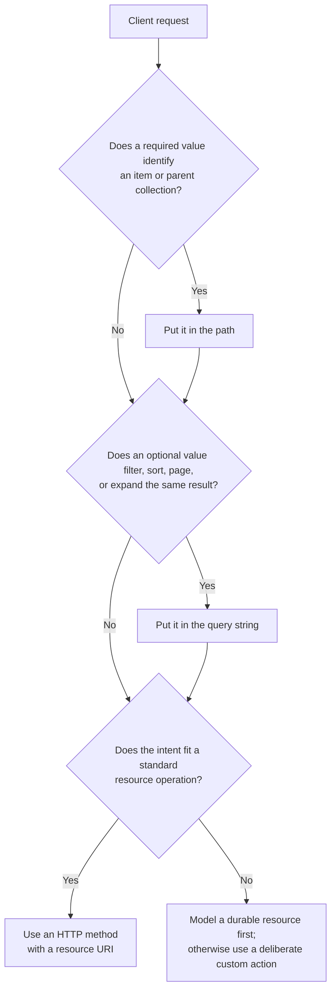

# Designing REST API Endpoints

An endpoint is a contract, not a controller method. A client should be able to look at one route,
understand the business thing it addresses, and make a good guess at related routes without knowing the
database or Spring implementation.

Consider a client that needs a transaction, sometimes needs its images, and can open a review case. The
endpoint design should make those three intentions obvious while leaving the service free to change tables,
queues, or downstream dependencies.

## Start from the business resource

Name the thing a client works with, then give its collection and an individual item stable addresses.
The HTTP method expresses the usual operation; the URI expresses what receives it.

```http
GET    /v1/transactions
POST   /v1/transactions
GET    /v1/transactions/{transactionId}
PATCH  /v1/transactions/{transactionId}
DELETE /v1/transactions/{transactionId}
```

`/transactions` is a collection resource. `/transactions/{transactionId}` is one transaction. This is
why `GET /get-transaction/{transactionId}` and `POST /create-transaction` are weaker: they duplicate the
verb already carried by HTTP and couple the public API to a handler name.

Use plural, lowercase nouns consistently. Kebab case is a readable convention for multiword resources:
`/review-cases`, `/managed-devices`, and `/verification-attempts`. The exact casing convention matters
less than applying one convention across the API.

The resource model is deliberately not the database schema. A public `/transactions` resource may join
data from a relational store, an object store, and a vendor response. Exposing `/transaction_table_rows`
would make internal storage a client contract.

## Address the resource, then shape its representation

The most useful decision rule is this:

> Put required identity or required parent scope in the path. Put optional result shaping in the query
> string.

The two are not alternatives for a single request. A route commonly combines them: the path identifies the
transaction and a query parameter asks for an optional representation detail.



| Client question | Route form | Example |
| --- | --- | --- |
| Which exact thing? | Path parameter | `GET /transactions/{transactionId}` |
| Which parent-scoped collection? | Path parameter | `GET /projects/{projectId}/tasks` |
| Which subset of a collection? | Query parameter | `GET /transactions?status=REVIEW` |
| How should a collection be ordered or paged? | Query parameter | `GET /transactions?limit=50&cursor=...` |
| Which optional related data is useful now? | Query parameter | `GET /transactions/{id}?include=images` |

For example, a transaction screen always needs the transaction but only sometimes needs image metadata:

```http
GET /v1/transactions/txn_98234
GET /v1/transactions/txn_98234?include=images
```

`include=images` does not identify a second transaction; it asks for a richer representation of the same
one. A documented `include` list scales better than a growing set of special booleans such as
`includeImages=true` and `includeMerchant=true`.

If images are large, independently addressable, or need their own pagination and authorization rules,
make them resources instead:

```http
GET /v1/transactions/txn_98234/images
GET /v1/images/img_7f2
```

Do not put access tokens, passwords, or sensitive PII in paths or query strings. They commonly appear in
access logs, proxies, browser history, telemetry, and support screenshots.

## Keep relationships shallow, but not fake

Nested collection routes express useful context:

```http
GET  /v1/projects/{projectId}/tasks
POST /v1/projects/{projectId}/tasks
```

The project tells the server which task collection is meant. Once a task has a globally unique ID, repeat
parent history only when it adds identity:

```http
PATCH  /v1/tasks/{taskId}
DELETE /v1/tasks/{taskId}
```

This avoids routes such as `/users/{userId}/projects/{projectId}/tasks/{taskId}` for every task action.
It also prevents a client from needing parent IDs it does not otherwise have.

Do not flatten mechanically. If an issue number is unique only inside a repository, the repository belongs
to its address:

```http
GET /v1/repositories/{owner}/{repository}/issues/{issueNumber}
```

The path does not authorize access. For `DELETE /tasks/{taskId}`, the backend obtains the caller from its
credentials and verifies permission against the loaded task. A user ID supplied in a longer path is still
untrusted client input.

## Use HTTP methods for normal state changes

For ordinary resource operations, use the standard methods consistently.

| Intent | Typical method | Contract to state clearly |
| --- | --- | --- |
| Create in a collection | `POST /transactions` | Created resource and `Location`/response shape |
| Read a resource | `GET /transactions/{id}` | Representation and not-found behavior |
| Replace an item | `PUT /transactions/{id}` | Full representation and idempotency |
| Change selected fields | `PATCH /transactions/{id}` | Patch format and field semantics |
| Remove an item | `DELETE /transactions/{id}` | Delete versus soft-delete behavior |

Idempotency is an observable contract, not a word to add casually. Repeating the same `PUT` must leave the
resource in the same state. A `PATCH` can also be idempotent, but that depends on its documented operation:
setting `status` to `REVIEW` is different from blindly incrementing a retry count.

## Model a durable result before inventing an action endpoint

Some operations do not map naturally to CRUD. Capturing a payment or resubmitting a verification is a
business command. A custom action is reasonable when it cannot be expressed as a normal resource update:

```http
POST /v1/payments/{paymentId}:capture
POST /v1/transactions/{transactionId}:resubmit
```

First ask whether the operation creates a durable thing with a status, timestamps, and audit history. A
retry that creates a verification attempt is usually clearer as a resource:

```http
POST /v1/transactions/{transactionId}/attempts
GET  /v1/transactions/{transactionId}/attempts/{attemptId}
```

The interview answer is not “verbs are forbidden.” It is “prefer resource operations; use a custom action
only when the business intent would be distorted by pretending it is CRUD.”

## Design collection behavior as part of the contract

Filters, ordering, pagination, and field projection are collection concerns. Keep them out of a new route
for every variation:

```http
GET /v1/transactions?status=REVIEW&sort=-createdAt&limit=50&cursor=...
GET /v1/transactions?fields=id,status,createdAt
```

Document default ordering, maximum page size, cursor encoding/expiry, allowed filter values, and invalid
combinations. Cursor pagination is usually safer than offsets for a changing, ordered transaction feed,
but it needs a stable sort key and a tie-breaker such as `(createdAt, transactionId)`.

Also consider the payload boundary. One endpoint that returns every document image may be convenient for a
single screen but expensive for list traffic. Use field selection, `include`, or a separate subresource
based on how often the related data is needed and whether it has a different lifecycle.

## Make slow work visible instead of holding the request open

If document processing takes long enough that a normal response would time out, accept work and expose its
state:

```http
POST /v1/transactions

HTTP/1.1 202 Accepted
Location: /v1/operations/op_123

GET /v1/operations/op_123
```

The operation resource should say whether work is pending, succeeded, or failed and where the resulting
transaction can be read. A `202` only means accepted for processing; it does not mean verification
succeeded.

## Evolve the contract deliberately

Adding an optional response field is normally compatible. Removing a field, changing its meaning, or
making previously optional input required is a breaking change. Pick one versioning policy for public
consumers—URI versions such as `/v1/...` are a practical default—and pair a breaking release with a
deprecation and migration plan.

Before publishing a route set, read it as a client would:

```http
POST  /v1/transactions
GET   /v1/transactions?status=REVIEW&limit=50
GET   /v1/transactions/{transactionId}
GET   /v1/transactions/{transactionId}?include=images
POST  /v1/transactions/{transactionId}:resubmit
GET   /v1/review-cases?assigneeId={userId}&status=OPEN
PATCH /v1/review-cases/{reviewCaseId}
```

If a new engineer cannot infer whether each route represents a collection, item, related collection, or
deliberate command, refine the resource model before adding another special case.

## References

- [Microsoft: REST web API design](https://learn.microsoft.com/en-us/azure/architecture/best-practices/api-design)
- [Google AIP-121: resource-oriented design](https://google.aip.dev/121)
- [Google AIP-136: custom methods](https://google.aip.dev/136)

## Quick recall

**Q. How should an API fetch one transaction with optional images?**

Use `GET /v1/transactions/{transactionId}?include=images`. The path identifies the transaction; the
query changes the requested representation.

**Q. When does a value belong in a path instead of the query string?**

Use the path when it is required to identify the item or parent-scoped collection. Use the query string
for optional filters, sorting, pagination, projection, and expansions.

**Q. Why are deeply nested item routes usually a problem?**

They repeat parent IDs that add no identity and make clients carry unnecessary context. Keep nesting for
parent-scoped collections or children whose identity is only local to the parent.

**Q. When is a verb endpoint acceptable?**

When the operation is a real command that does not fit a standard resource method. First check whether it
creates a durable subresource with its own state and audit trail.

**Q. What does `202 Accepted` promise?**

Only that the server accepted work for later processing. Return an operation/status resource so the client
can learn the eventual result.
