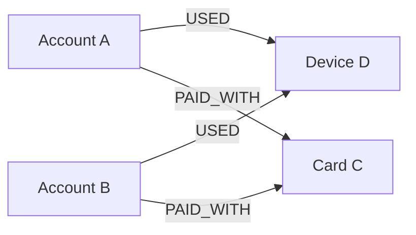

# Graph Databases

Graph databases model data as **nodes** and typed **relationships**. They fit a different access pattern from a
transaction table: not only “which rows match?”, but “how are these entities connected over several hops?”

Common interview examples:

- Fraud detection across accounts, devices, cards, IPs, and merchants.
- Social graphs such as friends-of-friends and recommendations.
- Dependency graphs such as package, service, or ownership relationships.
- Knowledge graphs where relationships are first-class facts.

Neo4j and Amazon Neptune are common examples.

## The reader path: anchor, then traverse

A property graph gives nodes and relationships labels/types and properties. For a fraud investigation, that can be:



The reader question is: *which accounts share two independent identifiers?* Start from a bounded anchor such as a
known account or device, follow the declared edge types, then filter or aggregate the resulting paths. The graph is
useful because the relationship is stored and queried as a first-class fact; it does not make an unbounded “find every
possible connection” request cheap.

In Cypher-like syntax, this asks for accounts that used the same device as a flagged account:

```cypher
MATCH (flagged:Account {id: $accountId})-[:USED]->(d:Device)<-[:USED]-(other:Account)
WHERE other <> flagged
RETURN other.id
LIMIT 100
```

An index helps find the starting `Account(id)`. Traversal then follows relationships. The crucial performance guard is
the query boundary: specific labels and relationship types, a bounded depth, and a `LIMIT` or business predicate.

## Relational baseline and decision

A relational database can represent the same data with `account`, `device`, and `account_device` tables. That is often
the better default for ordinary CRUD, strong multi-row transactions, fixed shallow joins, reporting, and teams that
already operate SQL well.

A graph database earns its added operational and modeling cost when relationship depth, path shape, and relationship
types are the primary query—not a rare report. Do not say “graphs are faster than SQL.” A graph can avoid repeatedly
constructing deep joins for traversal-oriented access; a relational plan can be simpler and better for a known,
bounded join and aggregation.

| Pressure | Naive failure | Graph mechanism | Trade-off / recovery |
| --- | --- | --- | --- |
| Investigate shared devices, cards, and IPs across several hops | Ad-hoc self-joins become hard to express and tune as path depth changes | Typed relationships and path matching | Bound depth and results; inspect plans and add an anchor index. |
| A celebrity device connects to millions of accounts | One traversal fans out into an enormous result set | Explicit relationship traversal exposes the fan-out | Apply time windows, relationship filters, limits, and asynchronous/offline analysis. |
| Relationship fact is corrected or deleted | Cached investigation results can retain a stale path | Update/delete the edge as a domain fact | Rebuild or invalidate dependent projections; keep audit evidence where the domain requires it. |

## Modeling rules that prevent bad queries

- Give an edge a business meaning: `USED`, `OWNS`, `TRANSFERRED_TO`, not a generic `RELATED_TO`.
- Put properties on the relationship when they belong to the connection, such as `firstSeenAt`, `lastSeenAt`, or
  `confidence`; put account attributes on the account node.
- Start from an indexed, selective node whenever possible. An unconstrained traversal can explode even on a graph
  engine.
- Model a high-fan-out relationship deliberately. A shared IP or popular merchant may need time windows, aggregation,
  or a separate analytical workflow instead of an online multi-hop traversal.

## Interview delivery

Say the query first: “Starting from a flagged account, find accounts that share a device or card within 30 days.” Then
name the relational baseline, explain why the changing multi-hop relationship path is the pressure, show the indexed
anchor and bounded traversal, and close with the supernode/result-explosion guard. Defer vendor clustering,
specialized graph algorithms, and full recommendation ranking unless the prompt asks for them.

## Quick recall

**Q. Is GraphQL a graph database?**

A. No. GraphQL is an API query language. Graph databases are storage engines for relationship-heavy data.

**Q. Why do graph databases fit fraud detection?**

A. Fraud often hides in relationships: shared devices, linked cards, repeated IPs, cycles, and suspicious clusters.

**Q. What is the safest performance rule for a graph query?**

A. Start from a selective indexed anchor, constrain relationship types and depth, and bound the result; never assume
a multi-hop traversal is cheap.

**Q. When is SQL still the better choice?**

A. For ordinary CRUD, fixed shallow joins, relational reporting, and strong transactional workflows where graph
traversal is not the dominant query.
