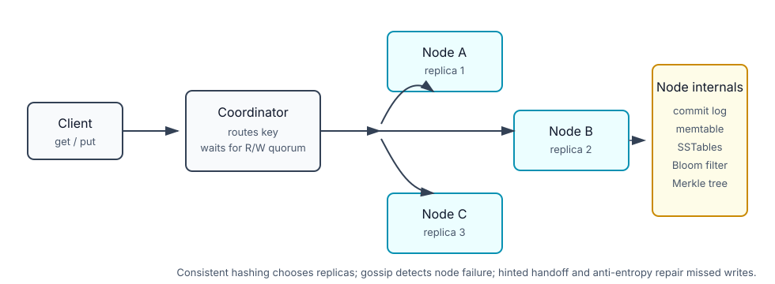
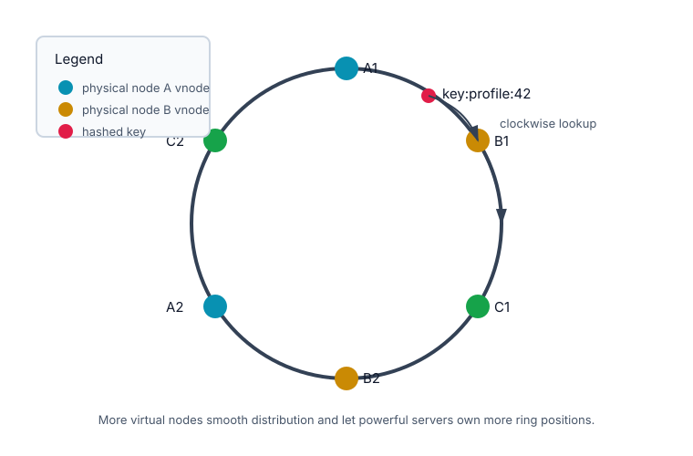

# Distributed Key-Value Store

## How it works

A key-value store exposes a tiny API:

```text
put(key, value)
get(key)
```

The key is unique. The value is usually opaque to the storage engine: bytes, JSON, string, list, object, or serialized domain state. The database does not need to understand joins or relational constraints to return a value by key.

Common examples:

- Redis / Memcached: cache and low-latency lookup.
- DynamoDB / Cassandra: distributed, highly available storage.
- RocksDB / LevelDB: embedded local key-value engines.

The interview version is usually: design a distributed key-value store with small values, large total data size, low latency, high availability, automatic scaling, and tunable consistency.

## Single-node baseline

On one machine, the simplest design is a hash table:

```text
key -> value
```

This gives fast lookups but runs into limits:

- memory is finite
- one machine is a single point of failure
- one CPU/disk/network path caps throughput
- restarts or disk loss can lose data unless persistence is added

Single-node optimizations:

- compress values
- keep hot data in memory
- spill colder data to disk
- use a commit log for durability

At large data/traffic scale, this becomes a distributed hash table.

## Distributed architecture



Key ideas:

- **Coordinator:** accepts client request, routes to storage nodes, waits for read/write quorum.
- **Consistent hashing:** maps keys to nodes and minimizes movement when nodes change.
- **Replication:** stores each key on `N` unique physical nodes for availability.
- **Quorum:** `R` and `W` tune latency vs consistency.
- **Gossip:** spreads node health/membership information without all-to-all heartbeats.
- **Hinted handoff:** temporarily stores writes for a failed node and hands them back later.
- **Merkle tree / anti-entropy:** finds replica differences efficiently and repairs only mismatched ranges.

## Consistent hashing in the store



Modulo hashing is brittle:

```text
node = hash(key) % N
```

When `N` changes, most keys remap. For a cache, that causes a cache-miss storm. For a database, it creates large data movement.

Consistent hashing maps both keys and nodes onto a ring. A key belongs to the first node encountered clockwise. Adding or removing a node moves only the affected range, not the whole dataset.

Virtual nodes fix two practical problems:

- one physical node at one ring position can own a huge uneven range
- adding/removing one physical node can overload its immediate neighbor

With virtual nodes, each physical node owns many ring positions. More virtual nodes usually means smoother distribution, at the cost of more metadata.

## Replication and quorums

Use `N`, `W`, and `R`:

- `N`: number of replicas for each key
- `W`: write acknowledgements required before write succeeds
- `R`: read responses required before read succeeds

Examples with `N = 3`:

| Config | Bias | Meaning |
|--------|------|---------|
| `W=1, R=1` | low latency | fastest, but stale reads are possible |
| `W=2, R=2` | stronger consistency | read/write sets overlap because `R + W > N` |
| `W=3, R=1` | fast reads, slow writes | write waits for all replicas |
| `W=1, R=3` | fast writes, slow reads | read checks all replicas |

Important nuance: `W=1` does not mean "write to one replica only." It means the coordinator can return success after one replica acknowledges; the write may still be sent to other replicas asynchronously.

## Conflict resolution

In AP-style systems, replicas may accept concurrent writes during partitions. That means two values can both be valid descendants of the same older value.

Vector clocks track causality:

```text
D1[(Sx, 1)]
D2[(Sx, 2)]
D3[(Sx, 2), (Sy, 1)]
D4[(Sx, 2), (Sz, 1)]  -> conflict with D3
```

If every counter in version B is greater than or equal to version A, B descends from A and can replace it. If each version is ahead in some dimension, they are siblings and need conflict resolution.

Tradeoffs:

- vector clocks detect conflicts without relying on wall-clock time
- clients or application logic may need to merge conflicting values
- vector metadata can grow and may need pruning

For shopping carts, merging items can work. For bank balances, this model is usually unacceptable; prefer stronger consistency.

## Failure handling

### Failure detection

Do not mark a node down only because one peer says so. Gossip protocols spread heartbeat counters and membership state across random peers until the cluster converges on who is healthy.

### Temporary failure

Strict quorum can block if the expected replica is down. Sloppy quorum improves availability by using the first healthy replicas instead of only the assigned ones.

Hinted handoff stores missed writes on a temporary node:

```text
assigned replica S2 is down
S3 stores write with hint "belongs to S2"
S2 recovers
S3 hands the write back to S2
```

### Permanent failure

Anti-entropy compares replicas and repairs missing/different data. Merkle trees make this efficient: compare root hashes first; if they differ, walk down to only the mismatched ranges.

### Data center outage

Replicate across data centers or regions if the system must survive full-site failure. This improves availability but adds latency, consistency, and cost tradeoffs.

## Write path

Typical LSM-style write path:

```text
write request
  -> append to commit log
  -> write to in-memory memtable
  -> return after W acknowledgements
  -> flush memtable to SSTable when full
```

Why this is fast: appending to a log is sequential I/O. Later compaction and read-path work pay the cost.

## Read path

Typical read path:

```text
read request
  -> check memtable/cache
  -> check Bloom filter
  -> read candidate SSTables
  -> reconcile versions if needed
  -> return after R responses
```

Bloom filters prevent many unnecessary disk reads by saying "this SSTable definitely does not contain the key" or "it might contain the key."

## Improved design summary table

| Goal / problem | Technique | Why it helps | Examples / caveats |
|----------------|-----------|--------------|--------------------|
| Store data beyond one server | Consistent hashing + partitioning | Spreads keys across nodes with limited remap on node changes | Dynamo-style KV stores, Cassandra, distributed caches |
| Incremental scaling | Add nodes to the ring | Only affected key ranges move | Rebalance cost is proportional to moved ranges, not total data |
| Uneven node capacity | Virtual nodes weighted by capacity | Larger machines own more ring positions | More vnodes = smoother distribution, more metadata |
| High availability reads | Replication across `N` nodes | Reads can succeed even if some replicas are down | Multi-AZ / multi-region if outage domain matters |
| Highly available writes | Sloppy quorum + hinted handoff | Healthy nodes temporarily accept writes for failed owners | Must hand data back and repair later |
| Tunable consistency | `N`, `W`, `R` quorum choices | Lets product choose latency vs consistency | `R + W > N` gives stronger overlap, not magic under all failure modes |
| Concurrent write conflicts | Versioning + vector clocks | Detects sibling versions without wall-clock ordering | Client/application merge can be complex |
| Temporary node failure | Gossip + hinted handoff | Detects failure and preserves writes during short outages | Avoid marking down from one node's opinion only |
| Permanent replica drift | Anti-entropy + Merkle trees | Repairs only differing key ranges | Used by Dynamo/Cassandra-style repair flows |
| Fast writes | Commit log + memtable + SSTable flush | Sequential append first, disk structure later | LSM-tree family: Cassandra, RocksDB, LevelDB |
| Fast reads from disk | Bloom filters + sorted SSTables | Avoids checking files that cannot contain the key | Bloom filters can false-positive, not false-negative |
| Data center outage | Cross-DC replication | Keeps data reachable when a site fails | Adds latency/cost; consistency becomes harder |
| Hot keys / celebrity problem | Caching, replication, salting, fanout, special-case routing | A single key can overload one partition even if hashing is balanced | Consistent hashing alone does not solve a single ultra-hot key |
| Search by text | Inverted index / search engine | KV lookup is not enough for free-text search | Elasticsearch/OpenSearch, Lucene |
| Autocomplete | Trie/FST or prefix index | Need prefix lookup and ranking, not plain `get(key)` | Often paired with cache for hot prefixes |
| Nearby cab / driver search | Geohash, S2, H3, quadtree | Spatial proximity needs geographic partitioning | Use geospatial cell as routing key; consistent hashing may distribute cells across nodes afterward |
| Load balancer affinity | Consistent hashing / Maglev-style hashing | Keeps the same key/client near the same backend with limited remap | Useful for caches, LBs, sticky routing |

## Gotchas / Trick questions

1. **"KV store means Redis."** Redis is one KV-style system, but the distributed datastore interview is closer to Dynamo/Cassandra concepts.
2. **"Consistent hashing solves all hot partitions."** It improves distribution of many keys. One extremely hot key still needs caching, replication, salting, or special handling.
3. **"R + W > N always means perfect consistency."** It gives overlap in the normal quorum model, but partitions, concurrent writes, sloppy quorum, and clocks still complicate reality.
4. **"Vector clocks resolve conflicts automatically."** They detect causality/conflict. Application or client logic still decides how to merge.
5. **"Bloom filter tells you where the key is."** No. It tells you where the key might be; false positives are possible.
6. **"Cab search uses consistent hashing."** Usually no. Nearby search uses geospatial indexes like geohash/S2/H3; consistent hashing may only distribute those cells across machines.

## Quick recall

**Q. What is the core API of a key-value store?**  
A. `put(key, value)` and `get(key)`.

**Q. Why consistent hashing?**  
A. It spreads keys across nodes and minimizes data movement when nodes are added or removed.

**Q. Why virtual nodes?**  
A. They smooth load distribution and let larger machines own more partitions.

**Q. What does quorum `W=1` mean?**  
A. The coordinator returns after one replica acknowledges, not that only one replica receives the write.

**Q. What are vector clocks for?**  
A. Detecting whether versions are ancestors or conflicting siblings.

**Q. What do Merkle trees help with?**  
A. Efficiently finding which replica key ranges differ during anti-entropy repair.

**Q. What is the write path mental model?**  
A. Commit log first, memtable second, flush to SSTable later.

**Q. What is the read path mental model?**  
A. Check memory, use Bloom filters to narrow SSTables, read candidates, reconcile versions.
