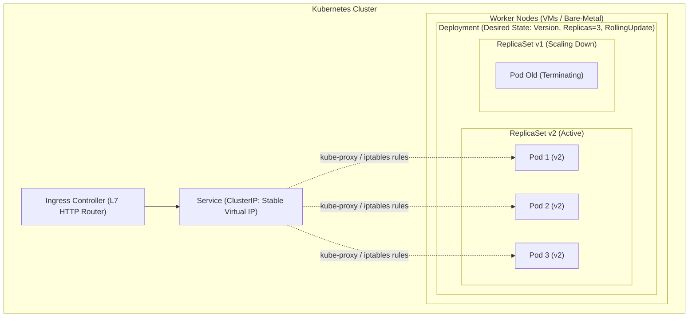

# Kubernetes, Containers, and Argo CD (GitOps)

In modern backend engineering, running an application is not just about building a JAR or binary—it is about packaging, isolating, orchestrating, discovering, scaling, and rolling out code safely across dynamic infrastructure.

---

## 1. Deployment Evolution & Pressure

As systems scaled from monoliths on dedicated iron to distributed microservices, infrastructure models evolved to solve distinct operational bottlenecks:

| Compute Model | What You Manage | Isolation & Startup | Key Pros | Key Cons / Traps |
| :--- | :--- | :--- | :--- | :--- |
| **Virtual Machine (VM)** | OS, Runtime, Dependencies, Application | Hardware virtualization (hypervisor), Minutes startup | Strong security boundary, full kernel control | Heavy resource footprint, slow horizontal scaling |
| **Container** | Application, Runtime, Dependencies, Image | OS kernel sharing (namespaces/cgroups), Seconds startup | Lightweight, highly portable, high compute density | Kernel sharing (weaker multi-tenant isolation), orchestration complexity |
| **Serverless (Lambda)** | Application code / handler only | Managed sandbox per invocation, Milliseconds-to-seconds | Zero server management, pay-per-request, instant auto-scale | Cold starts, execution time limits, vendor lock-in, connection pooling challenges |

### Docker vs. Kubernetes: The Scale Shift
* **Docker:** Builds and runs containers on a single host.
  * *Mental Model:* **A Single Taxi.** Ideal for 1 host running 5 containers. You manually handle crashes, port mapping, and host capacity.
* **Kubernetes (K8s):** Declarative container orchestrator managing thousands of containers across fleets of physical or virtual machines.
  * *Mental Model:* **Uber Fleet Dispatch System.** Automates placement (scheduling), routing, health monitoring, self-healing, rolling deployments, and dynamic autoscaling across 100+ nodes.

---

## 2. Kubernetes Architecture & Object Hierarchy

Kubernetes organizes infrastructure and workloads into a layered hierarchy where higher-level controllers manage lower-level primitives declaratively:



### The Workload Hierarchy
1. **Cluster:** A pool of compute nodes (control plane + worker nodes) unified by the Kubernetes API.
2. **Node:** A single physical machine or VM running a container runtime (e.g., `containerd`), `kubelet` (node agent), and `kube-proxy` (network agent).
3. **Deployment:** The declarative controller managing stateless application lifecycle, replica counts, and zero-downtime rolling upgrades.
4. **ReplicaSet:** The internal controller managed by a Deployment to ensure that an exact number of identical Pod replicas are running at any given time.
5. **Pod:** The smallest deployable unit in Kubernetes. A Pod is a protective wrapper enclosing one or more tightly coupled containers that share the same network namespace (localhost, IP) and storage volumes.
6. **Container:** The Linux runtime process isolated via cgroups (resource limits) and namespaces (process/network isolation).

---

## 3. Communication, Configuration & Health Layers

### Service Discovery & Networking
Pods are ephemeral: they die, reschedule, and receive dynamic, non-deterministic private IPs. Backend clients cannot rely on static Pod IPs.

* **Service (ClusterIP):** Provides a stable virtual IP address, a DNS name (`<service-name>.<namespace>.svc.cluster.local`), and layer-4 load balancing across healthy pods matching its label selector.
* **How `kube-proxy` Works:** `kube-proxy` runs on every node, watching the Kubernetes API for Service and `Endpoints` (or `EndpointSlice`) changes. It programs node-level packet filter rules (**iptables** or **IPVS**) so traffic directed to the virtual `ClusterIP` is transparently translated and forwarded directly to a healthy Pod IP.
* **Ingress:** An L7 reverse proxy (e.g., NGINX Ingress, AWS ALB Controller) that routes external HTTP/HTTPS traffic to internal Services based on hostnames and URL paths.

### Configuration Management
* **ConfigMap:** Injects non-sensitive environment configuration, property files, or command-line arguments (e.g., `DB_HOST`, `LOG_LEVEL`, `THREAD_POOL_SIZE`).
* **Secret:** Base64-encoded object for sensitive data (e.g., database passwords, TLS certificates, API keys, JWT signing keys). Can be mounted as environment variables or volume files.

### Container Health Probes
Kubernetes relies on three distinct probes to manage pod lifecycle safely:

```
                  +---------------------------+
                  | Container Process Starts  |
                  +-------------+-------------+
                                |
                                v
                  +---------------------------+
                  |      Startup Probe        | <--- Protects slow-starting apps (e.g., Spring Boot JVM).
                  | (Blocks Liveness/Readiness)|      Fails? Restart container.
                  +-------------+-------------+
                                | Passes
                                v
            +-------------------+-------------------+
            |                                       |
            v                                       v
+-----------------------+               +-----------------------+
|    Readiness Probe    |               |    Liveness Probe     |
| (Is app ready to      |               | (Is app alive /       |
|  serve traffic?)      |               |  deadlocked?)         |
+-----------+-----------+               +-----------+-----------+
            | Passes                                | Fails
            v                                       v
+-----------------------+               +-----------------------+
| Added to Service      |               | Kubelet restarts      |
| Endpoints (receives   |               | the container         |
| traffic)              |               +-----------------------+
+-----------------------+
```

1. **Startup Probe:** Checks if the application has completed initialization (e.g., heavy Spring context loading, warming caches). Disables liveness and readiness checks until it succeeds, preventing premature restarts.
2. **Readiness Probe:** Determines if the container is ready to accept incoming traffic. If it fails, the pod is removed from the Service `Endpoints`, so no traffic is routed to it, but the container is **not** restarted.
3. **Liveness Probe:** Detects unrecoverable deadlocks or frozen processes. If it fails beyond the threshold, `kubelet` terminates and restarts the container.

---

## 4. Zero-Downtime Rollouts & Scaling

### RollingUpdate Mechanics
When you update a Deployment's container image or environment variables:
1. The Deployment creates a **new ReplicaSet** (v2) alongside the old one (v1).
2. It scales up v2 while scaling down v1 according to two safety thresholds:
   * **`maxSurge`:** How many pods can be created *above* the desired replica count during rollout (e.g., `25%` or `1`).
   * **`maxUnavailable`:** How many pods can be unavailable *below* the desired replica count during rollout (e.g., `0` for strict zero-downtime).
3. Traffic transitions to v2 pods only after their **Readiness Probes** succeed. Once v2 reaches full replica count, v1 is scaled down to 0 replicas (kept for instant rollback).

### Autoscaling
* **Horizontal Pod Autoscaler (HPA):** Dynamically scales the number of Pod replicas based on CPU utilization, memory pressure, or custom application metrics (e.g., HTTP request rate, queue depth).
* **Cluster Autoscaler:** Scales underlying worker nodes up or down when Pods cannot be scheduled due to insufficient CPU/memory capacity.

---

## 5. GitOps Delivery with Argo CD

GitOps establishes **Git as the single source of truth** for both application code and declared infrastructure manifests.

```
Developer Push ---> Git Repository (Desired State: main branch)
                          |
                          | (Continuous Reconciliation Loop - default 3 min)
                          v
                   +--------------+
                   |   Argo CD    | <--- Diff: Desired (Git) vs Actual (K8s API)
                   +-------+------+
                           |
        +------------------+------------------+
        |                                     |
        v                                     v
[Sync Status]                           [Health Status]
* Synced: Cluster == Git                * Healthy: Pods running & ready
* OutOfSync: Drift detected             * Progressing / Degraded / Missing
        |
        v (If Self-Heal enabled)
Automated Reversion of Manual Cluster Changes
```

### Core GitOps Mechanics
* **Reconciliation Loop:** Argo CD continuously observes both the Git repository (desired state) and the live Kubernetes cluster (actual state), computing differences (diffs).
* **Sync Status vs. Health Status:**
  * **Sync Status (`Synced` vs `OutOfSync`):** Reflects whether the live cluster manifests match Git.
  * **Health Status (`Healthy`, `Progressing`, `Degraded`):** Reflects whether the running resources are functioning correctly (e.g., Pods passing readiness probes). An application can be `Synced` (matches Git) yet `Degraded` (e.g., bad image causing crash loops).
* **Drift Detection & Self-Healing:**
  * If an engineer manually edits a cluster resource using `kubectl edit`, Argo CD detects configuration drift (`OutOfSync`).
  * With **`selfHeal: true`**, Argo CD automatically overwrites the out-of-band cluster change to restore the exact state declared in Git.

---

## 6. Failure Modes, Debugging & Recovery

In production and interviews, knowing how Kubernetes fails is crucial:

| Failure State | Root Cause | Diagnosis (`kubectl`) | Remediation |
| :--- | :--- | :--- | :--- |
| **CrashLoopBackOff** | Container process starts and immediately exits with a non-zero exit code (e.g., uncaught exception, missing required env var, failed DB connection). | `kubectl logs <pod> --previous`<br>`kubectl describe pod <pod>` | Inspect startup stack trace, verify DB connectivity, check environment variables. |
| **OOMKilled (Exit Code 137)** | Container memory usage exceeded `resources.limits.memory` defined in the pod manifest. Linux cgroup sends `SIGKILL`. | `kubectl describe pod <pod>` (Look for `OOMKilled: true, Exit Code: 137`) | Increase memory limit or tune JVM heap (`-XX:MaxRAMPercentage=75.0` to leave room for off-heap/metaspace). |
| **ImagePullBackOff / ErrImagePull** | Kubernetes cannot download the container image (wrong tag, non-existent repo, or missing registry pull secret). | `kubectl describe pod <pod>` (Check Events section) | Fix image repository URL/tag, ensure `imagePullSecrets` is configured for private registries. |
| **Pending Pod** | Scheduler cannot place the pod onto any worker node due to insufficient CPU/memory requests, node taints/tolerations, or volume attachment limits. | `kubectl describe pod <pod>` (Events: `0/N nodes available: insufficient memory`) | Add worker nodes via Cluster Autoscaler, optimize pod `resources.requests`, or adjust affinities. |
| **Traffic routed to unready Pods** | Missing or misconfigured readiness probe causes Service to send live requests before DB connection pools or Spring contexts finish warm-up. | `kubectl describe pod <pod>` (Check Readiness Probe settings) | Implement `/actuator/health/readiness` and ensure initial delay and period seconds match JVM warm-up time. |

---

## 7. SDE2 Scope Recommendation

For SDE2 backend interviews, prioritize high-ROI workload architecture and delivery principles over low-level infrastructure administration:

* **High ROI (Must Master):**
  * Core Object Lifecycle: `Cluster`, `Node`, `Pod`, `Deployment`, `ReplicaSet`, `Service`, `Ingress`.
  * Traffic Routing: `ClusterIP` virtual IP mechanics, `kube-proxy`, and DNS-based service discovery.
  * Resilience: Liveness vs. Readiness vs. Startup probes, JVM container sizing, and handling `CrashLoopBackOff`/`OOMKilled`.
  * Deployments & GitOps: RollingUpdate configuration (`maxSurge`/`maxUnavailable`), Argo CD drift reconciliation, and zero-downtime migrations.
* **Low ROI (Out of Scope for SDE2):**
  * Custom Resource Definitions (CRDs) & Operator development from scratch.
  * Deep CNI (Container Network Interface) packet-level routing internals (e.g., Calico eBPF / Flannel VXLAN).
  * Storage CSI driver internals, Helm chart templating engines, or containerd low-level syscalls.

---

## 8. SDE2 Interview Answer Blueprint

When asked: *"How does your service run, scale, and get deployed in production?"*

1. **Packaging & Isolation:** *"Our backend service is packaged as a lightweight Docker container image running on a managed Kubernetes cluster. Pod memory and CPU requests/limits are tuned to accommodate both heap and metaspace."*
2. **Resilience & Networking:** *"Workloads are declared via Kubernetes Deployments backed by a ClusterIP Service. `kube-proxy` maps Service DNS to healthy Pod endpoints. We configure Startup Probes to protect slow JVM warm-ups, and Readiness Probes to guarantee zero-downtime during rolling updates."*
3. **GitOps Delivery:** *"Deployments are managed declaratively through Argo CD. Git is our single source of truth. Argo CD continuously reconciles desired Git manifests against cluster state, detecting drift and auto-healing out-of-band changes."*

---

## Quick recall

1. **Why is a Pod the atomic unit in Kubernetes instead of a Container?**
   * A Pod allows co-located helper containers (sidecars for logging, proxying, metric scraping) to share the same network namespace (`localhost`), IPC, and storage lifecycle.
2. **What is the difference between a Liveness Probe and a Readiness Probe?**
   * Liveness probe failure restarts the container; Readiness probe failure temporarily detaches the pod from Service endpoints so it stops receiving traffic without being killed.
3. **How does `kube-proxy` enable Service discovery without dynamic DNS updates?**
   * It programs node packet filter tables (iptables/IPVS) matching static virtual `ClusterIP`s to the dynamic list of healthy pod backend IPs.
4. **What does Exit Code 137 mean in Kubernetes?**
   * The container exceeded its memory limit and was killed by the OS kernel cgroup OOM killer (`SIGKILL` = 128 + 9).
5. **In Argo CD, can an application be `Synced` but `Degraded`?**
   * Yes. `Synced` means the cluster state exactly matches the Git manifests; `Degraded` means the underlying resources are failing to run (e.g., Pods failing readiness checks or crash-looping).
