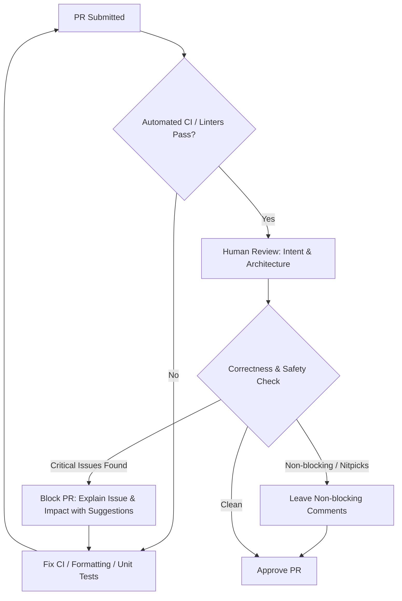

# Code Reviews

## Primary Purpose
A code review is a collaborative quality gate and knowledge-sharing mechanism, not an adversarial gatekeeping exercise or coding competition. Its primary goal is ensuring merged code is correct, maintainable, secure, observable, and aligned with system architecture while continuously leveling up team standards.

## What Should Be Reviewed?
When reviewing code, prioritize high-leverage architectural and runtime concerns over surface-level cosmetics:

1. **Correctness (Highest Priority):**
   - Does the implementation fulfill the actual business ticket and edge cases?
   - Are there concurrency hazards (race conditions, lost updates, thread-safety violations)?
   - Are off-by-one boundaries, null handling, and unexpected payload formats handled safely?
   - *Note on testing:* Passing automated tests does not guarantee correctness if assertions are weak, edge cases are omitted, or underlying business assumptions are flawed.
2. **Architecture & API Design:**
   - Are endpoint paths, status codes, payload structures, and error contracts backward-compatible?
   - Are mutation operations idempotent to safely tolerate network retries?
   - Even if system architecture is finalized in a design doc, code review validates implementation fidelity and API contracts.
3. **Maintainability & Readability:**
   - Can an engineer on-call understand and safely modify this code six months later?
   - Watch for monolithic methods, duplicated domain logic, deeply nested conditionals, and high coupling.
4. **Performance & Scalability:**
   - Look for N+1 database queries, unindexed lookups, unbounded in-memory collection growth, and accidental blocking I/O on reactive or event loops.
   - Avoid speculative micro-optimizations that sacrifice readability unless profiling data confirms a hot path bottleneck.
5. **Security & Data Integrity:**
   - Validate all input boundaries, authentication/authorization checks, SQL injection vectors, SSRF risks, and sensitive data leakage (PII/tokens in application logs).
   - Ensure transaction boundaries and foreign-key integrity protect against partial state corruption.
6. **Testing & Observability:**
   - Are unit, integration, and regression tests provided for happy paths, negative paths, and boundary conditions?
   - Are structured logs, metrics counters, and distributed trace contexts in place to diagnose production failures?

## What Not to Comment On
Do not block pull requests for personal stylistic preferences or alternate implementations of equivalent merit.
- Code formatting, import sorting, linting, and brace placement must be enforced automatically by CI formatters (Spotless, Checkstyle, Prettier).
- If both the author's pattern and your personal preference are readable, safe, and conform to team conventions, approve the author's approach.
- If you offer an optional suggestion, prefix it clearly (e.g., `nit:`, `suggestion (non-blocking):`).

## When Should You Block a PR?
Block a pull request only for objective technical risks:
- Logic defects and unhandled edge cases producing wrong outputs.
- Concurrency bugs, race conditions, or unhandled deadlocks.
- Security vulnerabilities or credential/PII leakage.
- Breaking API schema compatibility or database migration hazards.
- Potential data corruption, lack of transactional consistency, or unrecoverable error handling.
- Complete absence of required automated test coverage for critical domain logic.

## Constructive Review Communication
Effective review comments are specific, educational, and actionable. Frame feedback around the code and system behavior rather than the person.

- **Ineffective:** "This code is bad. Rewrite this." (Vague, confrontational, zero guidance).
- **Effective:** "This database query runs inside the `for` loop over `orderItems`, triggering an N+1 query pattern that will degrade response times under high load. Can we batch-fetch all items using `findAllById(itemIds)` before the loop instead?" (Identifies mechanism, explains impact, offers a concrete fix).

## Mindset as Author and Reviewer
- **Author Mindset:** View feedback as code hardening rather than personal criticism. Explain your trade-offs clearly, stay receptive to alternative approaches, and proactively offer context.
- **Reviewer Mindset:** Review intent before syntax ("Does this solve the underlying business problem cleanly?"). Think operationally: evaluate blast radius, rollback safety, and migration risks. Approving without change requests is normal and encouraged if the PR meets quality standards.
- **Resolving Deadlocks:** If a back-and-forth thread exceeds 2–3 iterations, switch immediately to a quick synchronous conversation or video call. Document the agreed resolution on the PR. If an architectural disagreement persists, escalate to the Tech Lead or Staff Engineer to decide on technical merit.

## Interview Perspective
- **"What do you prioritize when conducting a code review?"**
  - *Response Strategy:* Highlight correctness first (business logic fidelity, concurrency, edge cases), followed by security, backward compatibility, performance (e.g., N+1 queries, memory limits), observability, maintainability, and regression tests. Emphasize delegating style formatting entirely to automated tooling.
- **"How do you handle disagreements with another engineer on a PR?"**
  - *Response Strategy:* Ground the discussion in objective engineering criteria (latency, thread safety, operational risk, maintainability). Seek alignment via quick synchronous communication to eliminate tone ambiguity, and involve the Tech Lead if trade-offs remain deadlocked. The goal is the best outcome for the system, not winning an argument.

## Five Mental Questions During Every Review
1. **Is it correct?** Does it accurately implement the required business behavior across all valid and invalid inputs?
2. **Can it break production?** Could it introduce race conditions, breaking API changes, security flaws, or unmigrated database state?
3. **Will it scale?** Does it introduce unbounded memory allocations, blocking I/O, or N+1 query patterns?
4. **Can another engineer maintain it?** Is the logic self-explanatory, cleanly factored, and safe to modify during an incident?
5. **Are there sufficient tests and alerts?** Does the test suite verify boundary conditions, and do logs/metrics provide observability?

## Quick recall

**Q. What is the highest priority in a code review?**
A. Correctness — ensuring the implementation fulfills business requirements without logical flaws, race conditions, or unhandled edge cases.

**Q. When is it legitimate to block a PR?**
A. When there are logical bugs, security vulnerabilities, breaking API changes, data corruption risks, or missing critical tests.

**Q. What makes an effective code review comment?**
A. It is specific, actionable, and educational, clearly explaining the underlying failure mode or risk and offering a concrete alternative.

**Q. Do passing automated tests prove code correctness?**
A. No. Tests can have incomplete assertion logic, miss boundary conditions, fail to handle nulls/timeouts, or validate flawed business assumptions.

**Q. What are the five mental questions to ask during every code review?**
A. (1) Is it correct? (2) Can it break production? (3) Will it scale? (4) Can another engineer maintain it? (5) Are there sufficient tests and alerts?
