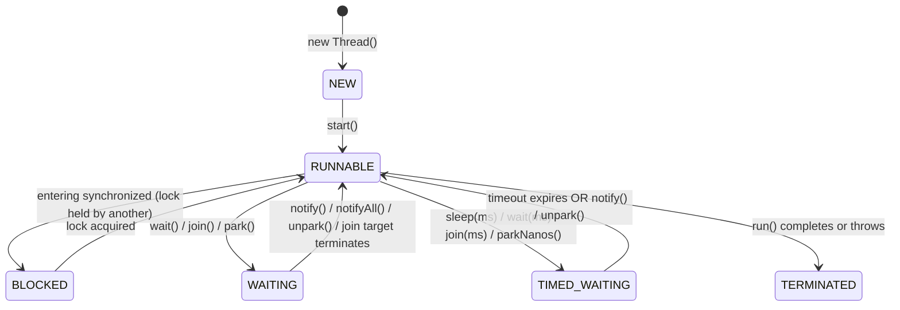

# Thread Lifecycle

---

## Process vs thread

A process is an independently running program with its own address space and resources. Two Java processes do not share heap objects unless they communicate through IPC, sockets, files, shared memory, or another external mechanism.

A thread is an execution path inside one process. Threads in the same JVM process share heap objects, static fields, file descriptors, and other process resources. Each thread has its own call stack, program counter, and local method frames.

Backend mental model:

```text
Spring Boot application = one JVM process
Incoming requests       = many worker threads inside that process
Shared objects          = heap state visible to those threads
```

That shared heap is why Java concurrency bugs are usually about shared mutable objects, not isolated request-local variables.

---

## The 6 states

Defined in `Thread.State`. The JVM tracks each thread's state; `Thread.getState()` returns the current value.

| State | What it means at JVM level |
|---|---|
| NEW | Thread object created, `start()` not yet called. No OS thread exists yet. |
| RUNNABLE | OS thread exists and is either running on a CPU core or waiting in the OS scheduler's run queue. Java doesn't distinguish the two. |
| BLOCKED | Waiting to acquire an intrinsic monitor lock (`synchronized` block/method). Another thread holds the lock. |
| WAITING | Indefinitely suspended — voluntarily gave up the CPU. Woken only when another thread explicitly notifies or unparks it. |
| TIMED_WAITING | Same as WAITING but with a deadline. JVM resumes the thread after the timeout even if no notification arrives. |
| TERMINATED | `run()` returned or threw an uncaught exception. Thread is dead — cannot be restarted. |

---

## State diagram



---

## Key transitions

### `start()`
Allocates an OS thread, moves the thread from NEW → RUNNABLE. Calling `start()` twice throws `IllegalThreadStateException`.

### Entering / exiting a `synchronized` block
- A thread trying to enter a `synchronized` block moves RUNNABLE → BLOCKED if the intrinsic lock is held by another thread.
- When the lock is released, one of the contending BLOCKED threads is promoted back to RUNNABLE (which one is unspecified — OS scheduler decides).

### `Object.wait()` / `notify()` / `notifyAll()`
- `wait()` — must hold the monitor lock. Atomically releases the lock and moves the calling thread RUNNABLE → WAITING (or TIMED_WAITING if called with a timeout). On wake, must re-acquire the lock before continuing.
- `notify()` — wakes one arbitrary WAITING thread on that object's monitor. The woken thread moves WAITING → BLOCKED (must re-acquire the lock).
- `notifyAll()` — wakes all WAITING threads. Each moves WAITING → BLOCKED and races for the lock.
- Common pitfall: `wait()` can wake spuriously (with no notification). Always call it inside a `while` loop checking the condition, not an `if`.

```java
synchronized (lock) {
    while (!conditionMet()) {   // NOT if — guards against spurious wakeups
        lock.wait();
    }
    // proceed
}
```

### `Thread.sleep(ms)`
Moves RUNNABLE → TIMED_WAITING. Does **not** release any held monitor locks. Resumes after the timeout or on interrupt.

### `thread.join()` / `thread.join(ms)`
Calling thread moves RUNNABLE → WAITING (or TIMED_WAITING). Resumes when the target thread reaches TERMINATED, or when the timeout expires.

### `LockSupport.park()` / `unpark(thread)`
Low-level primitives underlying `java.util.concurrent` locks.
- `park()` moves RUNNABLE → WAITING. `parkNanos()`/`parkUntil()` → TIMED_WAITING.
- `unpark(t)` wakes thread `t`. If `unpark` is called before `park`, the next `park` call returns immediately (one permit is "pre-loaded").
- Unlike `wait()`, `park()` does **not** require holding a lock.

---

## BLOCKED vs WAITING — the key distinction

Interviewers use this question to filter shallow from deep knowledge.

| | BLOCKED | WAITING |
|---|---|---|
| Cause | Trying to enter a `synchronized` block/method and the lock is taken | Voluntarily suspended via `wait()`, `join()`, or `park()` |
| Who decides when it ends | OS/JVM when the lock is released by another thread | Another thread explicitly calling `notify()`, `notifyAll()`, or `unpark()` |
| Lock held while suspended | No | No (for `wait()`, the lock is released atomically on entry) |
| Timeout variant | None — BLOCKED has no timeout | Yes → TIMED_WAITING |

One sentence for the interview: **BLOCKED is involuntary contention on a monitor lock; WAITING is a voluntary, indefinite suspension waiting for a signal.**

---

## TIMED_WAITING

Same semantics as WAITING — thread is suspended and not consuming CPU — but resumes after a wall-clock deadline even without a signal. Methods that produce TIMED_WAITING:

- `Thread.sleep(long millis)`
- `Object.wait(long timeout)`
- `Thread.join(long millis)`
- `LockSupport.parkNanos(long nanos)` / `LockSupport.parkUntil(long deadline)`
- `Condition.await(long time, TimeUnit unit)`

---

## Daemon threads

A daemon thread is a background thread whose lifecycle is tied to the JVM process, not to other threads.

```java
Thread t = new Thread(task);
t.setDaemon(true);   // must be called before start()
t.start();
```

**Rule:** when all non-daemon (user) threads have finished, the JVM exits even if daemon threads are still running. Daemon threads are abruptly killed — no `finally` blocks, no shutdown hooks run on their behalf.

Use cases: GC threads, JIT compiler threads, background housekeeping (e.g., a cache eviction loop). Do not use daemon threads for tasks that must complete (e.g., writing to a database).

---

## `interrupt()` mechanics

`interrupt()` sets the interrupted flag on the target thread. It does not stop the thread — it signals it.

**Two query methods:**

| Method | Type | Clears the flag? | Use when |
|---|---|---|---|
| `Thread.interrupted()` | static, tests current thread | Yes | You're inside the thread and want to consume the signal |
| `thread.isInterrupted()` | instance | No | You're outside and only want to check |

**Blocking methods that respond to interruption** (by throwing `InterruptedException`):
`Object.wait()`, `Thread.sleep()`, `Thread.join()`, `BlockingQueue.take()`, `Lock.lockInterruptibly()`, `LockSupport.park()` (returns without throwing; caller must check `Thread.interrupted()`).

When a blocking method throws `InterruptedException`, it **clears the interrupted flag** as a side effect. If you catch it and don't re-interrupt, the flag is lost.

```java
try {
    Thread.sleep(1000);
} catch (InterruptedException e) {
    Thread.currentThread().interrupt();   // restore the flag
    // then handle or propagate
}
```

---

## Quick recall

**Q. What is the difference between BLOCKED and WAITING?**
A. BLOCKED = waiting to acquire a monitor lock held by another thread. WAITING = voluntarily suspended via `wait()`/`join()`/`park()`, waiting for an explicit signal.

**Q. Process vs thread in one line?**
A. Processes have isolated address spaces; threads inside one process share heap memory and resources.

**Q. Does `Thread.sleep()` release held monitor locks?**
A. No. The thread sleeps but keeps all locks it holds.

**Q. What happens when the last non-daemon thread exits?**
A. The JVM exits immediately; all daemon threads are killed without running `finally` blocks.

**Q. What does `interrupt()` actually do?**
A. Sets the interrupted flag. If the thread is blocked in a method like `sleep()` or `wait()`, that method throws `InterruptedException` and clears the flag.

**Q. Why use `while` instead of `if` around `wait()`?**
A. `wait()` can wake spuriously (no notification). The `while` re-checks the condition and parks again if it isn't met.

**Q. What does `unpark` before `park` do?**
A. The permit is pre-loaded; the subsequent `park()` call returns immediately without blocking.

**Q. Can you call `start()` on a terminated thread?**
A. No — throws `IllegalThreadStateException`. A thread can only be started once.
