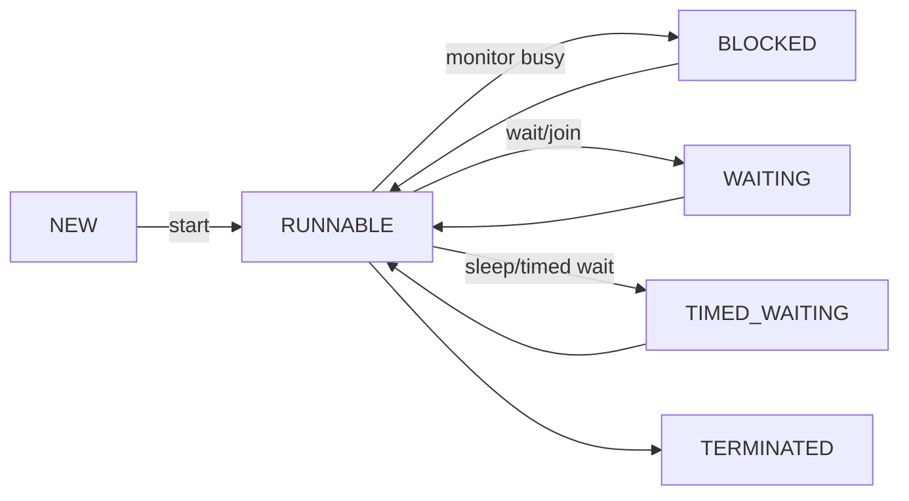

# Thread Lifecycle

Thread lifecycle matters because it explains `start()`, `join()`, `sleep()`, `wait()`, blocking, interruption, and thread dumps.

## Mental model

| Term | Meaning |
| --- | --- |
| Process | Running program with its own memory space. |
| Thread | Execution path inside a process. Threads in one JVM share heap/static state. |
| `Runnable` | The task. |
| `Thread` | The worker object that can run the task on a separate execution path. |

Backend model:

```text
Spring app = one JVM process
requests   = many worker threads
bug source = shared mutable heap state
```

## `run()` vs `start()`

```java
Thread worker = new Thread(() ->
        System.out.println(Thread.currentThread().getName()), "worker");

worker.run();   // normal method call on current thread
worker.start(); // new thread, then JVM calls run()
```

Rules:

- `new Thread(...)` creates only a Java object.
- `start()` creates a real execution path.
- `run()` does not create concurrency.
- A `Thread` object can be started only once.
- Prefer `Runnable`/`Callable` tasks over extending `Thread`.

## The 6 JVM states

`Thread.getState()` is a snapshot. It can change immediately after you read it.

| State | Meaning | Common trigger |
| --- | --- | --- |
| `NEW` | Thread object created, not started. | `new Thread(task)` |
| `RUNNABLE` | Running or ready to run. Java combines both. | after `start()` |
| `BLOCKED` | Waiting to enter `synchronized` because another thread owns the monitor. | monitor contention |
| `WAITING` | Waiting without timeout. | `wait()`, `join()`, `LockSupport.park()` |
| `TIMED_WAITING` | Waiting with timeout. | `sleep(ms)`, `wait(ms)`, `join(ms)` |
| `TERMINATED` | `run()` finished or threw an uncaught exception. | task done |



## `BLOCKED` vs `WAITING`

This is the interview distinction to know.

| Question | `BLOCKED` | `WAITING` |
| --- | --- | --- |
| Why stopped? | Tried to enter `synchronized`, but monitor is owned by another thread. | Voluntarily called `wait()`, `join()`, or similar. |
| Waiting for? | Monitor lock. | Signal, target-thread termination, or permit. |
| Did it release monitor? | No; it never acquired the monitor it wanted. | `wait()` releases monitor; `join()` is not about a monitor. |
| Timed form? | No public timed `BLOCKED`. | `TIMED_WAITING`. |

## `sleep()`, `wait()`, `join()`

| API | What it means | Lock behavior |
| --- | --- | --- |
| `Thread.sleep(ms)` | Current thread pauses for time. | Does not release locks. |
| `lock.wait()` | Current thread waits for condition signal. | Releases that monitor, then reacquires before returning. |
| `worker.join()` | Current thread waits for `worker` to finish. | Not a lock release tool. |

Important:

- Use `join()` when one thread must wait for another to finish.
- Do not use `sleep()` for correctness.
- A successful `join()` gives visibility of worker actions before termination.

```java
int[] result = new int[1];

Thread worker = new Thread(() -> result[0] = 42);
worker.start();
worker.join();

System.out.println(result[0]); // visible after join
```

## Interruption

`interrupt()` does not kill a thread. It requests cancellation.

| Situation | Effect |
| --- | --- |
| Thread is running CPU code | Flag is set; code must check it. |
| Thread is in `sleep()`, `wait()`, or `join()` | Method throws `InterruptedException` and clears the flag. |

Correct handling when you cannot continue:

```java
try {
    Thread.sleep(1000);
} catch (InterruptedException e) {
    Thread.currentThread().interrupt();
    return;
}
```

Swallowing `InterruptedException` loses the cancellation signal.

## What not to over-study

| Topic | Why |
| --- | --- |
| `LockSupport.park/unpark` details | Low-level primitive; recognize it from thread dumps, skip deep study first. |
| Daemon thread edge cases | Know daemon threads do not keep JVM alive; avoid deep cleanup semantics. |
| `getState()` control logic | Useful for diagnostics, not a synchronization tool. |

## Quick recall

**Q. `run()` vs `start()`?**  
A. `run()` is a normal method call. `start()` creates a new thread and then runs `run()` there.

**Q. Can a `Thread` be started twice?**  
A. No. Starting again throws `IllegalThreadStateException`.

**Q. What is `RUNNABLE`?**  
A. Either actually running or ready to run; Java does not expose a separate public “on CPU” state.

**Q. `BLOCKED` vs `WAITING`?**  
A. `BLOCKED` waits for a monitor. `WAITING` voluntarily waits for signal/completion.

**Q. Does `sleep()` release locks?**  
A. No.

**Q. Which thread waits on `worker.join()`?**  
A. The calling thread waits for `worker` to terminate.

**Q. What does `interrupt()` do?**  
A. Sets the interrupted flag; blocking methods respond by throwing `InterruptedException`.
