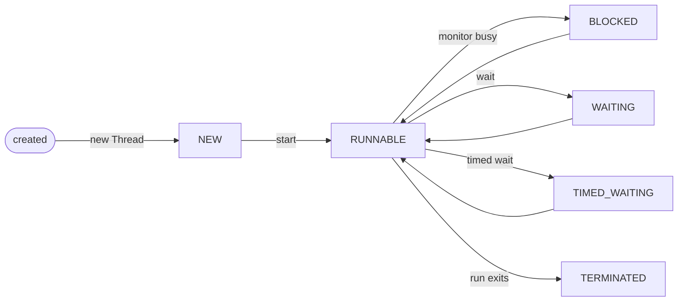

# Thread Lifecycle

## Mental model

A process is a running program with its own memory space and operating-system resources. Two separate Java processes do not share heap objects unless they communicate through something external, such as sockets, files, shared memory, a database, or a message broker.

A thread is one execution path inside a process. Threads in the same JVM share the same heap, static fields, class metadata, file descriptors, and process resources. Each thread has its own call stack, program counter, and local method frames.

Backend mental model:

```text
Spring Boot application = one JVM process
Incoming requests       = many worker threads inside that process
Shared objects          = heap objects visible to those threads
```

That shared heap is why Java concurrency bugs usually come from shared mutable state: two request threads may read or write the same object at the same time unless the code coordinates access.

## Thread object vs running thread

`new Thread(...)` creates a Java object. It does not yet create a new execution path.

`thread.start()` asks the JVM to create a real thread of execution and later call that thread object's `run()` method on the new thread.

`thread.run()` is just a normal method call. It runs on the current thread and does not create concurrency.

```java
Thread worker = new Thread(() ->
        System.out.println(Thread.currentThread().getName()), "worker");

worker.run();    // ordinary method call; prints the caller's thread name
worker.start();  // starts a new thread; prints "worker"
```

A `Thread` instance can be started only once. After it terminates, calling `start()` again throws `IllegalThreadStateException`. Create a new `Thread` object for a new execution.

## The 6 JVM states

Java exposes thread states through `Thread.State`. `Thread.getState()` returns a snapshot, not a stable truth forever. A thread can change state immediately after you inspect it.

| State | Meaning | Common way to reach it |
|---|---|---|
| `NEW` | A `Thread` object exists, but `start()` has not been called. No OS thread is running for it yet. | `new Thread(task)` |
| `RUNNABLE` | The thread is eligible to run. It may be running on a CPU core or waiting in the OS scheduler's run queue. Java groups both under `RUNNABLE`. | After `start()`, after lock acquisition, after wake-up |
| `BLOCKED` | The thread is waiting to enter a `synchronized` block or method because another thread holds that object's monitor lock. | Contention on `synchronized` |
| `WAITING` | The thread voluntarily suspended itself with no timeout. It needs another thread to wake it. | `wait()`, `join()`, `LockSupport.park()` |
| `TIMED_WAITING` | Same idea as `WAITING`, but with a deadline. The thread can wake because time expires. | `sleep(ms)`, `wait(ms)`, `join(ms)`, `parkNanos()` |
| `TERMINATED` | `run()` finished normally or ended with an uncaught exception. The thread is dead and cannot be restarted. | End of `run()` |

Important interview detail: Java does not have a separate public state for "currently executing on CPU". Running and ready-to-run are both reported as `RUNNABLE`.

## State diagram



| Transition | Typical Java trigger |
|---|---|
| Created -> `NEW` | `new Thread(...)` |
| `NEW` -> `RUNNABLE` | `thread.start()` |
| `RUNNABLE` -> `BLOCKED` | Entering `synchronized` while another thread holds the monitor |
| `BLOCKED` -> `RUNNABLE` | Monitor lock acquired |
| `RUNNABLE` -> `WAITING` | `Object.wait()`, `Thread.join()`, `LockSupport.park()` |
| `WAITING` -> `RUNNABLE` | `notify()`, `notifyAll()`, `unpark()`, or joined thread terminates |
| `RUNNABLE` -> `TIMED_WAITING` | `Thread.sleep(ms)`, `Object.wait(ms)`, `Thread.join(ms)`, `parkNanos()` |
| `TIMED_WAITING` -> `RUNNABLE` | Timeout expires, notification arrives, or thread is unparked |
| `RUNNABLE` -> `TERMINATED` | `run()` returns or throws an uncaught exception |

## `start()` and termination

`start()` is the lifecycle boundary. Before `start()`, the object is only a Java object in `NEW`. After `start()`, the JVM owns the scheduling of that thread.

```java
Thread worker = new Thread(() -> System.out.println("work"));

System.out.println(worker.getState()); // NEW
worker.start();
worker.join();
System.out.println(worker.getState()); // TERMINATED
```

If `run()` throws an uncaught exception, the thread still reaches `TERMINATED`. The exception does not automatically kill the whole JVM; it kills that thread unless it was the last non-daemon thread or the exception is handled by a configured uncaught exception handler.

## `synchronized` and `BLOCKED`

Every Java object can be used as a monitor lock. A `synchronized (lock)` block means: acquire `lock`'s monitor before entering, release it when leaving.

```java
Object lock = new Object();

Thread first = new Thread(() -> {
    synchronized (lock) {
        try {
            Thread.sleep(1000);
        } catch (InterruptedException e) {
            Thread.currentThread().interrupt();
        }
    }
});

Thread second = new Thread(() -> {
    synchronized (lock) {
        System.out.println("entered after first releases lock");
    }
});
```

If `first` holds the monitor and `second` tries to enter the same `synchronized (lock)` block, `second` becomes `BLOCKED`. It is not sleeping and it did not choose to wait for a condition. It is stuck because it cannot acquire the monitor yet.

When the monitor is released, one blocked contender may acquire it and move back to `RUNNABLE`. Java does not promise fairness for intrinsic monitor locks. Do not write code that depends on a specific blocked thread being chosen next.

## `wait()`, `notify()`, and `notifyAll()`

`wait()` is for condition waiting while using an object's monitor. Lifecycle-wise, it moves the current thread from `RUNNABLE` to `WAITING` or `TIMED_WAITING`.

The key mechanics:

- The calling thread must already hold that object's monitor.
- `wait()` releases the monitor before suspending the thread.
- When the thread wakes, it must re-acquire the same monitor before `wait()` returns.

`notify()` / `notifyAll()` wake waiting threads, but the woken thread still has to compete for the monitor before it can continue. Always re-check the condition in a `while` loop after wake-up; the dedicated `wait, notify, notifyAll` page covers the full pattern.

Small lifecycle example:

```java
Object lock = new Object();
boolean[] ready = {false};

Thread waiter = new Thread(() -> {
    synchronized (lock) {
        while (!ready[0]) {
            try {
                lock.wait(); // WAITING; releases lock while suspended
            } catch (InterruptedException e) {
                Thread.currentThread().interrupt();
                return;
            }
        }
        System.out.println("condition is ready");
    }
}, "waiter");

waiter.start();
Thread.sleep(100); // demo only: give waiter time to reach WAITING
System.out.println(waiter.getState()); // usually WAITING

synchronized (lock) {
    ready[0] = true;
    lock.notifyAll(); // waiter wakes, then re-acquires lock before continuing
}

waiter.join();
System.out.println(waiter.getState()); // TERMINATED
```

## `sleep()` and `TIMED_WAITING`

`Thread.sleep(ms)` pauses the current thread for at least roughly that duration. It moves the current thread to `TIMED_WAITING`.

```java
synchronized (lock) {
    Thread.sleep(1000);
}
```

This code sleeps while still holding `lock`. Other threads that need the same monitor remain `BLOCKED` until the sleeping thread exits the synchronized block.

Use `sleep()` for time-based pauses in demos, polling backoff, or scheduled gaps. Do not use it to coordinate correctness between threads. If one thread must wait for another to finish, use `join()`, `Future.get()`, `CountDownLatch`, or another coordination primitive.

## `join()`

`join()` makes the calling thread wait until another thread terminates.

```java
int[] result = new int[1];

Thread worker = new Thread(() -> result[0] = 42);
worker.start();

worker.join(); // main thread waits here
System.out.println(result[0]); // safe to read after join returns
```

The worker does not wait because you called `worker.join()`. The current thread waits for `worker`.

A successful `join()` also gives a memory visibility guarantee: actions done by the worker before termination are visible to the thread that joined it. That is why the example can read `result[0]` after `join()` returns.

`join(timeout)` moves the caller to `TIMED_WAITING`. If the timeout expires, the target thread may still be alive, so check `worker.isAlive()` if correctness depends on completion.

## `LockSupport.park()` and `unpark()`

`LockSupport` is a lower-level parking API used by many `java.util.concurrent` classes. Most application code should use higher-level tools first, but interviewers may ask how it differs from `wait()`.

| API | Requires `synchronized`? | Releases monitor? | Wake-up mechanism |
|---|---:|---:|---|
| `Object.wait()` | Yes | Yes | `notify()` / `notifyAll()` on the same monitor |
| `LockSupport.park()` | No | No monitor involved | `LockSupport.unpark(thread)` or interrupt |

`unpark(thread)` gives a thread one permit. If `unpark()` happens before `park()`, the next `park()` returns immediately. This avoids the classic "missed signal" problem that can happen when condition checks are not written correctly around `wait()`.

## `BLOCKED` vs `WAITING`

This is the most important distinction on the page.

| Question | `BLOCKED` | `WAITING` |
|---|---|---|
| Why did the thread stop? | It tried to enter `synchronized`, but another thread owns the monitor. | It voluntarily called `wait()`, `join()`, or `park()`. |
| What is it waiting for? | A monitor lock. | A signal, target-thread termination, or permit. |
| Is there a timeout? | No. `BLOCKED` has no timed variant. | `TIMED_WAITING` is the timed variant. |
| Did it release a monitor? | It never acquired the monitor it wanted. | `wait()` releases its monitor; `join()` and `park()` are not about that monitor. |

`BLOCKED` is involuntary lock contention; `WAITING` is voluntary suspension until a signal or completion event.

## `interrupt()` mechanics

`interrupt()` does not kill a thread. It requests cancellation by setting the thread's interrupted flag.

```java
worker.interrupt();
```

What happens next depends on what the target thread is doing:

- If it is running normal CPU code, nothing stops automatically. The code must check the flag.
- If it is blocked in `sleep()`, `wait()`, or `join()`, that method throws `InterruptedException`.
- When those blocking methods throw `InterruptedException`, they clear the interrupted flag.

Correct handling pattern when you cannot finish the operation:

```java
try {
    Thread.sleep(1000);
} catch (InterruptedException e) {
    Thread.currentThread().interrupt();
    return;
}
```

Restoring the flag preserves the cancellation signal for callers higher up the stack. Swallowing `InterruptedException` is a common production bug: shutdown code asks the thread to stop, but the thread erases the signal and keeps going.

Two ways to inspect the flag:

| Method | Checks which thread? | Clears flag? |
|---|---|---:|
| `Thread.interrupted()` | Current thread | Yes |
| `thread.isInterrupted()` | That specific thread | No |

## Daemon threads

A daemon thread is a background thread that does not keep the JVM alive.

```java
Thread t = new Thread(task);
t.setDaemon(true); // must happen before start()
t.start();
```

When all non-daemon threads finish, the JVM exits even if daemon threads are still running. Daemon threads are stopped abruptly as part of JVM exit; do not rely on them to finish writes, close resources, flush buffers, or run cleanup logic.

Good daemon examples: JVM housekeeping threads, GC-related threads, background cache cleanup where losing the final cycle is acceptable.

Bad daemon examples: payment capture, audit logging, database writes, message publishing, or anything that must complete reliably.

## Reading `getState()` correctly

`getState()` is useful for learning and diagnostics, but it is not a synchronization tool.

```java
Thread.State state = worker.getState();
```

By the time you act on `state`, the thread may have moved. Use lifecycle APIs and coordination primitives for correctness:

- `join()` to wait for completion.
- `interrupt()` plus cooperative checks to request cancellation.
- `CountDownLatch`, `Semaphore`, `BlockingQueue`, `Future`, or executor APIs for real coordination.

Use `getState()` to explain what is probably happening, not to control program logic.

## Quick recall

**Q. What is the difference between `run()` and `start()`?**
A. `run()` is a normal method call on the current thread. `start()` creates a new execution path and has the JVM call `run()` on that new thread.

**Q. Can a `Thread` be started twice?**
A. No. A `Thread` object can move from `NEW` to `RUNNABLE` only once. Starting it again throws `IllegalThreadStateException`.

**Q. Why can a running Java thread still show `RUNNABLE`?**
A. Java uses `RUNNABLE` for both actually running on CPU and ready-to-run in the OS scheduler queue.

**Q. What is the difference between `BLOCKED` and `WAITING`?**
A. `BLOCKED` means waiting to acquire a `synchronized` monitor. `WAITING` means the thread voluntarily suspended itself with `wait()`, `join()`, or `park()`.

**Q. Does `Thread.sleep()` release locks?**
A. No. If a thread sleeps inside `synchronized`, it keeps the monitor and other threads remain blocked.

**Q. Why should `wait()` be inside a `while` loop?**
A. Wake-up is not proof that the condition is true. Spurious wakeups, `notifyAll()`, and races after wake-up all require re-checking the condition.

**Q. Which thread waits when code calls `worker.join()`?**
A. The calling thread waits for `worker` to terminate. The worker does not wait for itself.

**Q. What does `interrupt()` actually do?**
A. It sets the interrupted flag. Blocking methods like `sleep()`, `wait()`, and `join()` respond by throwing `InterruptedException` and clearing the flag.
