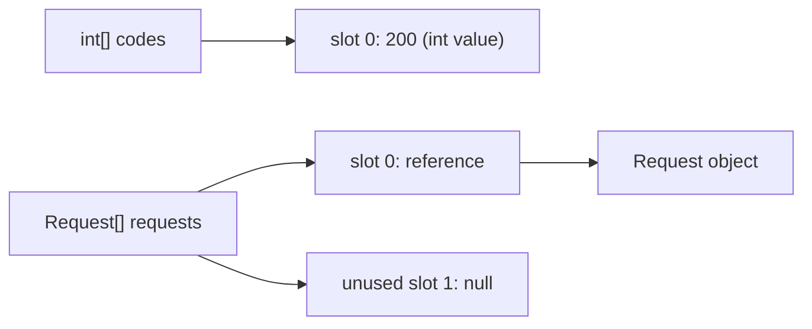

# Arrays

When a backend flow needs a known number of response slots—one status per shard, for example—an array gives that
fixed shape. An array is a built-in Java object with an immutable `length`; the variable holds a reference to that
array object.

```java
int[] statusCodes = new int[3];
statusCodes[0] = 200;
```

## Arrays as fixed-shape storage

An array has a component type and a fixed number of zero-based slots. Valid indexes are `0` through `length - 1`;
an access outside that range throws `ArrayIndexOutOfBoundsException`.

Use an array when the number of positions is known and does not need to change. Use `ArrayList` when entries must
grow or shrink while remaining index-addressable.

| Concern | Array | `ArrayList` |
| --- | --- | --- |
| Kind | Java language feature | Collections Framework class |
| Size | Fixed after creation | Can grow and shrink |
| Primitive elements | Yes, such as `int[]` | No; use wrappers such as `ArrayList<Integer>` |
| Count | `array.length` | `list.size()` |

`ArrayList<int>` is invalid because generics require reference types. `ArrayList<Integer>` is the usual alternative;
it grows internally and supports amortized additions at the end.

## What an array slot contains

A primitive array stores primitive values. A reference array stores references, not the objects themselves. New
reference slots start as `null`.



```java
int[] retries = new int[3];          // [0, 0, 0]
Request[] requests = new Request[3]; // [null, null, null]
```

The defaults belong to array components after the array object is created. They do not initialize a local array
variable:

```java
Request[] requests;
requests[0] = new Request(); // does not compile: local variable not initialized
```

## Traps worth saying out loud

Reference arrays are covariant: a `Request[]` can be assigned to an `Object[]`. That assignment compiles, but Java
checks each later store against the array's real runtime component type.

```java
Request[] requests = new Request[1];
Object[] values = requests;
values[0] = "not a request"; // ArrayStoreException at runtime
```

This is why covariance is convenient but less type-safe than generic collections.

Cloning an array is shallow. For a nested or reference array, the new outer array has new slots, but both arrays
point to the same inner arrays or objects.

```java
Request[] copy = requests.clone(); // different array; same Request references
```

Changing `copy[0]` replaces only its slot; mutating the shared `Request` through either array is visible through
both.

## Further reading

- [Java Language Specification, Chapter 10: Arrays](https://docs.oracle.com/en/java/javase/26/docs/specs/jls/jls-10.html)
- [Baeldung: `ArrayStoreException`](https://www.baeldung.com/java-arraystoreexception)
- [Programming.Guide: arrays versus `ArrayList`](https://programming.guide/java/array-vs-arraylist.html)

## Quick recall

**Q. Do arrays store objects?**
A. Reference arrays store references; primitive arrays store values.

**Q. Can an array change length?**
A. No. Its `length` is fixed when created.

**Q. Why is `ArrayList<int>` invalid?**
A. Generics require object types, so use `ArrayList<Integer>`.

**Q. How do I read an array's size?**
A. `array.length`, not `array.length()`.

**Q. Why can `Object[] values = new Request[1]` be risky?**
A. An incompatible store compiles but throws `ArrayStoreException` at runtime.

**Q. Does `clone()` deep-copy a reference array?**
A. No. It copies the array structure, not the referenced objects.
