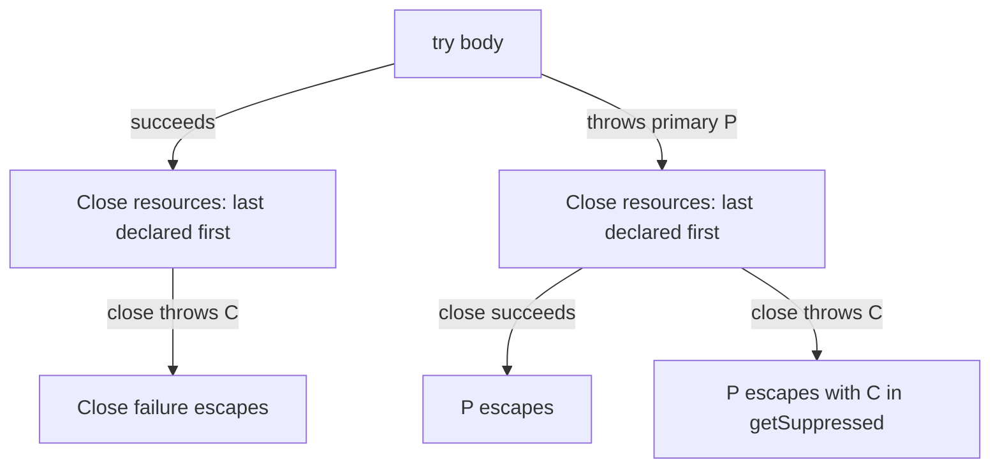

# finally and Resources

Cleanup must happen whether work succeeds or fails. `finally` runs while control leaves a `try` through normal completion, a return, or an exception, so it was traditionally used for cleanup. Do not return or throw from it: that replacement value or exception can hide the pending result or original failure. It is not a process-shutdown guarantee.

Prefer try-with-resources for an `AutoCloseable`. Java invokes `close()` automatically; resources close in reverse declaration order. If the body throws and `close()` also throws, the body failure remains primary and the close failure is attached through `getSuppressed()`. `Throwable` explicitly models both a cause and suppressed exceptions in its [API](https://docs.oracle.com/en/java/javase/21/docs/api/java.base/java/lang/Throwable.html).

The flow is why a caught exception should be inspected with `getSuppressed()` when a resource operation is involved. `AutoCloseable.close()` is the method that the language invokes for try-with-resources, as documented in the [Java API](https://docs.oracle.com/en/java/javase/21/docs/api/java.base/java/lang/AutoCloseable.html).

## Manual cleanup only when needed

Use `finally` for cleanup that cannot be expressed as an `AutoCloseable` resource. Otherwise, try-with-resources removes
manual null checks and closes already-initialized resources if construction of a later resource fails. A resource that
depends on another should be declared after it so it closes first.

## Quick recall

- **Does `finally` run after return?** Yes, unless the JVM cannot continue normally.
- **Should `finally` return?** No, it can suppress the real result or exception.
- **Resource close order?** Reverse declaration order.
- **Where is close failure stored?** `getSuppressed()`.
