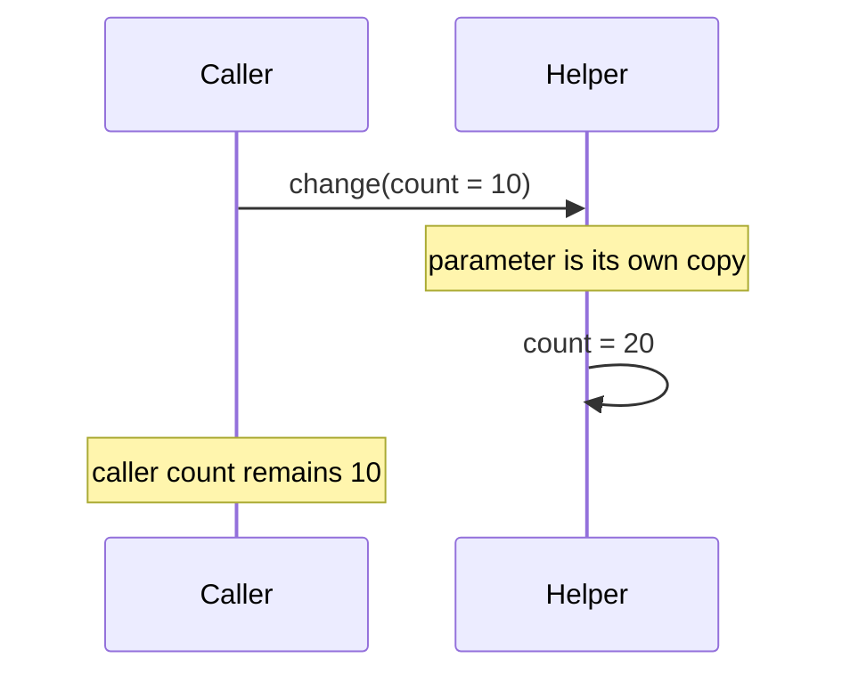

# Primitive Types

## The backend question this answers

Why did a helper fail to update my counter, and should an API field be `int` or `Integer`? Both questions start with Java's value model: Java always passes a copy of a value to a method. A primitive variable contains its value; an object variable contains a reference value that can identify an object.

## Values, references, and a method call

Java has eight primitive types: `byte`, `short`, `int`, `long`, `float`, `double`, `char`, and `boolean`. The most-used
numeric primitives are `int` (signed 32-bit), `long` (signed 64-bit), and `double` (64-bit floating point). Unsuffixed
integer literals are `int`; use `L` for a `long` literal, and remember that widening to floating point may still lose
precision. Use `long` for numeric counters or durations when the required range exceeds `int`; identifier
representation is a domain decision, not automatically a `long`. Use integer minor units or `BigDecimal`, not
`double`, for money.



For an object, Java still copies a value—the reference. Both copies can identify the same mutable object, so changing its fields is visible; assigning the parameter to a different object is not visible to the caller.

```java
static void replace(StringBuilder value) {
    value.append("!");       // visible: both references identify one object
    value = new StringBuilder("new"); // local reassignment only
}
```

This is pass-by-value, not pass-by-reference. The boundary matters when a service hands a mutable request object to a helper: mutations are shared, but a helper cannot replace the caller's reference.

## Numeric conversion is a correctness boundary

Java widens some numeric values automatically, but an explicit narrowing cast can discard information. A widening
conversion is not automatically exact: `int` to `float` can lose precision because `float` has fewer significant bits
than every `int` value needs. A narrowing conversion does not throw merely because it loses range; it keeps the
low-order bits for integral values.

```java
long eventId = 3_000_000_000L; // L matters: the literal does not fit in int
int truncated = (int) eventId; // explicit narrowing; information can be lost

byte retries = 10;
// retries = retries + 1;      // int promotion: does not compile
retries += 1;                  // compound assignment includes the narrowing conversion
```

**Problem:** a counter or amount silently crosses its type's range.

**Naive failure:** `Integer.MAX_VALUE + 1` wraps to `Integer.MIN_VALUE`; an explicit cast may produce a valid-looking
but wrong value.

**Mechanism:** choose the range before the data enters the calculation. For a checked business invariant, use
`Math.addExact`, `subtractExact`, or `multiplyExact`; they throw `ArithmeticException` instead of wrapping. For a
lossy external conversion, validate the range before casting.

**Trade-off:** checked arithmetic is not free and is unnecessary for every local loop counter. Use it at a money,
quota, inventory, or externally supplied numeric boundary where a wrong value is worse than a failed request.

**Recovery:** reject or map the invalid input before persisting it; do not try to infer the original value after a
narrowing cast or overflow has already occurred.

## Initialization is a separate rule

Fields receive defaults; all local variables—including primitive and reference variables—must be definitely assigned before use. An `int` field starts as `0`, a `boolean` field as `false`, and a reference field as `null`. This prevents an accidental local read before the program established its value.

## Primitive or wrapper?

Use a primitive when “missing” is not meaningful. Use a wrapper when absence itself is data: `Integer retryCount` may
distinguish “not supplied” from `0`. Wrappers are also required by generic APIs such as `List<Integer>`.

Autoboxing converts `int` to `Integer`; unboxing converts it back. The common trap is that unboxing a `null` wrapper throws `NullPointerException`.

```java
Integer configuredLimit = null;
// int limit = configuredLimit; // throws NullPointerException while unboxing
int limit = configuredLimit != null ? configuredLimit : 100;
```

**Problem:** an API returns a nullable wrapper and application code assumes a primitive.

**Naive failure:** `int limit = configuredLimit;` triggers hidden unboxing and throws when the configuration is
`null`. `==` between two wrappers can also compare their identities rather than their numeric values.

**Mechanism:** establish a non-null primitive at the input boundary, use `Objects.equals(left, right)` when either
wrapper may be `null`, and keep arithmetic accumulators primitive in hot paths. Autoboxing is compiler-inserted
conversion, not a new null-safety guarantee.

**Trade-off:** wrappers carry the useful “unknown/not supplied” state but force every consumer to make a null policy.
Do not choose a wrapper merely because a database column happens to be nullable.

**Recovery:** translate absent input to a default only when the business contract defines one; otherwise reject it with
a validation error. Wrapper cache and equality details belong in [Wrapper semantics](/java/foundations/wrapper_semantics/).

## Further reading

- [Java Language Specification: variables and method invocation](https://docs.oracle.com/javase/specs/jls/se25/html/)
- [Java SE API: `Integer`](https://docs.oracle.com/en/java/javase/25/docs/api/java.base/java/lang/Integer.html)

## Interview traps

- Java does not pass objects by reference; it passes a copied reference value.
- `null` is a reference value, never a primitive value.
- A field default does not imply a local-variable default.
- A numeric literal may need `L` to be a `long`; narrowing conversions and arithmetic can lose information silently.
- `byte`, `short`, and `char` operands promote to `int` in ordinary arithmetic.

## Quick recall

**Q. Can a primitive be `null`?**

A. No. Use a wrapper only when absence is meaningful.

**Q. Why does changing an object field in a helper affect the caller?**

A. The caller and parameter hold copied references to the same object.

**Q. Why does `Integer` sometimes throw during assignment to `int`?**

A. Java unboxes it; unboxing `null` throws `NullPointerException`.

**Q. Do local primitives have defaults?**

A. No. The compiler requires assignment before read; fields do have defaults.

**Q. Does a narrowing primitive cast throw on overflow?**

A. No. It can discard information. Validate first or use checked arithmetic where the value is an invariant.

**Q. When should an API return `int` instead of `Integer`?**

A. Return `int` when the result always exists; use `Integer` only when absence is a meaningful documented state.
