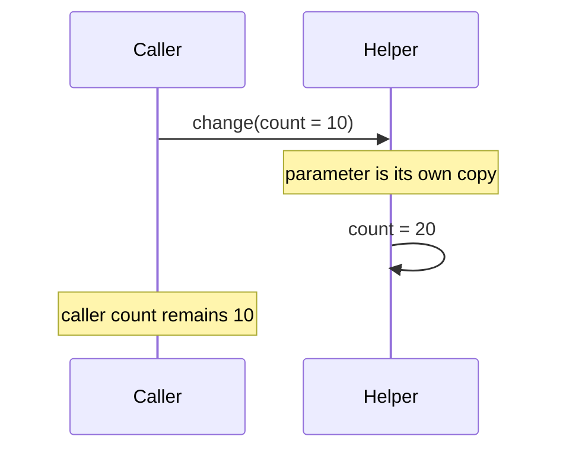

# Primitive Types

## The backend question this answers

Why did a helper fail to update my counter, and should an API field be `int` or `Integer`? Both questions start with Java's value model: Java always passes a copy of a value to a method. A primitive variable contains its value; an object variable contains a reference value that can identify an object.

## Values, references, and a method call

Java has eight primitive types: `byte`, `short`, `int`, `long`, `float`, `double`, `char`, and `boolean`. The interview-relevant defaults are `int` (32 bits), `long` (64 bits), and `double` (64 bits). Use `long` for numeric counters or durations when the required range exceeds `int`; identifier representation is a domain decision, not automatically a `long`. Never use `double` for money.



For an object, Java still copies a value—the reference. Both copies can identify the same mutable object, so changing its fields is visible; assigning the parameter to a different object is not visible to the caller.

```java
static void replace(StringBuilder value) {
    value.append("!");       // visible: both references identify one object
    value = new StringBuilder("new"); // local reassignment only
}
```

This is pass-by-value, not pass-by-reference. The boundary matters when a service hands a mutable request object to a helper: mutations are shared, but a helper cannot replace the caller's reference.

## Initialization is a separate rule

Fields receive defaults; all local variables—including primitive and reference variables—must be definitely assigned before use. An `int` field starts as `0`, a `boolean` field as `false`, and a reference field as `null`. This prevents an accidental local read before the program established its value.

## Primitive or wrapper?

Use a primitive when “missing” is not meaningful. Use a wrapper when absence itself is data: `Integer retryCount` may distinguish “not supplied” from `0`. Wrappers are also required by generic APIs such as `List<Integer>`.

Autoboxing converts `int` to `Integer`; unboxing converts it back. The common trap is that unboxing a `null` wrapper throws `NullPointerException`.

```java
Integer configuredLimit = null;
// int limit = configuredLimit; // throws NullPointerException while unboxing
int limit = configuredLimit != null ? configuredLimit : 100;
```

Do not use `==` for wrapper value comparison; it can compare object identity. Wrapper cache and equality details belong in [Wrapper semantics](/java/foundations/wrapper_semantics/).

## Further reading

- [Java Language Specification: variables and method invocation](https://docs.oracle.com/javase/specs/jls/se25/html/)
- [Java SE API: `Integer`](https://docs.oracle.com/en/java/javase/25/docs/api/java.base/java/lang/Integer.html)

## Interview traps

- Java does not pass objects by reference; it passes a copied reference value.
- `null` is a reference value, never a primitive value.
- A field default does not imply a local-variable default.
- A numeric literal may need `L` to be a `long`; narrowing conversions can lose information.

## Quick recall

**Q. Can a primitive be `null`?**

A. No. Use a wrapper only when absence is meaningful.

**Q. Why does changing an object field in a helper affect the caller?**

A. The caller and parameter hold copied references to the same object.

**Q. Why does `Integer` sometimes throw during assignment to `int`?**

A. Java unboxes it; unboxing `null` throws `NullPointerException`.

**Q. Do local primitives have defaults?**

A. No. The compiler requires assignment before read; fields do have defaults.
