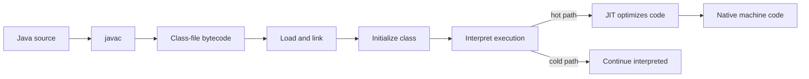

# Bytecode Execution

Bytecode is not native CPU machine code. It is an instruction set for the JVM.

Examples:

```text
JVM bytecode: iload, invokevirtual, return, iadd
CPU code:     MOV, ADD, JMP
```

Everything is stored as bits eventually, but the important interview distinction is the instruction set target:

- native executable targets an operating system and CPU
- JVM bytecode targets the JVM

## From a class file to an executing method



**Load** finds binary class data and creates the runtime `Class` representation. **Link** makes it executable: verification checks structural and bytecode type safety, preparation creates static fields with default values, and resolution connects symbolic field/method/type references. **Initialization** then executes static initializers when the class is first actively used. Resolution can be lazy, so some linkage failures appear only on a path that uses the missing type.

| Piece | Job | Production consequence |
| --- | --- | --- |
| Class loader | Defines a class from binary data, usually using a parent-delegation hierarchy. | A missing or incompatible dependency can surface as a linkage error. |
| Verifier | Rejects malformed or type-unsafe bytecode before it runs. | `VerifyError` is a binary-compatibility/instrumentation problem, not an ordinary business exception. |
| Interpreter | Starts executing bytecode without waiting to compile every method. | Early requests can be slower. |
| JIT compiler | Uses runtime profiling to compile and optimize frequently executed code. | Benchmarks and long-running services need warmup; a short cold run is not peak performance. |

## Two traps worth explaining

**Same name is not always the same type.** Runtime class identity includes the defining class loader. A plugin or application-server loader can define `com.example.Order` separately from another loader; casts can then fail even though the names match.

**JIT is implementation detail, not a correctness dependency.** HotSpot commonly uses tiered compilation and can replace an earlier optimization when profiling assumptions change. Say that the JVM can optimize hot code using runtime data; do not promise a particular compilation tier or timing for every JVM.

## Runtime memory areas: connect symptom to owner

| Area | Ownership and purpose | Interview symptom |
| --- | --- | --- |
| Heap | Shared; objects and arrays live here. | `OutOfMemoryError: Java heap space` means demand exceeded the heap limit—use a heap dump to distinguish retention from capacity. |
| Java stack | One per Java thread; method frames hold local values, references, and operand-stack work. | `StackOverflowError` usually means unbounded recursion or frames too deep, not a heap leak. |
| Metaspace | JVM-managed native memory for class metadata. | `OutOfMemoryError: Metaspace` often means too many classes/loaders are retained or the configured limit is too low. |
| Code cache | Native memory holding JIT-compiled code. | A full code cache can limit compilation; it is a JVM diagnostic concern, not application heap. |

The shortcut “objects are on the heap and locals are on the stack” is useful only if you add ownership: a stack local can hold a reference to a heap object, and a live stack frame can therefore keep that object reachable.

## Quick recall

**Q. What is the order around class execution?**
A. Load, link (verify/prepare/resolve), initialize on active use, then execute; resolution may be lazy.

**Q. Why can startup succeed but a request later fail with a linkage error?**
A. A symbolic reference can be resolved only when that request path first uses it.

**Q. Why warm up a JVM benchmark?**
A. The interpreter and runtime profiler run before hot code is JIT-optimized, so cold and steady-state behavior differ.

**Q. Heap OOME versus stack overflow?**
A. Heap OOME is object-retention/capacity pressure; stack overflow is usually recursion or call depth in one thread’s stack.
