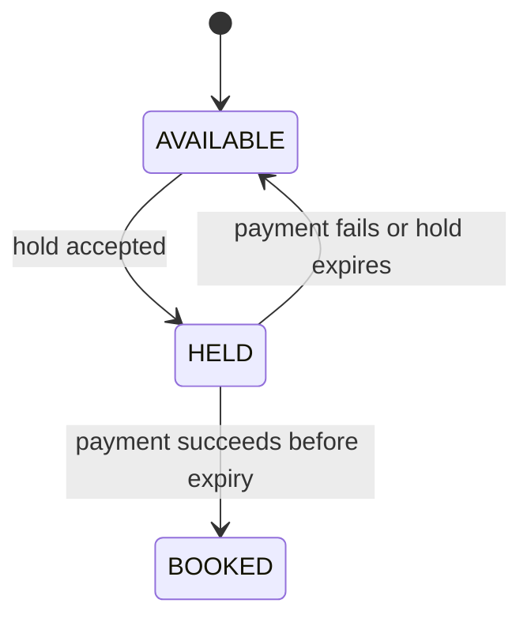

# Design notes — BookMyShow

Use this page after attempting the exercise. The central distinction is between a screen's reusable seat layout
and one show's mutable availability for those seats. Losing that distinction causes a booking in one show to
incorrectly block the same seat at a later show.

## Start from one booking attempt

A caller first discovers a show, then requests a short hold for a set of seat IDs. The system either holds all
requested seats or holds none. Payment turns a still-valid hold into a booking; payment failure or expiry returns
its seats to availability.

```mermaid
sequenceDiagram
    participant Caller
    participant Search
    participant Booking
    participant ShowSeats as Show seat state
    participant Payment

    Caller->>Search: find shows(movie, city, date)
    Search-->>Caller: matching shows
    Caller->>Booking: hold(showId, seatIds, idempotencyKey)
    Booking->>ShowSeats: verify all requested seats available
    alt any seat unavailable
        ShowSeats-->>Caller: reject; no seat changed
    else all available
        Booking->>ShowSeats: mark all HELD with expiry
        Booking-->>Caller: hold
        Caller->>Booking: confirm hold
        Booking->>Payment: attempt payment
        alt payment succeeds before expiry
            Booking->>ShowSeats: mark all BOOKED
        else failure or expiry
            Booking->>ShowSeats: release all to AVAILABLE
        end
    end
```

## The state belongs to the show, not the screen

A `Screen` owns physical seats such as `A1` and `A2`. A `Show` uses one screen at one start time, but owns a
separate state record for each of those seats. That gives the same physical `A1` independent availability at
different showtimes.



The state diagram answers the main correctness question: **what transitions are valid for one show-seat?** A
booked seat never returns to held in this base scope, and an expiry operation can release only a held seat.

## Responsibilities and invariants

| Responsibility | Own it here | Why |
| --- | --- | --- |
| Theatre city, screens, and fixed physical seats | theatre/screen model | These are venue facts, independent of a showtime. |
| Movie and scheduled start time | show model | Search returns a specific viewing opportunity. |
| Per-show seat availability and holds | booking/seat-state component | It protects the transactional part of the design. |
| Payment result and confirmed booking | booking service | It coordinates hold confirmation and release. |
| Duplicate request handling | hold/booking store | It maps one idempotency key to one original result. |

The base invariants are:

- One hold is all-or-nothing: if one requested seat is unavailable, none of the requested seats change.
- A confirmed booking owns every selected seat for that show.
- A failed or expired hold releases every seat it held.
- Repeating an idempotency key does not create another hold or payment attempt.

## Expiry is explicit on purpose

The exercise does not need a background scheduler. Give every hold an expiry timestamp and expose an operation
that scans/releases expired holds. That keeps the state transition testable. In a large system, an expiry index,
delayed queue, or periodic job would avoid scanning every historical hold; that is an operational follow-up.

## Search and booking have different shapes

Search answers a broad, read-heavy question: *which shows match a movie, city, and date?* Seat reservation
answers a narrow, correctness-sensitive question: *can this exact set of seats change together right now?*
Keep the two responsibilities distinct even in an in-memory LLD implementation. Scaling search separately is a
natural later extension, not a reason to complicate the base design.

## Interview follow-ups

For concurrent requests, protect the state for one show rather than locking every show. For persistence, store
holds, bookings, and payment attempts durably and make callback/retry processing idempotent. Cancellation,
refunds, waitlists, notifications, and dynamic pricing each add business rules after the hold lifecycle is sound.

## Quick recall

- Where does availability live? On a seat for one show, not on the reusable screen seat.
- What makes a multi-seat hold correct? All requested seats transition together, or none do.
- What releases a hold? Explicit expiry processing or payment failure.
