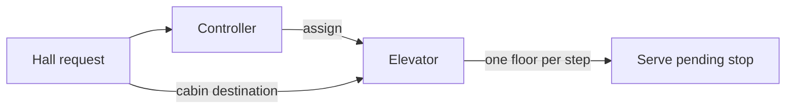

# Design notes — Elevator

## Responsibility boundary

The controller sees the building-wide picture and assigns hall requests. Each elevator owns only its
own mutable travel state: current floor, direction, doors, and pending stops.



Keeping those responsibilities separate prevents the controller from becoming the owner of every car's
movement details.

## Step 1: put shared building configuration in the controller

`totalFloors` is shared building configuration. It should not be duplicated inside every `Elevator`.

```text
ElevatorService
- totalFloors
- elevators

Elevator
- currentFloor
- direction
- doorState
- pendingStops
```

The service validates an incoming hall floor or cabin destination against `totalFloors` before adding work
to an elevator. A separate `Building` class is not earned in the base scope because there is one building;
it becomes useful only when the model needs multiple buildings or building-specific configuration.

## Step 2: model deterministic movement, not real time

The base exercise models a logical movement step:

```text
current floor 3, next stop 7

moveOneStep() -> 4
moveOneStep() -> 5
moveOneStep() -> 6
moveOneStep() -> 7, serve the stop
```

This does not claim that a car moves one floor per second. A scheduler, timer, or physical sensor could
call `moveOneStep()` in a production system; timing is intentionally outside this LLD scope.

## Base assignment rule

For a hall request, first prefer idle cars. Otherwise, consider cars already moving toward the request
floor in the requested direction. Choose the closest eligible car; use lower car ID as a deterministic
tie-breaker.

This is deliberately a simple policy. It makes the state model testable before discussing cost-based or
fairness-aware dispatch.

## Step 3: decide whether assignment needs Strategy

Direction is state on an elevator and input on a hall request. It is not, by itself, a reason to use the
Strategy pattern. The question is whether **assignment policy** must vary independently.

| Requirement | Smallest suitable design |
|---|---|
| One fixed nearest-eligible rule | Keep `assignElevator(...)` in `ElevatorService`. |
| VIP, emergency, peak-hour zoning, or cost-based policies | Introduce an `ElevatorAssignmentStrategy`. |

For this exercise, use the first row. A good interview explanation is:

> “I will keep assignment as one controller method because the requirements define one fixed policy. If
> later requirements introduce interchangeable policies such as VIP priority or emergency overrides, I can
> extract that method behind an assignment strategy without changing elevator movement state.”

The later extension would be small and focused:

```java
interface ElevatorAssignmentStrategy {
  Elevator assign(List<Elevator> elevators, HallRequest request);
}
```

The controller would use one strategy instance; an elevator would still own its own queue and movement.
Avoid adding a resolver or multiple strategy classes before a second policy is required.

## Step 4: let counterexamples shape stop ordering

The stop structure must consider both current floor and current direction. For example, a car travelling
down from floor 5 should not immediately reverse to serve a newly added floor-10 request. It should finish
eligible downward stops first, then reverse when no stop remains ahead. This is why a single min-heap or
max-heap is not enough to describe the complete scheduling rule.

## Quick recall

- Hall request: controller decides the car.
- Cabin request: assigned car records the destination.
- A car continues in its current direction until it has no stop ahead.
- Keep one assignment method until a second assignment policy is actually required.
