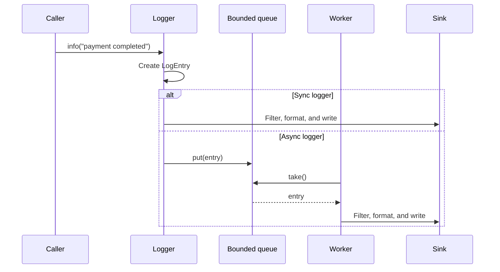

# Logger LLD

Design an in-process logging library, not a distributed log-collection platform. Application threads call
`logger.info("payment completed")`; the library creates an immutable entry, applies each configured sink's
minimum level and formatter, then writes to the configured target. The interesting design question is how
to keep that simple caller API while supporting both immediate and bounded asynchronous delivery.

The first scope is deliberately small: timestamp, level, and message; console output; per-sink filtering;
alternate formatters; and safe concurrent callers. It does not implement remote ingestion, file rotation,
or runtime configuration changes. Those are useful follow-ups only after the core delivery contract is
clear.

The core invariants are equally small. Every call creates one immutable entry; each sink filters that same
entry independently before formatting it; an async entry is accepted only when `put()` completes; and a
normal `close()` drains entries accepted before its shutdown marker. Queue acceptance order is not the same
as method-invocation order between concurrent callers.

## Start from one log call

For synchronous mode, the calling thread creates a `LogEntry` and sends it directly to every sink. Each
sink decides whether the level meets its threshold, formats accepted entries, and writes them. The logger
does not know whether a sink targets stdout, a file, or a later remote destination.

For asynchronous mode, that same entry is accepted into one bounded FIFO queue. A single worker removes
entries and runs the exact same sink-dispatch path. The queue makes the caller-facing trade-off explicit:
when full, `put()` blocks the caller instead of silently dropping an accepted log. One worker preserves
queue-acceptance order; adding workers would trade that global output order for throughput.

## What to practice

Start with the vague [interviewer prompt](exercise/problem_statement/), lead the
[candidate discussion](exercise/candidate_discussion/), then solve the agreed [final exercise](exercise/).

Use the [design notes](design/) after attempting the model. They connect the implemented classes to the
delivery flow, explain `ArrayBlockingQueue.put()` backpressure, and show why shutdown uses a marker plus
`join()` rather than immediately interrupting the worker. The runnable playground is the current source of
truth; it is intentionally separate from this explanation.

## Interview delivery

Say: "A logger creates an immutable entry and fans it out to sinks. Filtering and formatting belong to the
sink because both vary independently from logger delivery. I start synchronously. If writes must leave the
caller thread, I replace direct dispatch with one bounded FIFO queue and one worker; the stated full-buffer
policy determines whether the caller blocks, times out, rejects, or drops."

If asked to extend it, discuss a new sink, formatter, shutdown policy, or additional worker only after
stating the ordering and failure trade-off it changes.

Further reading:

- [Hello Interview's logging-service breakdown][hello-logger]

[hello-logger]: https://www.hellointerview.com/learn/low-level-design/problem-breakdowns/logging-service

## Quick recall

**Q. Why does a sink own its minimum level and formatter?**
A. Destinations can choose them independently, so the logger can fan out one immutable entry without
knowing target-specific policy.

**Q. What does the bounded queue guarantee?**
A. It bounds memory and preserves FIFO acceptance order. The full-buffer policy decides whether a caller
waits, fails, or loses a log.

**Q. Why is one async worker useful?**
A. It preserves queue-acceptance output order. More workers may improve throughput but can finish writes
out of order.
