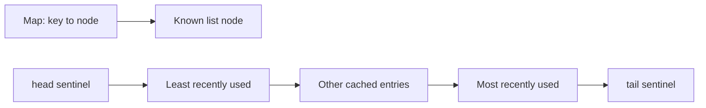

# LRU Cache Design Notes

Use this page after the requirement discussion to explain why one operation remains O(1) on average.

## Invariant

The list is ordered from least recently used immediately after `head` to most recently used immediately
before `tail`. `head` and `tail` are sentinel nodes: they are never cached, mapped, or evicted.

Every real node has exactly one key in the map, and every map entry points to exactly one list node. A
cache hit, insert, and update must leave both structures agreeing.

The reader question: how can the cache find an entry and also change its recency without scanning the
list? The map locates the node; the node's `prev` and `next` links let the cache detach and reattach it.

## Core operations

### Cache hit

1. Find the node by key in the map.
2. Detach it from its current position.
3. Attach it immediately before `tail`.
4. Return its value.

The tail side is the most-recent side, so a read refreshes the key without changing cache size.

### Insert, update, and eviction

For an existing key, update the value and move the same node to the most-recent side. Do not evict: the
number of cached keys did not change.

For a new key, evict `head.next` first only when the map is already at capacity, remove that key from the
map, then attach the new node before `tail`. Removing from both structures is essential; otherwise a
future lookup can find a detached, stale node.

| Operation | Map work | List work | Result |
| --- | --- | --- | --- |
| `get` hit | Find node | Move it before `tail` | O(1) average |
| `put` update | Find existing node | Move it before `tail` | O(1) average |
| `put` at capacity | Remove LRU key and add new key | Detach `head.next`, attach new node | O(1) average |

## Follow-up answers

### Thread safety

`get` changes recency, so it is a write operation too. The simplest correct extension is to synchronize
both `get` and `put` on the same cache instance. A non-static `synchronized` method is equivalent to
locking `this`; it does not lock every `LruCache` instance or the `LruCache` class.

### TTL

Store an expiry time per node using a monotonic clock. On `get`, remove an expired node and return a miss;
this is lazy expiry and keeps a normal read O(1). A background cleanup worker needs an additional
expiry-ordered structure; it is an optimization for memory cleanup, not part of the base cache.

### Weighted capacity

Replace entry-count capacity with `maxWeight` and `currentWeight`. Reject an entry larger than the limit;
otherwise evict least-recent entries until the new total fits. The recency structure remains unchanged.

### Metrics

Keep hit, miss, and eviction counters with each cache instance. They are observations, not an eviction
policy and not a list of events. In a Spring service, export those counters through the application's
normal metrics integration rather than adding custom logging code to the cache.

### `LinkedHashMap` alternative

Use an access-ordered `LinkedHashMap` for a simple in-memory application cache when standard-library use
is allowed. It refreshes order on access and can evict the eldest entry. Implement the map-plus-list model
directly when an interview asks for the mechanism or when custom node-level behavior makes the shortcut
less clear. `LinkedHashMap` still needs external synchronization for concurrent access.

## Deferred extensions

- Thread safety and contention policy.
- Time-to-live expiry and cleanup.
- Size or weight-based capacity.
- Eviction callbacks, statistics, and persistence.

## Quick recall

**Q. Why use a doubly linked list?**
A. A map finds a node, and both links let the cache remove that known node in O(1).

**Q. Why are head and tail sentinels useful?**
A. They make the empty and one-entry list follow the same detach/attach logic as every other list state.

**Q. Why must `get` be synchronized in a concurrent version?**
A. A hit moves a node, so concurrent reads can otherwise corrupt recency links.

**Q. When is `LinkedHashMap` enough?**
A. For a simple local LRU when the standard library is allowed and custom eviction behavior is unnecessary.
