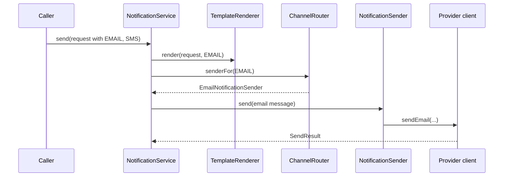

# Notification LLD Design

An OTP request can ask for Email, SMS, and Push at the same time. The core design must render the
business message once per requested channel, use the correct recipient address for that channel, and
return an outcome for each attempted delivery. It should not make `NotificationService` depend on
SendGrid, Twilio, Firebase, or a future WhatsApp vendor.

The current playground is intentionally synchronous and in memory. Retries, queues, preferences,
idempotency, provider fallback, and persistence are follow-ups; they should not distort the first-pass
object model.

## Walk one request before naming classes

For an OTP request addressed to Email and SMS, `NotificationService.send(request)` iterates through the
two requested channels. For each channel, it asks the renderer for channel-ready content, looks up the
registered sender, and collects that sender's `SendResult`. A missing email address produces an Email
failure, but does not prevent the SMS sender from reporting its own result.

The same sequence repeats for SMS. This simple flow is why the service owns orchestration, rather than
embedding a growing `if/else` chain for every channel and provider.

## Derive responsibilities from the flow

| Class | Role |
| --- | --- |
| `NotificationRequest` | Holds business type, recipient, template data, and requested channels. It rejects a missing type, recipient, or channel list. |
| `NotificationService` | Orchestrates one send attempt per requested channel and returns every `SendResult`. |
| `TemplateRenderer` | Converts a business request plus channel into a `NotificationMessage`. |
| `ChannelRouter` | Maps a `Channel` to its registered sender and fails fast if none is registered. |
| `NotificationSender` | Varying channel behavior: validate that channel's endpoint and delegate to its provider client. |
| `EmailProviderClient` / `SmsProviderClient` / `PushProviderClient` | Vendor boundary for one delivery mechanism. |

`NotificationMessage` is the hand-off object between rendering and delivery. It carries the recipient,
title, subject, and body without forcing a sender to understand template variables or business types.

## Why the seams exist

`NotificationSender` is a Strategy only because channel behavior genuinely varies: Email needs an email
address and subject, SMS needs a phone number, and Push needs a device token and title. The service can
therefore call one `send(message)` operation without knowing any channel-specific details.

The provider-client interfaces are Adapter boundaries. A vendor SDK change stays inside its channel
sender/client pair; it does not alter the request, renderer, router, or service. `ChannelRouter` is a
small registry rather than a factory because sender instances are supplied at construction time and are
looked up by one stable key.

## What the current design guarantees

- Callers choose business type and delivery channels, never a provider.
- Channel senders validate only their own endpoint; they do not decide the template.
- Provider clients do not know the business notification type.
- A requested channel always yields one `SendResult`, success or failure.
- The service's synchronous loop preserves the request's channel iteration order. It does not promise
  delivery ordering across separate requests.

## Extension: add WhatsApp without changing the service

Add `WHATSAPP` to `Channel`, implement a `WhatsAppNotificationSender`, give it a
`WhatsAppProviderClient`, and register the sender in `ChannelRouter`. The existing service still renders,
routes, sends, and collects outcomes through the same flow. That is the specific change the strategy and
adapter seams isolate.

If the interview adds retries or asynchronous delivery, put those concerns outside this synchronous
object model: a job/outbox layer decides when a notification is attempted; this design still owns how one
attempt is rendered, routed, and sent. Do not add retry state to every sender unless the requirement
actually asks for it.

## Quick recall

**Q. Why not put email/SMS/push if-else inside the service?**
A. It couples orchestration to every channel and vendor. Strategy + router keeps it replaceable.

**Q. What changes when adding WhatsApp?**
A. Add `WHATSAPP`, a sender, a provider client, and template support. Existing senders stay unchanged.

**Q. Why does `NotificationMessage` exist?**
A. It separates business/template data from channel delivery, so a sender receives only ready-to-send content.

**Q. Where should retry logic go?**
A. Outside the synchronous sender flow, in the layer that decides when an attempt is scheduled and retried.
