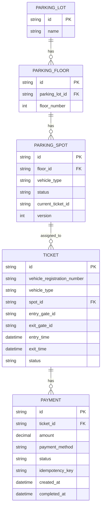
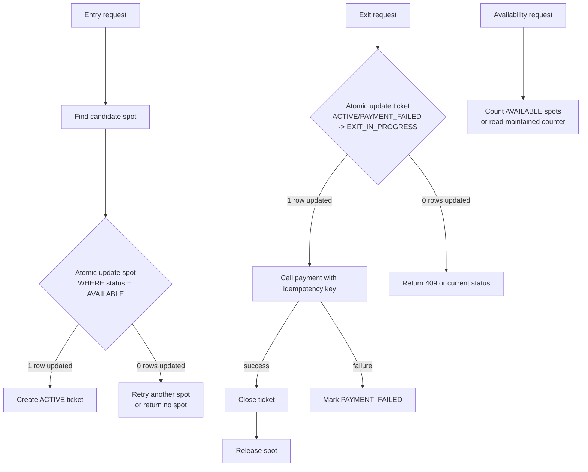
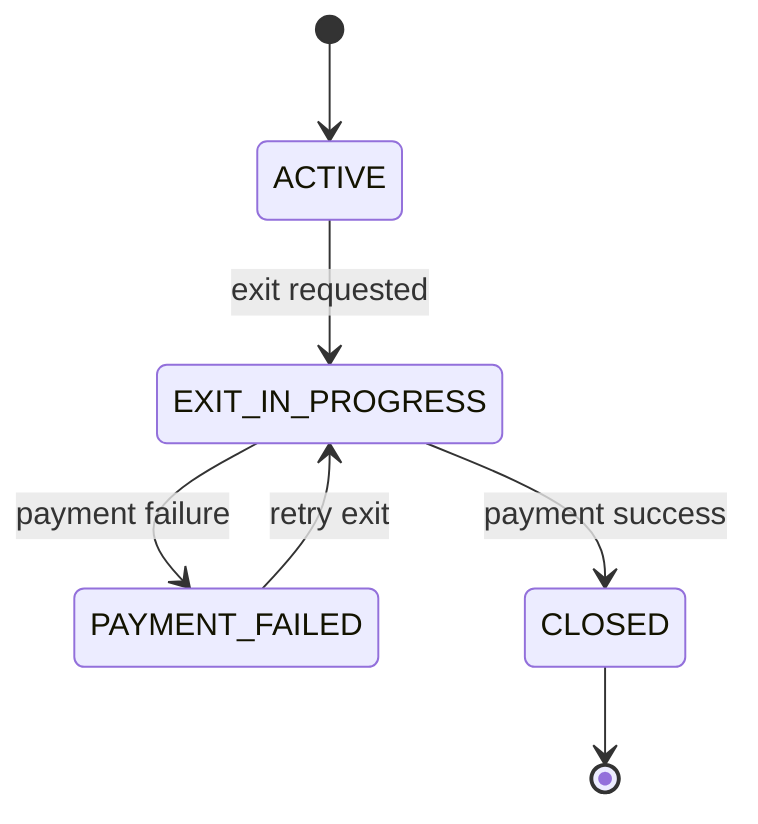

# Parking Lot Database and Concurrency

This page is the production-style discussion for the parking lot case study: tables, state transitions, race conditions, transactions, and the interview questions around them.

The key shift:

```text
Single JVM practice app:
Java objects + synchronized can be enough.

Multiple app instances:
Correctness must move to the database.
```

Java `synchronized` protects only one object inside one JVM. If the service runs behind a load balancer with multiple instances, each instance has a different lock. Shared state must be protected by database transactions, row locks, atomic conditional updates, unique constraints, and idempotency keys.

## Tables



Minimal table shape:

```text
parking_lot
- id
- name

parking_floor
- id
- parking_lot_id
- floor_number

parking_spot
- id
- floor_id
- vehicle_type
- status              AVAILABLE / OCCUPIED / OUT_OF_SERVICE
- current_ticket_id   nullable
- version             optional, for optimistic locking

ticket
- id
- vehicle_registration_number
- vehicle_type
- spot_id
- entry_gate_id
- exit_gate_id        nullable
- entry_time
- exit_time           nullable
- status              ACTIVE / EXIT_IN_PROGRESS / CLOSED / PAYMENT_FAILED

payment
- id
- ticket_id
- amount
- payment_method
- status              INITIATED / SUCCESS / FAILED
- idempotency_key     unique
- created_at
- completed_at        nullable
```

Useful constraints and indexes:

```text
parking_spot.current_ticket_id unique nullable
ticket.spot_id indexed
ticket.status indexed
payment.ticket_id indexed
payment.idempotency_key unique
```

## Race-condition map



The important interview point: dangerous operations are not plain reads or writes. They are check-then-change flows:

- if spot is available, reserve it
- if ticket is active, start exit
- if payment is not already done, collect it
- if counter is positive, decrement it

These must be atomic.

## Spot allocation

The unsafe pattern is read-then-write:

```sql
SELECT id
FROM parking_spot
WHERE vehicle_type = :vehicleType
AND status = 'AVAILABLE'
LIMIT 1;

UPDATE parking_spot
SET status = 'OCCUPIED'
WHERE id = :spotId;
```

Two app instances can both read the same available spot before either writes.

Use an atomic conditional update:

```sql
UPDATE parking_spot
SET status = 'OCCUPIED',
    current_ticket_id = :ticketId
WHERE id = :spotId
AND status = 'AVAILABLE';
```

Then check affected rows:

- `1`: this request reserved the spot.
- `0`: another request already took it.

Entry flow:

```text
1. create ticket id
2. find candidate available spot
3. reserve that spot with an atomic conditional update
4. create ACTIVE ticket
5. return ticket
```

Service shape:

```java
@Transactional
public Ticket enterVehicle(Vehicle vehicle, String entryGateId) {
  ParkingSpot spot = parkingSpotRepository.reserveAvailableSpot(vehicle.getVehicleType())
      .orElseThrow(() -> new ParkingLotException(NO_VALID_SPOT_FOUND));

  return ticketRepository.save(Ticket.open(vehicle, spot, entryGateId));
}
```

## Exit state machine

Exit should be a state transition, not just a method call.



Start exit atomically:

```sql
UPDATE ticket
SET status = 'EXIT_IN_PROGRESS'
WHERE id = :ticketId
AND status IN ('ACTIVE', 'PAYMENT_FAILED');
```

If affected rows is `1`, this request owns the exit flow.

If affected rows is `0`, the ticket is invalid, already closed, or already being processed.

After payment success:

```sql
UPDATE ticket
SET status = 'CLOSED',
    exit_time = :exitTime,
    exit_gate_id = :exitGateId
WHERE id = :ticketId
AND status = 'EXIT_IN_PROGRESS';
```

Release the spot:

```sql
UPDATE parking_spot
SET status = 'AVAILABLE',
    current_ticket_id = null
WHERE current_ticket_id = :ticketId;
```

## Payment and transaction boundary

Do not hold a long database transaction while calling an external payment gateway.

Bad shape:

```java
@Transactional
public void exitVehicle(...) {
  markExitInProgress();
  paymentGateway.charge(...);
  closeTicketAndReleaseSpot();
}
```

This can hold DB locks while waiting on a slow network call.

Better shape:

```text
Transaction 1:
ACTIVE / PAYMENT_FAILED -> EXIT_IN_PROGRESS

External call:
collect payment using an idempotency key

Transaction 2:
payment success -> CLOSED + release spot
payment failure -> PAYMENT_FAILED
```

Payment should be idempotent. A common idempotency key:

```text
ticketId + ":exit-payment"
```

The payment table should enforce:

```sql
UNIQUE(idempotency_key)
```

This protects against duplicate gateway calls caused by retries, double-clicks, duplicate requests, or app restarts.

## Duplicate exit request

If the first request has moved the ticket to `EXIT_IN_PROGRESS` and payment is still running, a second exit request should usually not wait.

Simple API behavior:

```text
POST /parking/tickets/{ticketId}/exit
```

If already processing:

```http
409 Conflict
```

```json
{
  "code": "EXIT_ALREADY_IN_PROGRESS",
  "message": "Exit is already being processed for this ticket"
}
```

Why fail fast instead of waiting:

- HTTP threads should not sit blocked behind long payment calls.
- Waiting requests can time out anyway.
- Retries become harder to reason about.
- A status endpoint gives the client a cleaner path.

A more production-style flow can return `202 Accepted` and expose:

```text
GET /parking/tickets/{ticketId}
```

or:

```text
GET /parking/tickets/{ticketId}/exit-status
```

For this practice app, `409 Conflict` is the simplest useful answer.

## Availability

Correct and simple:

```sql
SELECT COUNT(*)
FROM parking_spot
WHERE vehicle_type = :vehicleType
AND status = 'AVAILABLE';
```

If availability reads become very high, keep counters:

```text
availability_counter
- floor_id
- vehicle_type
- available_count
```

Update counters in the same transaction as spot reservation/release:

```sql
UPDATE availability_counter
SET available_count = available_count - 1
WHERE floor_id = :floorId
AND vehicle_type = :vehicleType
AND available_count > 0;
```

Start with counting spot rows. Add counters only when read traffic justifies the extra consistency work.

## What changes in code

Single-JVM practice code:

```text
ParkingLot.allocateSpot()
TicketRepository HashMap / ConcurrentHashMap
synchronized methods
```

Multi-instance code:

```text
ParkingSpotRepository
TicketRepository
PaymentRepository
@Transactional service methods
DB constraints
status transitions
idempotency key
```

Interview wording:

> In a single JVM demo, `synchronized` is acceptable. In a horizontally scaled service, synchronization does not work across instances. I would move shared mutable state to the database and use transactions, row-level locking, atomic conditional updates, unique constraints, and idempotency keys.

## Interview questions

- How do you prevent the same spot being assigned twice?
- Why is Java `synchronized` not enough after horizontal scaling?
- Should payment happen inside a DB transaction?
- What happens if payment succeeds but DB update fails?
- What happens if the user clicks exit twice?
- Should the second exit request wait or fail?
- How do you calculate availability?
- What happens if the app crashes while payment is in progress?
- Which database constraints protect the design?
- Where would you use idempotency?

## Quick recall

- Spot allocation is an inventory problem: do `update if available`, not read then write.
- Java `synchronized` protects one JVM, not multiple instances.
- Use ticket status transitions to stop duplicate exits.
- Do not keep DB locks open while waiting for payment.
- Use idempotency keys for payment retries.
- Duplicate exit during payment should usually return `409 Conflict` or current status, not wait.
