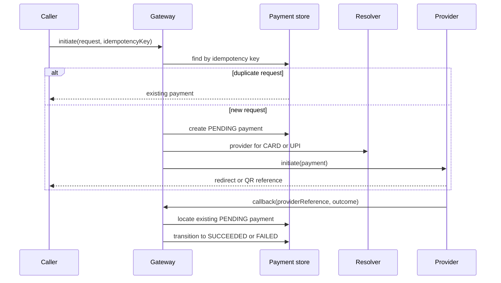
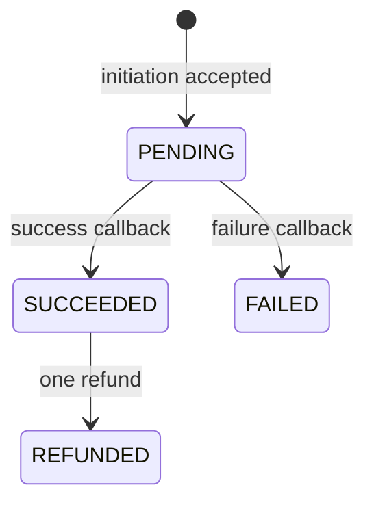

# Design notes — Payment Gateway

Use this page after attempting the exercise. The gateway owns the payment record and its state transitions;
a provider supplies method-specific initiation and outcome information. The gateway must never interpret a
provider redirect or callback as permission to create a second payment attempt.

## Start from one payment request

The caller supplies a merchant reference, amount, payment method, and idempotency key. The gateway returns an
existing payment if that key was seen before. Otherwise it records one pending attempt, selects the configured
provider for the method, and returns provider initiation data such as a redirect or UPI reference.

The callback path deliberately updates the existing payment. A callback is an outcome for an already-known
attempt, not a new request from which to infer a new charge.

## Model the lifecycle before providers

Only a pending payment accepts a normal outcome callback. A second callback after `SUCCEEDED` or `FAILED` is a
duplicate/out-of-order message for the base design and must not change state. A refund is allowed only from a
successful payment and only once.

## Responsibilities and invariant

| Responsibility | Own it here | Why |
| --- | --- | --- |
| Payment ID, merchant reference, amount, provider reference, status | `Payment` | It is the durable business record, even in memory for this exercise. |
| Method-to-provider selection | resolver | Card and UPI may vary without changing gateway orchestration. |
| Provider-specific initiation | provider implementation | A redirect URL and a UPI QR reference are not core gateway state. |
| Initiation, lookup, callback transition, refund | gateway service | It enforces the lifecycle and idempotency boundary. |

The central invariant is: **one idempotency key maps to at most one payment initiation.** A caller retry must
return the original payment rather than create another provider side effect.

## Provider abstraction: enough, not a framework

The provider seam exists because method-specific initiation may vary. The base resolver maps each supported
method to one configured provider. Do not add health scoring, routing percentages, or failover policy until the
requirements actually need multiple candidates for one method.

Likewise, do not store card numbers or bank details. The base model stores only safe provider references and the
minimum metadata needed to connect a callback with its payment.

## Failure and recovery thinking

An initiation timeout is ambiguous: the provider might have created a payment even if the caller saw no answer.
The idempotency key lets the caller ask for the same attempt rather than start over. In a real service, persist
the key and payment record before calling the provider, authenticate callbacks, deduplicate their event IDs, and
retry/reconcile pending payments. Those are production extensions, not reasons to enlarge this in-memory scope.

## Quick recall

- What does initiation create? One pending payment attempt.
- Why retain an idempotency key first? A retry must not initiate another charge.
- What can a callback change? Only the existing pending payment identified by its provider-safe reference.
