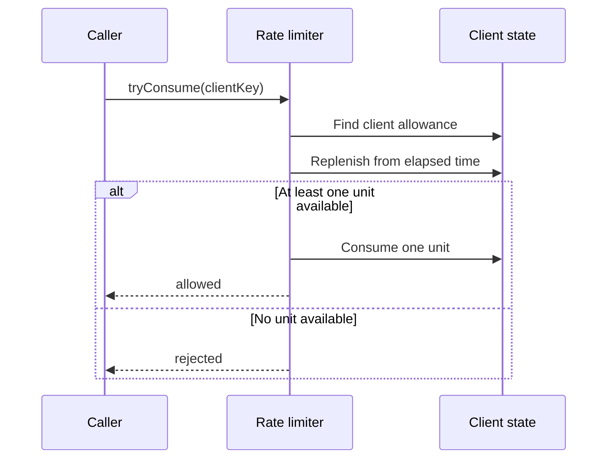

# Rate Limiter Design Notes

Use this page after attempting the exercise. It explains the behavior selected by the final requirements:
a client may use a short burst, then regains allowance steadily over elapsed time.

## Invariant

Each client has an independent allowance between zero and its configured burst capacity. Before deciding
whether to allow a request, replenish that client's allowance from elapsed time and cap it at capacity.
An allowed request consumes one unit; a rejected request consumes none.

The update must be atomic for one client: two simultaneous requests must not both consume the same final
unit. Different clients should not unnecessarily block each other.



The reader question: why is this more than a counter? A counter alone cannot recover capacity over time.
Each client state therefore needs the current allowance and the time from which replenishment is calculated.

## Core request flow

1. Validate the client key.
2. Find or create that client's state.
3. Within the same client-specific critical section, calculate elapsed monotonic time and replenish the
   allowance without exceeding capacity.
4. If at least one unit is available, subtract one and allow the request; otherwise reject it.
5. Store the updated allowance and time before releasing the client-specific protection.

Use a monotonic time source for elapsed-time calculations. Wall-clock time can move backward or forward,
which can create incorrect refills.

## Time and token representation

### Measure elapsed time, not calendar time

`LocalDateTime` represents a human-readable calendar value such as `2026-09-22 10:30`. It is useful for
displaying or auditing when something happened, but it is a poor source for a limiter's elapsed-duration
calculation. Machine-clock corrections, manual changes, and time-zone rules can make a wall clock jump.

```text
last refill: 10:00:00
the machine clock is corrected backward five minutes
current clock: 09:55:01
```

One real second passed, but a calendar-time subtraction now appears negative. A forward jump can incorrectly
award several minutes of tokens at once.

Use `System.nanoTime()` for this in-memory JVM implementation:

```java
long elapsedNanos = System.nanoTime() - lastRefillNanos;
```

Its number has no calendar meaning, and it must not be displayed, persisted, or compared across JVM runs.
Its useful property is that differences measure elapsed time reliably while this process runs.

### Why capacity is integral but refill state can be fractional

One request costs one complete token, so a burst capacity such as `10` means at most ten immediate requests
after a bucket has fully refilled. A capacity of `10.5` has no useful meaning in this base model.

Refill can be fractional. With a capacity of `10` and a rate of `0.5` token/second, a bucket earns half a
token after one second and one complete token after two seconds. Therefore the simple implementation uses:

```text
maxTokens               int
refillTokensPerSecond   double
availableTokens         double
```

At each request, calculate earned tokens from elapsed duration, cap the result, then decide whether one
full token can be consumed:

```text
earned = elapsedSeconds × refillTokensPerSecond
available = min(maxTokens, available + earned)
if available >= 1: consume one token and allow
otherwise: reject
```

### `double` versus scaled integers

`double` is the clearest base-exercise choice. Decimal fractions such as `0.1` are not represented exactly
in binary, so a long-running high-precision limiter can accumulate tiny rounding differences. That is not a
meaningful concern for this interview implementation.

Scaled integers avoid that issue by choosing a smaller exact unit. For example, define one token as 1,000
microtokens:

| Meaning | Scaled value |
| --- | ---: |
| One request token | 1,000 microtokens |
| Capacity of 10 tokens | 10,000 microtokens |
| Refill rate of 0.5 token/second | 500 microtokens/second |
| Cost of one request | 1,000 microtokens |

After one allowed request from a full bucket, `10,000` becomes `9,000`. One second of a `0.5` token/second
refill adds `500`, producing `9,500` exactly.

Scaled integers are not automatically simpler: configuration and request cost need scaling, integer
division can discard partial refill progress, and very large values can overflow. Use `double` here; discuss
scaled `long` units only when precision is a stated requirement.

## Refill choices: worker first, then lazy refill

It is useful to understand a worker-based implementation first. A single shared worker wakes periodically,
visits known buckets, and adds earned tokens up to their capacity. This makes the refill visible: tokens are
physically updated even when no request arrives.

Do **not** create one worker per client key. Thousands of idle client keys would mean thousands of waiting
threads. A worker-based learning version should have one shared worker that calls `refillAllBuckets()`.

```text
every refill interval:
    for each bucket:
        available = min(capacity, available + earnedTokens)
```

The worker and `tryConsume` both modify the same bucket, so they must use the same per-bucket lock. Without
that, a worker can refill while a request checks and consumes, producing an incorrect token count.

### Why lazy refill scales better

A token bucket does not need tokens to be physically added every second. It only needs the correct count
when a request arrives. Keep `availableTokens` and `lastRefillNanos`; on access, calculate all tokens earned
since that stored time in one step.

```text
bucket has 0 tokens at 12:00
no request arrives for ten seconds
no work is performed
request arrives at 12:10
calculate ten seconds of earned tokens, cap at capacity, then decide
```

For an elapsed-time token bucket, this gives the same permit decision as periodic refill. The difference is
work performed while the bucket is idle:

| Approach | Work while idle | Main concern |
| --- | --- | --- |
| One periodic worker | Scans every known bucket every interval | Cost grows with inactive keys. |
| One worker per key | Keeps many sleeping threads | Does not scale; avoid it. |
| Lazy refill | No work until a request touches that key | Refill/check/consume must stay atomic. |

The intuition to say in an interview is: **a bucket is logically refilled by elapsed time; lazy refill only
delays the arithmetic until someone needs the answer.**

## Model to derive

| Responsibility | Why it exists |
| --- | --- |
| `RateLimiter` | Receives a client key and locates that client's state. |
| Client allowance state | Holds the current allowance and last refill time. |
| Limit policy/configuration | Defines burst capacity and replenishment rate. |
| Per-client synchronization boundary | Makes replenish-and-consume one atomic decision. |

The exact class names and collection choices are your design decision. The important separation is that
policy tells the limiter *what is allowed*, while client state records *what this client has left*.

## Concurrency boundary

Synchronizing only the final decrement is not enough: replenishment, checking availability, and consuming
one unit form a single read-modify-write operation. A simple first version can synchronize each client's
state object. That keeps requests for the same client correct while allowing unrelated clients to proceed.

Do not lock the entire limiter unless the interview scope is deliberately tiny; it serializes independent
clients and becomes the first throughput bottleneck.

## Follow-up answers

### Fixed and sliding windows

A fixed window counts requests in one named period and is simple, but a client can burst at a period
boundary. A sliding window reduces that boundary effect, usually at the cost of more state or calculation.
Choose the policy based on the required burst behavior rather than treating one as universally best.

### Multiple instances

An in-memory map only limits requests arriving at that one process. For a shared limit across instances,
move the atomic allowance update to a shared store such as Redis and use one atomic operation there.

### Inactive-client cleanup

Remove state only after an inactivity threshold and only while coordinating with a request for that same
client. Cleanup is a memory-management extension; it must not let a concurrent request lose an update.

### Retry and metrics

The limiter can calculate an approximate retry-after duration from the missing allowance and refill rate.
Record allowed and rejected counters separately; those observations should not alter permit decisions.

## Quick recall

**Q. What must be isolated?**
A. The allowance and last-update state for each client key.

**Q. What is the shared-resource boundary?**
A. Updating one client's allowance and deciding whether to consume a unit.

**Q. Why is a global lock a poor production default?**
A. It serializes requests for independent clients that do not share rate-limit state.

**Q. Why use monotonic time for refill?**
A. Refill needs elapsed duration; wall-clock adjustments can make elapsed time incorrect.

**Q. Why use `double` for available tokens?**
A. It preserves fractional refill progress such as 0.5 token per second with the simplest exercise code.

**Q. When would scaled integers be preferable?**
A. When tiny floating-point rounding differences are unacceptable and the extra unit-conversion logic is
worth the precision.

**Q. Why is lazy refill preferable to one worker per key?**
A. Elapsed time already tells a bucket how many tokens it earned, so idle keys need no thread or periodic
work.
