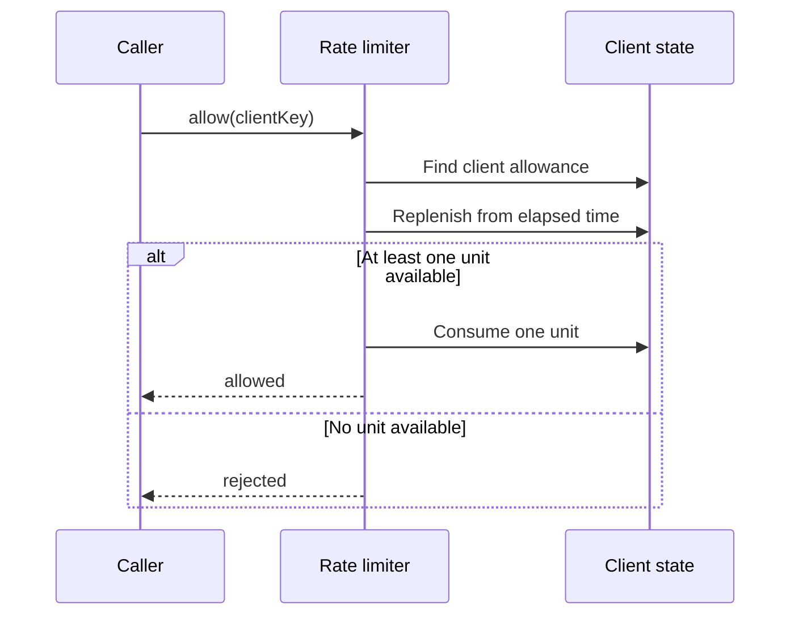

# Rate Limiter Design Notes

Use this page after attempting the exercise. It explains the behavior selected by the final requirements:
a client may use a short burst, then regains allowance steadily over elapsed time.

## Invariant

Each client has an independent allowance between zero and its configured burst capacity. Before deciding
whether to allow a request, replenish that client's allowance from elapsed time and cap it at capacity.
An allowed request consumes one unit; a rejected request consumes none.

The update must be atomic for one client: two simultaneous requests must not both consume the same final
unit. Different clients should not unnecessarily block each other.

The reader question: why is this more than a counter? A counter alone cannot recover capacity over time.
Each client state therefore needs the current allowance and the time from which replenishment is calculated.

## Core request flow

1. Validate the client key.
2. Find or create that client's state.
3. Within the same client-specific critical section, calculate elapsed monotonic time and replenish the
   allowance without exceeding capacity.
4. If at least one unit is available, subtract one and allow the request; otherwise reject it.
5. Store the updated allowance and time before releasing the client-specific protection.

Use a monotonic time source for elapsed-time calculations. Wall-clock time can move backward or forward,
which can create incorrect refills.

## Model to derive

| Responsibility | Why it exists |
| --- | --- |
| `RateLimiter` | Receives a client key and locates that client's state. |
| Client allowance state | Holds the current allowance and last refill time. |
| Limit policy/configuration | Defines burst capacity and replenishment rate. |
| Per-client synchronization boundary | Makes replenish-and-consume one atomic decision. |

The exact class names and collection choices are your design decision. The important separation is that
policy tells the limiter *what is allowed*, while client state records *what this client has left*.

## Concurrency boundary

Synchronizing only the final decrement is not enough: replenishment, checking availability, and consuming
one unit form a single read-modify-write operation. A simple first version can synchronize each client's
state object. That keeps requests for the same client correct while allowing unrelated clients to proceed.

Do not lock the entire limiter unless the interview scope is deliberately tiny; it serializes independent
clients and becomes the first throughput bottleneck.

## Follow-up answers

### Fixed and sliding windows

A fixed window counts requests in one named period and is simple, but a client can burst at a period
boundary. A sliding window reduces that boundary effect, usually at the cost of more state or calculation.
Choose the policy based on the required burst behavior rather than treating one as universally best.

### Multiple instances

An in-memory map only limits requests arriving at that one process. For a shared limit across instances,
move the atomic allowance update to a shared store such as Redis and use one atomic operation there.

### Inactive-client cleanup

Remove state only after an inactivity threshold and only while coordinating with a request for that same
client. Cleanup is a memory-management extension; it must not let a concurrent request lose an update.

### Retry and metrics

The limiter can calculate an approximate retry-after duration from the missing allowance and refill rate.
Record allowed and rejected counters separately; those observations should not alter permit decisions.

## Quick recall

**Q. What must be isolated?**
A. The allowance and last-update state for each client key.

**Q. What is the shared-resource boundary?**
A. Updating one client's allowance and deciding whether to consume a unit.

**Q. Why is a global lock a poor production default?**
A. It serializes requests for independent clients that do not share rate-limit state.

**Q. Why use monotonic time for refill?**
A. Refill needs elapsed duration; wall-clock adjustments can make elapsed time incorrect.
