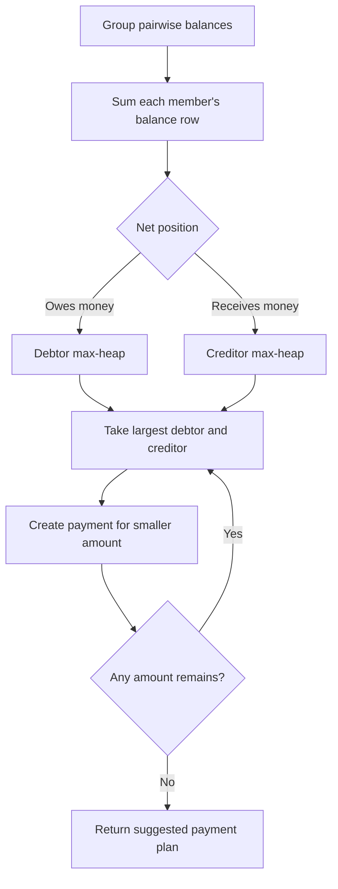

# Splitwise Design Notes

Use this page to record the decisions made while implementing the exercise.

## Invariants to protect

- Every expense has one payer, a positive amount, and at least one participant.
- Shares total exactly to the expense amount after any rounding rule is applied.
- A balance is directional: an amount one user owes another is not the same entry in reverse.
- Settling a balance cannot create a negative settlement amount.

## Decisions to make

- Which class owns split validation: expense, split strategy, or a dedicated validator?
- Should `Group` own balances, or should a ledger service own them?
- How will exact and percentage splits represent and validate money?
- Is a settlement a separate transaction record or only a direct balance adjustment in the MVP?

## Debt simplification — interview follow-up

Debt simplification is a group-only **suggestion**. It does not rewrite expense history or automatically
collect money. Its job is to replace several intermediate payment routes with a smaller set of payments
while leaving every member's final position unchanged.

### Worked example

Existing group debts:

```text
A owes B ₹10
B owes C ₹15
C owes A ₹5
```

Calculate what each person pays and receives overall:

| User | Pays | Receives | Final position |
|---|---:|---:|---|
| A | ₹10 | ₹5 | owes ₹5 |
| B | ₹15 | ₹10 | owes ₹5 |
| C | ₹5 | ₹15 | should receive ₹10 |

The simplified plan is therefore:

```text
A pays C ₹5
B pays C ₹5
```

A and B still each pay ₹5; C still receives ₹10. Only the payment routes changed.

### How it maps to the current balance map

The current group storage is:

```java
Map<Integer, Map<Integer, Map<Integer, BigDecimal>>> groupBalances;
```

For one group, `balances[user][counterpart]` is positive when `user` owes the counterpart. The reciprocal
entry is negative. Sum each user's inner map:

```text
positive total → user owes money overall
negative total → user should receive money overall
zero           → user is already settled
```

For the example above:

```text
A: +₹10 - ₹5  = +₹5   → debtor
B: -₹10 + ₹15 = +₹5   → debtor
C: +₹5 - ₹15  = -₹10  → creditor
```

Only group balances participate. Direct, non-group balances remain separate.

### Algorithm

The reader question for this flow is: **How do tangled pairwise debts become a small payment plan?**



1. Build one net amount for every member.
2. Put users with positive totals into a debtor max-heap.
3. Put users with negative totals into a creditor max-heap, using the absolute amount.
4. Take the largest debtor and creditor. Create a payment for the smaller outstanding amount.
5. Reinsert whichever user still has an outstanding amount. Stop when both heaps are empty.

The result is a valid compact plan in `O(E + U log U)`, where `E` is the number of non-zero balance entries
and `U` is the number of members with an outstanding net position. The greedy approach is practical, but it
does not guarantee the mathematically smallest possible number of payments.

### Implementation boundary

Return a `List<Settlement>`-like plan from a separate `simplifyGroupDebts(groupId)` operation. Do not call
the current `settleBalance(...)` for a newly suggested route: it correctly validates an existing pairwise
debt, while simplification can produce a new route such as `A → C`.

When a suggested payment is actually completed, a fuller design needs a group-level net-balance projection
or a recomputation step that incorporates that payment. The raw expense history remains the source of truth.

For an SDE2 interview, explaining this data flow, the heap algorithm, and the boundary is enough unless the
interviewer explicitly asks for implementation. Real Splitwise likewise presents simplification as a way to
restructure group balances without changing each member's overall balance. [Further reading](https://kb.splitwise.com/balances-and-expenses/what-is-simplify-debts)

## Extensions after the MVP

- Debt simplification across a group.
- Persistent expense and settlement history.
- Concurrent updates and idempotency.
- Multi-currency support and rounding policy.

## Quick recall

- Use integer minor units or `BigDecimal` for money; never `double`.
- Model balances as an explicit ledger concern instead of recalculating every screen from scratch.
- Keep split calculation separate from balance mutation when different split types are required.
- Simplification reduces group payment routes from net positions; it does not alter expense history.
