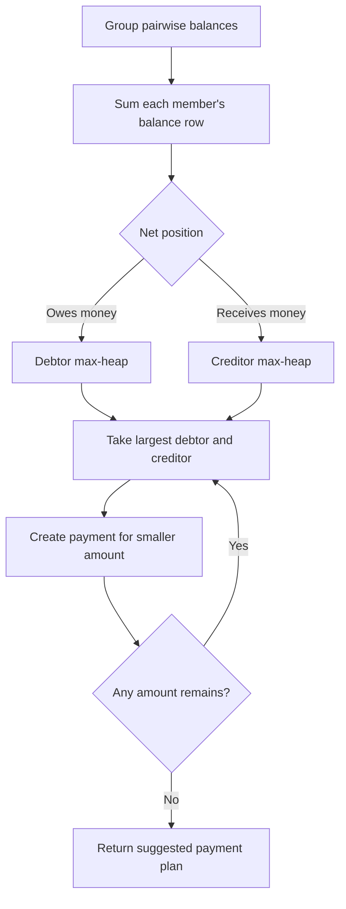
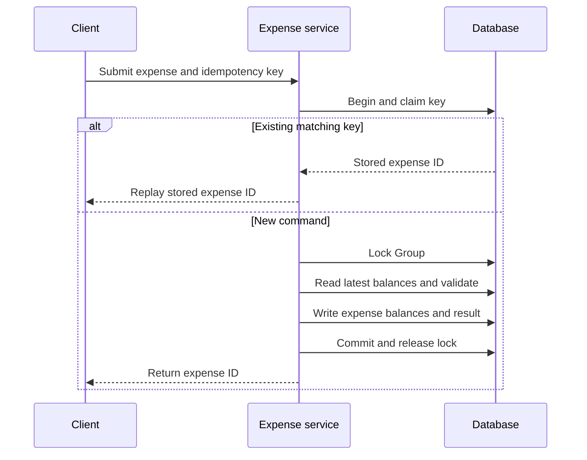

# Splitwise Design Notes

The runnable playground is the MVP source of truth. These notes explain why its boundaries preserve the expense and
balance invariants, then isolate changes that would require a different design.

## Current model and boundary

An `Expense` is the historical input: payer, total, participants, split type, and optional group. A `Split` begins
with an input value when needed (exact amount or percentage) and receives its calculated `amountOwed` from a strategy.
`ExpenseService` owns the derived in-memory balance projection and stores a `Settlement` separately; `GroupService`
owns users, groups, and both membership indexes.

The projection is intentionally pairwise, not a single user total. For every non-payer share, `addDebt` writes both
directions together. This makes “Bob owes Alice 50” directly queryable and lets `removeExpense` apply the inverse of
the original debt. It also means a settlement can validate the exact pair it is reducing.

## Invariants and current enforcement

| Invariant | Current enforcement boundary |
| --- | --- |
| Positive expense and at least one participant | `Expense` constructor and split strategies |
| No participant appears twice | `ExpenseService` before calculation |
| Every referenced user exists; group users belong to the group | `GroupService` checks called by `ExpenseService` |
| Shares account for the total | Equal/exact/percentage `SplitStrategy` implementation |
| Pairwise entries remain reciprocal | `ExpenseService.addDebt(...)` is the single balance-mutation helper |
| Settlement reduces, never exceeds, an existing debt | `ExpenseService.settleBalance(...)` |

`BigDecimal` avoids binary floating-point error, but it is not a universal rounding policy. The present implementation
uses two decimal places only for equal splits and assigns their remainder to the final participant. A persisted money
model should instead fix currency minor units and a documented allocation rule before accepting commands.

## Chosen design versus tempting alternatives

Putting split branches inside `ExpenseService` is smaller for one rule but forces edits there for every new split
calculation. The current strategies isolate only the varying calculation; they do not own balance mutation, group
membership, or persistence. Conversely, calculating a user’s total balance from every historical expense is simple
to reason about but makes common balance reads scan history. The MVP keeps a derived pairwise projection and retains
the `Expense` record so removal can reverse the same entries. In a persisted system, treat history as authoritative
and the projection as rebuildable.

## Delivery order

1. Establish the scope and reciprocal-balance/share-total invariants.
2. Walk one equal expense and a partial settlement.
3. Explain why split calculation varies while ledger mutation stays centralized.
4. Show membership validation and reversal on expense removal.
5. Offer simplification and persisted concurrency as follow-ups, with their changed boundaries.

## Debt simplification — interview follow-up

Debt simplification is a group-only **suggestion**. It does not rewrite expense history or automatically
collect money. Its job is to replace several intermediate payment routes with a smaller set of payments
while leaving every member's final position unchanged.

### Worked example

Existing group debts:

```text
A owes B ₹10
B owes C ₹15
C owes A ₹5
```

Calculate what each person pays and receives overall:

| User | Pays | Receives | Final position |
|---|---:|---:|---|
| A | ₹10 | ₹5 | owes ₹5 |
| B | ₹15 | ₹10 | owes ₹5 |
| C | ₹5 | ₹15 | should receive ₹10 |

The simplified plan is therefore:

```text
A pays C ₹5
B pays C ₹5
```

A and B still each pay ₹5; C still receives ₹10. Only the payment routes changed.

### How it maps to the current balance map

The current group storage is:

```java
Map<Integer, Map<Integer, Map<Integer, BigDecimal>>> groupBalances;
```

For one group, `balances[user][counterpart]` is positive when `user` owes the counterpart. The reciprocal
entry is negative. Sum each user's inner map:

```text
positive total → user owes money overall
negative total → user should receive money overall
zero           → user is already settled
```

For the example above:

```text
A: +₹10 - ₹5  = +₹5   → debtor
B: -₹10 + ₹15 = +₹5   → debtor
C: +₹5 - ₹15  = -₹10  → creditor
```

Only group balances participate. Direct, non-group balances remain separate.

### Algorithm

The reader question for this flow is: **How do tangled pairwise debts become a small payment plan?**



1. Build one net amount for every member.
2. Put users with positive totals into a debtor max-heap.
3. Put users with negative totals into a creditor max-heap, using the absolute amount.
4. Take the largest debtor and creditor. Create a payment for the smaller outstanding amount.
5. Reinsert whichever user still has an outstanding amount. Stop when both heaps are empty.

The result is a valid compact plan in `O(E + U log U)`, where `E` is the number of non-zero balance entries
and `U` is the number of members with an outstanding net position. The greedy approach is practical, but it
does not guarantee the mathematically smallest possible number of payments.

### Implementation boundary

Return a `List<Settlement>`-like plan from a separate `simplifyGroupDebts(groupId)` operation. Do not call
the current `settleBalance(...)` for a newly suggested route: it correctly validates an existing pairwise
debt, while simplification can produce a new route such as `A → C`.

When a suggested payment is actually completed, a fuller design needs a group-level net-balance projection
or a recomputation step that incorporates that payment. The raw expense history remains the source of truth.

For an SDE2 interview, explaining this data flow, the heap algorithm, and the boundary is enough unless the
interviewer explicitly asks for implementation. Real Splitwise likewise presents simplification as a way to
restructure group balances without changing each member's overall balance. [Further reading](https://kb.splitwise.com/balances-and-expenses/what-is-simplify-debts)

## Production follow-up — persisted concurrent writes

This is outside the current in-memory exercise. A persisted design must create the immutable expense and splits,
then update the derived balance projection as one short transaction. `@Transactional` makes that write atomic; it
does not stop another request from making a stale balance decision, so every balance-changing command needs one
consistent coordination resource.

For a group expense or settlement, lock the persisted `Group` row first. Every flow that changes that group's
balances—create, edit, remove, or settle—uses the same lock, then reads the latest projection, validates, writes the
expense/splits and balance changes, and commits. A second request for that group waits and calculates from the first
request's committed state.



For a direct expense, lock the canonical pair-balance row when it already exists. If it does not exist, lock the two
`User` rows in ascending ID order before creating the pair row. The fixed order prevents one request from holding A
while waiting for B as another holds B while waiting for A. Re-read the pair after those locks: use the row a prior
request created, or create it. A unique canonical-pair constraint is the final guard; a duplicate-key loser rolls
back and retries the whole command in a fresh transaction.

An optimistic `@Version` check is an alternative when conflicts are rare: a stale writer fails, reloads the current
projection, and retries the complete idempotent command only when that is safe. A pessimistic group lock is easier to
explain when group edits are expected to contend, but it costs waiting and can time out or deadlock. In either model,
rollback the failed command; retry deadlock, timeout, or optimistic conflicts only from a caller boundary that can
reuse the same idempotency key. Make that key real: store a unique caller/key record with a payload fingerprint and
the completed expense/result, reject a reused key with different input, and replay the stored result after an
ambiguous timeout. Never hold the database lock while calling a payment provider or waiting for user input.

## Extensions after the MVP

- Debt simplification across a group.
- Persistent expense and settlement history.
- Concurrent updates and idempotency.
- Multi-currency support and rounding policy.

## References

- [Splitwise: simplify debts](https://kb.splitwise.com/balances-and-expenses/what-is-simplify-debts) — product behavior for balance-preserving simplification.
- [Spring declarative transaction implementation](https://docs.spring.io/spring-framework/reference/data-access/transaction/declarative/tx-decl-explained.html) — transaction-proxy boundary for the persisted extension.
- [Codefarm Splitwise LLD guide](https://codefarm.in/guides/lld/06-lld-interview-problems/splitwise) and [SpaceComplexity interview walkthrough](https://spacecomplexity.ai/blog/splitwise-system-design-interview) — independent checks on interview scope and follow-ups.

## Quick recall

- Use integer minor units or `BigDecimal` for money; never `double`.
- Model balances as an explicit ledger concern instead of recalculating every screen from scratch.
- Keep split calculation separate from balance mutation when different split types are required.
- Simplification reduces group payment routes from net positions; it does not alter expense history.
