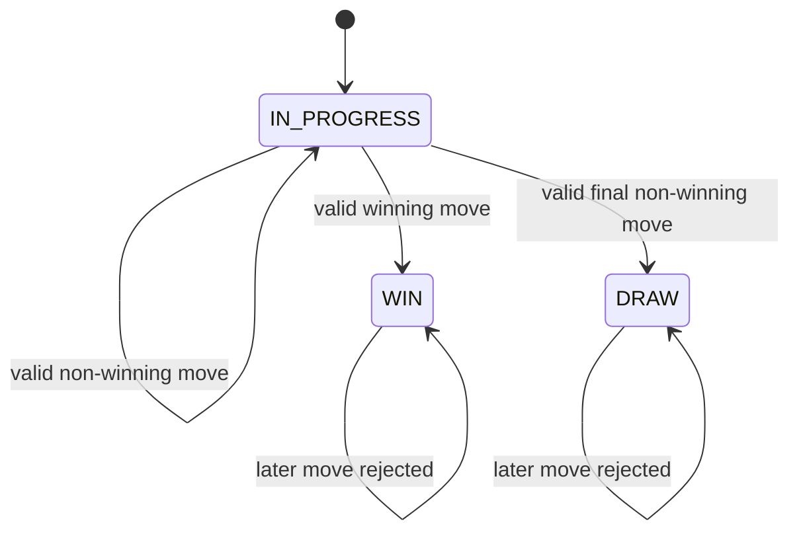

# Tic-Tac-Toe Design Notes

Use the playground note to identify entities and draw the initial class diagram before coding.

## Rules to preserve

- The current player can place exactly one symbol in one empty, in-bounds cell.
- A valid move changes the board and then passes the turn, unless it ends the game.
- A winner or draw is terminal; later moves cannot change the board.
- Win detection checks the row, column, and diagonals affected by the valid move.

## Walk one move before naming more classes

`Game.makeMove(player, row, column)` is the orchestration boundary. It first proves the game is still in
progress and that the caller is the current player. It then delegates bounds and empty-cell validation to the
board, places the symbol, checks only the affected winning lines, and either finishes the game or switches turn.

```mermaid
sequenceDiagram
    participant Caller
    participant Game
    participant Board

    Caller->>Game: makeMove(player, row, column)
    Game->>Game: game active and player's turn?
    Game->>Board: valid empty cell?
    alt invalid move
        Game-->>Caller: reject; state unchanged
    else valid move
        Game->>Board: place symbol
        Game->>Board: check affected row, column, diagonals
        alt winning move
            Game->>Game: state = WIN; winner = player
        else board full
            Game->>Game: state = DRAW
        else game continues
            Game->>Game: switch current player
        end
    end
```

The crucial ordering is **validate → place → evaluate → switch turn if unfinished**. Switching first or
mutating before validation causes invalid moves to corrupt the game state.

## Responsibility boundary

| Responsibility | Owner | Why |
| --- | --- | --- |
| Turn, terminal state, and winner | `Game` | They describe the game, not one cell. |
| Grid storage, bounds, and occupied-cell checks | `Board` | It owns the board representation. |
| Name and assigned symbol | `Player` | A player is identity plus `X` or `O`. |
| Win/draw evaluation after placement | `Game` using `Board` | The game decides the lifecycle; the board supplies cell data. |

## Why direct checks are correct here

For a fixed 3×3 board, direct row, column, and diagonal checks are clearer than a generic strategy hierarchy.
The move can only create a win through the row, column, or diagonals that contain its new cell. Checking those
lines keeps the logic easy to trace in an interview.

```text
main diagonal:      row == column
anti-diagonal:      row + column == boardSize - 1
```

The anti-diagonal condition selects only the cells lying from top-right to bottom-left. It works because a
3×3 board is square; a future rectangular board needs separate row/column dimensions and different win rules.

## State transition boundary



An invalid move does not appear as a transition because it must leave the board, current player, and status
unchanged.

## Decisions to make

- Which type owns board mutation and bounds/occupied-cell validation?
- Where should current turn and terminal status live?
- Should the runner pass a `Player`, symbol, or player ID to a move?
- How will the board expose a printable state without leaking mutable storage?

## Follow-up boundary

N×N support changes both storage size and the winning condition; discuss configurable board size and win length
only after the 3×3 rules are correct. Online play adds a shared-state concurrency boundary around `makeMove`.
Undo/redo requires move history and a way to recompute or restore board/game state. None belongs in the base
exercise.

## Quick recall

- Where is the turn check? In `Game`, before board mutation.
- Where are coordinate and occupied-cell checks? In `Board`.
- Why does an invalid move not switch turn? Validation and state transition remain in one flow.
