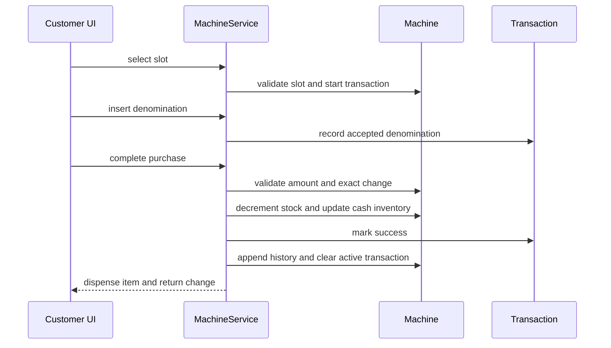
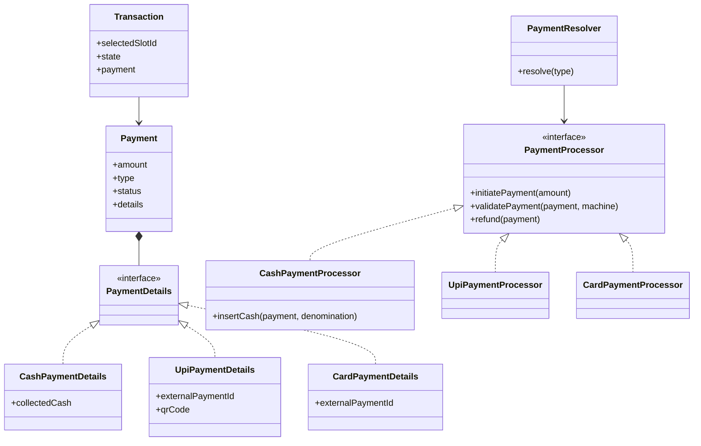

# Vending Machine Design Notes

The base interview answer is deliberately small: one in-memory machine, one selected item, and cash only. It is
tempting to start with carts, UPI, card terminals, a payment resolver, and a State-pattern hierarchy. That makes the
class diagram look sophisticated before it proves the one thing the interviewer asked for: a correct purchase.

## Scope and invariants

`Machine` owns durable state: slots and the cash available to make change. `Transaction` owns one customer's
temporary attempt: the selected slot, inserted denominations, and its terminal outcome. Money is an integer minor
unit such as paise or cents; `double` makes exact change unreliable.

The base design must preserve these rules:

- Stock never becomes negative.
- A successful purchase decrements stock exactly once and updates the cash inventory in the same mutation.
- A cancelled or failed purchase does not reduce stock and returns the inserted denominations when applicable.
- Only one transaction is active on this in-memory machine; every terminal outcome records history and clears it.
- A transaction starts in `IN_PROGRESS` and transitions exactly once to `SUCCESS`, `FAILED`, or `CANCELLED`;
  terminal transactions cannot accept cash or complete again.

The prompt's failure contract matters. On insufficient payment or unavailable exact change, refund and clear the
transaction. A real product might let the customer insert more cash, but that is a different agreed requirement.

## Start from one purchase

The core question for this diagram is: **which object changes which state, and only after every check succeeds?**

`insertCash` records each accepted note or coin on `Transaction`; it does not permanently add it to the machine cash
inventory. The physical acceptor or UI may detect a denomination, but the domain records what it accepted. That lets
the domain reject unsupported money immediately and later refund the exact denominations rather than trusting a
client-supplied total.

## Base model and responsibility boundaries

| Object | Owns | Must not own yet |
| --- | --- | --- |
| `Machine` | slot map, cash inventory, active transaction, transaction history | UI/hardware details or provider callbacks |
| `Slot` | one product description, positive price, and quantity | payment progress |
| `Transaction` | selected slot, collected cash, and `IN_PROGRESS`/terminal state | durable machine cash |
| `CashDenomination` | supported integer denomination values | floating-point conversion rules |
| `MachineService` | coordinates one use case across the model | cash/change policy hidden in the UI |

An explicit transaction is the useful boundary. Putting selected slot and inserted cash directly on `Machine` makes
refund, history, and a later payment mode harder to reason about.

## Cash-only flow and its failure paths

### Select and insert

`selectItem(slotId)` rejects an unknown or empty slot, creates a transaction, and stores the slot id. `insertCash`
requires that transaction, validates the denomination, and increments its collected-denomination map. Commands throw
meaningful domain exceptions on invalid requests; use `boolean` for real questions such as `isAvailable()` or
`canMakeChange(amount)`, and return useful output from `cancel()` and `completePurchase()`.

### Complete purchase

**Problem:** stock and cash can drift apart if cash is committed during payment handling and stock is reduced later.

**Naive failure:** a change calculation succeeds, cash is recorded, then a stock mutation fails. The customer has
paid but the machine cannot truthfully say whether it vended.

**Mechanism:** while holding the machine lock, calculate the inserted total, exact-change breakdown, next stock
quantity, and next cash-inventory map without changing live state. After every calculation succeeds, publish those
prepared values in a no-fail commit section, mark the transaction successful, append history, and clear the active
transaction. The lock prevents interleaving; prepared replacement state prevents a calculation exception from leaving
cash and stock partially changed.

**Trade-off:** a cash inventory may need an exact-change algorithm. A greedy selection is acceptable only when the
supported denominations are guaranteed to make it correct; otherwise use a bounded search or dynamic-programming
policy as a later variation.

**Recovery:** insufficient cash or no exact change leaves stock untouched, marks the attempt failed, records it,
clears the active transaction, and returns the inserted denominations. `cancel()` follows the same cleanup path but
marks it cancelled.

## Add a payment abstraction only when payment varies

Cash, UPI, and card share a business goal—prove that a transaction may vend or must be refunded—but their event
lifecycles differ. Cash receives denomination events, whereas digital providers initiate a request and later send a
callback. That is the point to add `Payment`, composed `PaymentDetails`, and a processor strategy.

The reader question here is: **what varies with payment type without changing stock ownership or the common vending
completion step?**

`Payment` holds common identity, amount, type, status, and details. Composition avoids a large DTO full of irrelevant
cash maps, QR codes, and terminal identifiers. `PaymentResolver` maps `PaymentType` to the matching processor.

Do not force every operation through one artificial `processPayment()` method. The shared operations are initiate,
validate/finalize, and refund. `CashPaymentProcessor.insertCash(...)` and a digital processor's callback handler stay
specific to their event source. The downcast from `PaymentDetails` belongs inside `CashPaymentProcessor`, not in
`MachineService`.

### Digital callbacks and recovery

**Problem:** a provider callback can arrive after the customer has left, and a successful payment does not prove the
item dispensed.

**Naive failure:** treating `PENDING_CONFIRMATION` as `PAID`, or treating a vending failure as a payment failure,
can dispense without confirmation or lose a customer refund.

**Mechanism:** the callback updates `Payment.status`; later `validatePayment` verifies a terminal `SUCCESS` before
the same vending-finalization boundary runs. Digital completion changes stock but not the machine's physical cash
inventory. Typical statuses are `INITIATED`, `PENDING_CONFIRMATION`,
`SUCCESS`, `FAILED`, and `REFUNDED`. `PaymentResult` contains common completion output; cash contributes its change
map while digital payments normally return none.

**Trade-off:** this introduces persistence and idempotent provider-event handling, so it is not part of the first
cash-only implementation.

**Recovery:** if vending fails after a successful digital payment, fail the transaction and call the provider refund
flow; set payment status to `REFUNDED` only after confirmation. Do not start another payment while the existing one
is pending.

## Concurrency and persistence are deployment follow-ups

For one in-memory JVM, one lock per `Machine` protects a purchase, restock, or cash-collection operation. Do not lock
the singleton service: Machine A must not block Machine B. Keep the lock around the full shared-state decision and
mutation, and release it in `finally`; a `ReentrantLock` is appropriate when you need that explicit boundary.

For multiple service instances, a Java lock is no longer shared. Persist stock by machine and slot, then use a short
database transaction with a row lock or an optimistic version check before reducing the final item. For a multi-item
cart, change `selectedSlotId` to `Map<slotId, count>`, validate every slot, update all inventory atomically, and lock
several rows in a stable slot-id order. A shared catalogue and price can be global, while physical quantity remains
per `machine_slots` record.

| Follow-up | What genuinely changes | What stays true |
| --- | --- | --- |
| Card, UPI, wallet | Payment details, processor, callback lifecycle | Stock changes only after validated payment. |
| Restock or cash collection | One-machine synchronization boundary | Do not race with purchase cash/stock mutations. |
| Shared storage | Repository/schema and DB concurrency | Physical stock is machine and slot scoped. |
| Multiple selected items | Transaction selection becomes a cart | Validate and mutate every item atomically. |

## Interview delivery

Start by asking whether this is cash only, one item, one machine, and one active transaction. State the four base
invariants, walk the successful purchase, then explain cancellation/no-change recovery. Name `Transaction` as the
temporary-state boundary before drawing classes. Only when the interviewer asks for a variation, introduce the
smallest new responsibility: payment processor for a new payment lifecycle, a per-machine lock for concurrent local
operations, or database coordination for shared inventory.

This avoids two common mistakes: presenting a cart and payment framework before the base flow works, and claiming a
transaction/payment status means a physical machine state. Model transaction and payment state first; add a separate
machine-state object only if legal machine operations truly vary by state and the conditional logic becomes the
problem.

## First implementation boundary

For the agreed cash-only round, implement only `Machine`, `Slot`, `Transaction`, `CashDenomination`, the selection,
cash insertion, completion, cancellation, exact-change, and atomic-update paths. Add `PaymentProcessor`, digital
payment details, persistence, carts, or concurrent access only when the interviewer introduces that follow-up.

## Further reading

- [Java `ReentrantLock` contract](https://docs.oracle.com/en/java/javase/26/docs/api/java.base/java/util/concurrent/locks/ReentrantLock.html)
- [PostgreSQL explicit row locking](https://www.postgresql.org/docs/current/explicit-locking.html)
- [Vending Machine LLD reference comparison](https://www.systemdesign.academy/lld/vending-machine)
- [Independent Vending Machine LLD walkthrough](https://www.techinterview.org/post/3233463566/low-level-design-vending-machine/)

## Quick recall

- **Why does `Transaction` own inserted cash?** It is refundable temporary state; `Machine` cash is durable only
  after a successful purchase.
- **What must be atomic?** The successful stock decrement and cash-inventory change, after payment/change validation.
- **When is `PaymentProcessor` justified?** When payment lifecycles genuinely vary, such as cash events versus an
  asynchronous provider callback.
- **Why are payment and transaction states separate?** A confirmed payment can still require a refund when vending
  fails.
- **What protects the final item in multiple instances?** A database transaction with row coordination or an
  optimistic version check, not `synchronized`.
