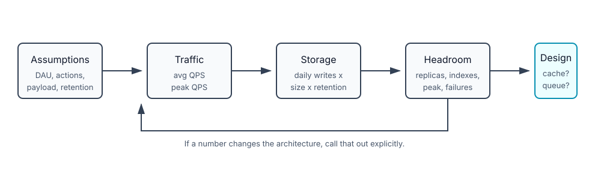

# Back-of-the-Envelope Capacity Estimation

## How it works

Back-of-envelope estimation is not about getting the exact number. It is about proving that your design is in the right order of magnitude.

In a system design interview, the interviewer is usually checking:

- Can you state assumptions clearly?
- Can you convert users into QPS?
- Can you estimate storage from writes, size, retention, and replication?
- Can you tell whether one database/cache/server is obviously insufficient?
- Can you round numbers without losing the point?

The final answer matters less than the path. A candidate who says "roughly 50 PB because X, Y, Z" is stronger than one who silently calculates a precise but unjustified number.

## Units to remember

Use powers of two for memory/storage intuition, but round aggressively in interviews:

| Power | Unit | Exact-ish | Interview shorthand |
|-------|------|-----------|---------------------|
| `2^10` | 1 KB | 1024 bytes | 1000 bytes |
| `2^20` | 1 MB | 1024 KB | about 1 million bytes |
| `2^30` | 1 GB | 1024 MB | about 1 billion bytes |
| `2^40` | 1 TB | 1024 GB | about 1 trillion bytes |
| `2^50` | 1 PB | 1024 TB | about 1 quadrillion bytes |

The important habit is labeling units. `5` is useless; `5 MB/request` is meaningful.

## Latency intuition

You do not need to memorize every nanosecond number. You need the shape:

```text
CPU cache < RAM < SSD < same-DC network < cross-region network
```

Useful conclusions:

- Memory is much faster than disk, which is why Redis and DB buffer pools help.
- Random disk seeks are expensive; avoid them when possible.
- Cross-region calls are too slow for the hot path of most user requests.
- Compression can be worth it before sending large payloads over the internet, but measure CPU cost for hot paths.

Useful order-of-magnitude anchors:

| Operation | Rough latency |
|-----------|---------------|
| L1/L2 cache reference | `~1-10 ns` |
| Main memory reference | `~100 ns` |
| Compress 1 KB with a simple codec | `~2-10 us` |
| Read 1 MB sequentially from memory | `~3-250 us` |
| Round trip inside one data center | `~500 us` |
| Disk seek / random disk access | `~2-10 ms` |
| Read 1 MB sequentially from disk | `~1-30 ms` |
| Cross-continent packet round trip | `~150 ms` |

Do not argue these as current benchmark truth. Use them as interview intuition: memory is nanoseconds, local network is micro/milliseconds, disk seeks are milliseconds, and cross-region calls dominate user-facing latency.

## Availability intuition

Availability percentages are easier to reason about after converting them to downtime:

| Availability | Approx downtime/day | Approx downtime/year | What it usually implies |
|--------------|---------------------|----------------------|--------------------------|
| 99% | 14.4 minutes | 3.65 days | Basic setup; outages are expected |
| 99.9% | 1.44 minutes | 8.77 hours | Redundancy and manual/automatic recovery |
| 99.99% | 8.64 seconds | 52.6 minutes | Multi-AZ, tested failover, strong ops discipline |
| 99.999% | 864 milliseconds | 5.26 minutes | Very expensive; failures must be nearly invisible |
| 99.9999% | 86.4 milliseconds | 31.56 seconds | Specialized systems; every dependency and deploy path must be engineered for it |

Use this to challenge requirements. If someone asks for "five nines" on a side project or internal dashboard, the cost probably does not match the value. If they ask for payments or identity verification availability, the investment may be justified.

## Common estimates

### QPS

Formula:

```text
average QPS = daily events / 86,400
peak QPS ≈ 2x to 10x average QPS, depending on traffic shape
```

Example:

```text
150M daily active users
2 writes/user/day

daily writes = 150M × 2 = 300M/day
average write QPS = 300M / 86,400 ≈ 3.5K QPS
peak write QPS ≈ 7K QPS if using 2x peak factor
```

### Storage

Formula:

```text
storage = writes/day × bytes/write × retention × replication factor
```

Example:

```text
30M media uploads/day
1 MB/upload

raw = 30 TB/day
5 years = 30 TB × 365 × 5 ≈ 55 PB
with 3 replicas ≈ 165 PB
```

Then add overhead for indexes, metadata, logs, thumbnails, backups, and compression. Do not pretend the raw number is the final infrastructure bill.

### Cache size

Formula:

```text
cache size = hot objects × object size × overhead factor
```

Example:

```text
10M hot user profiles
2 KB/profile
raw = 20 GB
with overhead ≈ 30-50 GB
```

The interview point: cache only the hot set, not necessarily the entire dataset.

### Server count

Formula:

```text
servers = peak QPS / safe QPS per server
```

If one API server safely handles 1000 QPS and peak traffic is 7000 QPS, you need at least 7 servers. Add headroom for deploys and failure:

```text
7 required + N+1 or 30-50% buffer → maybe 10-12 servers
```

## Estimation workflow



1. Clarify active users and traffic shape.
2. Split reads and writes.
3. Estimate average QPS.
4. Estimate peak QPS.
5. Estimate payload/object size.
6. Estimate daily storage.
7. Apply retention and replication.
8. Add rough overhead and headroom.
9. Use the result to justify architecture choices.

The last step matters most. If the estimate says `7K write QPS`, explain whether one primary DB can handle it, whether batching helps, whether queues are needed, and where caching actually helps.

Map the number to a design decision:

| Estimate says | Design implication |
|---------------|--------------------|
| Reads dominate writes | cache, read replicas, denormalized read models |
| Writes dominate reads | partitioning, batching, async queue, append-only storage |
| Storage grows to PB scale | object storage, lifecycle policies, partitioning, compression |
| Peak QPS is much higher than average | autoscaling, queue buffering, rate limiting, overprovisioning |
| Cross-region latency matters | regional routing, data replication, avoid global sync calls |

## Gotchas / Trick questions

1. **"Average QPS is enough."** No. Traffic has peaks. Use a peak factor or ask for peak-to-average ratio.
2. **"Storage = raw data only."** No. Include replication, indexes, metadata, backups, logs, thumbnails, and retention.
3. **"Reads and writes scale the same way."** No. Read replicas and caches help reads; writes still need primary capacity, partitioning, batching, or queues.
4. **"Every estimate needs exact math."** No. Round numbers so the interview discussion stays on design.
5. **"Cache the full dataset."** Usually no. Cache the hot set and size memory from access patterns.

## Quick recall

**Q. Average QPS formula?**  
A. `daily events / 86,400`.

**Q. Storage estimate formula?**  
A. `writes/day × bytes/write × retention × replication factor`, then add overhead.

**Q. Why label units?**  
A. `5` is ambiguous; `5 MB/request` makes the calculation checkable.

**Q. Why is peak QPS more important than average QPS?**  
A. Systems fail during spikes, not during mathematically smooth average traffic.

**Q. What does an interviewer care about more than the final number?**  
A. Assumptions, units, rounding, and whether the number changes the architecture.

**Q. When estimating cache, what should you size?**  
A. The hot working set, not the entire database.

**Q. How do estimates affect design?**  
A. They tell you whether to add cache, replicas, sharding, queues, object storage, autoscaling, or regional routing.
