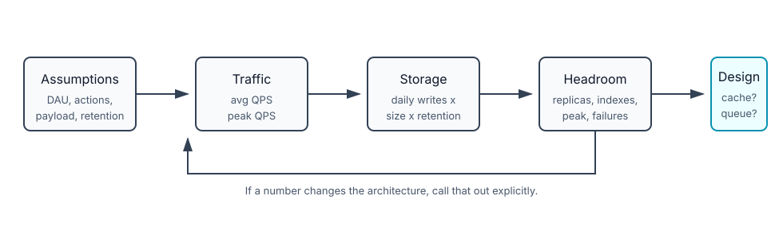

# Back-of-the-Envelope Capacity Estimation

## How it works

Back-of-envelope estimation is not about getting the exact number. It is about proving that your design is in the right order of magnitude.

In a system design interview, the interviewer is usually checking:

- Can you state assumptions clearly?
- Can you convert users into QPS?
- Can you estimate storage from writes, size, retention, and replication?
- Can you tell whether one database/cache/server is obviously insufficient?
- Can you round numbers without losing the point?

The final answer matters less than the path. A candidate who says "roughly 50 PB because X, Y, Z" is stronger than one who silently calculates a precise but unjustified number.

## Units to remember

Use powers of two for memory/storage intuition, but round aggressively in interviews:

| Power | Unit | Exact-ish | Interview shorthand |
|-------|------|-----------|---------------------|
| `2^10` | 1 KB | 1024 bytes | 1000 bytes |
| `2^20` | 1 MB | 1024 KB | about 1 million bytes |
| `2^30` | 1 GB | 1024 MB | about 1 billion bytes |
| `2^40` | 1 TB | 1024 GB | about 1 trillion bytes |
| `2^50` | 1 PB | 1024 TB | about 1 quadrillion bytes |

The important habit is labeling units. `5` is useless; `5 MB/request` is meaningful.

## Latency intuition

You do not need to memorize every nanosecond number. You need the shape:

```text
CPU cache < RAM < SSD < same-DC network < cross-region network
```

Useful conclusions:

- Memory is much faster than disk, which is why Redis and DB buffer pools help.
- Random disk seeks are expensive; avoid them when possible.
- Cross-region calls are too slow for the hot path of most user requests.
- Compression can be worth it before sending large payloads over the internet, but measure CPU cost for hot paths.

Useful order-of-magnitude anchors:

| Operation | Rough latency |
|-----------|---------------|
| L1/L2 cache reference | `~1-10 ns` |
| Main memory reference | `~100 ns` |
| Compress 1 KB with a simple codec | `~2-10 us` |
| Read 1 MB sequentially from memory | `~3-250 us` |
| Round trip inside one data center | `~500 us` |
| Disk seek / random disk access | `~2-10 ms` |
| Read 1 MB sequentially from disk | `~1-30 ms` |
| Cross-continent packet round trip | `~150 ms` |

Do not argue these as current benchmark truth. Use them as interview intuition: memory is nanoseconds, local network is micro/milliseconds, disk seeks are milliseconds, and cross-region calls dominate user-facing latency.

## Availability intuition

Availability percentages are easier to reason about after converting them to downtime:

| Availability | Approx downtime/day | Approx downtime/year | What it usually implies |
|--------------|---------------------|----------------------|--------------------------|
| 99% | 14.4 minutes | 3.65 days | Basic setup; outages are expected |
| 99.9% | 1.44 minutes | 8.77 hours | Redundancy and manual/automatic recovery |
| 99.99% | 8.64 seconds | 52.6 minutes | Multi-AZ, tested failover, strong ops discipline |
| 99.999% | 864 milliseconds | 5.26 minutes | Very expensive; failures must be nearly invisible |
| 99.9999% | 86.4 milliseconds | 31.56 seconds | Specialized systems; every dependency and deploy path must be engineered for it |

Use this to challenge requirements. If someone asks for "five nines" on a side project or internal dashboard, the cost probably does not match the value. If they ask for payments or identity verification availability, the investment may be justified.

## Common estimates

### QPS

Formula:

```text
average QPS = daily events / 86,400
peak QPS ≈ 2x to 10x average QPS, depending on traffic shape
```

Example:

```text
150M daily active users
2 writes/user/day

daily writes = 150M × 2 = 300M/day
average write QPS = 300M / 86,400 ≈ 3.5K QPS
peak write QPS ≈ 7K QPS if using 2x peak factor
```

### Bandwidth (Network I/O)

Formula:

```text
bandwidth = QPS × payload size
```

Keep units clear: convert Bytes per second (B/s) to bits per second (bps) by multiplying by 8 (e.g., 100 MB/s = 800 Mbps). Calculate ingress (incoming writes/uploads) and egress (outgoing reads/downloads) separately because network interfaces and cloud pricing differ by direction.

### Little's Law (Concurrent Work Sizing)

Formula:

```text
L = λ × W
```

- `L` = average number of concurrent requests / in-flight work in the system
- `λ` (lambda) = arrival rate (throughput / QPS)
- `W` = average service time / latency per request

Example:
If an API receives `5,000 QPS` (`λ`) and average backend processing time is `200 ms` (`0.2 s`, `W`), the system must handle `5,000 × 0.2 = 1,000` concurrent in-flight requests (`L`). Use Little's Law to size worker thread pools, async connection queues, and container concurrency limits.

### Storage & Replication Tradeoffs

Formula:

```text
storage = writes/day × bytes/write × retention × replication multiplier
```

Example:

```text
30M media uploads/day
1 MB/upload

raw = 30 TB/day
5 years = 30 TB × 365 × 5 ≈ 55 PB
with 3-way replication (3x) ≈ 165 PB
```

Replication strategies:
- **3-way replication**: `3.0x` storage overhead (200% extra). Simple quorum reads, low CPU compute cost, fast recovery, ideal for hot transactional databases and active block stores.
- **Erasure coding (e.g., Reed-Solomon 8+4 or 10+4)**: `1.33x – 1.5x` storage overhead (33–50% extra). Drastically cuts PB-scale raw disk costs, but incurs CPU encoding overhead and higher network reconstruction traffic during disk degradation. Standard for cold/warm object storage tiers (e.g., AWS S3).

Then add overhead for indexes, metadata, logs, thumbnails, backups, and compression. Do not pretend the raw number is the final infrastructure bill.

### Cache Size & the 80/20 Assumption

Formula:

```text
cache size = hot objects × object size × overhead factor
```

The **80/20 Pareto rule** (e.g., 20% of objects account for 80% of daily reads) is a standard **interview assumption / simplifying heuristic**, not a universal physical law. In practice, long-tail workloads (e.g., e-commerce catalogs or news feeds) may exhibit 95/5 or 60/40 distributions. Always state 80/20 explicitly as an assumption when sizing the hot working set.

Example:

```text
10M hot user profiles (assuming 20% of 50M total profiles generate 80% of traffic)
2 KB/profile
raw = 20 GB
with 30-50% memory overhead ≈ 30-50 GB RAM for cache
```

The interview point: cache only the hot set, not necessarily the entire dataset.

### Server count

Formula:

```text
servers = peak QPS / safe QPS per server
```

If one API server safely handles 1000 QPS and peak traffic is 7000 QPS, you need at least 7 servers. Add headroom for deploys and failure:

```text
7 required + N+1 or 30-50% buffer → maybe 10-12 servers
```

## References & Authoritative Citations

- **AWS Well-Architected Framework (Reliability & Performance Efficiency Pillars)**: Capacity management, horizontal scaling headroom, and storage tiering.
- **Google SRE Workbook (Chapter 8: Capacity Planning & Chapter 9: Non-Abstract Large System Design)**: Demand forecasting, Little's Law queuing limits, and N+2 redundancy.
- **Little's Law (John D.C. Little, 1961 - Operations Research)**: Mathematical equivalence of concurrency, arrival rate, and latency ($L = \lambda W$).
- **System Design Primer (Donne Martin)**: Powers of two memory hierarchy, back-of-the-envelope latency constants, and bandwidth calculations.

## Estimation workflow



1. Clarify active users and traffic shape.
2. Split reads and writes.
3. Estimate average QPS.
4. Estimate peak QPS.
5. Estimate payload/object size.
6. Estimate network bandwidth (ingress & egress).
7. Estimate daily storage.
8. Apply retention and replication / erasure coding.
9. Size concurrency using Little's Law ($L = \lambda W$).
10. Add rough overhead and headroom.
11. Use the result to justify architecture choices.

The last step matters most. If the estimate says `7K write QPS`, explain whether one primary DB can handle it, whether batching helps, whether queues are needed, and where caching actually helps.

Map the number to a design decision:

| Estimate says | Design implication |
|---------------|--------------------|
| Reads dominate writes | cache, read replicas, denormalized read models |
| Writes dominate reads | partitioning, batching, async queue, append-only storage |
| Storage grows to PB scale | object storage, erasure coding, lifecycle policies, compression |
| Network egress dominates ingress | CDN offload, edge caching, response compression |
| High concurrency ($L = \lambda W$) | non-blocking I/O, async thread pools, connection pooling |
| Peak QPS is much higher than average | autoscaling, queue buffering, rate limiting, overprovisioning |
| Cross-region latency matters | regional routing, data replication, avoid global sync calls |

## Gotchas / Trick questions

1. **"Average QPS is enough."** No. Traffic has peaks. Use a peak factor or ask for peak-to-average ratio.
2. **"Storage = raw data only."** No. Include replication/erasure coding, indexes, metadata, backups, logs, thumbnails, and retention.
3. **"Reads and writes scale the same way."** No. Read replicas and caches help reads; writes still need primary capacity, partitioning, batching, or queues.
4. **"Every estimate needs exact math."** No. Round numbers so the interview discussion stays on design.
5. **"Cache the full dataset."** Usually no. Cache the hot set and size memory from access patterns.
6. **"80/20 is an absolute universal law."** No. It is an interview heuristic; real distributions vary widely.
7. **"Bandwidth and QPS are interchangeable."** No. High QPS with small payloads strains CPU/connections; low QPS with large video payloads saturates NIC bandwidth.

## Quick recall

**Q. Average QPS formula?**
A. `daily events / 86,400`.

**Q. Storage estimate formula?**
A. `writes/day × bytes/write × retention × replication factor`, then add overhead.

**Q. Why label units?**
A. `5` is ambiguous; `5 MB/request` makes the calculation checkable.

**Q. Why is peak QPS more important than average QPS?**
A. Systems fail during spikes, not during mathematically smooth average traffic.

**Q. What does an interviewer care about more than the final number?**
A. Assumptions, units, rounding, and whether the number changes the architecture.

**Q. When estimating cache, what should you size?**
A. The hot working set, not the entire database.

**Q. How do estimates affect design?**
A. They tell you whether to add cache, replicas, sharding, queues, object storage, autoscaling, or regional routing.

**Q. How do you estimate network bandwidth?**
A. `bandwidth = QPS × payload size` (calculated separately for ingress and egress).

**Q. What is Little's Law and how is it used in capacity planning?**
A. `L = λ × W` (concurrency = arrival rate × latency); it sizes thread pools, connection limits, and in-flight request capacity.

**Q. What is the tradeoff between 3-way replication and erasure coding?**
A. 3-way replication has 200% overhead (3x storage) with minimal CPU overhead; erasure coding offers low storage overhead (1.33x–1.5x) at the cost of higher CPU encoding and network reconstruction overhead.
