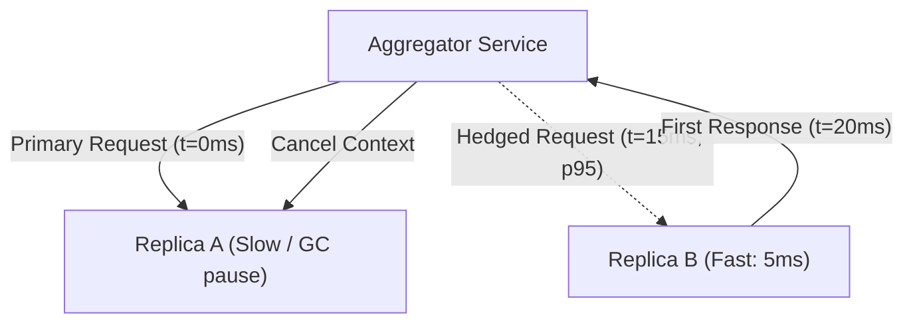
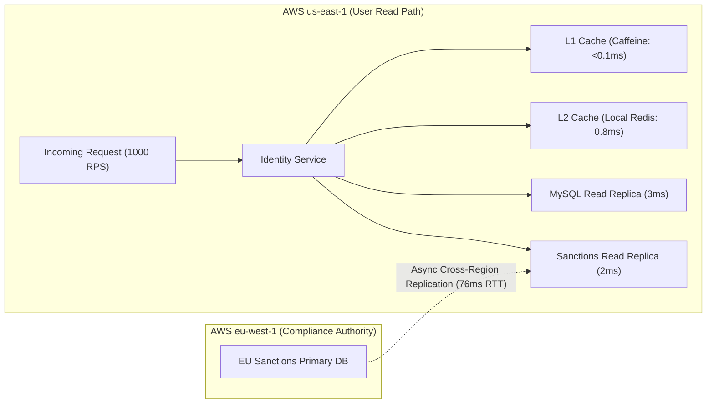

# Solution

## Solution: thread-pool-sizing-littles-law - Thread Pool and Connection Pool Sizing

### 1. Baseline Concurrency (Normal Conditions)

Little's Law states that for any stable system:

$$L = \lambda \times W$$

Where:
- $\lambda$ = Average arrival rate (throughput)
- $W$ = Average residence / response time
- $L$ = Average number of active in-flight requests in the system

**Cluster-Wide Concurrency:**
- $\lambda_{\text{cluster}} = 2,500\text{ req/s}$
- $W_{\text{p50}} = 20\text{ ms} = 0.020\text{ s}$
- $L_{\text{cluster}} = 2,500\text{ req/s} \times 0.020\text{ s} = 50\text{ in-flight requests}$

**Per-Instance Concurrency (10 instances, equal load balancing):**
- $\lambda_{\text{instance}} = \frac{2,500\text{ req/s}}{10} = 250\text{ req/s}$
- $L_{\text{instance}} = 250\text{ req/s} \times 0.020\text{ s} = 5\text{ in-flight requests}$

Under normal conditions, each instance handles an average of only 5 concurrent requests at any instant.

---

### 2. Degraded Concurrency Calculation

If average response time across all requests degrades to $W = 120\text{ ms} = 0.120\text{ s}$ while arrival rate remains steady at $\lambda_{\text{instance}} = 250\text{ req/s}$:

- $L_{\text{instance}} = 250\text{ req/s} \times 0.120\text{ s} = 30\text{ in-flight requests}$
- $L_{\text{cluster}} = 2,500\text{ req/s} \times 0.120\text{ s} = 300\text{ in-flight requests}$

> **Average vs. p99 sizing nuance:**
> Little's Law applies strictly to the **mean** ($\bar{W}$ and $\bar{\lambda}$). If only the 99th percentile reaches $120\text{ ms}$ while the median stays at $20\text{ ms}$, the true average concurrency $L$ will be between 5 and 30. Little's Law alone **does not** give a single exact pool size because it models mean steady-state behavior rather than tail variance, bursts, or hardware saturation boundaries.

---

### 3. Pool Exhaustion & Queue Fill Analysis

#### Failure Propagation Sequence
1. **HikariCP Pool Saturation**: Each instance has `maximumPoolSize = 50`. The calculated average degraded concurrency is 30, so the pool is not exhausted by that mean alone. It can still saturate when the DB hold time, burst rate, or tail latency rises enough that more than 50 requests concurrently need a connection.
2. **Tomcat Thread Starvation**: Incoming requests allocate a Tomcat worker thread (up to `maxThreads = 200`). When a thread executes `dataSource.getConnection()`, it can block waiting for a pooled connection up to `connectionTimeout` (30,000 ms by default unless configured).
3. **Thread Pool Depletion**: Because threads are blocked waiting for DB connections rather than quickly returning to the pool, all 200 Tomcat threads get tied up within fractions of a second.
4. **Queue Overflow & Rejection**: Once 200 threads are busy, incoming requests fall back into the OS/Tomcat accept queue (capacity 100).

#### Queue Saturation Time
When all worker threads are blocked and unable to complete requests (effective service rate $\mu \approx 0$ for new arrivals), the queue fills purely by the arrival rate:

$$t_{\text{fill}} = \frac{\text{Queue Capacity}}{\lambda_{\text{instance}}} = \frac{100\text{ requests}}{250\text{ req/s}} = 0.40\text{ s} = 400\text{ ms}$$

Within **400 ms** of thread exhaustion, the queue overflows, resulting in immediate `503 Service Unavailable`, `Connection Refused` (`ECONNREFUSED`), and cascading upstream retries.

---

### 4. Remediation & Sizing Strategy

#### Why 2,000 Tomcat Threads Creates Thrashing
Increasing `maxThreads` from 200 to 2,000 on an 8-vCPU node worsens outages:
- **Hardware Parallelism Limit**: 8 vCPUs can physically execute at most 8 CPU instructions concurrently.
- **Context-Switch Churn**: 2,000 runnable threads force the OS kernel scheduler into constant register saving, cache line invalidation, and lock contention, spending CPU time on OS overhead rather than application logic.
- **Memory Overhead**: Each JVM thread allocates a stack (`-Xss`, typically 1 MB). 2,000 threads consume ~2 GB of non-heap RAM, inducing GC pressure and risking container `OOMKilled`.
- **Downstream Overload**: More request threads increase the number waiting for the same bounded pool; they do not create more connections than HikariCP permits. Raising both limits indiscriminately can then overload the database and exhaust its connection budget.

#### Production Configuration Recommendations
- **Database Connection Pool (HikariCP)**:
  Follow the PostgreSQL / HikariCP sizing formula:
  $$\text{Pool Size} = (\text{CPU Cores} \times 2) + \text{Effective Spindle Count}$$
  Treat this as a starting hypothesis, not a law: keep the cluster-wide total within the database connection budget, load-test it, and tune from observed DB CPU, wait events, and query latency.
- **Fail-Fast `connectionTimeout`**:
  Lower HikariCP `connectionTimeout` from 30,000 ms to **500–1,000 ms**. If no connection is free within 1 second, fail fast, emit a metric, and return a clean fallback or 429/503 before Tomcat threads are locked.
- **Tomcat Thread Pool**: Set `maxThreads` to **100–200** (or migrate I/O-heavy endpoints to Java 21 Virtual Threads).
- **Resilience**: Implement circuit breakers (e.g. Resilience4j) with bounded concurrency bulkheads to isolate database-heavy endpoints from in-memory/cache endpoints.

---

## Solution: fanout-tail-latency-percentiles - Tail Latency Amplification in Distributed Fan-Out

### 1. Probability of Tail Degradation Formula

Let $p$ be the probability that a single downstream service exceeds its SLA threshold (here $p = 0.01$ for the 99th percentile, where $99\%$ succeed within $50\text{ ms}$).

Assuming $N$ downstream calls are independent and identically distributed (i.i.d.):
1. Probability that a single service call completes in $< 50\text{ ms}$:
   $$P(\text{single fast}) = 1 - p = 0.99$$
2. Probability that **all** $N$ service calls complete in $< 50\text{ ms}$:
   $$P(\text{all fast}) = (1 - p)^N = 0.99^N$$
3. Probability that **at least one** service call takes $\ge 50\text{ ms}$ (tail event):
   $$P(\text{at least one } \ge 50\text{ ms}) = 1 - (1 - p)^N = 1 - 0.99^N$$

#### Computed Probabilities

| Fan-Out Degree ($N$) | Formula | Probability of Slow Request ($\ge 50\text{ ms}$) | Effective SLA |
| :--- | :--- | :--- | :--- |
| **$N = 1$** | $1 - (0.99)^1$ | $1.00\%$ | $99.00\%$ |
| **$N = 10$** | $1 - (0.99)^{10} = 1 - 0.90438$ | **$9.56\%$** | $90.44\%$ |
| **$N = 20$** | $1 - (0.99)^{20} = 1 - 0.81791$ | **$18.21\%$** | $81.79\%$ |
| **$N = 100$** | $1 - (0.99)^{100} = 1 - 0.36603$ | **$63.40\%$** | $36.60\%$ |

---

### 2. Overall Service p99 Latency Amplification

Even though every individual downstream microservice meets its $50\text{ ms}$ p99 SLA:
- At $N = 20$, the aggregator has an **$18.21\%$ chance** of encountering at least one request in the downstream tail ($\ge 50\text{ ms}$).
- Therefore, the aggregator's **81.8th percentile** is already at $50\text{ ms}$.
- The aggregator's true **99th percentile (p99)** is governed by the 99.9th percentile ($800\text{ ms}$) of the downstream services:
  $$P(\text{at least one } \ge 800\text{ ms}) = 1 - (1 - 0.001)^{20} = 1 - (0.999)^{20} \approx 1 - 0.98018 = 1.98\%$$
  Because nearly $2\%$ of overall page requests hit a downstream $800\text{ ms}$ pause, the aggregator's p99 latency degrades to approximately **$800\text{ ms}$**, an amplification of $16\times$ over the single-service p99.

---

### 3. Production Tail Mitigation Techniques



#### Technique Trade-offs

1. **Hedged Requests (Speculative Retries)**:
   - *Mechanism*: Send a duplicate request to a secondary replica if the primary replica has not answered within the 95th percentile ($15\text{ ms}$).
   - *Trade-off*: Adds load only for calls that cross the hedge threshold and can worsen an already overloaded dependency. Use it only for idempotent work, cap it, and disable it when overload signals rise.
2. **Tied Requests with Cancellation**:
   - *Mechanism*: Issue requests concurrently to multiple replicas with a shared request ID; when one server begins execution or returns data, it cancels the peer via gRPC context cancellation.
   - *Trade-off*: Reduces tail variance immediately but consumes extra ingress bandwidth and scheduling capacity if cancellation signals experience network lag.
3. **Graceful Degradation & SLA Deadlines**:
   - *Mechanism*: Enforce a strict SLA timeout budget per downstream call (e.g. $25\text{ ms}$ for Recommendations, $30\text{ ms}$ for Reviews). If the deadline passes, return cached fallback data or omit the non-critical widget.
   - *Trade-off*: Guarantees user-facing response times stay under $35\text{ ms}$ at the cost of transient UI completeness. Core payment and inventory paths remain strict.

---

## Solution: queueing-saturation-utilization - Utilization Knee and Backpressure Dynamics

### 1. Utilization & Queue Metrics ($M/M/1$ System)

Given service rate $\mu = 250\text{ events/s}$ ($T_s = \frac{1}{\mu} = 4\text{ ms} = 0.004\text{ s}$):

- Utilization: $\rho = \frac{\lambda}{\mu}$
- Average Queue Length: $L_q = \frac{\rho^2}{1 - \rho}$
- Average Queue Wait Time: $W_q = \frac{\rho}{\mu(1 - \rho)}$
- Total Latency / Residency Time: $W = W_q + T_s = \frac{1}{\mu(1 - \rho)}$

#### Metric Calculations

| Metric | Case A ($\lambda = 150\text{ events/s}$) | Case B ($\lambda = 200\text{ events/s}$) | Case C ($\lambda = 240\text{ events/s}$) |
| :--- | :--- | :--- | :--- |
| **Utilization ($\rho$)** | $\frac{150}{250} = \mathbf{0.60}\text{ (60\%)}$ | $\frac{200}{250} = \mathbf{0.80}\text{ (80\%)}$ | $\frac{240}{250} = \mathbf{0.96}\text{ (96\%)}$ |
| **Queue Length ($L_q$)** | $\frac{0.60^2}{1 - 0.60} = \frac{0.36}{0.40} = \mathbf{0.90}\text{ items}$ | $\frac{0.80^2}{1 - 0.80} = \frac{0.64}{0.20} = \mathbf{3.20}\text{ items}$ | $\frac{0.96^2}{1 - 0.96} = \frac{0.9216}{0.04} = \mathbf{23.04}\text{ items}$ |
| **Queue Wait ($W_q$)** | $\frac{0.60}{250 \times 0.40} = \frac{0.60}{100} = \mathbf{6.0\text{ ms}}$ | $\frac{0.80}{250 \times 0.20} = \frac{0.80}{50} = \mathbf{16.0\text{ ms}}$ | $\frac{0.96}{250 \times 0.04} = \frac{0.96}{10} = \mathbf{96.0\text{ ms}}$ |
| **Total Latency ($W$)** | $6.0 + 4.0 = \mathbf{10.0\text{ ms}}$ | $16.0 + 4.0 = \mathbf{20.0\text{ ms}}$ | $96.0 + 4.0 = \mathbf{100.0\text{ ms}}$ |

---

### 2. The "Hockey Stick" Knee Analysis

```
Total Latency W (ms)
 100 |                                                 * Case C (96%, 100ms)
  80 |
  60 |
  40 |
  20 |                                 * Case B (80%, 20ms)
  10 |                 * Case A (60%, 10ms)
   4 | * (0%, 4ms)
     +---------------------------------------------------
       0%             60%             80%            96%  100%
                                Utilization (rho)
```

- **From Case A to Case B**: Throughput increases by $+33.3\%$ ($150 \to 200$), and latency doubles ($10\text{ ms} \to 20\text{ ms}$, $\Delta = +10\text{ ms}$).
- **From Case B to Case C**: Throughput increases by only $+20\%$ ($200 \to 240$), but latency surges **$5\times$** ($20\text{ ms} \to 100\text{ ms}$, $\Delta = +80\text{ ms}$).

**Why Latency Explodes Non-Linearly:**
Queueing delay is governed by the hyperbola $\frac{1}{1 - \rho}$. When $\rho = 0.60$, the server is idle $40\%$ of the time ($1 - \rho = 0.40$), readily absorbing Poisson arrival bursts. At $\rho = 0.96$, the probability of finding the server idle drops to only $4\%$. Any stochastic burst creates an immediate backlog that takes prolonged time to drain, causing the classic "hockey stick" saturation knee above $70\% - 80\%$ utilization.

---

### 3. Overload Failure (Case D) & Backpressure Architecture

#### Mathematical & Operational Failure in Case D ($\lambda = 255\text{ events/s} > \mu = 250\text{ events/s}$)
- $\rho = \frac{255}{250} = 1.02 > 1.0$. The system is mathematically non-stationary and unstable.
- Net queue accumulation rate is $\lambda - \mu = 5\text{ events/second}$.
- Without bounds, queue length $L_q(t) \to \infty$ and latency $W(t) \to \infty$.
- In JVM/Kubernetes environments, unbounded queues cause Heap exhaustion, Long STW GC pauses, and Linux OOM killer termination (`OOMKilled`).

#### Production Backpressure & Load-Shedding Architecture
1. **Target Operating Range**: Engineer autoscaling and capacity to maintain steady-state utilization $\rho \le 0.70$ ($\le 175\text{ events/s}$ per consumer pod).
2. **Pull-Based Consumers**: Use Kafka consumer pull loops with bounded batch sizes (`max.poll.records = 50`). Consumers control ingestion rate, eliminating in-memory buffer bloat.
3. **Autoscaling (KEDA / HPA)**: Scale Kubernetes worker pods automatically based on Kafka consumer lag and processing rate rather than CPU utilization alone.
4. **Token-Bucket Rate Limiting & Load Shedding**: Place an ingress gateway rate limiter to drop or shed non-critical traffic with HTTP `429 Too Many Requests` or push surplus webhooks to a Dead Letter Queue (DLQ) when downstream banking APIs degrade.

---

## Solution: latency-hierarchy-caching-tradeoff - Hardware Latency Ladder and Cross-Region Optimization

### 1. Latency & Concurrency Impact

#### Baseline vs. Cross-Region Latency

- **Baseline Total Latency ($W_{\text{base}}$)**:
  $$W_{\text{base}} = 0.1\text{ ms (CPU)} + 3.0\text{ ms (MySQL)} + 0.9\text{ ms (Redis)} = 4.0\text{ ms} = 0.004\text{ s}$$

- **With Synchronous Cross-Region Step 4**:
  - Step 4 Latency = $76\text{ ms (Network RTT)} + 4.0\text{ ms (EU DB)} = 80.0\text{ ms}$
  $$W_{\text{new}} = W_{\text{base}} + 80.0\text{ ms} = 4.0\text{ ms} + 80.0\text{ ms} = 84.0\text{ ms} = 0.084\text{ s}$$

#### In-Flight Concurrency (Little's Law at $\lambda = 1,000\text{ RPS}$)

- **Baseline Concurrency ($L_{\text{base}}$)**:
  $$L_{\text{base}} = 1,000\text{ req/s} \times 0.004\text{ s} = 4\text{ active in-flight requests}$$

- **New Concurrency ($L_{\text{new}}$)**:
  $$L_{\text{new}} = 1,000\text{ req/s} \times 0.084\text{ s} = 84\text{ active in-flight requests}$$

**Impact Summary:**
- Latency increases by $\frac{84\text{ ms}}{4\text{ ms}} = \mathbf{21\times}$.
- In-flight request concurrency increases by $\frac{84}{4} = \mathbf{21\times}$.

#### Why Concurrency Multiplies System Resource Footprint
In a synchronous I/O model:
- Each in-flight request holds an allocated worker thread, socket connection, and heap context while waiting for network packets to cross the Atlantic.
- Memory footprint increases $21\times$ for in-flight request state.
- Socket buffers, connection tracking tables, and connection pool threads are occupied for $84\text{ ms}$ instead of $4\text{ ms}$, multiplying vulnerability to connection pool exhaustion during traffic surges.

---

### 2. Architectural Redesign (p99 $< 10\text{ ms}$)



#### Production Redesign Components

1. **Multi-Tier Caching (L1 Local Caffeine + L2 Local Redis)**:
   - Sanctions lists change infrequently (hours/days).
   - Place an in-memory Caffeine L1 cache inside each JVM instance (latency $< 0.1\text{ ms}$) with a 15-minute TTL.
   - Place an in-region Redis L2 cluster in `us-east-1` (latency $< 1.0\text{ ms}$).
   - With a expected cache hit ratio $> 99.5\%$, $995$ out of $1,000$ requests avoid the network entirely, keeping p99 well under $5\text{ ms}$.
2. **Asynchronous Cross-Region Database Replication**:
   - Deploy an AWS Aurora Global Database or DynamoDB Global Table with primary writes in `eu-west-1` and a read replica in `us-east-1`.
   - The $76\text{ ms}$ network RTT is incurred **asynchronously during write replication**, completely removing cross-region network latency from the user synchronous read path.
   - Local read latency against the in-region replica takes $2.0 - 3.0\text{ ms}$.
3. **Data Sovereignty Compliance**:
   - Data residency is a product and legal constraint, not a cache setting. Replicate only data that the governing policy permits outside the EU; otherwise keep the authoritative decision in-region or redesign the product flow with compliance stakeholders.
4. **Asynchronous Post-Verification Pipeline (If applicable)**:
   - If full EU compliance requires storing an audit record in Frankfurt, publish an event to an async Kafka/SQS topic. The identity check returns to the user in $< 5\text{ ms}$, while a background worker asynchronously writes the audit record to `eu-west-1`.

---

## Quick recall

**Q. What is the fundamental formula for Little's Law, and what does each variable represent?**
A. $L = \lambda W$, where $L$ is average in-flight requests (concurrency), $\lambda$ is average throughput (arrival rate), and $W$ is average response time (latency).

**Q. Can you calculate the exact thread pool size directly from Little's Law alone?**
A. No. Little's Law gives average steady-state concurrency, not tail variance, traffic spikes, burst buffers, or CPU core context-switching limits.

**Q. Why does a 20-service fan-out with 99% individual SLAs yield only an ~82% aggregate SLA?**
A. $P(\text{all fast}) = 0.99^{20} \approx 0.8179$. The probability that at least one service hits the slow tail is $1 - 0.8179 = 18.21\%$.

**Q. What is a "hedged request" and what trade-off does it make?**
A. Sending a duplicate request to a backup server after the p95 latency threshold; it trades a small amount of extra backend compute (+5%) to eliminate the severe tail delay.

**Q. Why does queue latency spike dramatically when system utilization $\rho$ exceeds 80%?**
A. Latency follows the non-linear asymptote $W \propto \frac{1}{1 - \rho}$. High utilization leaves no idle server capacity to absorb stochastic arrival bursts.

**Q. How does adding a 76 ms cross-region call affect in-flight concurrency at 1,000 RPS?**
A. Concurrency jumps from 4 to 84 in-flight requests ($L = 1,000 \times 0.084\text{ s}$), requiring $21\times$ more active sockets, threads, and memory.
