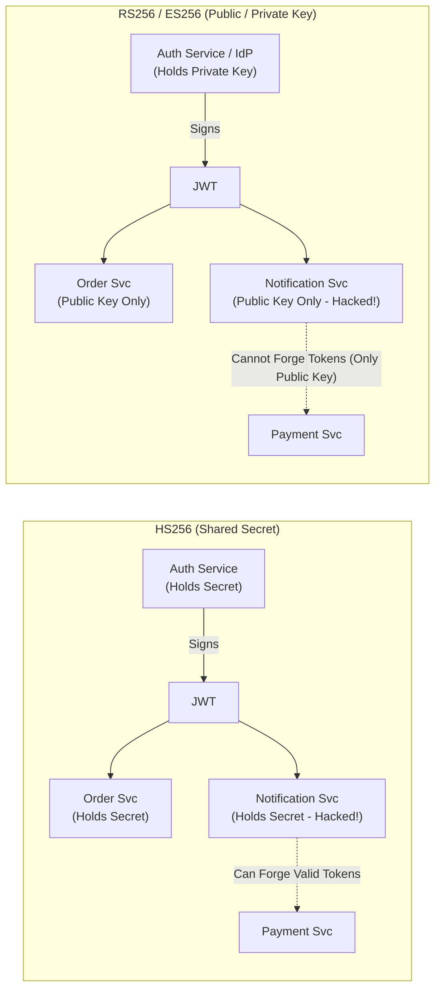
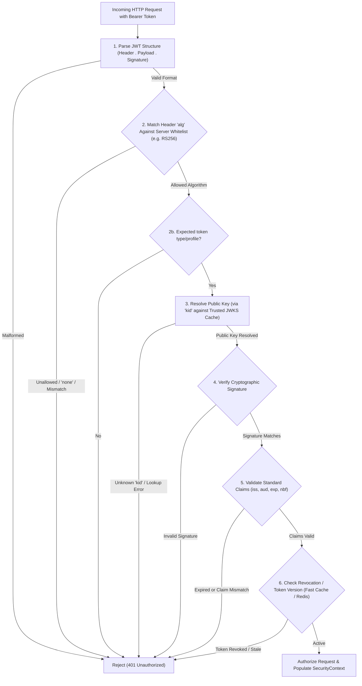

# JWT: Mechanics, Architectures, and Vulnerabilities

JSON Web Tokens (JWT) are the standard mechanism for stateless identity propagation and authorization in distributed systems. When designed correctly, they decouple authentication services from downstream APIs; when misconfigured, they introduce severe systemic vulnerabilities.

This guide covers JWT foundations, cryptographic distinctions ([RFC 7515](https://datatracker.ietf.org/doc/html/rfc7515), [RFC 7519](https://datatracker.ietf.org/doc/html/rfc7519), [RFC 7516](https://datatracker.ietf.org/doc/html/rfc7516)), architectural tradeoffs, validation pipelines, classic attack vectors, and production hardening grounded in the [RFC 8725 JWT Best Current Practices](https://datatracker.ietf.org/doc/html/rfc8725).

---

## 1. OAuth Trust vs. SDK Trust

Before examining token internals, interview candidates must separate two foundational security questions that are frequently conflated:

* **Question 1: "Is this the same client instance that initiated the OAuth flow?"**
  * **Solved by:** **PKCE (Proof Key for Code Exchange)**. It binds the authorization code exchange to the dynamic secret generated by the specific client instance that started the authorization request, preventing authorization code interception.
* **Question 2: "Is this request genuinely originating from my unmodified, trustworthy mobile/client app?"**
  * **Solved by:** **Device Attestation** (e.g., Google Play Integrity, Apple App Attest) and **HMAC Request Signing** via backend-secured keys.

> **Key Takeaway:** OAuth 2.0 / OIDC manages delegated authorization and user identity; it does **not** prove client binary integrity or protect against forged requests sent via tools like Postman using intercepted credentials.

---

## 2. JWT Terminology & Mechanics: JWS vs. JWE

A standard JWT ([RFC 7519](https://datatracker.ietf.org/doc/html/rfc7519)) consists of three Base64URL-encoded parts separated by periods:
$$\text{Token} = \text{Base64URL}(\text{Header}) \,.\, \text{Base64URL}(\text{Payload}) \,.\, \text{Base64URL}(\text{Signature})$$

### The Common Misconception
Many developers incorrectly assume that a JWT payload is encrypted and private.
* **The Reality:** The payload is **not** encrypted—it is merely Base64URL encoded. Any intermediary or client can decode and view the entire JSON claims set.
* **The Security Guarantee:** The signature is calculated over `Base64URL(Header) + "." + Base64URL(Payload)`. While anyone can *read* the data, no one can *modify* it without invalidating the cryptographic signature.

### The "Envelope" Analogy
* **JWS (JSON Web Signature - [RFC 7515](https://datatracker.ietf.org/doc/html/rfc7515)):** Like a **transparent envelope** stamped with an authentic wax seal. Anyone inspecting the envelope can read the enclosed letter (e.g., `Salary = ₹30L`), but nobody can alter the content (e.g., change it to `₹50L`) without breaking the seal. JWS guarantees **Integrity** and **Authenticity**, but **not Confidentiality**.
* **JWE (JSON Web Encryption - [RFC 7516](https://datatracker.ietf.org/doc/html/rfc7516)):** Like a **locked metal lockbox**. The payload itself is cipher text. Only holders of the decryption key can open the box and read the payload. JWE guarantees **Confidentiality**, **Integrity**, and **Authenticity**.

```
+-------------------------------------------------------------------------------+
| JWS (Signature / Transparent Envelope):                                       |
| [ Header (JSON) ] . [ Payload (Readable JSON) ] . [ Cryptographic Signature ] |
| -> Guarantees: Integrity + Authenticity (Confidentiality: NO)                |
+-------------------------------------------------------------------------------+
| JWE (Encryption / Locked Box):                                                |
| [ Protected Header ] . [ Encrypted Key ] . [ IV ] . [ Ciphertext ] . [ Tag ]  |
| -> Guarantees: Confidentiality + Integrity + Authenticity                     |
+-------------------------------------------------------------------------------+
```

### Why Do Most Backend Systems Use JWS Over JWE?
* **Interview Question:** *"If HTTPS already encrypts transport traffic, do we still need JWE?"*
* **Answer:** In the vast majority of architectures, **no**. Standard architectures rely on HTTPS (TLS) for transport-layer confidentiality and JWS for application-layer integrity. Production systems avoid packing sensitive data (e.g., PII, passwords, medical records, financial balances) directly into tokens. Instead, tokens carry lightweight authorization claims (`sub`, `roles`, `tenant_id`, `exp`), and services fetch detailed records from secured databases as needed.
* **Cost of JWE:** JWE adds payload size bloat, CPU encryption/decryption overhead, and substantial asymmetric/symmetric key-management complexity across downstream microservices.
* **When is JWE actually used?** In zero-trust or multi-hop topologies where tokens traverse untrusted intermediate proxies or microservices (e.g., an Edge Gateway routes a token through Order Service and Payment Service, but the token contains a payload meant solely for the downstream Payroll Service).

---

## 3. Signing Architectures: Symmetric (HS256) vs. Asymmetric (RS256 / ES256)

Choosing between symmetric (HMAC) and asymmetric (RSA/ECDSA) algorithms dictates the security perimeter and failure blast radius of your entire service mesh.



### The Architectural Problem with HS256
In HS256 (HMAC-SHA256), the **exact same secret key** is used both to sign and to verify tokens.
* **Blast Radius Scenario:** Consider an API Gateway and 20 downstream microservices (User, Payment, Order, Notification, Inventory, etc.). For all 20 services to independently verify JWTs, every service must be provisioned with the shared `JWT_SECRET`.
* **The Vulnerability:** If a low-security service (e.g., Notification Service) is compromised via remote code execution or credential leakage, the attacker extracts `JWT_SECRET`. Because HS256 is symmetric, the attacker can now mint arbitrary valid tokens (e.g., `{"sub": "attacker", "role": "ADMIN"}`) and send them to the Payment Service. The Payment Service verifies the HMAC math and accepts the forged token as legitimate.

### The RS256 / ES256 Solution
Asymmetric algorithms split trust into two distinct keys:
* **Private Key:** Held **only** by the Authorization Server / Identity Provider (e.g., Keycloak, Auth0, internal Auth service). It is used strictly to **sign** tokens.
* **Public Key:** Distributed freely to all verifying microservices or published over a standard JWKS (JSON Web Key Set) endpoint. It is used strictly to **verify** signatures.

If the Notification Service is breached, the attacker only acquires a public verification key. They cannot create signatures, completely eliminating token forgery across the rest of the ecosystem.

---

## 4. JWT Verification Pipeline: Normal Path vs. Attacker Path

RFC 8725 mandates a defensive verification pipeline. A secure backend treats the entire incoming token—including the header—as **untrusted input**.

### Normal Verification Flow



### Step-by-Step Validation Checklist
1. **Format Validation:** Ensure the string conforms strictly to three dot-separated Base64URL components.
2. **Algorithm Whitelisting:** Compare `header.alg` against a hardcoded, immutable server-side whitelist.
3. **Token Type/Profile:** When the application defines distinct token kinds, require the expected `typ`/profile before accepting one token where another is expected.
4. **Key Resolution via `kid`:** Extract Key ID (`kid`) from the header to look up the public key in a cached, trusted JWKS. Never allow the token to specify key locations dynamically.
5. **Cryptographic Verification:** Verify the signature using the resolved key and allowed algorithm.
6. **Claims Validation:**
   * `exp` (Expiration Time): Must be strictly greater than current server time (allowing a tight clock-skew grace period, e.g., $\le 60\text{s}$).
   * `nbf` (Not Before) / `iat` (Issued At): Reject if timestamps are in the unreasonable future.
   * `iss` (Issuer): Must match the exact expected Identity Provider URL.
   * `aud` (Audience): Must contain this specific service's identifier to prevent cross-service token replay.
7. **Revocation Check:** Query a high-speed store (e.g., Redis blocklist or user `token_version`) if instant invalidation is required.

---

## 5. Classic JWT Vulnerabilities and Exploits

The root cause of historic JWT exploits is consistent: **The backend server blindly trusted parameters in the attacker-controlled JWT Header instead of strictly enforcing its own security policy.**

### Vulnerability 1: The `alg=none` Attack
* **Mechanism:** An attacker takes a valid token, alters claims (e.g., `"role": "ADMIN"`), deletes the signature portion, and sets the header to `{"alg": "none"}` or variations (`"None"`, `"NONE"`, `"nOnE"`).
* **The Exploit:** Flawed JWT libraries evaluated the header, recognized `none` as a valid RFC algorithm, and skipped cryptographic verification altogether, returning a valid parsed claims set.
* **The Fix:** Explicitly whitelist permitted algorithms (e.g., `setAllowedAlgorithms(List.of(Algorithm.RS256))`). Reject `none` unconditionally in production.

### Vulnerability 2: Algorithm Confusion (Key Confusion) Attack
* **Scenario:** The backend expects RS256 tokens and stores an RSA Public Key for verification. RSA Public Keys are publicly accessible (often exposed at `/.well-known/jwks.json`).
* **The Attack:**
  1. The attacker crafts a forged token with `"role": "ADMIN"`.
  2. The attacker modifies the header to `{"alg": "HS256"}`.
  3. The attacker signs the token using HMAC-SHA256, but passes the server's **RSA Public Key** (in PEM or text format) as the HMAC secret key.
* **The Exploit:** A buggy backend checks the header, sees `HS256`, switches to HMAC verification mode, and passes its configured key (which happens to be the RSA Public Key text) into the HMAC verifier. Because the attacker signed the token with that exact same public key string, the HMAC signature computes identically. The server marks the forged token as valid.
* **The Fix:**
  * Enforce strict algorithm whitelisting: if the service expects RS256, reject any token with `alg=HS256` before key resolution.
  * Strong key typing: Ensure verification keys are typed (e.g., `RSAPublicKey` cannot be cast to an `HMAC` `SecretKey`).

### Vulnerability 3: Key ID (`kid`) Header Manipulation & JWKS Injection
* **Mechanism:** The `kid` header parameter is an arbitrary identifier used to choose between multiple signing keys.
* **Attacks:**
  * **Directory Traversal:** Attacker supplies `"kid": "../../../dev/null"`. A filesystem lookup based on unvalidated input is already a serious key-disclosure/path-access bug. If that path is then used by an HMAC verifier (often after a separate algorithm-confusion mistake), an empty or attacker-chosen file can become an attacker-known symmetric key.
  * **SQL Injection:** If `kid` is concatenated into a database query to look up client public keys (`SELECT key FROM keys WHERE kid = '...'`), SQL injection can allow the attacker to control the returned key.
  * **JWKS Spoofing (`jku` / `x5u` injection):** Attacker sets `jku` (JWK Set URL) in the header to point to their own rogue server (`https://attacker.com/jwks.json`). If the verifying library fetches keys from the header-supplied URL without domain whitelisting, it verifies the token against the attacker's own public key.
* **The Fix:** Treat `kid` as untrusted text (sanitize/escape). Never read keys from arbitrary disk paths or raw user URLs. Maintain a static, server-configured JWKS endpoint URL with caching and rate limiting.

---

## 6. Architecture Trade-offs & Revocation Strategies

Pure stateless JWTs present an inherent tradeoff: **You cannot revoke a stateless JWT before its `exp` without introducing state.**

| Revocation Strategy | Mechanism | Latency Impact | Tradeoff |
| :--- | :--- | :--- | :--- |
| **Short-Lived Access + Refresh Tokens** (Recommended) | Access token valid for 5–15 min. Refresh token stored in DB/Redis with rotation. | Zero extra latency for API calls; DB hit only on refresh. | Revocation delayed by up to the access token TTL. |
| **Redis Denylist / Blocklist** | On logout/password reset, push token `jti` (JWT ID) to Redis with TTL = remaining token lifetime. | Sub-millisecond Redis `EXISTS` check on every incoming request. | Introduces a network hop and memory footprint proportional to active revocations. |
| **User Token Version / Epoch** | Store an integer `token_version` in the user's DB/Redis record. Embed `ver` in the JWT claims. | Fast cache read to verify `jwt.ver == user.ver`. | Invalidates *all* active tokens for that user at once upon password reset or security event. |

### Zero-Downtime Asymmetric Key Rotation
To rotate RSA/EC keys without dropping user sessions:
1. **Generate New Key Pair:** The IdP creates Key Pair $B$ with a distinct `kid="key-2026-b"`.
2. **Publish Public Key:** Add Public Key $B$ to the published `/.well-known/jwks.json` alongside active Public Key $A$ (`kid="key-2026-a"`).
3. **Switch Signing:** Configure the IdP to start signing new tokens using Private Key $B$. Downstream microservices fetch the updated JWKS and verify new tokens seamlessly using `kid="key-2026-b"`, while existing in-flight tokens verify against Public Key $A$.
4. **Decommission Old Key:** After the maximum access token TTL has elapsed, remove Public Key $A$ from the JWKS and securely purge Private Key $A$.

---

## 7. SDE2 Interview Delivery Framework

When asked in a system design or backend interview: *"How would you architect authentication using JWTs across our microservices?"* structure your answer in four clean stages:

1. **Cryptographic Model (Asymmetric over Symmetric):**
   * *"I recommend RS256/ES256 over HS256 to limit our failure blast radius. The Identity Provider holds the private key; microservices only hold the public key fetched from a cached JWKS endpoint. If any downstream service is compromised, attackers cannot forge tokens."*
2. **Strict RFC 8725 Verification Pipeline:**
   * *"Every API Gateway and service enforces an immutable algorithm whitelist, rejects `alg=none`, validates standard claims (`exp`, `nbf`, `iss`, and especially `aud` to prevent token reuse across domains), and sanitizes the `kid` header against injection."*
3. **Token Lifecycles & Revocation:**
   * *"We keep access tokens short-lived (5 to 15 minutes) to minimize exposure windows and pair them with single-use rotating refresh tokens stored in Redis/DB. For emergency revocations (e.g., account takeover), we check a distributed Redis denylist keyed by token `jti` or match an incremental `token_version`."*
4. **Resilience & Key Rotation:**
   * *"We implement dual-key JWKS rotation using unique `kid` values. Downstream services cache public keys in memory with a short TTL (e.g., 1 hour) and a background refresh to ensure zero-downtime rotation and immunity to JWKS endpoint outages."*

---

## 8. Authoritative References & Learning Resources

### Authoritative Standards & Specifications
* [RFC 7519 - JSON Web Token (JWT)](https://datatracker.ietf.org/doc/html/rfc7519) — Core token syntax and standard claim definitions.
* [RFC 7515 - JSON Web Signature (JWS)](https://datatracker.ietf.org/doc/html/rfc7515) — Signature formats, header parameters, and serialization.
* [RFC 7516 - JSON Web Encryption (JWE)](https://datatracker.ietf.org/doc/html/rfc7516) — Cryptographic encryption specifications for confidential claims.
* [RFC 8725 - JSON Web Token Best Current Practices](https://datatracker.ietf.org/doc/html/rfc8725) — Mandatory security guidelines covering algorithm whitelisting, validation, and attack mitigations.
* [OWASP JSON Web Token Cheat Sheet](https://cheatsheetseries.owasp.org/cheatsheets/JSON_Web_Token_for_Java_Cheat_Sheet.html) — Practical vulnerability defenses and implementation patterns.

### Independent Learning Links
* [PortSwigger Web Security Academy: JWT Attacks](https://portswigger.net/web-security/jwt) — Comprehensive breakdown and interactive labs for algorithm confusion, `alg=none`, and header injection.
* [Auth0 JWT Handbook & Debugger](https://jwt.io/introduction) — In-depth architectural guide for token lifecycles, claims modeling, and visual token decoding.

---

## Quick recall

**Q: Is the payload of a standard JWS token encrypted?**
A: No. It is Base64URL encoded. It guarantees integrity and authenticity via its signature, but provides zero confidentiality.

**Q: What is the primary architectural flaw of using HS256 across multiple microservices?**
A: Symmetric key sharing. Every verifying microservice must hold the signing secret; compromising one service allows an attacker to forge valid tokens across all other services.

**Q: How does RS256 mitigate the shared secret vulnerability?**
A: Asymmetric cryptography. The IdP keeps the Private Key to sign tokens, while microservices only hold the Public Key to verify them, preventing token forgery from a compromised verifier.

**Q: What is the root cause of the Algorithm Confusion (Key Confusion) attack?**
A: The server trusts the `alg` header from an incoming token, switching to HMAC mode and using its stored RSA Public Key as the HMAC secret key.

**Q: How do you prevent both `alg=none` and Algorithm Confusion attacks?**
A: Enforce an explicit, immutable server-side whitelist of allowed algorithms (e.g., only RS256) and reject unlisted algorithms before cryptographic processing.

**Q: Why are `iss` (Issuer) and `aud` (Audience) claims critical in microservices?**
A: `iss` verifies the token came from the trusted IdP; `aud` ensures the token was minted specifically for the receiving service, preventing token reuse across different APIs.

**Q: How do you perform zero-downtime key rotation with JWKS?**
A: Publish both old and new public keys with distinct `kid`s in the JWKS, sign new tokens with the new private key, and retire the old public key only after all old tokens expire.
