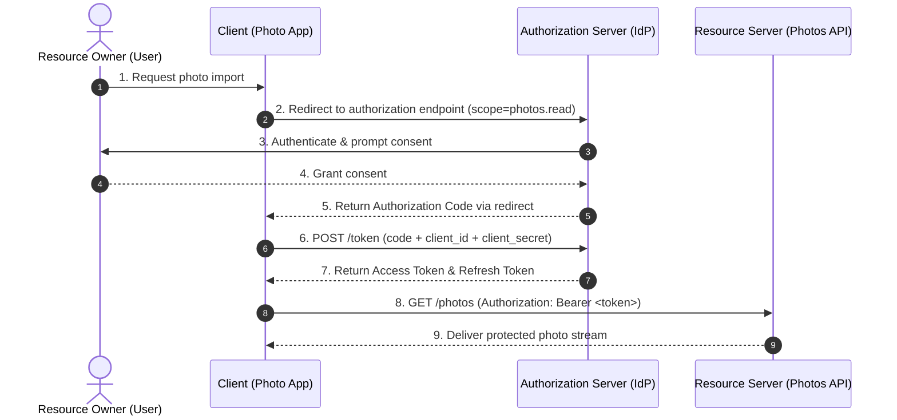
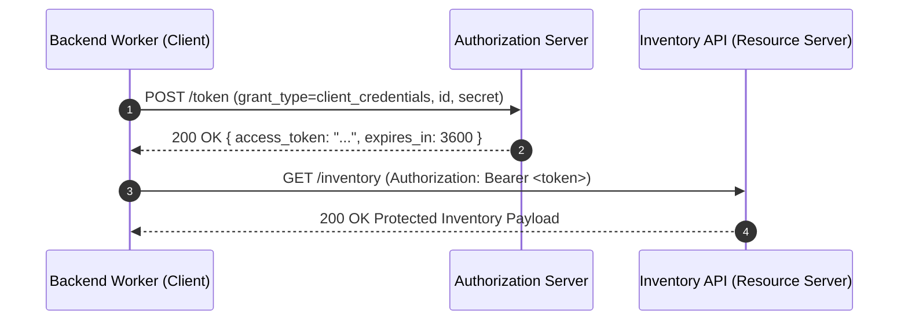

# OAuth 2.0, JWT, and API Keys

This guide provides foundational, interview-ready notes covering delegated authorization, identity assertion, and machine credential patterns for senior backend interviews.

---

## 1. Core Terminology & Fundamental Definitions

Before evaluating protocols and architectures, establish precise vocabulary:

- **Authentication (AuthN)**: "Who are you?" The process of verifying a claimed identity (e.g., verifying a user's password, biometric prompt, or federated identity via Google).
- **Authorization (AuthZ)**: "What are you permitted to do?" The process of determining whether an authenticated actor has access to a specific resource or action (e.g., swapping a profile picture, reading photos).
- **Delegated Authorization**: A mechanism allowing a resource owner to grant a third-party application scoped, limited access to their protected resources without sharing long-term credentials (passwords).
- **Bearer Token**: A security token where possession of the token is sufficient for access; any entity holding the string can exercise the permissions granted by it (RFC 6750).
- **JSON Web Token (JWT)**: A compact, URL-safe means of representing claims to be transferred between two parties, structured as `Header.Payload.Signature` (RFC 7519).
- **API Key**: A static or semi-static opaque token representing machine/application identity rather than a delegated user session.

---

## 2. The Problem: Credential Sharing Anti-Pattern

### Without Delegated Authorization
Consider a photo-printing application that needs to import files from a user's Google Drive.
- **The Anti-Pattern**: The printing app asks the user for their Google username and password. The app logs in directly as the user to fetch files.
- **Security Failures**:
  1. The third-party client holds the user's master password in plain text.
  2. The user cannot limit the app's scope (the app can read emails, delete Drive files, or change passwords).
  3. The user cannot revoke access to only the printing app without changing their master password.
  4. Credential theft at the printing app compromises the user's entire identity across the internet.

### With OAuth 2.0 (Delegated Authorization)
The user clicks "Import from Google". The browser directs the user to Google. Google requests consent for the exact scope `read_drive_photos`. Upon approval, Google issues a scoped, short-lived **Access Token** to the printing app. The app presents `Authorization: Bearer <token>` to the Google Photos API. The password is never exposed to the client.



---

## 3. Protocol Components & Actors (RFC 6749)

1. **Resource Owner**: The entity capable of granting access to a protected resource (typically the end user).
2. **Client**: The application making protected resource requests on behalf of the resource owner (e.g., Photo Printing App, Web SPA, Mobile App).
3. **Authorization Server**: The server issuing access tokens to the client after successfully authenticating the resource owner and obtaining authorization (e.g., Google Identity, Okta, Keycloak).
4. **Resource Server**: The server hosting protected data and accepting access tokens (e.g., Google Photos API, internal microservices).
5. **Access Token**: A credential representing authorization issued to the client. It can be an opaque string validated via token introspection or a self-contained JWT.
6. **Scope**: A string parameter defining the exact granular permissions requested (e.g., `read:photos`, `user:profile`).
7. **Refresh Token**: A long-lived credential issued alongside the access token, used strictly to obtain new access tokens when short-lived access tokens expire.

---

## 4. Key Protocol Distinctions & Misconceptions

### OAuth 2.0 vs OpenID Connect (OIDC)
- **Misconception**: *"OAuth 2.0 is an authentication protocol (login system)."*
- **Reality**: OAuth 2.0 is strictly an **authorization framework**. It provides an `Access Token` granting permissions to APIs, but standard OAuth does not specify user identity claims.
- **OpenID Connect (OIDC)** is an identity layer built directly on top of OAuth 2.0. It adds an `ID Token` (a signed JWT containing identity claims like `sub`, `email`, `name`) and a standardized `/userinfo` endpoint.
- "Login with Google" uses **OIDC for identity** (verifying who you are) and **OAuth for delegated API access** (granting photo access).

| Dimension | OAuth 2.0 (RFC 6749) | OpenID Connect (OIDC Core 1.0) |
|---|---|---|
| **Primary Goal** | Authorization / Access Delegation | Authentication + Identity Assertion |
| **Token Issued** | `Access Token` (opaque or JWT) + `Refresh Token` | `ID Token` (JWT) + `Access Token` + `Refresh Token` |
| **Key Question** | "What is this application allowed to access?" | "Who is the user, and who authenticated them?" |
| **Target Audience** | Resource Server (API) | Client Application (Frontend / Backend) |

### JWT vs OAuth 2.0
- **Misconception**: *"We chose JWT instead of OAuth for our system."*
- **Reality**: Comparing JWT to OAuth is a category error. OAuth is a multi-actor architectural protocol describing *how tokens are requested and issued*. JWT is simply a *data format* for representing signed tokens.
- **Mental Analogy**: OAuth 2.0 is the Department of Motor Vehicles (the governing authority and issuance process). A JWT is the physical laminated driver's license card carrying signed claims.

### OAuth 1.0 vs OAuth 2.0
- **OAuth 1.0**: Required cryptographic request signing for every request (calculating HMAC signatures over headers, URLs, and bodies). Signing protects request integrity, but does not provide transport confidentiality; sensitive deployments still need TLS. Its request-by-request signing model was notoriously complex to implement.
- **OAuth 2.0**: Offloads transport-layer encryption entirely to mandatory TLS/HTTPS. Introduces bearer tokens, separated server roles, and clean support for multiple grant types.

---

## 5. Primary OAuth 2.0 Grant Flows

### 1. Authorization Code Flow (RFC 6749 Section 4.1)
- **Use Case**: Web applications with a secure backend server capable of keeping a `client_secret` confidential.
- **Mechanism**: The user authenticates in the browser; the authorization server returns an intermediate `Authorization Code` via redirect. The client backend exchanges this code + `client_secret` server-to-server for access/refresh tokens.
- **Why**: Keeps the access token out of browser history and client-side JavaScript execution context.

### 2. Client Credentials Flow (RFC 6749 Section 4.4)
- **Use Case**: Machine-to-Machine (M2M) communication where no human user is present (e.g., cron daemon, internal backend worker syncing inventory).
- **Mechanism**: The client sends its own `client_id` and `client_secret` directly to the `/token` endpoint via `POST` and receives an access token scoped to the application itself.



### A deliberate scope cut: device authorization

The **Device Authorization Grant** is useful when a device cannot host a normal browser interaction, such as a TV. It is a separate flow: the device displays a code and the user completes consent on another device. Know that it exists; for a typical backend interview, explain Authorization Code with PKCE and Client Credentials first.

---

## 6. API Keys vs OAuth Tokens

```
API Key      -> [Identifies Application] -> Static / Long-Lived -> Machine Context
OAuth Token  -> [Identifies User Delegated Scope] -> Short-Lived -> User Context
```

- **API Keys**:
  - Represent *Application Identity* ("This request is made by Customer A's server").
  - Characteristics: Long-lived, static, high blast radius if leaked.
  - Ideal Scope: Secure internal networks, private VPCs, developer APIs with server-side secret vaults.
  - Limitation: Cannot represent end-user consent, dynamic scopes, or fine-grained actor delegation.
- **OAuth Tokens**:
  - Represent *Delegated Authorization* ("This request is made by Application X on behalf of User Y").
  - Characteristics: Short-lived access tokens (e.g., 15 minutes) paired with rotating refresh tokens, reducing exposure windows.

---

## 7. Failure Modes, Attack Vectors & Security Controls

| Vulnerability / Threat | Attack Vector | Security Control |
|---|---|---|
| **Bearer Token Eavesdropping** | Attacker intercepts network traffic to steal bearer token. | Enforce strict TLS (HTTPS only) across all authorization and resource server endpoints (RFC 6750). |
| **Over-Privileged Client (Scope Creep)** | Attacker compromises a client with broad `*` access. | Enforce Least Privilege via granular scopes (`photos:read` instead of `all:write`). |
| **Token Leakage via Referrer / Browser** | Access tokens placed in URL hash or query strings. | Deprecate OAuth 2.0 Implicit Flow. Use Authorization Code with PKCE and POST token exchanges. |
| **Credential Storage Compromise** | Static client secret committed to public repositories. | Use Client Credentials with secret managers (Vault/KMS) or transition to asymmetric mTLS / private key JWT client assertions (RFC 7523). |

---

## 8. Trade-Offs & Recovery Strategies

- **Opaque Tokens vs Self-Contained JWTs**:
  - *Opaque Tokens*: High security and immediate revocation capability (every API call inspects database/Redis cache), but introduces network latency and central database query load.
  - *JWTs*: Zero-lookup local signature verification at microservices (stateless scaling), but cannot be revoked instantly without maintaining distributed revocation lists or using very short lifetimes (5–15 mins).
- **Recovery Strategy**: Use short-lived JWT access tokens (10 minutes) combined with centralized, rotatable refresh tokens stored in Redis for fast session invalidation.

---

## 9. 60-Second Interview Delivery

> "OAuth 2.0 is an open standard for delegated authorization—it allows a user to grant a third-party application access to specific resources without handing over their password. It uses four actors: Resource Owner, Client, Authorization Server, and Resource Server.
>
> In contrast, OpenID Connect is an identity layer on top of OAuth 2.0 that adds user authentication via an `ID Token` JWT.
>
> In backend system design, we distinguish between API Keys, which identify machines and applications statically, and OAuth Tokens, which represent user-delegated, short-lived permissions. For microservices, we balance stateless JWT validation for performance with short token TTLs and refresh token rotation to ensure immediate revocability."

---

## 10. Quick Recall

**Q: Does OAuth 2.0 provide user authentication by default?**
A: No. OAuth 2.0 is strictly an authorization framework for resource delegation. Authentication is provided by OpenID Connect (OIDC), which layers an `ID Token` on top of OAuth.

**Q: What is a Bearer Token?**
A: A token that grants access to whoever holds it, without requiring proof of cryptographic key possession on each call. It relies on mandatory TLS to prevent transport interception.

**Q: When should you use the Client Credentials grant instead of Authorization Code?**
A: Use Client Credentials for machine-to-machine (M2M) communication without user involvement (e.g., cron jobs, internal daemon services). Use Authorization Code when an end user must authenticate and grant consent.

**Q: Why are API keys discouraged for end-user client authorization?**
A: API keys are static, long-lived, lack delegated user consent semantics, and cannot easily restrict permissions per user session without custom overhead.

---

## 11. Authoritative & Learning References

### Standard Specifications
- [RFC 6749: The OAuth 2.0 Authorization Framework](https://datatracker.ietf.org/doc/html/rfc6749)
- [RFC 6750: The OAuth 2.0 Authorization Framework: Bearer Token Usage](https://datatracker.ietf.org/doc/html/rfc6750)
- [OpenID Connect Core 1.0 Specification](https://openid.net/specs/openid-connect-core-1_0.html)

### Independent Learning & Interview Guides
- [Auth0 OAuth 2.0 & OIDC Architecture Overview](https://auth0.com/intro-to-iam/what-is-oauth-2)
- [DigitalOcean Guide to Understanding OAuth 2.0](https://www.digitalocean.com/community/tutorials/an-introduction-to-oauth-2)
