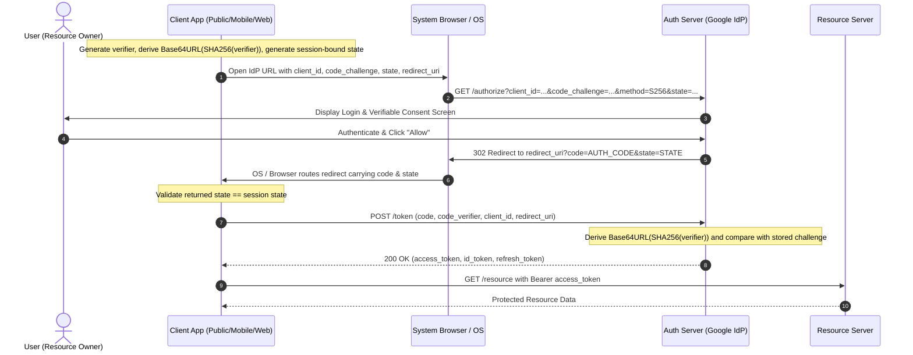
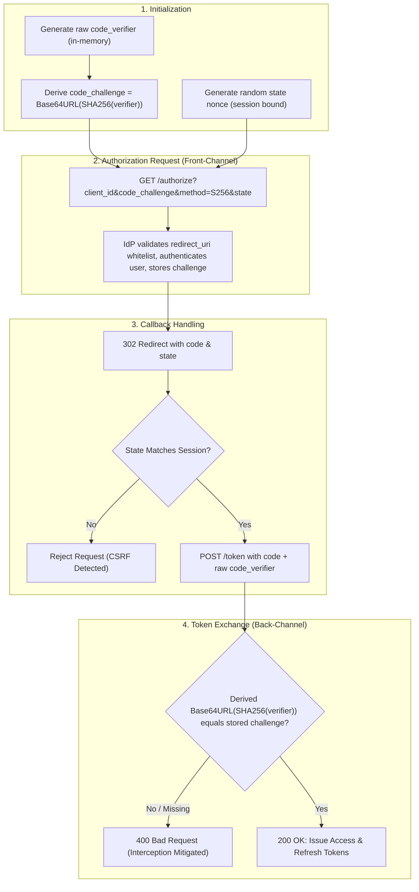

# OAuth 2.0 & PKCE Deep Dive

This guide covers the core security mechanics of OAuth 2.0 and Proof Key for Code Exchange (PKCE). It breaks down the protocol from core primitives to advanced threat models, clarifying common misconceptions, architectural boundaries, and first-time SDE2 interview patterns.

---

## 1. Core Terminology

Grounding terms per [RFC 6749](https://datatracker.ietf.org/doc/html/rfc6749) and [RFC 7636](https://datatracker.ietf.org/doc/html/rfc7636):

| Term | Definition & Role | Trust Boundary |
| :--- | :--- | :--- |
| **Resource Owner** | The end user who owns the protected data and grants access (e.g., human Spotify/Google user). | Untrusted user-agent runtime. |
| **Client** | Application requesting tokens on behalf of the Resource Owner. | **Confidential** (backend server holding secrets) vs **Public** (mobile app / SPA unable to protect static secrets). |
| **Authorization Server (IdP)** | Server authenticating the user and issuing authorization codes and tokens (e.g., Google OAuth Server). | Trusted identity domain. |
| **Resource Server** | API hosting protected user resources (e.g., Google Drive API, Spotify Playlists API). | Validates access tokens. |
| **Authorization Code** | Short-lived, single-use, high-entropy credential returned via browser redirect, exchanged at the token endpoint. | Publicly transported across front-channel redirect. |
| **Access Token / Refresh Token** | Bearer credentials granting access to Resource Server APIs or renewing expired access tokens. | Confidential backend credential; never exposed to untrusted front channels. |
| **`code_verifier`** | Cryptographically random string (`[A-Z]`, `[a-z]`, `[0-9]`, `-._~`, 43–128 chars) created by client per login flow. | In-memory dynamic secret. Never transmitted over the front-channel. |
| **`code_challenge`** | Base64URL-encoded SHA-256 hash of `code_verifier`: `BASE64URL(SHA256(code_verifier))` with method `S256`. | Publicly sent to `/authorize` endpoint in front-channel URL. |
| **`state`** | Cryptographic nonce binding the login request to the user's browser session. | Protects against Cross-Site Request Forgery (CSRF). |

---

## 2. Normal Flow: Authorization Code & PKCE Path

### The Two Separate Conversations of OAuth
OAuth separates user authorization from credential issuance across two distinct communication boundaries:
1. **Front-Channel (Browser / User Interaction):** The browser navigates to the Authorization Server, the user authenticates, reviews permissions, and consents. The IdP redirects the browser back to the client callback carrying the temporary `code`.
2. **Back-Channel (Server-to-Server Token Exchange):** The client directly calls the IdP's `/token` endpoint over a secure TLS connection, exchanging the code (and `code_verifier` or `client_secret`) for actual tokens.

### Why involve the Browser at all? (Verifiable Consent)
* **The Struggle:** Why can't a backend simply call Google via a server-to-server API to log the user in directly?
* **The Reason:** Google requires absolute cryptographic proof that the legitimate human user logged in and explicitly approved the permission grant. If the backend made an API call directly, a rogue backend could forge consent without user knowledge. Because the IdP owns the domain and rendering surface inside the browser, it enforces verifiable, out-of-band consent.

### Why does the Authorization Code exist?
* **Common Misconception:** The Authorization Code exists to solve token expiration or UX issues, functioning like a long-lived API key to repeatedly fetch tokens.
* **The Reality:** The Authorization Code exists to **prevent Access Tokens from ever passing through the untrusted browser environment** (mitigating historical vulnerabilities in the legacy Implicit Flow where tokens leaked into browser history, referrer headers, and XSS-vulnerable scripts). The Auth Code is a temporary, single-use ticket that is useless without the accompanying secret credential (`client_secret` or PKCE `code_verifier`).

---

## 3. Threat Models & Attacks

### 1. Authorization Code Interception Attack (Mobile / Native Apps)
* **The Attack:** On mobile devices, native applications historically registered custom URI schemes (e.g., `myapp://callback`) to receive OAuth redirects. A malicious app installed on the same device can register the exact same custom URI scheme (URI Scheme Hijacking). When the IdP redirects with `myapp://callback?code=STOLEN_CODE`, the OS might route the intent to the malicious app.
* **Without PKCE:** Because public clients cannot store a confidential `client_secret` (decompiling APK/IPA extracts static secrets), the attacker simply sends `client_id` + `STOLEN_CODE` to `/token` and receives the user's access token.

### 2. Client Identity Spoofing with Public `client_id`
* **The Attack:** On the consent screen, Google displays *"Spotify wants access to your account."* Because `client_id` is public, an attacker on `evil.com` attempts to initiate an OAuth flow using Spotify's `client_id` to trick users into granting permissions.
* **Why it Fails:** During OAuth registration, Spotify registers an exact whitelist of `redirect_uri` targets (e.g., `https://spotify.com/callback`). Even if `evil.com` initiates the flow, Google strictly redirects the Authorization Code only to Spotify's pre-registered URIs. `evil.com` never receives the code.

### 3. OAuth Login CSRF (Session Hijacking)
* **The Attack:** An attacker completes the authorization step on their own account, intercepts the redirect URL containing their valid `code`, and tricks a victim into loading that URL. The victim's browser sends the attacker's code to the backend callback, associating the victim's session with the attacker's account.

### 4. PKCE Scope Confusion (What PKCE does NOT prevent)
* **The Misconception:** *"If an attacker starts a new OAuth flow from scratch, they generate their own `code_verifier`. Why is PKCE useful?"*
* **The Clarification:** PKCE does **not** stop an attacker from starting their own legitimate login flow. PKCE specifically binds the **initial authorization request** to the **final token exchange** of the *same ongoing session*. It prevents an attacker who intercepted an in-flight Auth Code from completing the exchange, because the attacker lacks the in-memory `code_verifier` created by the genuine client instance.

---

## 4. Security Controls & Mitigations

1. **PKCE Dynamic Binding ([RFC 7636](https://datatracker.ietf.org/doc/html/rfc7636)):**
   * Client generates high-entropy `code_verifier` and sends `code_challenge = BASE64URL(SHA256(code_verifier))` with `code_challenge_method=S256`.
   * Authorization Server holds the challenge. At token exchange, it derives `BASE64URL(SHA256(received_verifier))` and compares that string with the stored challenge before issuing tokens.
   * Use `S256`. The legacy `plain` method does not protect a code observed by an attacker and should be disabled unless a documented compatibility exception exists.
2. **Strict Redirect URI Exact Matching ([OAuth Security BCP](https://datatracker.ietf.org/doc/html/draft-ietf-oauth-security-topics)):**
   * Authorization Servers reject wildcard and partial path matches, allowing only exact string matches against pre-registered URIs.
3. **Session Nonce Validation (`state` parameter):**
   * Cryptographic nonce stored in a secure, `HttpOnly`, `SameSite` session cookie/store. IdP echoes `state` in the callback, verified by the client before exchanging code.
4. **System Browser vs Embedded WebViews ([RFC 8252](https://datatracker.ietf.org/doc/html/rfc8252)):**
   * Native apps must use the external system browser or modern system browser tabs (`ASWebAuthenticationSession` on iOS, `Custom Tabs` on Android), never embedded WebViews (`UIWebView`/`WKWebView`/Android `WebView`). WebViews allow host applications to inspect keystrokes, steal credentials, and hijack sessions.
5. **App Claimed HTTPS Schemes (Universal Links / Android App Links):**
   * Native apps replace custom URI schemes with claimed HTTPS domains verified via Apple App Site Association (`apple-app-site-association`) or Android Digital Asset Links (`assetlinks.json`), preventing rogue local apps from claiming the callback URL.

---

## 5. Architectural Trade-offs & Recovery Boundaries

### 1. Public vs. Confidential Clients
* **Confidential Clients (Traditional Web Backends):** Protect a static `client_secret` in server memory. PKCE is still recommended (mandatory per OAuth 2.1 / Security BCP) to defend against code injection and authorization code leakage.
* **Public Clients (SPAs, Mobile, CLI Tools):** Cannot maintain a static secret. PKCE is mandatory.

### 2. Frontend Trust vs. SDK / Device Attestation
* **The Boundary:** OAuth and PKCE authenticate the *user* and verify that the *same client instance* completed the token exchange.
* **The Limitation:** PKCE does **not** prove that incoming API calls originate from a genuine, untampered mobile binary rather than Postman or a reverse-engineered script.
* **The Solution:** Client integrity and device-level trust require separate controls:
  * Hardware-backed attestation (Android Play Integrity API, Apple App Attest / DeviceCheck).
  * Mutual TLS (mTLS) with device-bound keys or HMAC request signing.

### 3. Single-Use Code Revocation & Replay Detection
* Authorization codes must expire within short timeframes (e.g., 60 seconds) and be strictly single-use.
* If an authorization server receives a duplicate token exchange request for an already-used code, it must reject the request and immediately revoke all tokens previously issued by that authorization grant.

---

## 6. 60-Second Interview Delivery (SDE2 Level)

> "In OAuth 2.0, the **Authorization Code flow** exists to keep sensitive Access Tokens out of the untrusted front-channel browser environment by using a temporary, single-use code exchanged over a secure back-channel.
>
> However, **public clients** like mobile apps cannot securely store a static `client_secret`. On mobile devices, attackers could exploit custom URI scheme hijacking to intercept the authorization code in transit.
>
> **PKCE (RFC 7636)** solves this without static secrets. The client generates an ephemeral secret `code_verifier`, sends `BASE64URL(SHA256(verifier))` as its `code_challenge` to the authorization endpoint, and later presents the raw verifier at the token endpoint. The IdP derives the same value and compares it with the stored challenge, so only the client instance that initiated the login can exchange the code.
>
> We pair PKCE with `state` for CSRF protection, claimed HTTPS App Links per RFC 8252, and external system browsers rather than embedded webviews."

---

## 7. Authoritative References & Further Learning

### Authoritative Specifications
* [RFC 6749 - The OAuth 2.0 Authorization Framework](https://datatracker.ietf.org/doc/html/rfc6749)
* [RFC 7636 - Proof Key for Code Exchange by OAuth Public Clients (PKCE)](https://datatracker.ietf.org/doc/html/rfc7636)
* [RFC 8252 - OAuth 2.0 for Native Apps](https://datatracker.ietf.org/doc/html/rfc8252)
* [OAuth 2.0 Security Best Current Practice (IETF BCP)](https://datatracker.ietf.org/doc/html/draft-ietf-oauth-security-topics)

### Independent Learning Resources
* [Aaron Parecki: OAuth 2.0 and PKCE Explained (oauth.com)](https://www.oauth.com/oauth2-servers/pkce/)
* [Auth0 Architecture Guide: Authorization Code Flow with PKCE](https://auth0.com/docs/get-started/authentication-and-authorization-flow/authorization-code-flow-with-pkce)

---

## Quick recall

**Q: Why does the Authorization Code flow exist instead of returning tokens directly in the redirect URL?**
A: To prevent access tokens from being exposed to browser-side vulnerabilities (XSS, browser history, referrer headers). The code is useless without the accompanying secret credential.

**Q: Why is the browser required in OAuth instead of a direct backend-to-IdP API call?**
A: To provide verifiable consent. The IdP guarantees user authentication and explicit human approval on its own trusted domain, preventing rogue backends from forging consent.

**Q: What stops an attacker on `evil.com` from using Spotify's public `client_id` on the consent screen?**
A: Pre-registered redirect URI whitelists. The IdP strictly redirects the authorization code only to Spotify's registered callback URLs, never to `evil.com`.

**Q: What is the purpose of the `state` parameter?**
A: Prevents OAuth CSRF attacks by binding the authorization response to the user's initiating browser session nonce.

**Q: What exact attack does PKCE prevent?**
A: Authorization Code Interception. It ensures that even if a rogue application on a mobile device intercepts the Authorization Code via URI scheme hijacking, it cannot exchange it for tokens without the in-memory `code_verifier`.

**Q: Does PKCE prevent network sniffing?**
A: No. Transport-layer encryption (TLS/HTTPS) protects data in transit. PKCE protects against local OS-level redirect interception.

**Q: Why are embedded WebViews forbidden for OAuth per RFC 8252?**
A: WebViews allow the hosting application to inspect user keystrokes, capture login credentials, and steal session cookies. System browsers isolate credentials from the host app.

**Q: Does PKCE protect backend APIs against bot requests or Postman scripts?**
A: No. PKCE validates OAuth session integrity, not binary/device integrity. Protecting backend endpoints against scripted calls requires Device Attestation (Play Integrity / App Attest) or request signing.
