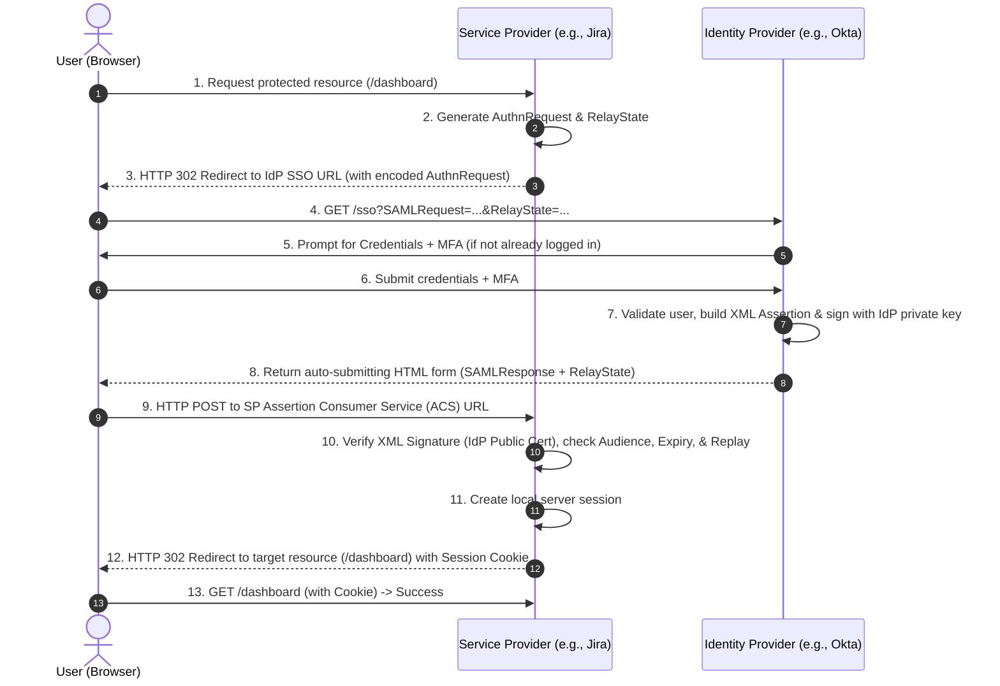
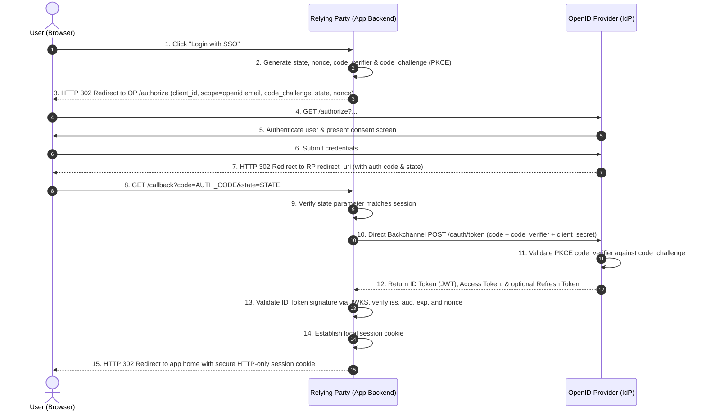

# Deep Dive: SSO, SAML, OAuth2, OIDC, Identity Providers, Identity Brokers

## Single Sign-On (SSO) Overview

Single Sign-On (SSO) is an authentication process where a user accesses multiple applications or websites using a single set of login credentials. Instead of logging into every application separately, the user authenticates once and gains access to multiple trusted applications.

**Key Idea:** SSO primarily solves **authentication** ("Who are you?") once at a centralized authority instead of repeatedly in every downstream application.

---

## Core Actors in Federated SSO

```
+-----------------------------------------------------------------------+
|                              End User                                 |
|                       (Browser / User Agent)                          |
+-------------------+-------------------------------+-------------------+
                    |                               |
        1. Access   |                   4. Redirect | / Auth
                    v                               v
+-------------------+-------+       +---------------+-------------------+
|      Service Provider     |       |         Identity Provider         |
|         (SP / RP)         |       |             (IdP / OP)            |
|                           |       |                                   |
| - Consumes identity       |       | - Verifies credentials & MFA      |
| - Enforces authorization  |       | - Issues signed assertions/tokens |
| - Maintains local session |       | - Holds authoritative user store  |
+---------------------------+       +-----------------------------------+
                    ^                               ^
                    |      +-----------------+      |
                    +----->| Identity Broker |<-----+
                           | (Intermediary)  |
                           +-----------------+
```

### 1. Identity Provider (IdP / OpenID Provider - OP)
The authoritative system responsible for authenticating users.
- **Responsibilities:** Store user identities, verify credentials (passwords, MFA, biometrics), generate cryptographically signed identity assertions/tokens, and declare identity claims to downstream applications.
- **Examples:** Google Workspace, Okta, Microsoft Entra ID (Azure AD), Auth0, OneLogin, Ping Identity.
- **Mental Model:** IdP answers: *"Who are you?"*

### 2. Service Provider (SP / Relying Party - RP)
The business application that provides actual functionality.
- **Responsibilities:** Provide services, establish trust with the IdP via shared metadata/certificates/JWKS, and consume identity information issued by the IdP.
- **Examples:** Jira, Slack, GitHub, Zoom, Salesforce, internal microservice dashboards.
- **Mental Model:** *"I trust Okta. If Okta signs a token saying this user is Swapnil with email swapnil@example.com, I believe it."* The application never handles or validates the user's password directly.

### 3. Identity Broker
An intermediary gateway positioned between multiple Identity Providers and multiple Applications.
- **Purpose:** Applications integrate once with the broker; the broker integrates with heterogeneous external IdPs. It acts like an **API Gateway for Identity**.
- **Key Capabilities:**
  - **Protocol Translation:** Bridges legacy and modern protocols (e.g., translates enterprise SAML 2.0 assertions into OIDC JWT tokens for modern single-page apps and mobile clients).
  - **Home Realm Discovery (HRD):** Inspects user email domain (e.g., `@customer-a.com` vs `@customer-b.com`) or tenant identifier to dynamically route authentication to the correct customer IdP.
  - **Claim Transformation & Normalization:** Maps diverse enterprise schema claims (`http://schemas.xmlsoap.org/ws/2005/05/identity/claims/emailaddress`) into standardized claims (`email`, `roles`, `groups`).
- **Examples:** Keycloak, Auth0 Enterprise Federation, Okta Universal Directory, Azure AD B2B Federation, AWS IAM Identity Center.

---

## Authentication vs Authorization

- **Authentication (AuthN):** Verifying identity (*"Swapnil is verified"*). Example: Google verifying credentials and issuing an identity assertion.
- **Authorization (AuthZ):** Determining permissions (*"Can Swapnil access Production resources?"*). Example: Jira deciding access based on identity attributes, assigned roles, or group memberships.

> **Common Misconception:** SSO takes care of both login and all fine-grained permissions.
> **Reality:** SSO handles AuthN and coarse-grained attribute exchange. The Service Provider remains responsible for domain-level authorization decisions unless an external AuthZ engine (e.g., OPA, Zanzibar) is explicitly hooked in.

---

## Protocol Boundary: SAML 2.0 vs OAuth 2.0 vs OIDC

```
+---------------------------------------------------------------------+
|                              OAuth 2.0                              |
|         Delegated Authorization Framework (RFC 6749 / 6750)         |
|              Issues: Access Tokens & Refresh Tokens                 |
+----------------------------------+----------------------------------+
                                   |
                                   | (Layered on top of OAuth 2.0)
                                   v
+---------------------------------------------------------------------+
|                         OpenID Connect (OIDC)                       |
|           Federated Authentication Layer (OIDC Core 1.0)            |
|              Issues: ID Tokens (JWT) via "openid" scope             |
+---------------------------------------------------------------------+

+---------------------------------------------------------------------+
|                              SAML 2.0                               |
|        Independent XML-based Federation Standard (OASIS SAML)       |
|              Issues: XML Assertions via Browser Redirects           |
+---------------------------------------------------------------------+
```

### 1. OAuth 2.0 (RFC 6749)
- **Purpose:** Delegated authorization.
- **Question:** *"What resources can this third-party application access on behalf of the user?"* (e.g., Can Canva access your Google Photos?).
- **Core Output:** Access Token (opaque or JWT) passed in HTTP `Authorization: Bearer <token>` header to Resource Servers.
- **Note:** OAuth 2.0 by itself is **not** an authentication protocol; an access token proves authorization, not user identity.

### 2. OpenID Connect (OIDC Core 1.0)
- **Purpose:** Identity and authentication layered directly on top of OAuth 2.0.
- **Question:** *"Who is the current user, and when did they authenticate?"*
- **Core Output:** **ID Token** (digitally signed JSON Web Token - JWT) delivered alongside access tokens when requesting the `openid` scope.
- **Example:** "Login with Google", "Sign in with Apple".

### 3. SAML 2.0 (Security Assertion Markup Language)
- **Purpose:** XML-based open standard for federated identity and Enterprise Single Sign-On.
- **Core Output:** **SAML Assertion** (digitally signed XML document containing `<Subject>`, `<Conditions>`, and `<AttributeStatement>`).
- **Identity Federation:** One organization trusting another organization's IdP (e.g., Company A's internal applications trust Company B's Okta/Azure AD instance).
- **Why Enterprises Still Rely on SAML:**
  - Deep legacy footprint in enterprise ERPs (SAP, Oracle, Workday, ServiceNow).
  - Native integration with traditional browser-based corporate intranets and legacy Active Directory Federation Services (ADFS).
  - Mature enterprise compliance and established bilateral trust metadata tooling.

### Detailed Protocol Comparison

| Dimension | SAML 2.0 | OpenID Connect (OIDC) | OAuth 2.0 |
|---|---|---|---|
| **Primary Goal** | Enterprise Federated AuthN | Modern Federated AuthN | Delegated Resource AuthZ |
| **Payload Format** | XML (verbose, complex) | JSON (compact, JSON Web Signature) | Opaque string or JWT |
| **Token Type** | `<saml:Assertion>` | ID Token (JWT) | Access Token / Refresh Token |
| **Transport Medium** | HTTP POST binding / Redirect | HTTP REST API / JSON responses | HTTP REST / Bearer headers |
| **Mobile & REST Friendly** | Poor (requires full browser DOM) | Native (ideal for mobile apps & SPAs) | Native (designed for APIs) |
| **Specification Body** | OASIS Standard | OpenID Foundation | IETF OAuth Working Group |
| **Target Architecture** | Legacy & enterprise B2B SaaS | Modern Web, Mobile, Microservices | Modern APIs and Resource Servers |

---

## Session Cookie vs JWT

- **SAML World:** The SP validates the incoming XML assertion, extracts claims, and establishes a stateful server-side session identified by an HTTP-only, secure `Set-Cookie` session identifier.
- **OIDC World:** The RP receives an ID Token (JWT) and an Access Token. For browser-to-backend web apps, best practice is still exchanging the token for a secure HTTP-only session cookie at the backend gateway to eliminate browser token-theft risks (XSS). For pure API-to-API communication, stateless JWT verification via IdP public keys (`/jwks.json`) is standard.

---

## SP-Initiated Normal Paths (Sequence Flows)

### 1. SAML 2.0 Web Browser SSO (SP-Initiated)



### IdP-initiated SAML: compatibility, not the default

With **IdP-initiated** SSO, the user starts from an IdP portal and the IdP posts an unsolicited assertion to the SP. It can support older enterprise integrations, but the SP did not create the request state that ordinarily links a login attempt to a browser session. Prefer SP-initiated flow for new integrations; if IdP-initiated flow is required, strictly validate the assertion signature, recipient, audience, expiry, replay ID, and approved RelayState/target mapping before establishing a session.

### 2. OIDC Authorization Code Flow with PKCE (RP-Initiated)



---

## Federation Failures, Security Risks, and Engineering Controls

In accordance with **NIST SP 800-63C** (Digital Identity Guidelines: Federation and Assertions) and standard distributed systems practices, production SSO implementations must handle these failure modes:

### 1. Clock Skew and Expiration Failures
- **Failure:** The IdP's timestamp drifts ahead of or behind the SP's server clock. Assertions fail validation on `NotBefore` / `NotOnOrAfter` (SAML) or `nbf` / `exp` (JWT).
- **Engineering Controls:**
  - Enforce NTP synchronization across all infrastructure.
  - Implement a bounded, explicit clock skew tolerance window (typically 60 to 120 seconds maximum) in validation libraries.

### 2. Signing Key / Certificate Rotation Failures
- **Failure:** IdP rotates its signing key or X.509 certificate. Downstream SPs fail signature verification, causing total login outages for all federated users.
- **Engineering Controls:**
  - **OIDC:** Dynamically fetch and cache public signing keys from the IdP's discovery endpoint (`/.well-known/openid-configuration` -> `jwks_uri`). Cache keys by Key ID (`kid`). If a token arrives with an unknown `kid`, trigger a single cache refresh before rejecting.
  - **SAML:** Periodically ingest and refresh IdP XML metadata or maintain dual active certificates in SP configuration during planned migration windows.

### 3. Replay Attacks
- **Failure:** An adversary intercepts a valid SAML Assertion or OIDC authorization code and attempts to submit it multiple times.
- **Engineering Controls:**
  - **SAML:** SP must record and cache processed assertion IDs (`ID` attribute in `<Assertion>`) in a fast distributed cache (e.g., Redis) with a TTL matching assertion validity duration; reject duplicates.
  - **OIDC:** IdP enforces one-time use of `code` at the `/token` endpoint (subsequent requests using the same code invalidate all previously issued tokens). RP validates the cryptographic `nonce` claim inside the ID Token against the local session.

### 4. Token Injection & Audience Mismatch
- **Failure:** A token or assertion issued for Client A (e.g., a low-security internal tool) is forwarded or re-submitted to Client B (e.g., the production billing portal).
- **Engineering Controls:**
  - SP/RP must strictly validate that the `Audience` (`<AudienceRestriction>` in SAML, `aud` claim in JWT) exactly matches its own registered Entity ID / Client ID.
  - Reject any assertion where the audience is ambiguous or unverified.

### 5. Open Redirect and RelayState Manipulation
- **Failure:** An attacker injects a malicious URL into `RelayState` (SAML) or `state`/`redirect_uri` (OIDC) to redirect authenticated users to phishing sites post-login.
- **Engineering Controls:**
  - Maintain a strict server-side whitelist of allowed destination URLs and redirect domains.
  - Bind `RelayState` / `state` to an encrypted, tamper-proof session cookie established prior to initiating the login flow.

---

## Architectural Tradeoffs & Disaster Recovery

```
+------------------------------------------------------------------------------------+
|                               Federation Tradeoffs                                 |
+-----------------------------------------+------------------------------------------+
|                 PROS                    |                   CONS                   |
+-----------------------------------------+------------------------------------------+
| - Single pane of glass for user access  | - Single Point of Failure (SPoF) blast   |
| - Centralized MFA & instant offboarding |   radius: IdP outage locks out all apps  |
| - Applications never touch raw passwords| - Complex troubleshooting (XML/crypto)   |
| - Standardized compliance and audit logs| - Latency: multi-hop cross-domain hops   |
+-----------------------------------------+------------------------------------------+
```

### Blast Radius Mitigation & Emergency Recovery
1. **Break-Glass Emergency Accounts:** Maintain local, non-federated administrative accounts protected by hardware security keys (FIDO2/WebAuthn) stored in emergency key vaults for direct SP access during IdP outages.
2. **Session Decoupling:** Once authenticated, SP maintains its own local session cookie with a reasonable lifetime (e.g., 8-12 hours). If the IdP suffers an intermittent 15-minute outage, already-logged-in users remain unaffected.
3. **Multi-IdP Redundancy via Identity Broker:** For mission-critical internal tools, the identity broker can fail over to a backup directory provider or secondary corporate identity domain.

---

## 60-Second SDE2 Interview Answer

> "Single Sign-On is an identity federation pattern where a centralized **Identity Provider (IdP)** verifies user credentials and issues cryptographically signed assertions or tokens to trusted **Service Providers (SPs)**, eliminating the need for applications to manage raw passwords.
>
> In enterprise setups, **SAML 2.0** uses signed XML documents transmitted via browser HTTP POST bindings, ideal for legacy corporate and web apps. In modern web, mobile, and microservice architectures, **OpenID Connect (OIDC)** is preferred; it layers identity on top of **OAuth 2.0**, issuing compact JSON Web Tokens (**ID Tokens**) alongside access tokens via REST endpoints and PKCE.
>
> An **Identity Broker** acts as an API Gateway for authentication, abstracting multiple upstream IdPs, normalizing attribute claims, and performing protocol translation (such as SAML to OIDC).
>
> In production, critical controls include enforcing clock skew bounds, dynamic JWKS key rotation, strict `Audience` and `nonce` validation to prevent token injection/replay attacks, and maintaining local break-glass admin accounts to mitigate IdP outage blast radius."

---

## Standards and Authoritative References

- **OASIS SAML 2.0 Profiles:** [OASIS Security Assertion Markup Language (SAML) V2.0 Technical Overview](https://docs.oasis-open.org/security/saml/Post2.0/sstc-saml-tech-overview-2.0.html)
- **OpenID Connect Core 1.0:** [OpenID Connect Core 1.0 incorporating errata set 1](https://openid.net/specs/openid-connect-core-1_0.html)
- **NIST SP 800-63C:** [NIST Digital Identity Guidelines - Federation and Assertions](https://pages.nist.gov/800-63-3/sp800-63c.html)
- **Accessible Deep Dive (Auth0 / Okta):** [Auth0 Overview of SAML and OIDC Federation](https://auth0.com/docs/authenticate/protocols)
- **Security & Threat Mitigation (OWASP):** [OWASP Authentication & SAML Security Cheat Sheet](https://cheatsheetseries.owasp.org/cheatsheets/SAML_Security_Cheat_Sheet.html)

---

## Quick recall

1. **What is the fundamental difference between an IdP and an SP?**
   The IdP authenticates the user and generates signed identity assertions; the SP consumes those assertions and delivers application services without handling credentials.

2. **Why is OAuth 2.0 alone insufficient for login?**
   OAuth 2.0 provides delegated authorization (access tokens for resources), not user identity verification. OIDC adds the ID Token (JWT) on top of OAuth 2.0 to provide standardized authentication.

3. **What is the primary role of an Identity Broker?**
   It sits between multiple IdPs and SPs, performing protocol translation (e.g., SAML to OIDC), Home Realm Discovery (routing by email domain), and claim normalization.

4. **How does an SP prevent SAML assertion replay attacks?**
   The SP caches processed assertion IDs in a distributed cache with a TTL equal to assertion validity and rejects duplicate IDs.

5. **What does the SP check to prevent token injection from another client?**
   The SP checks that the `Audience` (`aud` in JWT, `<AudienceRestriction>` in SAML) exactly matches its own registered Entity ID or Client ID.

6. **What is the recommended disaster recovery safeguard against total IdP outages?**
   Dedicated, vault-secured local break-glass administrative accounts independent of the federated IdP, plus decoupled SP session lifetimes.
