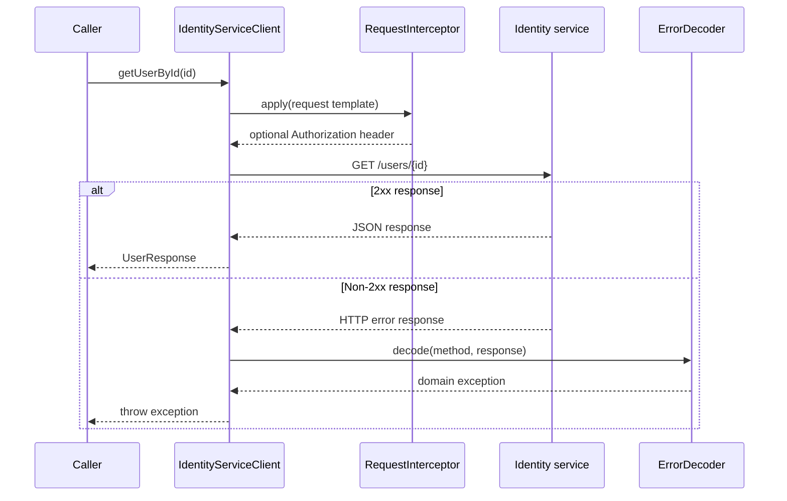

# Feign / OpenFeign Solutions

## Solution: declare-feign-client - Declare the Feign client interface

The interface is the outbound HTTP contract. A caller asks for a user; the client owns the HTTP method,
path, serialization, and response decoding.

The call has one controlled outbound boundary. A client-specific interceptor can enrich the request before
it leaves the service; an error decoder only participates after a non-2xx response. Keeping both in the
client configuration prevents a downstream policy from leaking into unrelated clients.



In an interview, summarize the boundary rather than listing annotations: "The Feign interface owns the
outbound HTTP contract. Its client-specific configuration adds only the headers and error mapping trusted
for that downstream service, and its timeout budget protects the caller's request threads from a slow
dependency."

```java
@FeignClient(
    name = "identity-service",
    url = "${identity.service.url}",
    configuration = IdentityFeignConfig.class
)
public interface IdentityServiceClient {

    @GetMapping("/users/{id}")
    UserResponse getUserById(@PathVariable("id") String id);

    @PostMapping("/users")
    UserResponse createUser(@RequestBody CreateUserRequest request);

    @GetMapping("/users")
    UserResponse getUserByEmail(@RequestParam("email") String email);
}
```

`email` shapes a valid users collection request, so it is a query parameter. A user ID addresses one
resource, so it belongs in the path.

## Solution: request-interceptor-auth - Propagate inbound authorization

The interceptor belongs in a configuration that is passed through `configuration = IdentityFeignConfig.class`.
That makes the trust boundary visible: do not automatically forward a user token to every external client.

```java
public class IdentityFeignConfig {

    @Bean
    RequestInterceptor authorizationForwarder() {
        return template -> {
            RequestAttributes attributes = RequestContextHolder.getRequestAttributes();
            if (!(attributes instanceof ServletRequestAttributes servletAttributes)) {
                return;
            }

            String authorization = servletAttributes.getRequest().getHeader("Authorization");
            if (authorization != null && !authorization.isBlank()) {
                template.header("Authorization", authorization);
            }
        };
    }
}
```

`RequestContextHolder` has no servlet request when a job, Kafka consumer, or test invokes the client. The
guard makes that call valid instead of treating an absent inbound token as a programming failure.

## Solution: custom-errordecoder - Map upstream failures to domain failures

`ErrorDecoder.decode` returns the exception Feign should throw. The mapping makes the call site's branch
about an identity-service outcome rather than a transport-library type.

```java
public final class IdentityErrorDecoder implements ErrorDecoder {
    private final ErrorDecoder fallback = new ErrorDecoder.Default();

    @Override
    public Exception decode(String methodKey, Response response) {
        return switch (response.status()) {
            case 400 -> new ValidationException("Identity service rejected the request");
            case 404 -> new UserNotFoundException("Identity user was not found");
            case 503 -> new ServiceUnavailableException("Identity service is unavailable");
            default -> fallback.decode(methodKey, response);
        };
    }
}
```

Add this second bean to the same `IdentityFeignConfig` that contains the interceptor:

```java
@Bean
ErrorDecoder identityErrorDecoder() {
    return new IdentityErrorDecoder();
}
```

If a `400` body contains field errors that the caller needs, read it inside `decode` and handle a null body
and I/O failure. Do not use `methodKey` as if it contained request values; it identifies the Feign method,
not the user being requested. Avoid copying sensitive upstream bodies unfiltered into logs or exceptions.

## Solution: timeout-configuration - Bound a blocking downstream call

```yaml
spring:
  cloud:
    openfeign:
      client:
        config:
          identity-service:
            connectTimeout: 2000
            readTimeout: 5000
```

The calling thread waits while this blocking client establishes a connection and waits for a response. A
`connectTimeout` bounds connection establishment; a `readTimeout` bounds waiting after connection for the
response. Explicit values keep a degraded dependency from occupying every request thread until the caller
cannot serve unrelated traffic. Tighten the response budget for an interactive endpoint only if its product
SLO allows a faster failure; choose a separately justified budget for a batch operation.

## Solution: wiremock-test-outline - Verify the client boundary without a real service

The critical setup decision is timing: start WireMock and register its URL before Spring builds the Feign
client. The following is an outline; imports and DTO details are intentionally omitted.

```java
@SpringBootTest
class IdentityServiceClientTest {
    private static final WireMockServer wireMock = new WireMockServer(options().dynamicPort());

    static {
        wireMock.start();
    }

    @DynamicPropertySource
    static void identityServiceProperties(DynamicPropertyRegistry registry) {
        registry.add("identity.service.url", wireMock::baseUrl);
    }

    @Autowired
    private IdentityServiceClient client;

    @AfterAll
    static void stopWireMock() {
        wireMock.stop();
    }

    @Test
    void returnsMappedUserForSuccessfulResponse() {
        wireMock.stubFor(get(urlEqualTo("/users/123"))
            .willReturn(okJson("{\"id\":\"123\",\"name\":\"Ada\"}")));

        UserResponse response = client.getUserById("123");

        assertThat(response.id()).isEqualTo("123");
    }

    @Test
    void mapsNotFoundThroughIdentityErrorDecoder() {
        wireMock.stubFor(get(urlEqualTo("/users/999")).willReturn(notFound()));

        assertThatThrownBy(() -> client.getUserById("999"))
            .isInstanceOf(UserNotFoundException.class);
    }
}
```

This is an integration-boundary test, not a WireMock tutorial. It proves request mapping, JSON decoding, and
the configured error decoder in one path.

## Quick recall

**Q. What does a `RequestInterceptor` own?**

Cross-cutting outbound request changes, such as an allowed authorization header or correlation ID.

**Q. What should an `ErrorDecoder` return?**

An exception representing the upstream result. Feign throws the returned exception to the caller.

**Q. Why test the Feign client against a stub server?**

It verifies the actual HTTP mapping and configured decoder without relying on an unstable downstream service.

## References

- [Spring Cloud OpenFeign reference][openfeign-reference]
- [WireMock JUnit 5 reference][wiremock-junit]

[openfeign-reference]: https://docs.spring.io/spring-cloud-openfeign/reference/spring-cloud-openfeign.html
[wiremock-junit]: https://wiremock.org/docs/junit-jupiter/
