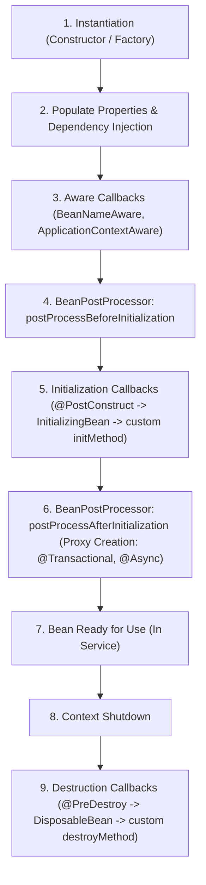

# Bean Lifecycle

---

## Mental model

Spring does far more than call constructors. For a standard singleton bean in an `ApplicationContext`, the creation, initialization, and destruction sequence proceeds through distinct lifecycle phases:



Interviewers focus on the bean lifecycle because it explains:

- why constructor execution is too early for logic requiring fully injected dependencies
- when `@PostConstruct` and `@PreDestroy` run relative to Spring wiring
- why `@Transactional`, `@Async`, and `@Cacheable` rely on post-initialization dynamic proxies
- why prototype-scoped beans are not tracked or destroyed by Spring on shutdown

---

## Constructor vs `@PostConstruct`

- **Constructor**: Use it to receive required dependencies and assign them to immutable (`final`) fields.
- **`@PostConstruct`**: Use it when startup logic requires already-injected dependencies or environment state.

```java
@Component
public class CacheWarmer {
    private final ProductRepository repository;

    public CacheWarmer(ProductRepository repository) {
        this.repository = repository;
    }

    @PostConstruct
    public void warmUp() {
        repository.findTopProducts().forEach(cache::put);
    }
}
```

With constructor injection, dependencies are available inside the constructor. However, `@PostConstruct` remains the standard location for post-wiring startup logic (such as cache warming or connection handshakes) after Spring completes all property population and `Aware` callbacks.

Keep heavy startup work minimal; a long-running `@PostConstruct` directly blocks application context startup.

---

## `@PreDestroy`

Use `@PreDestroy` to cleanly release resources held by a Spring-managed singleton bean when the application context is closed or gracefully shut down.

```java
@Component
public class FileImportWorker {
    private ExecutorService executor;

    @PostConstruct
    public void start() {
        executor = Executors.newSingleThreadExecutor();
    }

    @PreDestroy
    public void stop() {
        executor.shutdown();
    }
}
```

`@PreDestroy` is bound to **Spring-managed bean instances**, not arbitrary class definitions. Spring executes destroy callbacks only for objects it instantiates and manages inside the container. If you instantiate an object manually using `new`, Spring does not track it or invoke its `@PreDestroy` method.

Core interview use cases:

- Stop background threads or `ExecutorService` thread pools.
- Close network clients, database connection pools, file handles, or message broker sessions.
- Flush buffered logs, metrics, audit events, or in-memory queues.
- Release distributed locks or deregister a worker instance from service discovery.
- Stop accepting new tasks and cleanly finish or cancel in-flight work.

While the operating system eventually reclaims process memory and file descriptors on termination, `@PreDestroy` ensures graceful application shutdown, state flushing, and protocol-level socket disconnects before process exit.

**Prototype gotcha**: Spring instantiates and configures prototype beans, but does **not** manage their subsequent lifecycle or execute their destroy callbacks. If a prototype bean acquires an open resource, the calling code is responsible for closing it.

---

## Proxies and lifecycle

Spring features such as `@Transactional`, `@Async`, `@Cacheable`, and `@Validated` operate by wrapping the target bean instance in a dynamic proxy (via CGLIB or JDK dynamic proxies).

```java
@Service
public class PaymentService {
    @Transactional
    public void capturePayment(Order order) {
        // transaction starts before this method and commits/rolls back after it
    }
}
```

The object injected into collaborator beans is the outer Spring proxy wrapping the underlying bean instance. Consequently, method calls originating from external beans pass through the proxy interceptor chain, whereas internal self-invocations bypass the proxy:

```java
public void outer() {
    inner(); // direct 'this' invocation: bypasses Spring proxy interceptor!
}

@Transactional
public void inner() {
}
```

Proxy creation occurs during the `BeanPostProcessor.postProcessAfterInitialization` phase—after the raw bean instance has completed property injection and all initialization callbacks (`@PostConstruct`).

---

## BeanPostProcessor in one paragraph

`BeanPostProcessor` is Spring's primary internal extension point for intercepting bean instances before and after their initialization callbacks. Application-level services rarely implement this interface directly, but understanding it clarifies how Spring delivers declarative infrastructure:

| Feature | Role in Bean Lifecycle |
| --- | --- |
| `@Autowired` / `@Value` | `AutowiredAnnotationBeanPostProcessor` injects dependencies before initialization |
| `@PostConstruct` / `@PreDestroy` | `CommonAnnotationBeanPostProcessor` invokes JSR-250 lifecycle hooks |
| `@Transactional` / `@Async` / `@Cacheable` | Auto-proxy creators wrap the initialized bean in a proxy during `postProcessAfterInitialization` |

Interview takeaway: You rarely implement `BeanPostProcessor` in domain code, but Spring framework modules rely heavily on it to power annotations and AOP proxies.

---

## `@Bean(initMethod/destroyMethod)`

When integrating third-party library classes whose source code you cannot modify, `@PostConstruct` and `@PreDestroy` annotations cannot be added. Use `@Bean` lifecycle attributes in `@Configuration` classes:

```java
@Configuration
public class ClientConfig {
    @Bean(initMethod = "connect", destroyMethod = "close")
    public ExternalClient externalClient() {
        return new ExternalClient();
    }
}
```

Use JSR-250 annotations (`@PostConstruct` / `@PreDestroy`) for first-party beans you own. Use `@Bean(initMethod = "...", destroyMethod = "...")` or standard `AutoCloseable` discovery when wiring third-party library components.

---

## `@DependsOn`

Spring automatically orders bean creation based on direct dependency graphs defined by constructor and property injection.

Use `@DependsOn` only when a bean relies on an implicit, side-effect dependency rather than an injected object reference:

```java
@Bean
@DependsOn("flyway")
public ReportRepository reportRepository() {
    return new ReportRepository();
}
```

Typical use case: A database migration or schema initialization bean (`Flyway` / `Liquibase`) must complete before repositories execute queries. If you frequently reach for `@DependsOn`, consider making dependencies explicit via constructor arguments.

---

## What to avoid

- Do not place heavy business logic or blocking external RPCs inside lifecycle init callbacks.
- Do not use lifecycle callbacks as a workaround to hide missing or circular dependencies.
- Do not rely on Spring to execute `@PreDestroy` on `prototype`-scoped beans.
- Do not implement framework-coupled lifecycle interfaces (`InitializingBean`, `DisposableBean`) in domain classes unless building custom framework extensions.
- Do not expect proxy-driven annotations (`@Transactional`, `@Async`, `@Cacheable`) to trigger during self-invocation (`this.method()`).

---

## Quick recall

**Q. What is the execution sequence for a singleton bean's lifecycle?**
A. Instantiation -> Property injection -> Aware callbacks -> `BeanPostProcessor` before init -> `@PostConstruct` / `InitializingBean` / `initMethod` -> `BeanPostProcessor` after init (proxying) -> In-service -> Shutdown -> `@PreDestroy` / `DisposableBean` / `destroyMethod`.

**Q. When should you use `@PostConstruct` over a constructor?**
A. When startup initialization logic requires dependencies and configuration properties to be fully injected and ready across the container.

**Q. What is the role of `@PreDestroy` and which beans run it?**
A. It releases singleton resources (executors, connection pools, sockets, buffer flushes) during graceful context shutdown. Spring invokes it only for container-managed singleton beans, never for prototype beans.

**Q. Why does `@Transactional` fail to start a transaction when called from another method within the same class?**
A. Self-invocation calls the local `this` instance directly, bypassing the Spring proxy created during `postProcessAfterInitialization`.

**Q. How does `BeanPostProcessor` enable Spring annotations?**
A. It provides before-init and after-init lifecycle hooks that detect annotations (`@PostConstruct`, `@Autowired`) and wrap beans in dynamic proxies (`@Transactional`, `@Async`).

**Q. How do you configure lifecycle init and destroy methods for third-party classes?**
A. Declare them via `@Bean(initMethod = "...", destroyMethod = "...")` inside a `@Configuration` class.

**Q. When is `@DependsOn` appropriate?**
A. When Bean A depends on Bean B's startup side effects (e.g., database schema migration) without holding a direct Java reference to Bean B.
