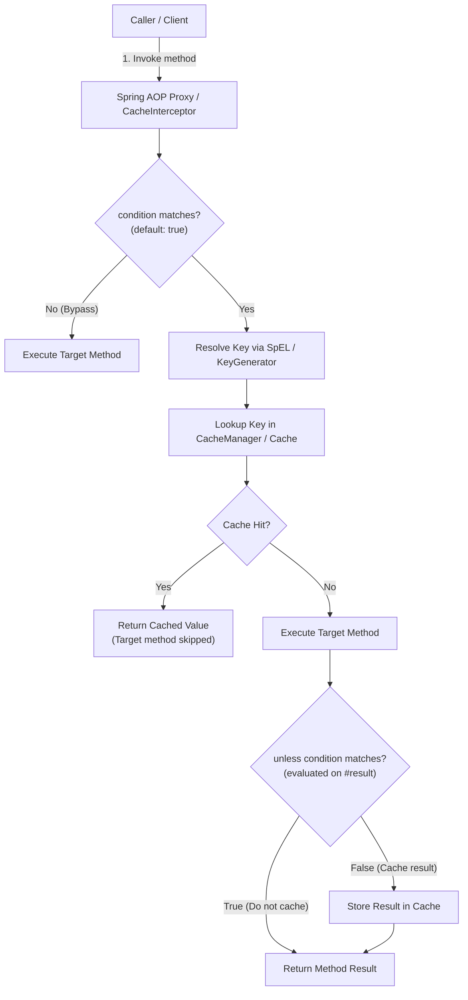

# Spring Caching Abstraction

The Spring Caching Abstraction provides a transparent, annotation-driven caching layer that decouples application business logic from specific cache storage technologies. By programming against Spring's `CacheManager` and `Cache` interfaces, you can switch from an in-memory Caffeine cache to a distributed Redis cluster via configuration without modifying application service code.

---

## What the Abstraction Is

Spring's caching support is implemented as an AOP (Aspect-Oriented Programming) advice around annotated methods. Method annotations (`@Cacheable`, `@CacheEvict`, `@CachePut`) define caching intentions, while `CacheInterceptor` coordinates with the configured `CacheManager` to inspect, store, or invalidate entries.

```
@Cacheable("users")          <-- Application code (provider-agnostic)
    │
    ▼
CacheInterceptor (AOP)       <-- Evaluates SpEL, conditions, and cache operations
    │
    ▼
CacheManager (Interface)     <-- Bridges Spring Cache SPI to underlying provider
    │
    ├─ ConcurrentMapCacheManager (In-memory ConcurrentHashMap, no eviction/TTL -- dev/test only)
    ├─ CaffeineCacheManager      (In-process, high-concurrency, TTL & TinyLFU -- single-node prod)
    ├─ JCacheCacheManager        (JSR-107 compliant, e.g., EhCache 3 off-heap/disk tiers)
    └─ RedisCacheManager         (Distributed, shared across nodes, per-cache TTL -- multi-node prod)
```

### Enabling Caching

To activate Spring caching, add `@EnableCaching` to a `@Configuration` class:

```java
@Configuration
@EnableCaching
public class CacheConfig { }
```

Without `@EnableCaching`, Spring does not register the caching advisor (`BeanFactoryCacheOperationSourceAdvisor`) or `CacheInterceptor`. As a result, all caching annotations are silently ignored at runtime—the methods execute normally without checking or updating any cache.

---

## Core Annotations and Execution Flow



### @Cacheable

Checks the cache before method invocation. On a cache hit, the cached value is returned immediately and method execution is skipped. On a cache miss, the target method executes, and the returned value is stored in the cache before returning to the caller.

```java
@Cacheable(cacheNames = "users", key = "#id")
public User findById(Long id) {
    return userRepository.findById(id).orElseThrow();
}
```

#### Key Defaults

If the `key` attribute is omitted, Spring generates a key using `SimpleKeyGenerator`:
- **0 parameters:** Uses `SimpleKey.EMPTY`.
- **1 parameter:** Uses the parameter instance directly (e.g., `Long id` uses the `Long` value).
- **Multiple parameters:** Computes a compound key wrapped in `SimpleKey` containing all arguments.

#### Stampede Protection with `sync = true`

Under high concurrency, when a hot cache entry expires, dozens of concurrent requests for the same key may experience a cache miss simultaneously. Each thread will invoke the expensive target method in parallel, causing a **cache stampede** (thundering herd) that overwhelms the database.

Setting `sync = true` forces the local cache abstraction to synchronize concurrent lookups for the same key:

```java
@Cacheable(cacheNames = "users", key = "#id", sync = true)
public User findById(Long id) {
    return userRepository.findById(id).orElseThrow();
}
```

When `sync = true`, only one thread acquires the lock and calls the target method; all other threads block until the result is computed and then read the freshly cached value.

> [!WARNING]
> `@Cacheable(sync = true)` delegates directly to the underlying provider's `Cache.get(key, Callable)` method. Because the value loader is executed atomically inside the cache provider, Spring cannot inspect the result before storing it. Consequently, **combining `sync = true` with `unless` is strictly forbidden and throws `IllegalArgumentException: @Cacheable(sync=true) does not support unless attribute` at runtime**.

---

### @CacheEvict

Removes one or more entries from the cache when entities are updated or deleted.

```java
// 1. Evict a single entry by key
@CacheEvict(cacheNames = "users", key = "#id")
public void deleteUser(Long id) {
    userRepository.deleteById(id);
}

// 2. Flush all entries within the "users" cache
@CacheEvict(cacheNames = "users", allEntries = true)
public void clearUserCache() {
    // Triggers cache.clear() across the entire cache name
}

// 3. Evict before method execution to guarantee eviction even on exception
@CacheEvict(cacheNames = "users", key = "#id", beforeInvocation = true)
public void purgeUserData(Long id) {
    userRepository.purgeExternalRecords(id);
}
```

#### `beforeInvocation` Semantics

- **`beforeInvocation = false` (default):** Eviction happens **after** the method completes successfully. If the method throws an exception, the eviction is skipped, leaving the existing cache entry intact.
- **`beforeInvocation = true`:** Eviction runs **before** the target method is invoked. This guarantees that stale data is stripped from the cache even if the underlying business method or database operation throws an exception.

---

### @CachePut

Always executes the target method and stores the returned value into the cache, updating existing entries unconditionally without ever checking for an existing cache hit.

```java
@CachePut(cacheNames = "users", key = "#result.id")
public User updateUser(UserUpdateRequest req) {
    User user = userRepository.findById(req.id()).orElseThrow();
    user.updateDetails(req.name(), req.email());
    return userRepository.save(user);
}
```

- `@CachePut` is designed for write/update operations to keep the cache warm.
- The SpEL `#result` variable is available in `key` and `unless` expressions because `@CachePut` executes after the target method returns.

> [!CAUTION]
> **Never place `@Cacheable` and `@CachePut` on the same method.** If placed together, `@Cacheable` may intercept the call and return the cached value without invoking the method, preventing `@CachePut` from ever refreshing the cache with new data.

---

### @CacheConfig

`@CacheConfig` is a class-level annotation that establishes common defaults (such as `cacheNames`, `keyGenerator`, `cacheManager`, or `cacheResolver`) across all caching methods in the class:

```java
@Service
@CacheConfig(cacheNames = "users")
public class UserService {

    @Cacheable(key = "#id")          // Inherits cacheNames = "users"
    public User findById(Long id) { ... }

    @CacheEvict(key = "#id")
    public void deleteUser(Long id) { ... }

    @CachePut(key = "#result.id")
    public User updateUser(UserUpdateRequest req) { ... }
}
```

Method-level attributes always override class-level defaults.

---

## SpEL Key Generation and Conditional Caching

### SpEL Evaluation Context

Spring Cache provides predefined SpEL variables for constructing cache keys:

| Expression | Resolves to | Lifecycle Availability |
|---|---|---|
| `#id` or `#a0` / `#p0` | Argument named `id` (or first argument by index) | Before and after invocation |
| `#user.id` | Property `id` accessed via getter on `#user` argument | Before and after invocation |
| `#root.methodName` | Name of the annotated method | Before and after invocation |
| `#root.targetClass` | Class of the target bean | Before and after invocation |
| `#root.args[0]` | Array access to method parameters | Before and after invocation |
| `#result` | Object returned by the method | **Only** after invocation (`@CachePut`, `unless`) |
| `T(String).valueOf(#id)` | Static method call / explicit type conversion | Before and after invocation |

### Custom KeyGenerator

When key generation requires business-specific hashing, multi-tenant partitioning, or serialization of complex domain objects, register a custom `KeyGenerator`:

```java
@Component("tenantAwareKeyGenerator")
public class TenantAwareKeyGenerator implements KeyGenerator {

    @Override
    public Object generate(Object target, Method method, Object... params) {
        String tenantId = TenantContext.getCurrentTenant();
        return tenantId + ":" + method.getName() + ":" + Arrays.deepToString(params);
    }
}

// Usage in service:
@Cacheable(cacheNames = "accounts", keyGenerator = "tenantAwareKeyGenerator")
public Account findAccount(String accountNumber) { ... }
```

### `condition` vs `unless`

Both attributes accept SpEL expressions but evaluate at different lifecycle stages:

```java
// condition: Evaluated BEFORE method call. If false, caching is completely bypassed.
@Cacheable(cacheNames = "users", key = "#id", condition = "#id > 0")
public User findById(Long id) { ... }

// unless: Evaluated AFTER method call. If true, result is NOT stored in cache.
@Cacheable(cacheNames = "users", key = "#id", unless = "#result == null")
public User findById(Long id) { ... }
```

| Feature | `condition` | `unless` |
|---|---|---|
| **Evaluation Timing** | Before target method execution | After target method completes |
| **Cache Hit Check** | Bypassed if condition evaluates to `false` | Always checked before method runs |
| **Cache Write** | Skipped if `false` | Skipped if `true` |
| **`#result` Access** | No (method has not run yet) | Yes (can inspect returned payload) |
| **Primary Use Case** | Skip caching for invalid or test arguments (`#id > 0`) | Prevent caching `null`, empty collections, or error DTOs |

---

## Provider Adapters: Local vs Distributed

### 1. ConcurrentMapCacheManager (Dev / Test Only)

```java
@Bean
public CacheManager cacheManager() {
    return new ConcurrentMapCacheManager("users", "products");
}
```

- Built on Java's `ConcurrentHashMap`.
- Provides zero eviction policies, zero TTL expiration, and unbounded memory growth.
- **Production risk:** Unbounded cache accumulation inevitably causes `OutOfMemoryError`. Use strictly for unit and integration testing.

### 2. CaffeineCacheManager (Single-Node Production)

Caffeine is a high-performance, near-optimal in-process cache library utilizing the Window TinyLFU eviction algorithm.

```java
@Bean
public CacheManager cacheManager() {
    CaffeineCacheManager manager = new CaffeineCacheManager("users", "products");
    manager.setCaffeine(Caffeine.newBuilder()
        .initialCapacity(500)
        .maximumSize(10_000)
        .expireAfterWrite(Duration.ofMinutes(10))
        .recordStats());
    return manager;
}
```

- **In-process memory speed:** Sub-microsecond reads without network serialization.
- **`expireAfterWrite` vs `expireAfterAccess`:** `expireAfterWrite` guarantees bounded data staleness regardless of access frequency, making it the safer default for database-backed entities.
- **Limitation:** In-process only. Entries are lost on application restart and cannot be shared across multiple horizontal service replicas.

### 3. JCacheCacheManager / EhCache 3 (Multi-Tier Off-Heap)

EhCache 3 supports JSR-107 (JCache) integration and allows multi-tiered storage combining on-heap memory with off-heap RAM and local disk:

```java
@Bean
public CacheManager cacheManager() {
    return new JCacheCacheManager(); // Bridges javax.cache.CacheManager to Spring
}
```

- **Off-heap capability:** Caches hundreds of gigabytes per node without triggering JVM garbage collection pauses.
- Useful for large standalone instances requiring high-density local caching before introducing distributed infrastructure.

### 4. RedisCacheManager (Distributed / Multi-Node Production)

Redis provides an out-of-process distributed cache shared across all horizontal application instances:

```java
@Bean
public RedisCacheManager cacheManager(RedisConnectionFactory connectionFactory) {
    RedisCacheConfiguration defaultConfig = RedisCacheConfiguration.defaultCacheConfig()
        .entryTtl(Duration.ofMinutes(15))
        .disableCachingNullValues()
        .serializeValuesWith(
            RedisSerializationContext.SerializationPair.fromSerializer(
                new GenericJackson2JsonRedisSerializer()));

    Map<String, RedisCacheConfiguration> cacheConfigurations = Map.of(
        "sessions", RedisCacheConfiguration.defaultCacheConfig().entryTtl(Duration.ofHours(2)),
        "products", RedisCacheConfiguration.defaultCacheConfig().entryTtl(Duration.ofMinutes(5))
    );

    return RedisCacheManager.builder(connectionFactory)
        .cacheDefaults(defaultConfig)
        .withInitialCacheConfigurations(cacheConfigurations)
        .build();
}
```

- **Cluster coherence:** All nodes read and invalidate the same centralized dataset; survived pod restarts and rolling deployments.
- **Serialization:** Always use JSON serialization (`GenericJackson2JsonRedisSerializer` or `Jackson2JsonRedisSerializer`). The default Java serialization (`JdkSerializationRedisSerializer`) produces brittle binary blobs that fail deserialization whenever entity classes or serialVersionUIDs change.
- **Latency overhead:** Each cache operation incurs a network round-trip (~0.5–2 ms). Under extreme read traffic, consider a two-layer near-cache (Caffeine L1 + Redis L2).

---

## Production Resilience: CacheErrorHandler

By default, Spring registers `SimpleCacheErrorHandler`. If Redis becomes unreachable due to network partitions, cluster failover, or latency spikes, `SimpleCacheErrorHandler` rethrows the `RedisConnectionFailureException`. As a result, **a transient cache outage cascades into complete application failure (HTTP 500s), even if the primary database is completely healthy**.

To achieve high availability, implement a custom `CacheErrorHandler` via `CachingConfigurer`:

```java
@Configuration
@EnableCaching
public class ResilientCacheConfig implements CachingConfigurer {

    private static final Logger log = LoggerFactory.getLogger(ResilientCacheConfig.class);

    @Override
    public CacheErrorHandler errorHandler() {
        return new CacheErrorHandler() {
            @Override
            public void handleCacheGetError(RuntimeException exception, Cache cache, Object key) {
                // Fail-open: Log warning and swallow exception so caller falls back to the database
                log.warn("Cache GET failure on cache '{}' for key '{}'. Falling back to database.",
                    cache.getName(), key, exception);
            }

            @Override
            public void handleCachePutError(RuntimeException exception, Cache cache, Object key, Object value) {
                log.error("Cache PUT failure on cache '{}' for key '{}'. Data written to DB only.",
                    cache.getName(), key, exception);
            }

            @Override
            public void handleCacheEvictError(RuntimeException exception, Cache cache, Object key) {
                log.error("Cache EVICT failure on cache '{}' for key '{}'. Stale data risk!",
                    cache.getName(), key, exception);
            }

            @Override
            public void handleCacheClearError(RuntimeException exception, Cache cache) {
                log.error("Cache CLEAR failure on cache '{}'.", cache.getName(), exception);
            }
        };
    }
}
```

- **Fail-open on reads (`handleCacheGetError`):** Swallowing the exception causes Spring to treat the error as a cache miss, seamlessly falling back to the database query.
- **Alerting on writes (`handleCacheEvictError`):** If an eviction fails in Redis, the cache will hold stale data. Log errors with high severity to trigger operational alerts.

---

## Common Pitfalls and Gotchas

| Pitfall | Root Cause | Solution |
|---|---|---|
| **Self-invocation bypass** | Method call via `this.method()` bypasses Spring AOP proxy | Refactor method to separate `@Service` bean, or inject bean into itself (`@Autowired Self`) |
| **Non-public method ignored** | Spring AOP proxy interception applies only to `public` methods | Make annotated caching methods `public` |
| **`sync = true` with `unless` crash** | Atomic provider execution does not allow post-invocation SpEL inspection | Remove `unless` when `sync = true`, or enforce null checks inside target method |
| **`@Cacheable` + `@CachePut` on same method** | `@Cacheable` returns cached value and skips method, preventing `@CachePut` execution | Use `@Cacheable` exclusively on read methods and `@CachePut` on write/update methods |
| **`@CachePut` dirty read on rollback** | Cache is updated before transaction commits; on DB rollback, cache retains phantom data | Evict or update cache strictly in `TransactionSynchronization.afterCommit()` callback |
| **`@CacheEvict` skipped on method error** | `beforeInvocation = false` defaults to skipping eviction if method throws | Set `beforeInvocation = true` if eviction must occur regardless of execution errors |
| **Null values permanently cached** | Method returns `null` on missing entity and Spring caches it without expiration | Add `unless = "#result == null"` or configure provider with short negative-caching TTL |
| **Redis outage takes down service** | Default `SimpleCacheErrorHandler` rethrows Redis connection exceptions | Register custom `CacheErrorHandler` to fail open on read errors |
| **Brittle Java serialization in Redis** | Default serializer breaks when entity class fields change | Configure `GenericJackson2JsonRedisSerializer` on `RedisCacheConfiguration` |
| **`ConcurrentMapCacheManager` OOM** | In-memory map has no size bounds or TTL | Replace with Caffeine or Redis in production |
| **Missing `@EnableCaching`** | Caching advisor is never registered | Add `@EnableCaching` to a `@Configuration` class |

---

## Quick Recall

**Q. What does `@EnableCaching` actually register in the Spring ApplicationContext?**
A. It registers the caching infrastructure beans, specifically `BeanFactoryCacheOperationSourceAdvisor` and `CacheInterceptor`, enabling Spring AOP proxies to intercept caching annotations.

**Q. Why does `@Cacheable(sync = true, unless = "#result == null")` throw an `IllegalArgumentException`?**
A. `sync = true` delegates computation directly to the provider's atomic `Cache.get(key, Callable)` method; because value storage occurs inside the provider, Spring cannot inspect `#result` against the `unless` expression prior to caching.

**Q. What happens when an annotated method calls another cached method within the same class (`this.findCached(...)`)?**
A. The call bypasses the Spring AOP proxy and invokes the target instance directly, causing all caching annotations on the inner method to be completely ignored.

**Q. If a method annotated with `@CacheEvict(beforeInvocation = false)` throws a `RuntimeException`, is the cache entry deleted?**
A. No. With `beforeInvocation = false` (default), eviction runs only after successful method completion. To guarantee deletion when errors occur, set `beforeInvocation = true`.

**Q. How do you prevent a Redis outage from causing HTTP 500 errors on `@Cacheable` endpoints?**
A. Register a custom `CacheErrorHandler` in `CachingConfigurer` and swallow exceptions in `handleCacheGetError`, causing Spring to treat cache failures as misses and fetch from the database.

**Q. Why is placing `@CachePut` inside an active `@Transactional` method risky?**
A. If the database transaction rolls back after `@CachePut` has already updated Redis, Redis will hold dirty, uncommitted data that was never persisted to the database.
