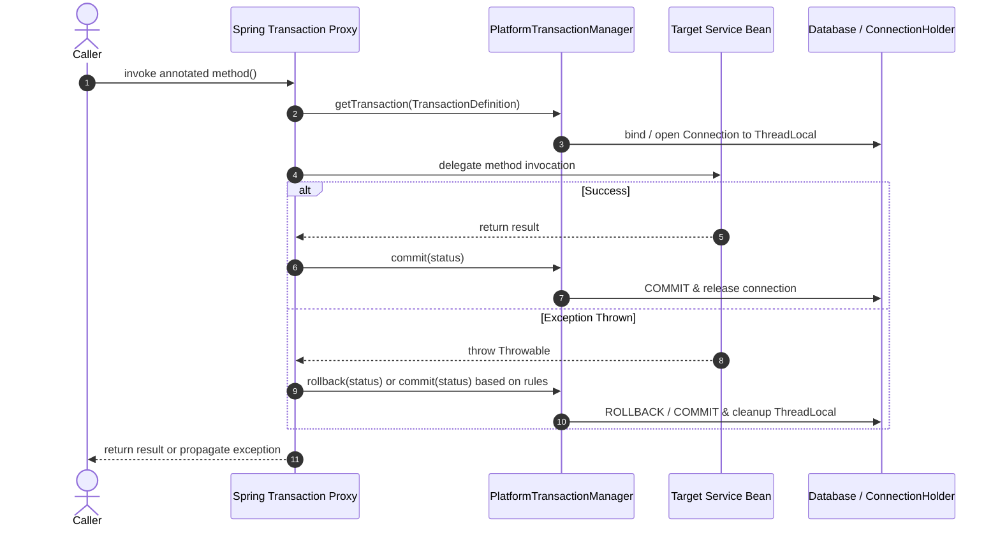

# Spring Transactions

`@Transactional` defines a declarative database transaction boundary. Key architectural aspects include proxy mechanics, self-invocation boundaries, exception rollback semantics, propagation behaviors, and concurrency locking strategies.

---

## How @Transactional works

Spring applies `@Transactional` using dynamic AOP proxies (CGLIB class-based or JDK interface-based).



The proxy intercepts calls from external callers, opens/binds resources to `TransactionSynchronizationManager`, delegates to the target instance, and commits or rolls back upon return.

```java
@Service
public class OrderService {

    @Transactional
    public void placeOrder(CreateOrderRequest request) {
        orderRepository.save(new Order(request));
        paymentRepository.save(new Payment(request));
    }
}
```

Spring opens a transaction before the method runs, commits on return, and rolls back if an eligible exception is thrown.

---

## Self-invocation trap

Calling a transactional method from within the same class bypasses the Spring proxy:

```java
@Service
public class OrderService {

    public void placeOrder(Order order) {
        this.sendConfirmation(order); // bypasses Spring proxy
    }

    @Transactional
    public void sendConfirmation(Order order) {
        // transaction annotation is ignored in this call path
    }
}
```

**Root cause:** `this.sendConfirmation()` directly invokes the raw target instance without passing through the surrounding proxy object.

**Preferred fix:** Move the transactional method to a separate Spring-managed bean.

```java
@Service
public class OrderService {
    private final ConfirmationService confirmationService;

    public void placeOrder(Order order) {
        confirmationService.sendConfirmation(order);
    }
}

@Service
public class ConfirmationService {

    @Transactional
    public void sendConfirmation(Order order) {
        // now called through Spring proxy
    }
}
```

Also avoid `@Transactional` on `private` methods. Standard Spring AOP proxies cannot intercept private method calls.

---

## Where to put @Transactional

Place `@Transactional` on service-layer methods that represent a complete business use case:

```java
@Transactional
public void transferMoney(Long fromAccountId, Long toAccountId, BigDecimal amount) {
    Account from = accountRepository.findById(fromAccountId).orElseThrow();
    Account to = accountRepository.findById(toAccountId).orElseThrow();

    from.debit(amount);
    to.credit(amount);
}
```

Do not rely on separate repository-level transactions when the multi-step use case must commit or roll back as an atomic unit.

---

## Transaction boundary versus concurrency control

`@Transactional` makes a single request atomic; it does not serialize two concurrent requests that read, calculate, and write the same record. The transaction boundary must cover the entire business operation, but concurrent read-modify-write workflows require a concurrency control strategy.

For lock-based isolation, acquire the lock, read, calculate, and write within the same service transaction. A repository method that locks a row in an isolated transaction is ineffective if that transaction commits before subsequent calculations and updates occur.

---

## JPA locking: pessimistic or optimistic

Use a **pessimistic lock** when contention is high or retrying the operation is costly. In Spring Data JPA, a repository query requests explicit database locking:

```java
@Lock(LockModeType.PESSIMISTIC_WRITE)
@Query("select g from GroupEntity g where g.id = :id")
Optional<GroupEntity> findByIdForUpdate(Long id);
```

The database holds the exclusive lock until the enclosing transaction completes. Keep locked transactions as brief as possible.

Use **optimistic locking** when conflicts are infrequent. Add a version field to the entity:

```java
@Version
private Long version;
```

The update verification checks that the database version matches the in-memory version. If another transaction updated the row concurrently, JPA throws an `OptimisticLockException` (wrapped by Spring as `ObjectOptimisticLockingFailureException`) at flush or commit time.

| Mode | Meaning | Boundary |
|---|---|---|
| `PESSIMISTIC_READ` | Ask the database to protect a read from conflicting writes. | Reader compatibility is database/provider specific. |
| `PESSIMISTIC_WRITE` | Take exclusive coordination before a read-modify-write decision. | Competing work waits, fails on timeout, or can be a deadlock victim. |
| `PESSIMISTIC_FORCE_INCREMENT` | Take the pessimistic write-style lock and advance a versioned entity's version. | Useful only when that version advance is meaningful to the model. |
| `OPTIMISTIC_FORCE_INCREMENT` | Validate optimistically and force a version advance. | No long-lived database lock; a stale update still fails. |

| Choose | When it fits | Caller-visible consequence |
|---|---|---|
| `PESSIMISTIC_WRITE` | Short, contended coordination such as a group-balance update | A competing request waits, times out, or becomes a deadlock victim. |
| `@Version` | Conflicts are rare and retrying the whole decision is acceptable | A stale writer fails explicitly; it must reload/retry or report conflict. |

---

## Propagation

Propagation dictates how transactional boundaries interact when existing transactions are present.

- `REQUIRED` (Default): Joins the current transaction if one exists; creates a new one if none exists.
- `REQUIRES_NEW`: Suspends any existing transaction and always creates a new, independent physical transaction.
- `SUPPORTS`: Executes non-transactionally if none exists; joins if one exists.
- `NOT_SUPPORTED`: Executes non-transactionally, suspending any existing transaction.
- `MANDATORY`: Must run within an existing transaction; throws `IllegalTransactionStateException` if none exists.
- `NEVER`: Must run non-transactionally; throws `IllegalTransactionStateException` if an active transaction exists.
- `NESTED`: Executes within a nested transaction using database savepoints (if supported by the transaction manager).

### Propagation.REQUIRED behavior

```java
@Transactional
public void placeOrder() {
    orderRepository.save(order);
    inventoryService.reserve(); // REQUIRED joins same transaction
}
```

If `reserve()` fails with a runtime exception, the shared transaction is marked rollback-only.

### Propagation.REQUIRES_NEW behavior

```java
@Transactional
public void placeOrder() {
    orderRepository.save(order);
    auditService.log("order created"); // independent transaction
    throw new RuntimeException("payment failed");
}

@Service
public class AuditService {
    @Transactional(propagation = Propagation.REQUIRES_NEW)
    public void log(String message) {
        auditRepository.save(new AuditLog(message));
    }
}
```

The audit log commits independently even if `placeOrder()` rolls back.

---

## Rollback rules

By default, Spring declarative transactions roll back on:

- `RuntimeException` (unchecked exceptions)
- `Error`

Spring does **not** roll back by default on checked exceptions (`java.lang.Exception` subclasses other than `RuntimeException`).

```java
@Transactional
public void transfer() throws InsufficientFundsException {
    throw new InsufficientFundsException();
    // checked exception: transaction commits unless configured otherwise
}
```

To roll back on checked exceptions, declare `rollbackFor`:

```java
@Transactional(rollbackFor = InsufficientFundsException.class)
public void transfer() throws InsufficientFundsException {
    throw new InsufficientFundsException();
}
```

---

## Common gotchas

| Scenario | What happens |
|---|---|
| `@Transactional` on private method | Ignored by Spring AOP proxies |
| Calling transactional method through `this` | Bypasses proxy; transactional attributes ignored |
| Checked exception thrown | No rollback by default unless `rollbackFor` is specified |
| Runtime exception caught in outer method after inner `REQUIRED` rollback | Outer commit throws `UnexpectedRollbackException` because transaction is marked rollback-only |
| Entity lazy field accessed after transaction closes | Throws `LazyInitializationException` due to closed Hibernate session |
| Lock acquired outside service transaction | Lock released prematurely; subsequent mutations unprotected |
| Remote network call inside transaction | Long connection hold time, connection pool exhaustion, elevated deadlock risk |
| Lock timeout, deadlock, or optimistic conflict | Transaction aborts; safe retry requires an idempotent command boundary |

---

## Further reading

- [Spring Framework: declarative transaction implementation](https://docs.spring.io/spring-framework/reference/data-access/transaction/declarative/tx-decl-explained.html)
- [Spring Data JPA: locking](https://docs.spring.io/spring-data/jpa/reference/jpa/locking.html)
- [Jakarta Persistence: `LockModeType`](https://jakarta.ee/specifications/persistence/4.0/apidocs/jakarta.persistence/jakarta/persistence/lockmodetype)

---

## Quick recall

**Q. How does Spring apply `@Transactional`?**  
A. Through dynamic AOP proxies that intercept method calls to manage transaction lifecycles.

**Q. What is the self-invocation issue?**
A. Calling a transactional method via `this` bypasses the proxy, skipping transaction boundaries.

**Q. Where should `@Transactional` be placed?**
A. On service-layer methods representing atomic business use cases.

**Q. What is the default rollback policy?**
A. Rolls back on `RuntimeException` and `Error`; commits on checked exceptions unless `rollbackFor` is set.

**Q. What is the difference between `REQUIRED` and `REQUIRES_NEW`?**
A. `REQUIRED` joins an existing transaction; `REQUIRES_NEW` suspends any existing transaction and starts an independent one.

**Q. Why does catching an exception from a `REQUIRED` method still fail at outer commit?**
A. The inner failure marks the shared physical transaction rollback-only, causing `UnexpectedRollbackException` on commit.

**Q. Does `@Transactional` alone prevent concurrent lost updates?**
A. No. It guarantees atomicity; concurrency coordination requires pessimistic locking (`@Lock`) or optimistic locking (`@Version`).
