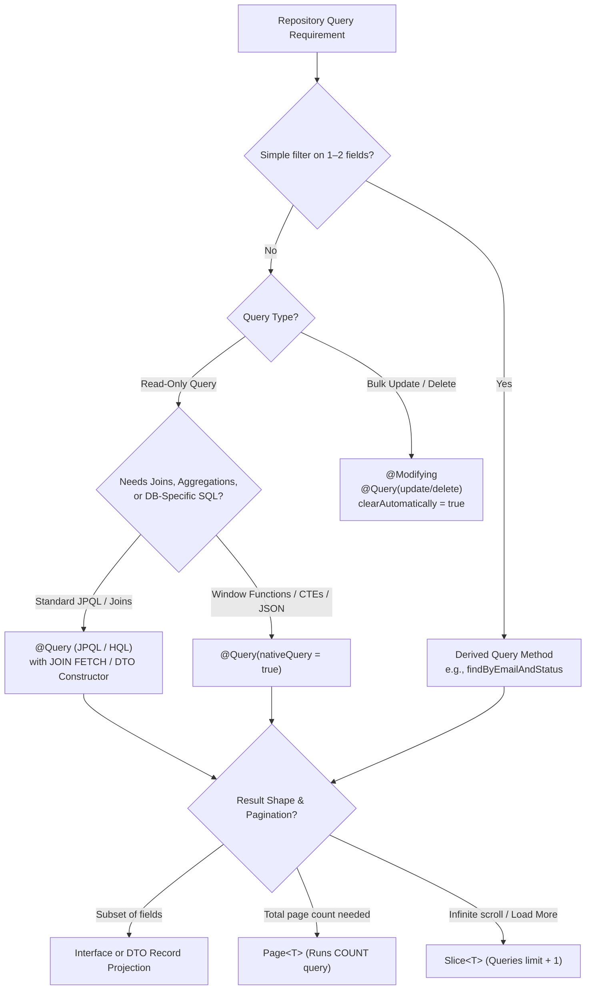

# Derived Queries & @Query

Spring Data JPA generates SQL queries from repository method signatures, provides explicit JPQL via `@Query`, and supports native SQL, projections, and pagination. In SDE2 interviews, the focus is on query strategy trade-offs, first-level cache synchronization with `@Modifying`, and the performance implications of `Page` versus `Slice`.

---

## Query Strategy Decision Tree



---

## Derived queries

Spring Data JPA parses repository method names into ASTs (Abstract Syntax Trees) at application startup and translates them into JPQL queries.

```java
public interface UserRepository extends JpaRepository<User, Long> {
    Optional<User> findByEmail(String email);

    boolean existsByEmailAndTenantId(String email, Long tenantId);

    List<User> findByStatusOrderByCreatedAtDesc(UserStatus status);
}
```

### Common prefixes

- `findBy...` / `getBy...` / `readBy...` / `queryBy...` / `searchBy...` / `streamBy...`
- `existsBy...` (generates `SELECT 1 ...` or count check)
- `countBy...` (generates `SELECT COUNT(...)`)
- `deleteBy...` / `removeBy...` (executes select then individual delete, or bulk delete depending on repository configuration)

### Common keywords

- **Logical:** `And`, `Or`
- **Comparison:** `Between`, `LessThan`, `LessThanEqual`, `GreaterThan`, `GreaterThanEqual`, `In`, `NotIn`
- **Nullability:** `IsNull`, `IsNotNull`
- **String Matching:** `StartingWith`, `EndingWith`, `Containing`, `Like`, `IgnoreCase`
- **Ordering & Limiting:** `OrderBy...Asc/Desc`, `Top<N>`, `First<N>`, `Distinct`

---

## When derived queries are good

Use derived queries for simple, high-readability predicates involving 1 or 2 properties:

```java
List<Order> findByStatus(OrderStatus status);

List<Order> findByCustomerIdAndStatus(Long customerId, OrderStatus status);

boolean existsByEmail(String email);
```

### Advantages

1. **Boilerplate-free:** No explicit JPQL or SQL strings to maintain.
2. **Fail-fast validation at startup:** Spring validates the property path against the JPA entity metadata during bootstrap.

```java
// Example mistake:
List<User> findByEmailAddress(String email);
```

If the entity property is `email` rather than `emailAddress`, the application context fails to start immediately with a `PropertyReferenceException`.

---

## When to use @Query

Switch from derived queries to explicit `@Query` annotations when method names become unwieldy, or when the query requires joins, aggregations, or complex expressions.

```java
@Query("""
    select o
    from Order o
    join fetch o.items
    where o.customer.id = :customerId
      and o.status = :status
      and o.createdAt >= :from
    """)
List<Order> findRecentOrders(
    @Param("customerId") Long customerId,
    @Param("status") OrderStatus status,
    @Param("from") Instant from
);
```

### When to switch to `@Query`

- **3+ filter conditions:** Long method names like `findByTenantIdAndStatusAndCreatedAtGreaterThanAndPaymentStatus` harm readability.
- **Joins and Fetch Joins:** Preventing N+1 queries by using `JOIN FETCH` on lazy associations.
- **Aggregations and Grouping:** Queries utilizing `COUNT`, `SUM`, `AVG`, `GROUP BY`, or `HAVING`.
- **Subqueries and Expressions:** Dynamic expressions, `COALESCE`, `CASE WHEN`, or subqueries that derived method parsers cannot express.

> [!NOTE]
> JPQL operates on JPA entity names and Java property names, not raw database table names and columns.

---

## Native queries

Use native SQL queries (`nativeQuery = true`) only when JPQL cannot express the required query cleanly.

```java
@Query(
    value = """
        select *
        from users
        where tenant_id = :tenantId
          and created_at > now() - interval '30 days'
        """,
    nativeQuery = true
)
List<User> findRecentUsers(@Param("tenantId") Long tenantId);
```

### Typical use cases

- **Vendor-specific SQL functions:** PostgreSQL JSONB operators (`->>`, `@>`), full-text search syntax, or spatial/GIS queries.
- **Advanced SQL features:** Window functions (`ROW_NUMBER()`, `RANK()`), Common Table Expressions (`WITH recursive ...`), or `CONNECT BY`.
- **Database-level performance tuning:** Explicit index hints or vendor-specific join hints.

### Trade-offs

- **Loss of portability:** Tied to a specific database vendor dialect.
- **Raw table/column names:** Refactoring Java entity fields will not trigger compile-time errors in native SQL strings.
- **Type mapping overhead:** Non-entity result sets require explicit `@SqlResultSetMapping` or constructor projections.

---

## @Modifying and the Persistence Context

By default, `@Query` methods are executed as read-only `SELECT` queries. For DML operations (`UPDATE` or `DELETE`), annotate the method with `@Modifying`.

```java
@Modifying(clearAutomatically = true, flushAutomatically = true)
@Transactional
@Query("update User u set u.status = :status where u.tenantId = :tenantId")
int updateStatusForTenant(@Param("status") UserStatus status, @Param("tenantId") Long tenantId);
```

### Critical SDE2 considerations

1. **Transaction requirement:** Modifying queries must execute within an active transaction (`@Transactional`), otherwise Spring throws an `InvalidDataAccessApiUsageException` or `TransactionRequiredException`.
2. **Return types:** Modifying queries return `int` or `Integer` (the number of affected rows), or `void`.
3. **Bypassing the Persistence Context (1st-Level Cache):**
   - Bulk JPQL and native `UPDATE`/`DELETE` queries translate directly to SQL statements executed against the database.
   - They do **not** load entities into the `EntityManager` and do **not** trigger JPA lifecycle callbacks (`@PreUpdate`, `@PostUpdate`).
   - Any entities already loaded in the current `EntityManager` will retain their pre-update state in memory, causing cache drift.
4. **`clearAutomatically` and `flushAutomatically`:**
   - `flushAutomatically = true`: Flushes any pending entity state changes to the database before the bulk query runs, preventing dirty-checking overwrites.
   - `clearAutomatically = true`: Clears the `EntityManager` after the query executes, forcing subsequent entity reads within the same transaction to reload fresh state from the database.

---

## Projections

Projections prevent fetching full entity graphs and lazy association proxies when a read-only endpoint or UI component only requires a few fields.

### 1. Interface-based projections (Closed & Open)

**Closed projection:** Spring Data JPA generates a dynamic proxy implementing the interface and selects only the required columns.

```java
public interface UserSummary {
    Long getId();
    String getEmail();
}

List<UserSummary> findByTenantId(Long tenantId);
```

**Open projection:** Uses SpEL to compute values across properties (forces loading the full entity into memory).

```java
public interface UserDisplay {
    @Value("#{target.firstName + ' ' + target.lastName}")
    String getFullName();
}
```

### 2. DTO Class / Record projections

DTO constructor expressions in JPQL map directly into Java records or immutable classes:

```java
public record UserSummaryDto(Long id, String email) {}

@Query("""
    select new com.example.dto.UserSummaryDto(u.id, u.email)
    from User u
    where u.tenantId = :tenantId
    """)
List<UserSummaryDto> findSummaries(@Param("tenantId") Long tenantId);
```

DTO records avoid proxy creation overhead, make immutability explicit, and decouple repository output from Hibernate persistence contexts.

---

## Page vs Slice vs Keyset Pagination

Spring Data JPA provides two primary abstractions for chunked data retrieval via `Pageable`:

```java
Page<User> findByTenantId(Long tenantId, Pageable pageable);

Slice<User> findByTenantId(Long tenantId, Pageable pageable);
```

| Return Type | Internal Execution Mechanism | Metadata Available | Performance Characteristics | Best Use Case |
|---|---|---|---|---|
| `Page<T>` | Executes data query (`LIMIT / OFFSET`) + explicit `SELECT COUNT(*)` query | Total elements (`getTotalElements()`), Total pages (`getTotalPages()`), `hasNext()` | Higher overhead; `COUNT(*)` scans can become bottlenecks on large tables | Classic numbered pagination controls (e.g., "Page 1 of 50") |
| `Slice<T>` | Executes data query with `LIMIT = requested_size + 1` | `hasNext()`, current page items (no total count/pages) | Low overhead; no count query executed | Infinite scroll, "Load More" feeds, batch processors |

### Deep-paging limitation

Both `Page` and `Slice` default to SQL `LIMIT / OFFSET`. For deep pages on large tables (e.g., `OFFSET 1000000`), the database must scan and discard 1,000,000 rows. For massive datasets, use **keyset pagination** (cursor-based pagination via derived query filters like `where id > :lastSeenId order by id asc limit :size`).

---

## Quick recall

**Q. How does Spring Data validate derived query method names?**
A. During application startup, Spring parses the method name against entity property paths and fails immediately with `PropertyReferenceException` if a field does not exist.

**Q. When should you switch from a derived query to `@Query`?**
A. When filtering across 3+ properties, when using `JOIN FETCH` to prevent N+1 queries, or when performing aggregations/grouping.

**Q. Why do bulk `@Modifying` queries cause persistence context drift?**
A. Bulk updates execute directly in the database without updating the in-memory 1st-level cache (`EntityManager`), leaving previously loaded entities stale unless `clearAutomatically = true` is set.

**Q. What is the difference between `Page<T>` and `Slice<T>`?**
A. `Page<T>` issues a separate `COUNT(*)` query to compute total elements and page numbers; `Slice<T>` fetches `size + 1` rows to check `hasNext()` without running a count query.

**Q. When should you prefer record DTO projections over interface projections?**
A. Record DTOs provide immutable data structures without proxy overhead, work cleanly across service/API boundaries, and make exact selected fields explicit in JPQL constructor expressions.
