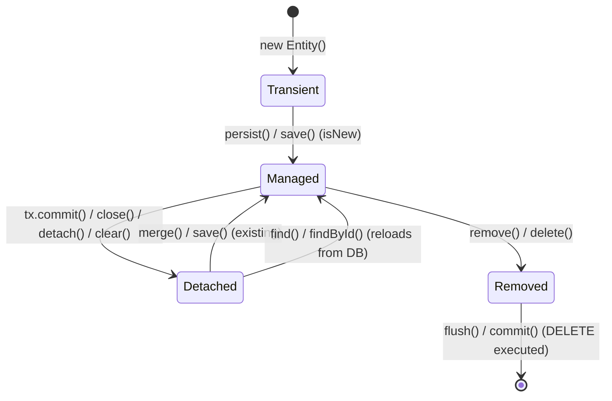

# JPA Entity Lifecycle

The JPA entity lifecycle governs how Hibernate tracks object state transitions, manages synchronization with the database, and executes SQL statements. For senior backend interviews, key evaluation areas include the four entity states, automatic dirty checking boundaries, `persist` vs `merge` mechanics, lifecycle callbacks, and `LazyInitializationException` prevention.

---

## Entity States Overview

A JPA entity instance belongs to one of four states relative to the **Persistence Context** (Hibernate's first-level cache and unit-of-work container, typically scoped to an active transaction):

| State | Definition | Persistence Context Association | Database Representation |
|---|---|---|---|
| **Transient** | Newly instantiated Java object (`new Entity()`) | Not attached | No corresponding DB row or identifier assigned |
| **Managed** | Attached instance tracked for mutations | Attached to active context | Exists in DB (or scheduled for `INSERT` on flush) |
| **Detached** | Previously managed entity disconnected from context | Not attached | Has persistent identifier and existing DB row |
| **Removed** | Managed entity scheduled for deletion | Attached, marked for removal | Row exists until transaction flush/commit executes `DELETE` |

---

## State Transition Diagram



---

## 1. Transient State

A transient object is a standard Java object created with `new`. Hibernate is completely unaware of it:

```java
User user = new User();
user.setEmail("alice@example.com");
```

- **Identity**: Does not have a primary key/database identity assigned (unless manually set before assignment).
- **Tracking**: Changes made to transient objects do not trigger database updates.
- **Transition**: Calling `entityManager.persist(user)` or Spring Data's `userRepository.save(user)` transitions the object to the **Managed** state.

---

## 2. Managed State & Dirty Checking

A managed entity is attached to the current persistence context. Hibernate monitors every modification made to the entity's properties:

```java
@Transactional
public void updateEmail(Long id, String newEmail) {
    User user = userRepository.findById(id).orElseThrow();
    user.setEmail(newEmail);
    // No userRepository.save(user) required!
}
```

### How Dirty Checking Works

1. When an entity enters the managed state (via `find()`, JPQL query, or `persist()`), Hibernate takes an internal **snapshot** of its field values in the first-level cache.
2. During transaction commit (or explicit `flush()`), Hibernate compares the entity's current state with the initial snapshot.
3. If any field differs, Hibernate automatically generates and executes the appropriate SQL `UPDATE` statement.

> **Key Rule**: Dirty checking operates **only** on managed entities inside an open, active persistence context/transaction. If the transaction commits or rolls back, or the entity is detached, mutations are ignored.

---

## 3. Detached State

A detached entity represents an object that has an existing database identifier but is no longer associated with an active persistence context.

```java
User user = userService.getUser(id); // Transaction finishes, session closes
user.setEmail("updated@example.com"); // Not tracked; no SQL UPDATE will run
```

### Common Detachment Causes
- Transaction boundary ends (e.g., entity returned from `@Transactional` service to controller).
- Explicit detachment via `entityManager.detach(entity)` or `entityManager.clear()`.
- Session closure or serialization across network/HTTP boundaries.

### Re-attaching Detached Entities
1. **Reload from DB**: Retrieve a fresh managed instance using `findById(id)` inside a new transaction and apply changes.
2. **Merge**: Pass the detached instance to `entityManager.merge(detached)` or `repository.save(detached)`.

---

## 4. Removed State

An entity marked as removed is scheduled for deletion from the database:

```java
@Transactional
public void deleteUser(Long id) {
    User user = userRepository.findById(id).orElseThrow();
    userRepository.delete(user); // or entityManager.remove(user)
}
```

- The entity remains in the persistence context in the `Removed` state until the next flush/commit.
- At flush/commit, Hibernate issues the SQL `DELETE` statement.
- If the entity is accessed after the transaction commits, it is treated as transient (or detached depending on identifier retention).

---

## persist() vs merge() vs save()

| Method | Source | Target State | Behavior & Nuance |
|---|---|---|---|
| `persist(entity)` | JPA `EntityManager` | Transient $\rightarrow$ Managed | Makes entity managed. Throws exception if entity is detached with existing ID (unless ID generator allows). Does not return a new reference. |
| `merge(entity)` | JPA `EntityManager` | Detached $\rightarrow$ Managed | Copies state from detached object into a **new or existing managed instance** in the current context. **Returns the managed copy**. |
| `save(entity)` | Spring Data JPA | Handles both | Checks `entityInformation.isNew(entity)`: calls `persist()` if new, otherwise calls `merge()`. |

### The Merge Trap

Calling `merge()` does **not** make the passed object managed; it returns a separate managed reference:

```java
User detachedUser = new User();
detachedUser.setId(42L);
detachedUser.setEmail("original@example.com");

User managedUser = entityManager.merge(detachedUser);

// Pitfall: Modifying the detached instance has no effect!
detachedUser.setEmail("ignored@example.com"); // NOT tracked!

// Correct: Modify the returned managed reference
managedUser.setEmail("persisted@example.com"); // Tracked via dirty checking
```

> **Interview Insight**: Always assign the return value of `repository.save()` or `entityManager.merge()` back to the variable: `user = userRepository.save(user);`.

---

## Entity Lifecycle Callbacks

JPA provides lifecycle annotations to intercept entity state transitions without external listeners:

```java
@Entity
public class Order {
    @Id
    @GeneratedValue(strategy = GenerationType.IDENTITY)
    private Long id;

    private Instant createdAt;
    private Instant updatedAt;

    @PrePersist
    void onPrePersist() {
        this.createdAt = Instant.now();
        this.updatedAt = Instant.now();
    }

    @PreUpdate
    void onPreUpdate() {
        this.updatedAt = Instant.now();
    }
}
```

### Complete Callback Annotations
- `@PrePersist` / `@PostPersist`: Before and after `INSERT` execution / entity becomes managed.
- `@PreUpdate` / `@PostUpdate`: Before and after SQL `UPDATE` dirty check flush.
- `@PreRemove` / `@PostRemove`: Before and after SQL `DELETE` execution.
- `@PostLoad`: Invoked immediately after an entity is loaded from the database into the persistence context.

> **Best Practice**: Keep lifecycle callbacks purely computational (e.g., setting timestamps, sanitizing input). Never invoke Spring repositories, inject dependencies, or perform remote I/O within JPA entity callbacks.

---

## LazyInitializationException & Context Boundaries

`LazyInitializationException` occurs when application code attempts to navigate an uninitialized lazy association (`FetchType.LAZY`) after the Hibernate persistence context has closed.

```java
// Service Layer
@Transactional(readOnly = true)
public Order findOrder(Long id) {
    return orderRepository.findById(id).orElseThrow(); // items proxy is uninitialized
}

// Controller / View Layer (Persistence Context is closed!)
public void renderInvoice(Long orderId) {
    Order order = findOrder(orderId);
    int itemCount = order.getItems().size(); // Throws LazyInitializationException!
}
```

### Remediation Strategies
1. **JOIN FETCH / JPQL Query**: Eagerly fetch associations needed for the specific use case:
   ```java
   @Query("SELECT o FROM Order o JOIN FETCH o.items WHERE o.id = :id")
   Optional<Order> findByIdWithItems(@Param("id") Long id);
   ```
2. **`@EntityGraph`**: Declaratively specify fetch attributes per repository method.
3. **DTO Projections**: Query directly into record/DTO structures (`SELECT new com.example.OrderSummaryDto(...)`), eliminating entity attachment and proxy overhead entirely.
4. **Avoid Open Session in View (OSIV)**: Keep OSIV disabled in production APIs (`spring.jpa.open-in-view=false`) to prevent hidden N+1 queries and connection pool exhaustion outside transactional boundaries.

---

## Quick recall

**Q. What are the four JPA entity lifecycle states?**
A. Transient (new, untracked), Managed (attached, tracked), Detached (previously attached, untracked), and Removed (scheduled for deletion).

**Q. Why is calling `userRepository.save()` unnecessary when modifying a loaded entity?**
A. Inside a `@Transactional` boundary, Hibernate dirty checking detects modifications against the initial snapshot at transaction commit and automatically executes SQL `UPDATE`.

**Q. What is the difference between `persist()` and `merge()`?**
A. `persist()` makes a transient entity managed in-place. `merge()` copies the state of a detached entity into a managed instance and returns the managed reference.

**Q. Why does modifying the object passed to `entityManager.merge(entity)` not save changes?**
A. The passed argument remains detached; only the returned instance is attached to the persistence context.

**Q. What triggers a `LazyInitializationException`?**
A. Accessing an uninitialized lazy proxy or collection after the persistence context (session/transaction) has closed.

**Q. How should `LazyInitializationException` be resolved in production services?**
A. Use `JOIN FETCH` queries, `@EntityGraph`, or DTO projections inside the transactional service layer; avoid relying on Open Session in View.
