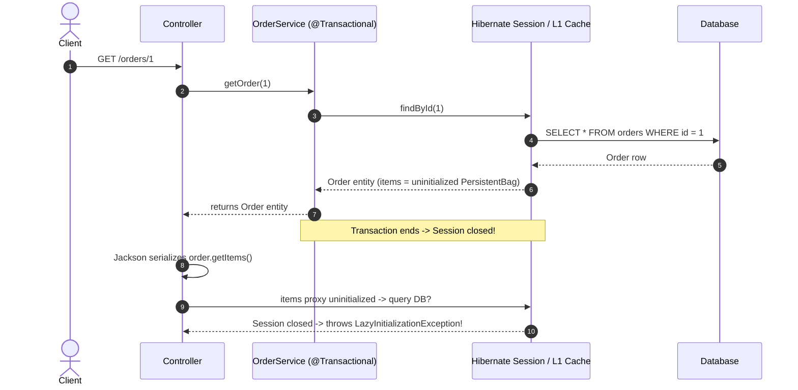

# Lazy vs Eager Loading & N+1

Lazy and eager loading control when JPA entities and their related associations are fetched from the database into the persistence context (Hibernate `Session` / JPA `EntityManager`). For senior backend interviews, mastery requires understanding the default fetch semantics, the mechanics of `LazyInitializationException`, identifying and solving N+1 query problems across different access patterns, and understanding the architectural trade-offs of Open Session in View (OSIV).

---

## FetchType defaults

JPA defines two fetch strategies via the `javax.persistence.FetchType` / `jakarta.persistence.FetchType` enum:

- **`FetchType.LAZY`**: The association is represented by a dynamic proxy or uninitialized collection container. The underlying SQL query is deferred until the property or collection is first accessed.
- **`FetchType.EAGER`**: The association is fetched immediately alongside the owning entity, either via an automatic SQL `JOIN` (for single entity lookups) or an immediate secondary `SELECT`.

| Association Annotation | Default FetchType | Reason / Risk |
|---|---|---|
| `@OneToMany` | `LAZY` | Collections can contain thousands of records; eager fetching could exhaust memory. |
| `@ManyToMany` | `LAZY` | Many-to-many collections can explode in size; lazy by default. |
| `@ManyToOne` | `EAGER` | Single-valued relation; defaults to eager in the JPA specification. |
| `@OneToOne` | `EAGER` | Single-valued relation; defaults to eager in the JPA specification. |

### Practical Production Rule

> **Explicitly set `FetchType.LAZY` on all `@ManyToOne` and `@OneToOne` mappings.**
> Eager loading binds a static fetch plan to the entity mapping, forcing Hibernate to load associated entities on every query—even when the use case only requires parent attributes.

---

## Lazy loading mechanics

When Hibernate loads an entity with a lazy association, it populates the field with a runtime proxy (e.g., ByteBuddy proxy for single entities, or `PersistentBag` / `PersistentSet` for collections) containing only the entity's primary key.

```java
Order order = orderRepository.findById(id).orElseThrow();
// Order scalar columns are loaded in the persistence context.

List<OrderItem> items = order.getItems();
// Returns an uninitialized Hibernate PersistentBag (no SQL fired yet).

items.size();
// Accessing contents initializes the collection.
// SQL executes HERE if the JPA EntityManager/Session is currently active.
```

If the property is touched while the persistence context is active, Hibernate transparently issues a `SELECT` query to populate the proxy.

---

## LazyInitializationException & The Transaction Boundary

A `LazyInitializationException` occurs when application code attempts to navigate or serialize an uninitialized lazy proxy or collection after the underlying Hibernate `Session` / `EntityManager` has closed.

### The Problematic Flow



```java
// Anti-pattern: Returning entities directly past the transaction boundary
@Transactional(readOnly = true)
public Order getOrder(Long id) {
    return orderRepository.findById(id).orElseThrow();
}

// In the Controller or Jackson JSON serialization:
Order order = orderService.getOrder(id);
order.getItems().size(); // Throws LazyInitializationException: could not initialize proxy - no Session
```

### The Solution: Service-Boundary DTOs

Fetch the required data explicitly within the transactional boundary and map it to an immutable DTO or record before returning to the web layer:

```java
@Transactional(readOnly = true)
public OrderDetailsResponse getOrder(Long id) {
    Order order = orderRepository.findWithItems(id)
            .orElseThrow(() -> new OrderNotFoundException(id));
    return OrderDetailsResponse.from(order);
}
```

---

## The N+1 Problem

The N+1 query problem occurs when loading a collection of $N$ parent entities results in 1 initial query to fetch the parents, followed by $N$ individual subsequent queries to fetch the associated child records when iterated.

```java
// Query 1: Fetches N order records
List<Order> orders = orderRepository.findAll();

// Queries 2..(N+1): Hibernate executes 1 query per order to load items
for (Order order : orders) {
    System.out.println("Items count: " + order.getItems().size());
}
```

For 100 orders, this executes **101 SQL queries**, causing severe latency spikes, connection pool starvation, and database CPU contention.

---

## Solving N+1: Four Production Strategies

### 1. `JOIN FETCH` (JPQL / HQL)

Use `JOIN FETCH` when a specific query always requires the associated entity or collection.

```java
public interface OrderRepository extends JpaRepository<Order, Long> {

    @Query("""
        SELECT o
        FROM Order o
        JOIN FETCH o.items
        WHERE o.status = :status
        """)
    List<Order> findAllWithItems(@Param("status") OrderStatus status);
}
```

- **How it works**: Compiles to a single SQL `INNER JOIN` (or `LEFT JOIN FETCH` for optional associations), hydrating parent entities and child collections in one database round-trip.
- **Caveats**:
  - **Multiple Collection Fetches**: Do not fetch-join multiple `@OneToMany` or `@ManyToMany` collections in a single query. It causes a Cartesian product of rows, triggering Hibernate's `MultipleBagFetchException`.
  - **Pagination with Collection `JOIN FETCH`**: Using `Pageable` with `JOIN FETCH` on a collection causes Hibernate to emit `HHH000104: firstResult/maxResults specified with collection fetch; applying in memory!`, pulling the entire table into JVM memory before paginating.

---

### 2. `@EntityGraph` (Spring Data JPA)

`@EntityGraph` provides dynamic fetch plans on repository methods without hand-writing custom JPQL.

```java
public interface OrderRepository extends JpaRepository<Order, Long> {

    // Overriding findById or custom derived finder with eager graph
    @EntityGraph(attributePaths = {"customer", "items"})
    Optional<Order> findWithDetailsById(Long id);
}
```

- **Graph Types**:
  - `EntityGraphType.FETCH` (Default): Specified attributes are treated as `EAGER`; all other attributes are treated as `LAZY`.
  - `EntityGraphType.LOAD`: Specified attributes are treated as `EAGER`; unspecified attributes retain their configured mapping defaults.

---

### 3. Batch Fetching (`@BatchSize` / `default_batch_fetch_size`)

Batch fetching tells Hibernate to load uninitialized lazy proxies in batches using an SQL `IN` predicate instead of one-by-one.

```java
@Entity
public class Order {
    @Id
    private Long id;

    @OneToMany(mappedBy = "order", fetch = FetchType.LAZY)
    @BatchSize(size = 25)
    private List<OrderItem> items = new ArrayList<>();
}
```

Or configure globally in `application.yml`:

```yaml
spring:
  jpa:
    properties:
      hibernate:
        default_batch_fetch_size: 25
```

- **How it works**: When the first `order.getItems()` is initialized, Hibernate looks ahead in the persistence context and selects items for up to 25 parent IDs:
  ```sql
  SELECT * FROM order_items WHERE order_id IN (?, ?, ?, ..., ?)
  ```
- **Impact**: Reduces N+1 from $1 + N$ queries down to $1 + \lceil N / \text{batch\_size} \rceil$ queries (e.g., 101 queries becomes 5 queries for 100 records with batch size 25).
- **Advantage**: Safe to use alongside `Pageable` pagination because the initial parent query remains a standard paginated `SELECT` with `LIMIT`/`OFFSET`.

---

### 4. DTO Projections (Constructor Expressions / Records)

For read-only API queries, selecting DTO projections directly in JPQL is the most performant and memory-efficient approach.

```java
public record OrderSummaryDto(Long id, String orderNumber, String customerName, BigDecimal totalAmount) {}

public interface OrderRepository extends JpaRepository<Order, Long> {

    @Query("""
        SELECT new com.example.dto.OrderSummaryDto(o.id, o.orderNumber, c.name, o.totalAmount)
        FROM Order o
        JOIN o.customer c
        WHERE o.status = :status
        """)
    List<OrderSummaryDto> findSummariesByStatus(@Param("status") OrderStatus status);
}
```

- **Benefits**:
  - Eliminates proxy allocation and dirty checking overhead in the persistence context.
  - Generates SQL selecting only the required columns instead of `SELECT *`.
  - Prevents `LazyInitializationException` and Jackson serialization recursion by design.

---

## Why `FetchType.EAGER` is an Anti-Pattern

Defining `FetchType.EAGER` on entity field declarations is dangerous in production:

1. **Global Unconditional Execution**: Eager associations are fetched on *every* query (including `findById`, `findAll`, JPQL queries, and cascade operations), even when the caller only needs a single field.
2. **Hidden N+1 on JPQL Queries**: Declaring `fetch = FetchType.EAGER` does **not** prevent N+1 queries when using JPQL. Running `SELECT o FROM Order o` in JPQL will query the orders table first, and Hibernate will then fire $N$ secondary queries to fulfill the eager contract for each child entity.
3. **Cartesian Product Risk**: Multiple eager associations join together across tables, multiplying result set sizes exponentially and exhausting memory.

---

## The Non-Owning `@OneToOne` Lazy Trap

In JPA, declaring `@OneToOne(fetch = FetchType.LAZY, mappedBy = "user")` on the non-owning side (the entity without the `@JoinColumn`) **still results in immediate eager loading**.

```java
@Entity
public class User {
    @Id
    private Long id;

    // Non-owning side: still eagerly fetched despite LAZY!
    @OneToOne(mappedBy = "user", fetch = FetchType.LAZY)
    private UserProfile profile;
}
```

### Why does this happen?
Java proxies cannot intercept a `null` check. Hibernate needs to know whether `user.getProfile()` should be set to `null` or to a proxy object. Because the foreign key column lives in the `user_profiles` table (the owning side), the `users` table has no foreign key column to check. Hibernate must execute an immediate query against `user_profiles` to verify if a child row exists.

### Remedies:
1. Make the parent entity the owning side by placing `@JoinColumn` on `User`.
2. Use bytecode enhancement (`hibernate-enhance-maven-plugin`) for field-level lazy interceptors.
3. Query `UserProfile` directly or use DTO projections.

---

## Open Session in View (OSIV)

Spring Boot defaults `spring.jpa.open-in-view=true`.

- **Mechanism**: Registers an `OpenEntityManagerInViewFilter` / `Interceptor` that binds the JPA `EntityManager` to the entire HTTP request lifecycle, keeping the Hibernate Session open during view rendering / JSON serialization.
- **Why it looks convenient**: Prevents `LazyInitializationException` because controllers and Jackson serializers can navigate uninitialized proxies.
- **Why it is hazardous in production**:
  1. **Connection Pool Exhaustion**: Database connections are held open while the application performs slow network I/O, template rendering, or JSON serialization.
  2. **Uncontrolled N+1 Queries**: Serializing an entity tree in Jackson triggers hidden database queries inside the HTTP response loop, untracked by service transactions.
  3. **Architecture Violation**: Database access leaks into the presentation tier.

### Recommended Configuration
```yaml
spring:
  jpa:
    open-in-view: false
```
Enforce data retrieval within `@Transactional` service methods and return explicit DTOs.

---

## N+1 vs Circular JSON Serialization

These two problems often appear together during entity serialization but have completely distinct causes:

| Dimension | N+1 Query Problem | Circular JSON Serialization |
|---|---|---|
| **Layer** | Persistence / Database layer | Presentation / Serialization layer (Jackson) |
| **Root Cause** | Iterating lazy associations triggers $N$ secondary SQL queries. | Bidirectional entity references (`User -> Order -> User -> ...`) cause infinite Jackson recursion. |
| **Symptom** | Slow API response times, database query spikes. | `StackOverflowError` or `JsonMappingException: Direct self-reference leading to cycle`. |
| **Fixes** | `JOIN FETCH`, `@EntityGraph`, `@BatchSize`, DTO projections. | `@JsonIgnore`, `@JsonManagedReference` / `@JsonBackReference`, `@JsonIdentityInfo`, or DTOs. |

---

## Quick recall

**Q. What are the default fetch types in JPA?**
A. `@OneToMany` and `@ManyToMany` are `LAZY`. `@ManyToOne` and `@OneToOne` are `EAGER`.

**Q. What triggers `LazyInitializationException`?**
A. Accessing an uninitialized lazy proxy or collection after the Hibernate `Session` / `EntityManager` has closed.

**Q. What is the N+1 problem and what causes it?**
A. Executing 1 query to fetch $N$ parent entities, followed by $N$ separate queries to load each entity's lazy association upon access.

**Q. What are the four primary ways to resolve N+1?**
A. 1) `JOIN FETCH` in JPQL, 2) `@EntityGraph` in Spring Data, 3) Batch fetching via `@BatchSize`, 4) DTO projections.

**Q. Why does JPQL `SELECT o FROM Order o` still cause N+1 when an association is configured as `FetchType.EAGER`?**
A. JPQL parses the query directly without automatic join expansion; Hibernate then executes $N$ secondary queries to fulfill the eager contract.

**Q. Why does `@OneToOne(mappedBy = "...", fetch = FetchType.LAZY)` fail to lazy-load by default?**
A. The parent table lacks the foreign key; Hibernate must query the child table immediately to determine if the reference is `null` or should be proxied.

**Q. Why should `spring.jpa.open-in-view` be set to `false` in production?**
A. OSIV holds database connections open across the entire HTTP request lifecycle and masks lazy queries during JSON serialization, causing connection pool exhaustion.
