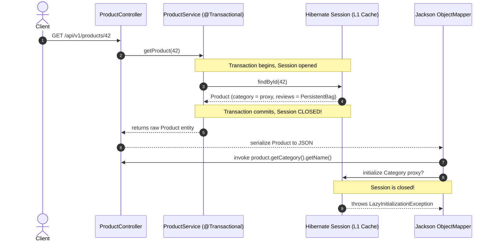
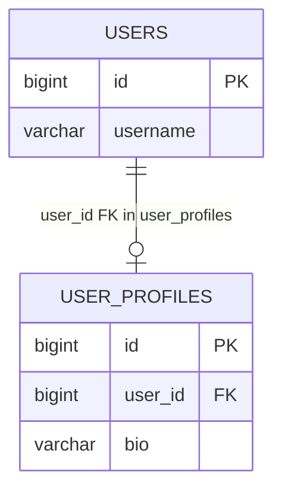

# Solutions: Lazy vs Eager Loading & N+1 Query Optimization

---

## Solution: triage-paginated-n-plus-one - Mitigating N+1 in Paginated Order History

### 1. Analysis of the Pagination Failure
- **In-Memory Pagination Hazard**: When Hibernate encounters a `JOIN FETCH` on a collection association (`o.items`, `o.discounts`) alongside pagination parameters (`Pageable` / `firstResult` / `maxResults`), applying an SQL `LIMIT` / `OFFSET` at the database level would truncate rows unpredictably. Because joining a 1-to-many relationship produces a Cartesian product (multiple result rows per parent `Order`), a SQL limit of 20 would return 20 joined rows (which might represent only 2 distinct orders).
- **Runtime Behavior & Warning**: Hibernate logs `HHH000104: firstResult/maxResults specified with collection fetch; applying in memory!`. To preserve correct entity graphs, Hibernate removes `LIMIT` and `OFFSET` from the generated SQL, fetches **the entire dataset** matching the `WHERE` clause into JVM memory, and applies pagination in Java heap space.
- **Memory & Latency Impact**: For large production tables, this causes severe latency spikes, extreme database I/O, thread stalls, high Garbage Collection overhead, and eventual `java.lang.OutOfMemoryError` (OOM).

---

### 2. Explanation of the Bag Fetch Constraint
- **`MultipleBagFetchException`**: In Hibernate, a `java.util.List` mapped without an `@OrderColumn` or `@IndexColumn` is treated as a **Bag** (an unordered collection allowing duplicates).
- **Cartesian Product Problem**: Fetching two or more bags simultaneously (`o.items` and `o.discounts`) via `JOIN FETCH` in a single JPQL query produces a Cartesian product ($N \times M$ rows for each parent).
- **De-duplication Impossibility**: Because bags do not enforce uniqueness (unlike `Set`) and do not have an explicit ordering index, Hibernate cannot determine how to de-duplicate and reconstruct the individual child collections safely from the Cartesian result set without risking data corruption.

---

### 3. Production Architecture & Remediation

A production-grade solution uses **single-valued fetch joins with batch fetching** or a **two-step ID-based fetch**:

#### Strategy A: Single-Valued Join Fetch + Global Batch Fetching (Recommended)

1. **Repository Query**: Fetch-join only single-valued associations (`@ManyToOne` `customer`) in the paginated query. Single-valued associations maintain a 1:1 row relationship and are completely safe with SQL `LIMIT`/`OFFSET`:

```java
public interface OrderRepository extends JpaRepository<Order, Long> {

    @Query(value = """
        SELECT o FROM Order o
        JOIN FETCH o.customer
        """,
        countQuery = "SELECT count(o) FROM Order o")
    Page<Order> findRecentOrders(Pageable pageable);
}
```

2. **Global Batch Configuration**: Configure Hibernate batch fetching in `application.yml`:

```yaml
spring:
  jpa:
    properties:
      hibernate:
        default_batch_fetch_size: 50
```

3. **Execution Flow & Query Count**:
   - **Query 1**: Paginated query fetching 20 `Order` rows + `Customer` with SQL `LIMIT 20 OFFSET 0`.
   - **Query 2**: Count query for `Page<Order>` metadata (`SELECT count(o) FROM Order o`).
   - **Query 3 (Batch)**: `SELECT * FROM order_items WHERE order_id IN (?, ?, ..., ?)` for the 20 orders.
   - **Query 4 (Batch)**: `SELECT * FROM discounts WHERE order_id IN (?, ?, ..., ?)` for the 20 orders.
   - **Total Queries**: Exactly **4 queries** regardless of dataset size, executing true database-level pagination.

#### Strategy B: Two-Step ID Pagination

If batch fetching is not globally enabled:
1. Step 1: Query only the paginated list of Order IDs: `SELECT o.id FROM Order o` with `Pageable`.
2. Step 2: Fetch full entity graphs in two separate queries using `WHERE o.id IN (:ids)` (one query with `JOIN FETCH o.items`, another with `JOIN FETCH o.discounts`), and merge in the persistence context.

---

## Solution: resolve-lazy-init-after-osiv-disable - Eliminating LazyInitializationException Post OSIV Teardown

### 1. Root Cause & Lifecycle Trace



- **Under OSIV (`open-in-view: true`)**: Spring's `OpenEntityManagerInViewInterceptor` kept the `EntityManager` and underlying `Session` open for the duration of the HTTP request. When Jackson serialized `product.getCategory()` in the controller/view layer, the active session transparently executed lazy SQL queries.
- **Post OSIV Teardown (`open-in-view: false`)**: The `Session` lifecycle is bound strictly to `@Transactional`. When `ProductService.getProduct()` returns, the transaction commits and the `Session` closes immediately. When Jackson invokes getters on uninitialized proxies (`Category`) or collections (`reviews`), no active session is bound to the thread, triggering `LazyInitializationException: could not initialize proxy - no Session`.

---

### 2. Remediation Plan

#### Approach A: Dynamic Fetch Plan (`@EntityGraph`) + Service-Boundary DTO

1. **Repository**: Define an explicit entity graph fetch plan on the repository method:

```java
public interface ProductRepository extends JpaRepository<Product, Long> {

    @EntityGraph(attributePaths = {"category"})
    Optional<Product> findDetailedById(Long id);
}
```

2. **DTO & Service Mapping**: Fetch eagerly within the transaction and map to an immutable DTO before crossing the service boundary:

```java
public record ProductResponse(
    Long id,
    String name,
    String categoryName,
    List<String> reviewComments
) {
    public static ProductResponse from(Product product) {
        return new ProductResponse(
            product.getId(),
            product.getName(),
            product.getCategory() != null ? product.getCategory().getName() : null,
            product.getReviews().stream().map(Review::getComment).toList()
        );
    }
}

@Service
public class ProductService {
    private final ProductRepository productRepository;

    public ProductService(ProductRepository productRepository) {
        this.productRepository = productRepository;
    }

    @Transactional(readOnly = true)
    public ProductResponse getProduct(Long id) {
        Product product = productRepository.findDetailedById(id)
            .orElseThrow(() -> new EntityNotFoundException("Product not found: " + id));
        return ProductResponse.from(product);
    }
}
```

#### Approach B: Direct JPQL Constructor DTO Projection

Query directly into an immutable record without loading managed entities into the persistence context:

```java
public record ProductSummaryDto(Long id, String name, String categoryName) {}

public interface ProductRepository extends JpaRepository<Product, Long> {

    @Query("""
        SELECT new com.example.catalog.ProductSummaryDto(
            p.id,
            p.name,
            c.name
        )
        FROM Product p
        LEFT JOIN p.category c
        WHERE p.id = :id
        """)
    Optional<ProductSummaryDto> findSummaryById(@Param("id") Long id);
}
```

---

### 3. Trade-off Evaluation Matrix

| Dimension | Approach A (`@EntityGraph` + DTO Mapping) | Approach B (JPQL Constructor DTO Projection) |
|---|---|---|
| **Use Cases** | Write/update workflows, domain logic validation, entities requiring modifications before saving. | Read-heavy public APIs, search lists, analytics dashboards, high-throughput read paths. |
| **Performance & Memory** | Hydrates full managed entities into L1 cache; runs dirty checking on transaction close; selects all entity columns (`SELECT *`). | Zero entity hydration overhead; no dirty checking; selects only requested columns in SQL (`SELECT p.id, p.name, c.name`). |
| **Collection Associations** | Handles nested 1-to-many collections naturally via entity mapping or batching. | Difficult to map 1-to-many child collections directly in flat constructor expressions without database array aggregation or secondary queries. |
| **Reusability** | Domain entities can be reused across multiple service workflows. | DTO is tightly coupled to the specific screen/endpoint requirement. |

---

## Solution: non-owning-one-to-one-leak - Diagnosing the Non-Owning @OneToOne Eager Query Leak

### 1. Why Java Dynamic Proxies Fail on Non-Owning `@OneToOne`
- **Nullable Proxy Constraint**: In Java, an entity field reference is either `null` or points to a non-null object/proxy. A proxy cannot magically evaluate to `null` if the target record does not exist.
- **The Non-Owning Dilemma**: When loading a `User`, Hibernate must determine whether `user.getProfile()` should be `null` (no profile exists) or an uninitialized `UserProfile` proxy.
- **Forced Secondary Query**: Because dynamic proxies cannot intercept `null` checks without being instantiated, Hibernate is forced to execute an immediate SQL `SELECT` against `user_profiles` to verify if a matching row exists, completely bypassing `FetchType.LAZY`.

---

### 2. Ownership Mechanics & Foreign Key Placement



- **Owning Side (`UserProfile`)**: Contains the `@JoinColumn(name = "user_id")`. When Hibernate loads `UserProfile`, it inspects the foreign key column `user_id` directly in the `user_profiles` table:
  - If `user_id` is `NULL`, Hibernate sets `userProfile.getUser()` to `null`.
  - If `user_id` is `101`, Hibernate safely creates an uninitialized `User` proxy with ID `101` **without querying the `users` table**.
- **Non-Owning Side (`User`)**: Has `mappedBy = "user"`. The `users` table has **no foreign key column**. Hibernate has no way of knowing whether a child row exists in `user_profiles` without querying `user_profiles WHERE user_id = ?`.

---

### 3. Architectural Fixes

#### Fix 1: Invert Ownership or Use `@MapsId` (Shared Primary Key)

Make `UserProfile` share the exact same primary key as `User` via `@MapsId`. This guarantees a 1:1 identifier match:

```java
@Entity
@Table(name = "user_profiles")
public class UserProfile {
    @Id
    private Long id;

    @OneToOne(fetch = FetchType.LAZY)
    @MapsId
    @JoinColumn(name = "id")
    private User user;

    private String bio;
}
```

Or move the foreign key column `profile_id` into the `users` table if `User` is the natural owner.

#### Fix 2: Hibernate Bytecode Enhancement (Field-Level Interceptors)

Enable build-time bytecode enhancement via `pom.xml`. This replaces standard dynamic proxies with field-level interceptors:

```xml
<plugin>
    <groupId>org.hibernate.orm.tooling</groupId>
    <artifactId>hibernate-enhance-maven-plugin</artifactId>
    <version>${hibernate.version}</version>
    <executions>
        <execution>
            <configuration>
                <enableLazyInitialization>true</enableLazyInitialization>
            </configuration>
            <goals>
                <goal>enhance</goal>
            </goals>
        </execution>
    </executions>
</plugin>
```

Annotate the field with `@LazyToOne(LazyToOneOption.NO_PROXY)`:
```java
@OneToOne(mappedBy = "user", fetch = FetchType.LAZY)
@LazyToOne(LazyToOneOption.NO_PROXY)
private UserProfile profile;
```

#### Fix 3: Query via DTO Projections or Explicit Querying
Avoid referencing `user.getProfile()` directly during bulk queries. Query `User` scalar columns via DTO projections, and fetch `UserProfile` on demand via `userProfileRepository.findByUserId(userId)`.
