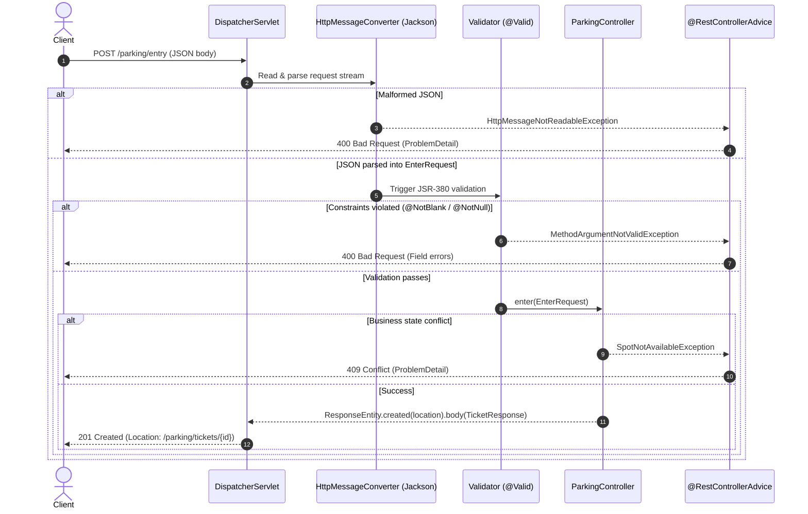

# Spring API Quick Revision

Use this as the pre-implementation checklist before writing a Spring REST API in an interview or practice project. It links to the deeper pages instead of duplicating them.

## Controller shape

```java
@RestController
@RequestMapping("/parking")
@RequiredArgsConstructor
public class ParkingController {
    private final ParkingService parkingService;

    @PostMapping("/entry")
    public ResponseEntity<TicketResponse> enter(@Valid @RequestBody EnterRequest request) {
        Vehicle vehicle = new Vehicle(request.getRegistrationNumber(), request.getVehicleType());
        Ticket ticket = parkingService.enterVehicle(vehicle, request.getEntryGateId());
        URI location = URI.create("/parking/tickets/" + ticket.getId());
        return ResponseEntity.created(location).body(TicketResponse.from(ticket));
    }
}
```

- `@RestController` = `@Controller` + `@ResponseBody`.
- Controller methods should be `public`.
- Keep controller thin: validate request, map request to service input, map service output to response.
- Prefer constructor injection through `final` fields and `@RequiredArgsConstructor` (immutable, fail-fast, easily mockable in unit tests without Spring reflection).
- Resource creation returns `201 Created` with a `Location` header pointing to the new resource; reads/updates without a new URI return `200 OK`.

Read next: [Spring REST](../rest/)

### Request execution flow

Reader question: *How does Spring MVC process an incoming HTTP request through deserialization, Bean Validation, controller execution, and global exception handling?*



## URL and parameter choices

| Case | Use | Example |
|---|---|---|
| Identify one resource | `@PathVariable` | `/tickets/{ticketId}/quote` |
| Filter or query | `@RequestParam` | `/availability?vehicleType=CAR` |
| Structured command data | `@RequestBody` | `POST /entry` with JSON body |
| Client metadata | `@RequestHeader` | `X-Correlation-Id` |

Resource identity comes before action/sub-resource:

```text
/tickets/{ticketId}/quote
/tickets/{ticketId}/exit
```

Avoid `/tickets/quote/{ticketId}` because it puts the action before the resource identity.

- Optional query params: Use `@RequestParam(required = false, defaultValue = "10") int limit`.
- Path/Query validation trap: `@Valid` on method parameters only validates `@RequestBody`. Validating `@PathVariable` or `@RequestParam` (e.g., `@Min(1)`) requires class-level `@Validated` on the controller. When violated, Spring throws `ConstraintViolationException` (defaults to 500 if unmapped), *not* `MethodArgumentNotValidException`.

Read next: [Spring MVC](../mvc/)

## HTTP method choices

| Method | Safe (RFC 9110) | Idempotent | Use when | Parking example |
|---|---|---|---|---|
| `GET` | Yes | Yes | Read only representation | `GET /parking/availability?vehicleType=CAR` |
| `POST` | No | No | Create resource or execute command | `POST /parking/entry`, `POST /parking/tickets/{ticketId}/exit` |
| `PUT` | No | Yes | Replace/set known resource completely | `PUT /tickets/{ticketId}` |
| `PATCH` | No | No | Partially update delta fields | `PATCH /tickets/{ticketId}` |
| `DELETE` | No | Yes | Remove resource | `DELETE /tickets/{ticketId}` |

- **Safe:** Method execution does not mutate server resource state (read-only: `GET`, `HEAD`).
- **Idempotent:** Multiple identical requests leave the server resource in the exact same state as one request (`GET`, `PUT`, `DELETE`).
- **`PUT` vs `PATCH`:** `PUT` replaces the full resource representation (omitted fields are overwritten or reset); `PATCH` applies only the provided delta attributes.

Read next: [HTTP Fundamentals](../../../networking/http_basics/)

## Request validation

```java
public class EnterRequest {
    @NotBlank
    private String registrationNumber;

    @NotNull
    private VehicleType vehicleType;

    @Valid
    @NotNull
    private DriverDetails driver;
}
```

```java
@PostMapping("/entry")
public ResponseEntity<TicketResponse> enter(@Valid @RequestBody EnterRequest request) {
    ...
}
```

- `@NotNull`: Value must not be `null`; used for enums, numbers, and nested objects.
- `@NotEmpty`: Not `null` and length/collection size > 0.
- `@NotBlank`: String must not be `null`, empty, or contain only whitespace characters.
- `@Valid` on `@RequestBody` triggers JSR-380 validation after Jackson deserialization.
- **Nested validation trap:** If a DTO contains a nested object (`driver`), you *must* add `@Valid` on the nested field; without `@Valid`, constraints inside `DriverDetails` are silently ignored.
- **`@Valid` vs `@Validated`:** `@Valid` is standard Jakarta EE (supports nested cascading); `@Validated` is Spring's variant that supports validation groups (`@Validated(OnCreate.class)`) and enables method-level parameter validation on `@RestController` classes.
- Domain constructors should still validate invariants; controller validation only protects API input.

## Exception handling

```java
@RestControllerAdvice
public class GlobalExceptionHandler {

    @ExceptionHandler(MethodArgumentNotValidException.class)
    public ResponseEntity<Map<String, String>> handleValidation(MethodArgumentNotValidException ex) {
        Map<String, String> fieldErrors = new HashMap<>();
        for (FieldError error : ex.getBindingResult().getFieldErrors()) {
            fieldErrors.put(error.getField(), error.getDefaultMessage());
        }
        return ResponseEntity.badRequest().body(fieldErrors);
    }
}
```

- `@RestControllerAdvice` = `@ControllerAdvice` + `@ResponseBody` on all handler methods.
- Spring Boot 3 / Spring 6 supports RFC 9457 `ProblemDetail` natively: enable via `spring.mvc.problemdetails.enabled=true` or return `ProblemDetail.forStatusAndDetail(HttpStatus.BAD_REQUEST, "Validation failed")`.

Use custom exceptions when the error has domain meaning or needs distinct status mapping:

| Situation | Exception style | HTTP status |
|---|---|---|
| Request shape invalid | Bean Validation / `IllegalArgumentException` | `400 Bad Request` |
| Unauthenticated / missing credentials | `AuthenticationException` | `401 Unauthorized` |
| Authenticated but lacks permission | `AccessDeniedException` | `403 Forbidden` |
| Resource missing | `TicketNotFoundException` | `404 Not Found` |
| Valid request conflicts with state | `NoValidSpotFoundException`, `TicketAlreadyClosedException` | `409 Conflict` |
| Unexpected bug | Fallback `Exception` handler | `500 Internal Server Error` |

Read next: [Spring Exception Handling](../exception_handling/)

## Spring wiring

```java
@Configuration
public class ParkingLotConfig {

    @Bean
    public ParkingLot parkingLot() {
        return new ParkingLot(...);
    }
}
```

- `@Service`, `@Repository`, `@Component`: classes Spring creates through component scan.
- `@Configuration` + `@Bean`: objects you create manually but still want Spring to inject.
- `@SpringBootApplication` should sit in a parent package of controllers, services, repositories, and config classes.

## Response shape

For practice, returning a domain object is acceptable. For API-quality code, return response DTOs:

```java
public record TicketResponse(
    String ticketId,
    String spotId,
    Integer floorNumber,
    Instant entryTime
) {
    public static TicketResponse from(Ticket ticket) {
        return new TicketResponse(
            ticket.getId(),
            ticket.getSpotId(),
            ticket.getFloorNumber(),
            ticket.getEntryTime()
        );
    }
}
```

- **Reason:** API response is a public contract; domain model is internal state. Exposing entities leaks internal schemas, risks cyclic references during serialization, and breaks API stability when database tables change.
- **Java records:** In modern Java (17+), prefer `record` for DTOs—they are immutable, boilerplate-free, and natively supported by Jackson.

## Feign & HTTP clients quick pointer

Feign is separate from the parking-lot app. Use it when your service calls another HTTP service.

Revise:
- `@FeignClient`
- method-level `@GetMapping` / `@PostMapping`
- `RequestInterceptor` for headers
- `ErrorDecoder` for upstream error mapping
- connect/read timeouts

*Spring 6 alternative:* When not using Spring Cloud OpenFeign, Spring Framework 6 introduces declarative HTTP interfaces (`@HttpExchange`, `@GetExchange`, `@PostExchange`) powered by `RestClient` or `WebClient`.

Read next: [Feign / OpenFeign](../../spring_cloud/feign/)

## Quick recall

**Q. Path variable or request param for `vehicleType` availability?**
A. `@RequestParam`, because vehicle type is a filter, not a resource id.

**Q. Path variable or request body for `ticketId` exit?**
A. Prefer path variable: `/tickets/{ticketId}/exit`.

**Q. When do you create a custom exception?**
A. When the error has domain meaning, different HTTP status, or different handling.

**Q. What handles `@Valid @RequestBody` failures?**
A. `MethodArgumentNotValidException`, usually mapped in `@RestControllerAdvice`.

**Q. Why not return domain `Ticket` directly?**
A. Response DTOs keep the API contract separate from internal model shape.

**Q. Why add `@Bean ParkingLot`?**
A. `ParkingService` depends on `ParkingLot`; Spring can inject it only if it is a bean.

**Q. What is the difference between `@Valid` and `@Validated`?**
A. `@Valid` is standard Jakarta EE (enables nested cascading validation); `@Validated` is Spring's variant supporting validation groups and class-level parameter validation on `@PathVariable`/`@RequestParam`.

**Q. What status code and header should a successful resource creation return?**
A. `201 Created` with a `Location` header containing the URI of the newly created resource.
