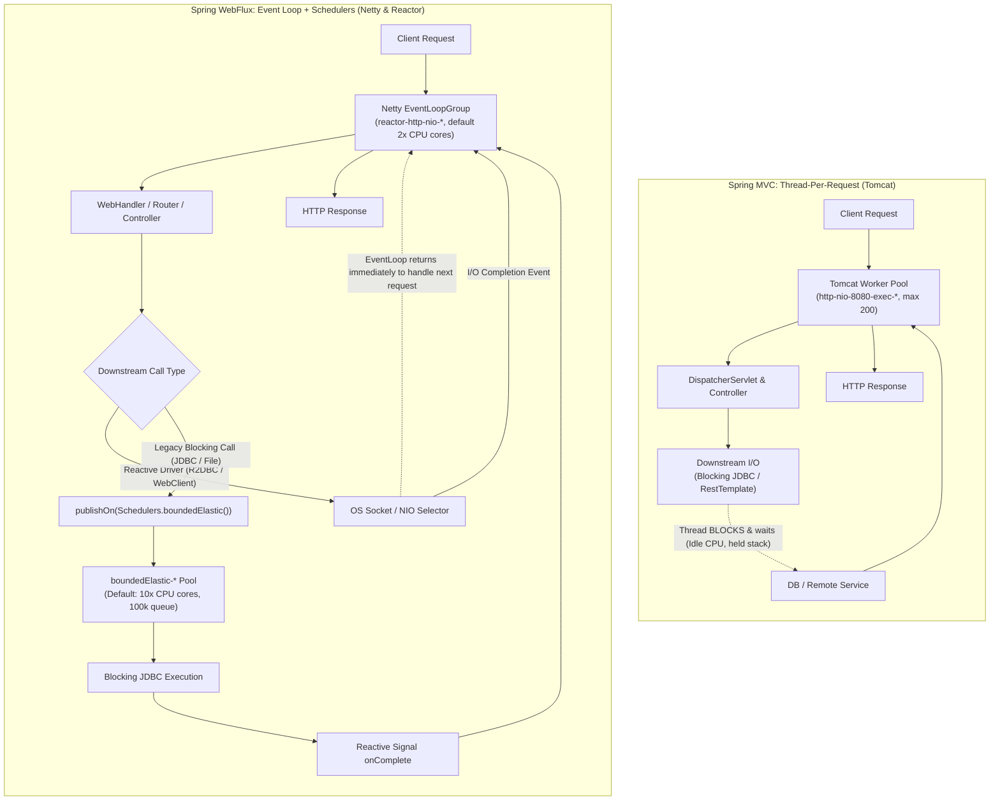

# Spring, WebFlux, and the Threading Model

## Frameworks, Libraries, and Dependencies
*   **Library:** Reusable code that *you* call (e.g., Jackson, Guava, Lombok).
*   **Framework:** Controls application flow and *calls your code* (Inversion of Control).
*   **Dependency:** The packaging mechanism (Maven/Gradle) used to bring code into your project. A dependency bundle (like a Spring Boot Starter) can contain frameworks, libraries, and servers.

## Spring Boot Request Lifecycle & Tomcat
*   **Misconception:** Everything goes through the main thread; the main thread receives requests and spawns sub-threads.
*   **Correction:** The main thread's only job is to start the Spring context and the embedded Tomcat server. After startup, the main thread essentially sleeps. HTTP requests are processed entirely by **Tomcat worker threads**.
*   **Misconception:** Controller is the servlet.
*   **Correction:** A Servlet is a Java component that receives HTTP requests and generates responses. The `DispatcherServlet` is the actual front-door servlet in Spring MVC. The Controller is just business logic built on top of it.

### The True Spring MVC Pipeline
1.  **OS:** Reserves Port 8080 (a port is just a number; sockets are the active connections inside it).
2.  **Tomcat:** Accepts the request on the socket and assigns it to a free **Worker Thread** from its pool (e.g., Thread 17 out of 200, named `http-nio-8080-exec-17`).
3.  **DispatcherServlet:** The worker thread enters Spring via the DispatcherServlet, which routes the request.
4.  **Business Logic:** Controller → Service → Repository → DB.
5.  **Response:** The response is returned, and Thread 17 goes back to the Tomcat pool.

## Blocking I/O vs. Thread Pools
In traditional Spring MVC (Blocking I/O), when a thread sends a DB query, it **BLOCKS** and waits. It cannot execute another request during this time.
*   **The Wait Problem:** If 200 Tomcat threads are all blocked waiting for the database, request #201 must wait in the queue. The CPU might be idle, but the application is stalled because the *thread pool* is exhausted.
*   **Resource Cost:** Each OS thread allocates a stack (typically 1 MB via `-Xss`). Running 1,000 idle blocked threads consumes ~1 GB of memory solely in thread stacks and induces severe CPU cache thrashing during context switching.

## Non-Blocking I/O (WebFlux, Netty, Event Loop)
**Motivation:** Instead of blocking a thread while waiting for the DB, what if the thread could send the query and immediately go process another request?

### How it Works (Event Loop)
1.  **Request arrives** → Event Loop thread takes it.
2.  **Start DB Query** → Event Loop registers the channel with the OS selector (epoll/kqueue), saves the request state, and immediately moves on to process another request.
3.  **DB Finishes (Event)** → The OS notifies the selector, the Event Loop retrieves the saved state, and resumes processing the response.
*   **Result:** A small number of threads (e.g., 8–16 threads on an 8-core CPU) can handle tens of thousands of concurrent requests because they *never block*.

### Architectural Visual: Thread-Per-Request vs. Event Loop



### The Reactive Stack Layering
*   **Java NIO:** OS-level non-blocking I/O (`Selector`, `Channel`, `ByteBuffer`).
*   **Netty:** Independent networking framework built on NIO; executes the `EventLoopGroup` channel pipeline.
*   **Project Reactor:** Implements the Reactive Streams specification (`Publisher`, `Subscriber`, `Subscription`) providing `Mono` (0..1 item) and `Flux` (0..N items).
*   **Spring WebFlux:** Reactive web framework built on top of Reactor and Netty (provides `HttpHandler`, `WebFilter`, annotated controllers, and functional routing).

### Netty Event Loop Internals & Thread Sizing
*   **Thread Allocation:** Netty defaults to `availableProcessors() * 2` worker threads (`reactor-http-nio-*`). On an 8-core CPU, exactly 16 event loop threads handle all network ingress and egress.
*   **Channel Pinning:** Each accepted client socket channel is assigned to exactly one `EventLoop` for its entire lifetime. Code executing on that channel pipeline runs sequentially, eliminating synchronization locks for channel state.

### The Golden Rule & Event Loop Starvation
Because a single event loop thread multiplexes thousands of active connections:
*   **Never block an Event Loop thread.** Any synchronous call (`Thread.sleep()`, blocking JDBC `repository.findById()`, or `RestTemplate.exchange()`) stalls that entire thread.
*   **The Catastrophic Consequence:** If an application has 16 event loop threads, blocking one thread freezes 6.25% of all concurrent users. Blocking 16 concurrent requests completely halts the entire service—even though CPU utilization sits near 0%. Health checks (`/actuator/health`) timeout, triggering container restarts by Kubernetes.
*   **Detection:** Integrate **BlockHound** (`BlockHound.install()`) into testing pipelines to throw `BlockingOperationError` whenever a blocking call touches an event loop.

## Reactor Schedulers & Thread Hopping
When blocking operations are unavoidable (legacy libraries, file system I/O, heavy CPU computations), Reactor shifts execution to dedicated thread pools via `Scheduler` instances:

| Scheduler | Thread Naming | Sizing & Characteristics | Primary Use Case |
| :--- | :--- | :--- | :--- |
| `Schedulers.immediate()` | Current thread | No thread switch; runs directly on caller | Testing or synchronous no-op passing |
| `Schedulers.single()` | `single-*` | Exactly 1 reusable daemon thread | Low-frequency sequential background tasks |
| `Schedulers.parallel()` | `parallel-*` | Fixed pool: `availableProcessors()` threads | CPU-intensive work (crypto, JSON parsing, image hashing) |
| `Schedulers.boundedElastic()` | `boundedElastic-*` | Dynamic pool: default `10 * availableProcessors()`, 100k queue cap, 60s idle TTL | Blocking I/O (legacy JDBC, blocking REST, disk files) |

### Thread Hopping: `subscribeOn` vs. `publishOn`
*   **`publishOn(Scheduler)`:** Switches the execution context for all **downstream** operators following it in the reactive chain. You can place multiple `publishOn` operators in a single pipeline to hop threads between pipeline stages.
*   **`subscribeOn(Scheduler)`:** Dictates which thread initiates the **subscription** and the source emission. It influences the entire upstream chain up to the source, regardless of where it is placed in the pipeline (unless overridden by an intermediate `publishOn`).

```java
// Example: Correct thread isolation in WebFlux
@GetMapping("/users/{id}")
public Mono<UserProfile> getUser(@PathVariable String id) {
    return Mono.fromCallable(() -> legacyJdbcRepository.findUser(id)) // 1. Blocking source
               .subscribeOn(Schedulers.boundedElastic())              // 2. Offloads source execution to boundedElastic-*
               .publishOn(Schedulers.parallel())                      // 3. Switches downstream to parallel-*
               .map(this::heavyCryptoTransform)                       // 4. Executes on parallel-*
               .publishOn(Schedulers.immediate());                    // 5. Ready to be serialized back to Netty event loop
}
```

## Context Propagation: Why `ThreadLocal` Fails
In traditional Spring MVC, one Tomcat worker thread processes a request from start to finish. Frameworks rely heavily on `ThreadLocal` for:
*   SLF4J `MDC` (Mapped Diagnostic Context: `traceId`, `spanId`, `tenantId`).
*   Spring Security `SecurityContextHolder`.
*   Transaction synchronization (`@Transactional`).

### The Reactive ThreadLocal Trap
In WebFlux, reactive pipelines hop across threads (`reactor-http-nio-1` → `boundedElastic-4` → `reactor-http-nio-2`). A value placed in `ThreadLocal` on Thread A is completely invisible when the pipeline resumes on Thread B, or worse, leaks into unrelated requests processed by Thread A.

### The Solution: Reactor `Context` & Micrometer Bridge
*   **Reactor `Context`:** An immutable key-value container attached to the reactive `Subscriber`. It flows **upstream** at subscription time and is accessible across all thread transitions:
    ```java
    Mono.deferContextual(ctx -> {
        String traceId = ctx.getOrDefault("TRACE_ID", "UNKNOWN");
        return callRemoteService(traceId);
    }).contextWrite(Context.of("TRACE_ID", "xyz-123"));
    ```
*   **Micrometer Context Propagation:** Spring Boot 3 integrates `io.micrometer:context-propagation`. Calling `Hooks.enableAutomaticContextPropagation()` at application startup automatically captures registered `ThreadLocal` values (like MDC) into Reactor `Context` and restores them whenever an operator executes on any thread.

## Crucial WebFlux Realizations
*   **Misconception:** Non-blocking I/O is faster and reduces request latency.
*   **Correction:** WebFlux does **NOT** make the database or network faster. Latency remains the same (or slightly higher due to operator pipeline overhead). It dramatically improves *thread utilization, scalability, and concurrency* under high load.
*   **Misconception:** WebFlux solves database bottlenecks.
*   **Correction:** WebFlux frees up *application threads*, but the database still has a limited connection pool. The bottleneck simply moves to the database. WebFlux shines when dealing with many concurrent requests that spend most of their time waiting for external I/O (microservice calls, Redis, Kafka, WebSockets, SSE).

## Quick recall
**Q. Does a Spring Boot application need `starter-web` to run?**
A. No. Without it, you just don't have an embedded Tomcat server (no HTTP listener). It can still run Kafka consumers or scheduled jobs perfectly fine.

**Q. Why not just use a massive thread pool instead of WebFlux?**
A. Context switching overhead. Too many OS threads thrash the CPU (saving/loading registers) and consume excessive stack memory (~1 MB per thread).

**Q. In WebFlux, does the same thread that started a request finish it?**
A. Not necessarily. Netty thread A might start the request, a worker thread B might process offloaded blocking work, and Netty thread C might write the final HTTP response.

**Q. Mono vs Flux in one sentence?**
A. `Mono` is a reactive stream that produces 0 or 1 value; `Flux` produces 0 to N values over time.

**Q. What happens if you execute a blocking JDBC call directly inside a WebFlux controller without a scheduler?**
A. You stall the Netty event loop thread, freezing all other concurrent connections multiplexed on that thread and causing severe latency spikes or health check timeouts.

**Q. What is the fundamental difference between `publishOn` and `subscribeOn`?**
A. `publishOn` switches execution for all downstream operators; `subscribeOn` sets the thread where the subscription and source data emission begin (upstream).

**Q. Why does SLF4J MDC logging fail out-of-the-box in WebFlux, and how is it resolved?**
A. MDC relies on `ThreadLocal`, which does not follow reactive thread hops; it is resolved using Reactor `Context` bridged with `Hooks.enableAutomaticContextPropagation()`.
