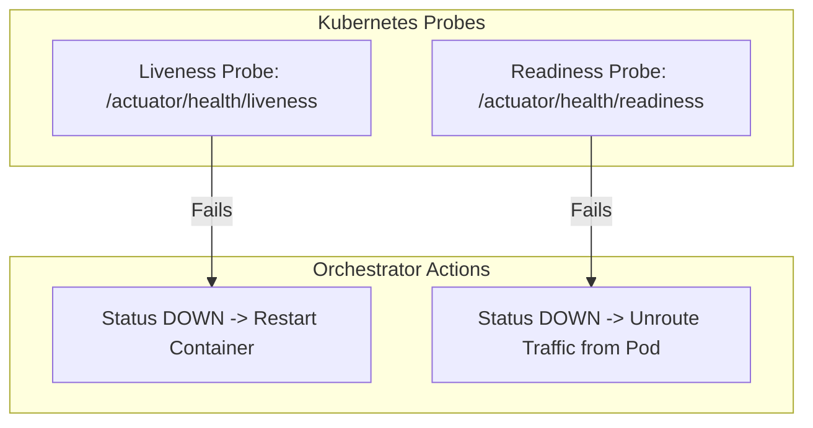

# Actuator

---

## Mental model

Spring Boot Actuator adds operational endpoints to a running application.

```xml
<dependency>
    <groupId>org.springframework.boot</groupId>
    <artifactId>spring-boot-starter-actuator</artifactId>
</dependency>
```

Use it to answer production questions:

- Is the app healthy?
- Is it ready to receive traffic?
- What metrics is it producing?
- Can we inspect or change runtime operational state (e.g. logging levels) without a restart?

---

## Common endpoints

| Endpoint | Use |
| --- | --- |
| `/actuator/health` | Health status for app/dependencies |
| `/actuator/info` | App version/build/info |
| `/actuator/metrics` | Available metric names and values |
| `/actuator/loggers` | View/change log levels at runtime; protect it |
| `/actuator/env` | Environment/config values; sensitive; do not expose publicly |

Default HTTP exposure is conservative: usually only `health` and `info` (`health` in Spring Boot 3+ defaults without sensitive details unless configured).

---

## Exposure and management configuration

Expose only what you need over HTTP:

```yaml
management:
  endpoints:
    web:
      exposure:
        include: health,info,metrics
```

Avoid wildcard exposure in production unless all endpoints are strongly protected:

```yaml
management:
  endpoints:
    web:
      exposure:
        include: "*"
```

Why: endpoints such as `env`, `heapdump`, `threaddump`, `beans`, and `loggers` can leak sensitive credentials/tokens or alter runtime behavior.

---

## Health and Kubernetes Probes

`/actuator/health` reports whether the app and its critical dependencies are healthy.

Typical aggregated response:

```json
{
  "status": "UP",
  "components": {
    "db": { "status": "UP" },
    "redis": { "status": "UP" }
  }
}
```

If one critical component is `DOWN`, the overall status becomes `DOWN` and Actuator maps the HTTP response status to `503 Service Unavailable` by default.

For interviews, know that Spring Boot automatically configures health indicators for registered datasources and clients (such as DB, Redis, RabbitMQ), and custom checks can implement `HealthIndicator`.

### Liveness vs Readiness

Spring Boot provides built-in probe support mapped directly to Kubernetes lifecycle events:

| Probe | Endpoint | Question Asked | Failure Action |
| --- | --- | --- | --- |
| **Liveness** | `/actuator/health/liveness` | Is internal state unrecoverably broken (e.g. deadlock, corrupted JVM)? | Restart / kill container |
| **Readiness** | `/actuator/health/readiness` | Is the app ready to process incoming requests (e.g. warm caches, DB pool available)? | Pull out of load balancer / stop routing traffic |



Example scenario: During warm-up or temporary downstream database throttling, readiness is `DOWN` while liveness is `UP`. That instructs the orchestrator: *"Do not restart the app, but route traffic elsewhere until ready."*

---

## Metrics and Micrometer

Actuator exposes operational metrics at `/actuator/metrics` and custom dimensional metrics via **Micrometer**.

- Micrometer acts as a metrics facade (vendor-neutral instrumentation API), analogous to how SLF4J operates for logging.
- It exports dimensional metrics (timers, counters, gauges) to backends like Prometheus, Datadog, or CloudWatch without coupling application code to vendor libraries.

---

## Security and Port Isolation

The production security rule is strict:

```text
Expose health/info publicly if needed. Protect or isolate everything else.
```

Common production pattern: bind management endpoints to an internal management port and restrict that port at the network/firewall level:

```yaml
management:
  server:
    port: 8081
```

If endpoints share the primary application port, enforce role-based access control with Spring Security:

```java
@Bean
public SecurityFilterChain securityFilterChain(HttpSecurity http) throws Exception {
    http
        .securityMatcher(EndpointRequest.toAnyEndpoint())
        .authorizeHttpRequests(auth -> auth
            .requestMatchers(EndpointRequest.to("health", "info")).permitAll()
            .anyRequest().hasRole("ACTUATOR_ADMIN")
        );
    return http.build();
}
```

Never expose `env`, `heapdump`, `threaddump`, `beans`, or `loggers` publicly.

---

## Quick recall

**Q. What does Actuator add?**
A. Operational endpoints for health, info, metrics, and runtime visibility.

**Q. Which endpoints are usually exposed by default over HTTP?**
A. `health` and `info`.

**Q. What is Micrometer?**
A. The dimensional metrics instrumentation facade used by Spring Boot Actuator.

**Q. Liveness vs readiness?**
A. Both are health endpoints. Liveness failure restarts the container; readiness failure temporarily removes the instance from traffic routing.

**Q. Why is `include: "*"` risky?**
A. It exposes sensitive environment variables, thread/heap memory dumps, and write operations like log level alterations.

**Q. Should `env`, `heapdump`, `beans`, or `loggers` be public?**
A. No. They expose internals or can affect runtime behavior.
