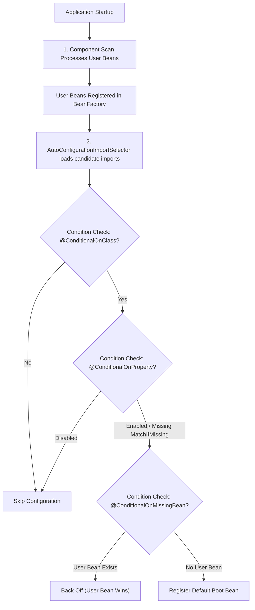

# Auto-Configuration

---

## Mental model

Spring Boot auto-configuration means:

> If a library is on the classpath and you have not defined your own bean, Boot creates sensible default beans for you.

Example: adding JDBC/JPA dependencies lets Boot attempt `DataSource`, transaction manager, and JPA setup. Adding web dependencies lets Boot configure Spring MVC, Jackson, and an embedded server (Tomcat/Jetty).

Auto-configuration is **opinionated defaults with non-invasive overrides**: it provides ready-to-run configurations while stepping aside the moment custom configuration is supplied.

---

## `@SpringBootApplication`

`@SpringBootApplication` combines three core annotations:

```java
@Configuration
@EnableAutoConfiguration
@ComponentScan
public class App {
    public static void main(String[] args) {
        SpringApplication.run(App.class, args);
    }
}
```

| Part | Meaning |
| --- | --- |
| `@Configuration` | Marks the class as a source of bean definitions |
| `@ComponentScan` | Scans the package and sub-packages for `@Component`, `@Service`, `@Repository`, `@Controller` |
| `@EnableAutoConfiguration` | Enables Spring Boot's conditional auto-configuration mechanism |

The auto-configuration piece is what makes Spring Boot feel automatic and eliminates boilerplate XML or manual Java configuration.

---

## How Auto-Configuration Works Internally

1. **Discovery**: `@EnableAutoConfiguration` imports `AutoConfigurationImportSelector`.
2. **Registration file**:
   - **Spring Boot 3.x (and 2.7+)**: Reads configuration class names listed in `META-INF/spring/org.springframework.boot.autoconfigure.AutoConfiguration.imports`.
   - **Legacy (Spring Boot 2.6 and earlier)**: Read from `META-INF/spring.factories` under `EnableAutoConfiguration`.
3. **Execution order**: User-defined beans from `@ComponentScan` are processed first. Auto-configuration classes run *after* user configuration.
4. **Condition evaluation**: Boot inspects condition annotations on each candidate auto-configuration class and `@Bean` method before registering beans.



---

## Conditional defaults

Auto-configuration relies on `@Conditional` annotations. Boot evaluates conditions against classpath libraries, existing beans, environment properties, and resource files.

Common conditional annotations:

| Condition Annotation | Trigger / Meaning | Example Use Case |
| --- | --- | --- |
| `@ConditionalOnClass` | Class is present on the classpath | Only configure JPA if Hibernate classes exist |
| `@ConditionalOnMissingClass` | Class is absent from classpath | Fallback when specific driver/library is missing |
| `@ConditionalOnBean` | Specific bean already exists in context | Configure security filter only if security manager is present |
| `@ConditionalOnMissingBean` | No bean of this type/name exists yet | Provide default `ObjectMapper` or `DataSource` |
| `@ConditionalOnProperty` | Specified property has expected value | Toggle feature flags (e.g. `app.feature.enabled=true`) |
| `@ConditionalOnResource` | Specified resource file exists | Check for schema script on classpath |
| `@ConditionalOnWebApplication` | Context is a web application | Configure embedded web server / DispatcherServlet |

Example:

```java
@AutoConfiguration
@ConditionalOnClass(PaymentClient.class)
public class PaymentAutoConfiguration {

    @Bean
    @ConditionalOnMissingBean
    public PaymentClient paymentClient(PaymentProperties properties) {
        return new HttpPaymentClient(properties.getBaseUrl());
    }
}
```

This ensures: if `PaymentClient` is on the classpath and the application has not registered its own `PaymentClient`, Boot registers the default HTTP client.

---

## Customizing auto-configuration

When Boot's default is not what you need, use one of three standard strategies:

### Option 1 — Define your own bean (Back-off)

Boot backs off when a user-defined bean exists for configurations guarded by `@ConditionalOnMissingBean`.

```java
@Configuration
public class JsonConfig {

    @Bean
    public ObjectMapper objectMapper() {
        return new ObjectMapper()
            .registerModule(new JavaTimeModule())
            .disable(SerializationFeature.WRITE_DATES_AS_TIMESTAMPS);
    }
}
```

Use this when you want the feature active, but need full control over bean instantiation and settings.

### Option 2 — Configure via external properties

```properties
spring.datasource.url=jdbc:postgresql://localhost:5432/orders_db
spring.datasource.username=orders_user
spring.datasource.password=secret
spring.datasource.hikari.maximum-pool-size=20
```

Use this when Boot's default bean construction is correct, but requires environment-specific parameters.

### Option 3 — Exclude auto-configuration classes

When a dependency is transitively present on the classpath but should not configure beans:

Via annotation:
```java
@SpringBootApplication(exclude = {DataSourceAutoConfiguration.class, HibernateJpaAutoConfiguration.class})
public class App {
    public static void main(String[] args) {
        SpringApplication.run(App.class, args);
    }
}
```

Via configuration property:
```properties
spring.autoconfigure.exclude=org.springframework.boot.autoconfigure.jdbc.DataSourceAutoConfiguration
```

Example: A microservice imports a shared corporate starter containing JPA dependencies, but this service only processes Kafka events without a relational database. Excluding `DataSourceAutoConfiguration` prevents startup failure caused by missing database URL properties.

---

## Diagnosing & Debugging Auto-Configuration

To see why an auto-configuration did or did not activate:

1. **Debug mode**: Run with `--debug` or set `debug=true` in `application.properties`.
2. **Condition Evaluation Report**:
   - **Positive matches**: Conditions that evaluated to true and configured beans.
   - **Negative matches**: Conditions that evaluated to false and why (e.g. `@ConditionalOnClass did not find class '...'`).
   - **Exclusions**: Explicitly excluded auto-configuration classes.
   - **Unconditional classes**: Configurations applied without conditional checks.

```text
Interview summary:
Auto-configuration provides sensible, conditional defaults discovered via imports, evaluated after user configuration, and designed to back off whenever custom beans or explicit exclusions are present.
```

---

## Quick recall

**Q. What is auto-configuration?**
A. Boot creates default beans when matching libraries/properties are present and you have not defined your own bean.

**Q. What enables auto-configuration?**
A. `@EnableAutoConfiguration`, included inside `@SpringBootApplication`.

**Q. Where are auto-configuration classes declared in modern Spring Boot (3.x)?**
A. In `META-INF/spring/org.springframework.boot.autoconfigure.AutoConfiguration.imports`.

**Q. Why does defining your own bean override Boot's default?**
A. User configuration is processed first during component scanning; auto-configuration runs later with `@ConditionalOnMissingBean` guards that back off when a matching bean already exists.

**Q. When should you exclude an auto-configuration?**
A. When a library is on the classpath (often transitively) but you do not want Boot to instantiate its default beans.

**Q. How do you inspect which auto-configurations evaluated and why?**
A. Start with `--debug` and inspect the Condition Evaluation Report for positive and negative matches.
