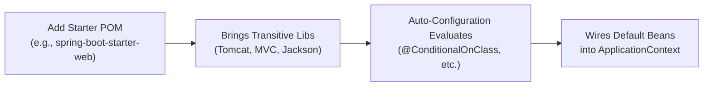

# Starter Ecosystem

---

## Mental model

A Spring Boot starter is a curated dependency descriptor bundle.

Instead of manually assembling individual dependencies (such as Spring MVC, embedded Tomcat, Jackson, validation, and compatible logging libraries) with manually synchronized versions, you declare a single starter:

```xml
<dependency>
    <groupId>org.springframework.boot</groupId>
    <artifactId>spring-boot-starter-web</artifactId>
</dependency>
```

The starter pulls in all required compile and runtime dependencies transitively. Auto-configuration classes packaged in Spring Boot (or the starter's autoconfigure module) then detect those classpath libraries and instantiate default beans when matching conditions are met.



Interview line:

```text
Starter = curated dependency bundle. Auto-configuration = conditional bean creation logic.
```

---

## Common starters

| Starter | Brings |
| --- | --- |
| `spring-boot-starter-web` | Spring MVC, embedded Tomcat, Jackson |
| `spring-boot-starter-data-jpa` | Spring Data JPA, Hibernate, JDBC, HikariCP, transactions |
| `spring-boot-starter-security` | Spring Security framework and default filter chains |
| `spring-boot-starter-validation` | Bean Validation API and Hibernate Validator (`@NotNull`, `@Valid`) |
| `spring-boot-starter-test` | JUnit Jupiter, Mockito, AssertJ, Hamcrest, Spring Test |
| `spring-boot-starter-actuator` | Production-ready health, metrics, auditing, and management endpoints |
| `spring-boot-starter-cache` | Spring Cache abstraction (`CacheManager` support) |
| `spring-boot-starter-aop` | Spring AOP and AspectJ runtime |

`spring-boot-starter` without a suffix is the base starter: Spring core, context, YAML/properties support, and default logging (`logback-classic` + `slf4j`).

---

## Starter naming conventions

Spring Boot defines a strict naming convention to distinguish official starters from third-party and custom internal starters:

- **Official Starters**: Follow the pattern `spring-boot-starter-*` (e.g., `spring-boot-starter-web`).
- **Custom / Third-Party Starters**: Must follow the pattern `*-spring-boot-starter` (e.g., `acme-auth-spring-boot-starter`).

### Two-module structure for custom starters

Production-grade custom starters typically separate concerns into two modules:
1. `*-spring-boot-autoconfigure`: Contains configuration classes, `@ConfigurationProperties`, and `@Conditional` bean declarations.
2. `*-spring-boot-starter`: An empty umbrella POM dependency bundle that transitively depends on the `autoconfigure` module and required client libraries.

---

## Parent POM and BOM

Most standalone Boot applications inherit from `spring-boot-starter-parent` so dependency versions and standard Maven plugin defaults (such as `spring-boot-maven-plugin` and compiler settings) are pre-configured:

```xml
<parent>
    <groupId>org.springframework.boot</groupId>
    <artifactId>spring-boot-starter-parent</artifactId>
    <version>3.2.0</version>
</parent>
```

### Importing the BOM without Parent POM

When an enterprise project must inherit from a corporate root parent POM, Spring Boot's dependency management can be imported directly via `spring-boot-dependencies` using `<scope>import</scope>`:

```xml
<dependencyManagement>
    <dependencies>
        <dependency>
            <groupId>org.springframework.boot</groupId>
            <artifactId>spring-boot-dependencies</artifactId>
            <version>3.2.0</version>
            <type>pom</type>
            <scope>import</scope>
        </dependency>
    </dependencies>
</dependencyManagement>
```

*Note:* When using the BOM import approach instead of `spring-boot-starter-parent`, you must explicitly configure `spring-boot-maven-plugin` executions and property overrides in your own POM.

---

## Managed versions

Boot curates a matrix of compatible library versions. This is why you omit `<version>` tags for dependencies managed by the Spring Boot BOM:

```xml
<dependency>
    <groupId>com.fasterxml.jackson.core</groupId>
    <artifactId>jackson-databind</artifactId>
</dependency>
```

Override managed versions only with an explicit reason, such as applying a security patch or addressing compatibility:

```xml
<properties>
    <jackson-bom.version>2.16.1</jackson-bom.version>
</properties>
```

Exact property names correspond to properties defined in the `spring-boot-dependencies` BOM.

---

## Excluding transitive dependencies

Starters bundle default implementations. If you require a different embedded server or logging engine, exclude the starter's default transitive dependency and declare the replacement.

For example, replacing Tomcat with Jetty:

```xml
<dependency>
    <groupId>org.springframework.boot</groupId>
    <artifactId>spring-boot-starter-web</artifactId>
    <exclusions>
        <exclusion>
            <groupId>org.springframework.boot</groupId>
            <artifactId>spring-boot-starter-tomcat</artifactId>
        </exclusion>
    </exclusions>
</dependency>

<dependency>
    <groupId>org.springframework.boot</groupId>
    <artifactId>spring-boot-starter-jetty</artifactId>
</dependency>
```

Apply exclusions deliberately with matching replacements. Blind exclusions risk `ClassNotFoundException` or missing auto-configuration triggers during context initialization.

---

## Quick recall

**Q. What is a starter?**
A. A curated dependency descriptor bundle that aggregates compatible libraries for a specific capability.

**Q. Starter vs auto-configuration?**
A. A starter brings dependencies onto the classpath; auto-configuration inspects that classpath and instantiates configured beans when conditions match.

**Q. Why can you omit dependency versions in Boot apps?**
A. Boot's parent POM or imported `spring-boot-dependencies` BOM manages verified, compatible versions.

**Q. How do you use Spring Boot dependency management if your project already has a company parent POM?**
A. Import `spring-boot-dependencies` with `<type>pom</type>` and `<scope>import</scope>` inside `<dependencyManagement>`.

**Q. What is the naming convention for official vs custom starters?**
A. Official starters use `spring-boot-starter-*`; third-party/custom starters use `*-spring-boot-starter`.

**Q. How do you swap Tomcat for Jetty?**
A. Exclude `spring-boot-starter-tomcat` from `spring-boot-starter-web` and add `spring-boot-starter-jetty`.
