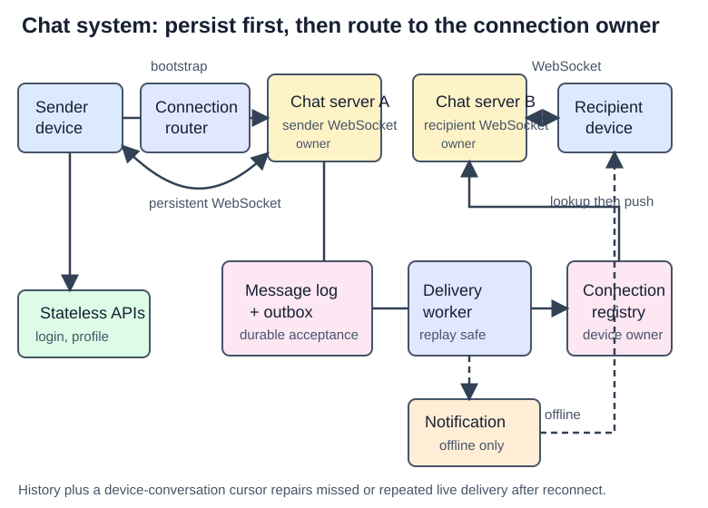

# Design a Chat System

## Problem

Design a text chat system like Messenger for 50M DAU. Support one-to-one chat, groups of at most 100 users, online presence, web/mobile clients, multiple devices, indefinite history, and push notifications for offline recipients.

## Clarify scope

Ask:

- Is it one-to-one, small group, large public channel, or all three?
- What is the group member limit?
- Is low delivery latency required? Is eventual delivery acceptable while offline?
- Is ordering required per conversation or globally?
- Are messages text only? What is the maximum size?
- Do clients support multiple devices and history retention?
- Do we need presence, read receipts, push notifications, E2EE, and search?
- What are DAU and expected concurrent WebSocket connections?

## Requirements

### Functional

- Send and receive messages in one-to-one and small group conversations.
- Persist history and synchronize missed messages across devices.
- Show online/offline presence.
- Push-notify offline recipients.

### Non-functional

- Low-latency live delivery.
- Durable messages; no loss after accepted send.
- Ordered messages within a conversation.
- Horizontally scalable connection and storage tiers.
- Tolerate reconnects, retries, and duplicate delivery.

## APIs and WebSocket events

HTTP is suitable for authentication and profile APIs. Use WebSocket after login for real-time events.

```text
WS client -> server: SEND_MESSAGE { clientMessageId, conversationId, body }
WS server -> client: MESSAGE { messageId, conversationId, senderId, body }
WS server -> client: ACK { clientMessageId, messageId }
WS client -> server: SYNC { afterMessageId }
WS client -> server: HEARTBEAT
```

`clientMessageId` makes sender retries idempotent. `messageId` is the durable ordering/deduplication identity.

## Architecture



| Component | Responsibility |
| --- | --- |
| API servers | Login, signup, profile, settings; stateless HTTP |
| Service discovery | Select a healthy chat server by region and connection capacity |
| Chat servers | Own WebSockets, authenticate events, route live messages |
| Message store | Durable ordered history, partitioned by conversation/channel |
| Sync stream/inbox | Decouple durable write from recipient/device delivery |
| Presence servers/store | Heartbeats, online state, presence events |
| Notification system | Push notification for offline users |

## Message storage

Store normal relational data such as profiles/settings/friends in a relational database. Put chat history in a distributed key-value or wide-column store, partitioned by conversation/channel. It supports high write volume, low-latency recent reads, and scalable historical storage.

```text
message(
  conversation_id,
  message_id,
  sender_id,
  body,
  created_at,
  primary key(conversation_id, message_id)
)
```

For one-to-one conversations, derive a stable `conversationId` from the two user IDs. For groups, `conversationId` is the channel/group ID and is the partition key.

## Send and receive flow

1. Sender connects to a chat server through WebSocket selected by service discovery.
2. Sender emits `SEND_MESSAGE` with `clientMessageId`.
3. Chat server checks membership and deduplicates sender retry.
4. Server assigns a sortable `messageId` and durably writes the message.
5. Server appends a recipient sync event after the write.
6. Connected recipient devices receive live WebSocket pushes from their chat-server owner.
7. Offline recipients receive a push notification and synchronize history when they open/reconnect.
8. Recipients ACK/read separately; delivery retries may replay, so dedupe by `messageId`.

## Ordering and delivery semantics

Require ordering **within one conversation**, not system-wide. A per-conversation sequence is the simplest option; a time-sortable globally unique ID is also acceptable. The storage partition and ID ordering must agree.

The correct delivery claim is at-least-once. A server can persist a message, crash before ACK, and receive a sender retry. Store `(senderId, clientMessageId) -> messageId` to return the first result, and let recipients ignore repeated `messageId`s.

## Multiple devices

Track a cursor per user-device. On reconnect, each device requests messages after its cursor; then it advances the cursor only after durable local handling.

```text
(userId, deviceId) -> lastSyncedMessageId
```

Live push is an optimization. The durable message store and cursor are the correctness path.

## Group chat

For the stated maximum of 100 members, persist one channel message and fan out lightweight references to member inboxes. This is deliberately a small-group design.

For large groups, explain the change: store one channel log and have clients pull recent channel messages, or use a hybrid. Do not make a copy per member for a 100,000-member channel.

## Presence flow

1. WebSocket connect writes presence with a heartbeat expiry.
2. Heartbeats refresh it periodically.
3. Logout clears it immediately.
4. Missed heartbeat beyond a grace interval changes status to offline.
5. Presence events are pushed to subscribed friends; large groups fetch on demand.

Presence is approximate. A user can be online but inactive, or disconnect immediately after an update.

## Failure handling

| Failure | Design response |
| --- | --- |
| Chat server unavailable | Client reconnects using service discovery and syncs from cursor |
| Message accepted twice | Sender idempotency by `clientMessageId` |
| Recipient sees duplicate | Ignore already-processed `messageId` |
| Push notification missing | Reconnect/history sync remains correct |
| Short network loss | Heartbeat grace period avoids false offline state |
| Storage latency/outage | Do not ACK accepted send before a durable write; surface retryable error |

## Quick recall

**Q. What is the main state on a chat server?**  
A. The active persistent WebSocket connections it owns.

**Q. What owns correctness when a user is offline?**  
A. Durable message history plus a per-device sync cursor, not the push notification.

**Q. What ordering should the design promise?**  
A. Per-conversation/channel ordering.

**Q. What does a heartbeat solve?**  
A. It avoids marking a user offline on every brief network interruption.

